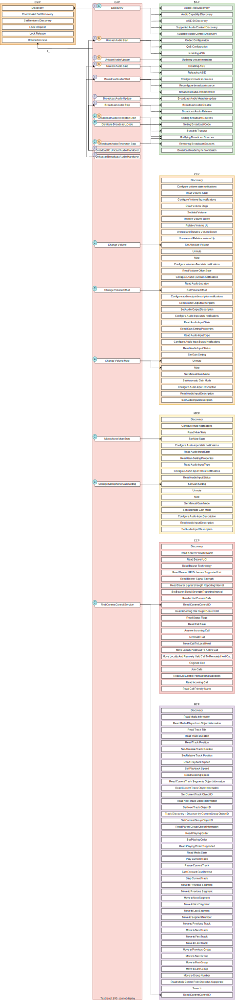

.. _bluetooth_le_audio_arch:

LE Audio Stack
##############

.. graphviz::
   :caption: Bluetooth Audio Architecture

   digraph bluetooth_audio_arch {
      r [shape=record, width=5, height=3
         label="{{TMAP | HAP | PBP | GMAP | ...} |
                  GAF |
                  {{{ GATT | GAP } | Low-level protocols (L2CAP, ATT, etc.)} | GAP | ISO}
                  | HCI Driver (USB, UART, SPI, virtual, etc.)}"
         ];
   }

Overall design
**************

The overall design of the LE Audio stack is that the implementation follows the specifications
as closely as possible,
both in terms of structure but also naming.
Most API functions are prefixed by the specification acronym
(e.g. `bt_bap` for the Basic Audio Profile (BAP) and `bt_vcp` for the Volume Control Profile (VCP)).
The functions are then further prefixed with the specific role from each profile where applicable
(e.g. :c:func:`bt_bap_unicast_client_discover` and :c:func:`bt_vcp_vol_rend_set_vol`).
There are usually a function per procedure defined by the profile or service specifications,
and additional helper or meta functions that do not correspond to procedures.

The structure of the files generally also follow this,
where BAP related files are prefixed with `bap` and VCP related files are prefixed with `vcp`.
If the file is specific for a profile role, the role is also embedded in the file name.

Generic Audio Framework (GAF)
*****************************
The Generic Audio Framework (GAF) is considered the middleware of the Bluetooth
LE Audio architecture. The GAF contains the profiles and services that allows
higher layer applications and profiles to set up streams, change volume, control
media and telephony and more. The GAF builds on GATT, GAP and isochronous
channels (ISO).

GAF uses GAP to connect, advertise and synchronize to other devices.
GAF uses GATT to configure streams, associate streams with content
(e.g. media or telephony), control volume and more.
GAF uses ISO for the audio streams themselves, both as unicast (connected)
audio streams or broadcast (unconnected) audio streams.

GAF mandates the use of the LC3 codec, but also supports other codecs.

.. graphviz::
   :caption: Generic Audio Framework (GAF)

   digraph gaf {
      node [shape=record];
      edge [style=invis];
      compound=true;
      nodesep=0.1;

      subgraph hap_layer {
         cluster=true;
         label="HAP";
         HAS;
         BAS [style=dashed];
         IAS [style=dashed];
      }

      subgraph pbp_layer {
         cluster=true;
         label="PBP";
         PBS[style=invis]; // Make it possible to treat PBP like the others
      }

      subgraph tmap_layer {
         cluster=true;
         label="TMAP";
         TMAS;
      }

      subgraph gmap_layer {
         cluster=true;
         label="GMAP";
         GMAS;
      }

      subgraph gaf_layer {
         cluster=true;
         label="Generic Audio Framework";

         subgraph transition_and_coordination_control_layer {
            cluster=true;
            label="Transition and Coordination Control";
            style=dashed;

            subgraph cap_layer {
               cluster=true;
               style=solid;
               label="CAP";
               CAS;
            }

            subgraph csip_layer {
               cluster=true;
               style=solid;
               label="CSIP";
               CSIS;
            }
         }

         subgraph stream_control_layer {
            cluster=true;
            label="Stream Control";
            style=dashed;

            subgraph bap_layer {
               cluster=true;
               label="BAP";
               style=solid;
               PACS [style=dashed];
               ASCS [style=dashed];
               BASS [style=dashed];
            }
         }

         subgraph content_control_layer {
            cluster=true;
            label="Content Control";
            style=dashed;

            subgraph mcp_layer {
               cluster=true;
               label="MCP";
               style=solid;
               MCS;
            }

            subgraph ccp_layer {
               cluster=true;
               label="CCP";
               style=solid;
               TBS;
            }
         }

         subgraph rendering_and_capture_control_layer {
            cluster=true;
            label="Rendering and Capture Control";
            style=dashed;

            subgraph micp_layer {
               cluster=true;
               label="MICP";
               style=solid;
               MICS;
               MICP_AICS [style=dashed];
            }

            subgraph vcp_layer {
               cluster=true;
               label="VCP";
               style=solid;
               VCS;
               VOCS [style=dashed];
               VCP_AICS [style=dashed];
            }
         }
      }

      HAS -> CAS;
      PBS -> CAS;
      TMAS -> CAS;
      GMAS -> CAS;

      CAS -> MCS;
      CAS -> TBS;
      CAS -> ASCS;
      CAS -> PACS;
      CAS -> BASS;
      CAS -> MICS;
      CAS -> MICP_AICS;
      CAS -> VCS;
      CAS -> VOCS;
      CAS -> VCP_AICS;

      CSIS -> MCS;
      CSIS -> TBS;
      CSIS -> ASCS;
      CSIS -> PACS;
      CSIS -> BASS;
      CSIS -> MICS;
      CSIS -> MICP_AICS;
      CSIS -> VCS;
      CSIS -> VOCS;
      CSIS -> VCP_AICS;
   }

The top-level profiles TMAP and HAP are not part of the GAF, but rather provide
top-level requirements for how to use the GAF.

GAF and the top layer profiles gave been implemented in Zephyr with the following structure.

.. graphviz::
   :caption: Zephyr Generic Audio Framework

   digraph gaf {
      node [shape=record];
      edge [style=invis];
      compound=true;
      nodesep=0.1;

      subgraph hap_layer {
         cluster=true;
         label="HAP";
         HAS_H [label="has.h"];
         BAS_H [label="bas.h"];
         IAS_H [label="ias.h"];
      }

      subgraph pbp_layer {
         cluster=true;
         label="PBP";
         PBP_H [label="pbp.h"]; // Make it possible to treat PBP like the others
      }

      subgraph tmap_layer {
         cluster=true;
         label="TMAP";
         TMAP_H [label="tmap.h"];
      }

      subgraph gmap_layer {
         cluster=true;
         label="GMAP";
         GMAP_H [label="gmap.h"];
         GMAP_PRESET_H [label="gmap_lc3_preset.h"];
      }

      subgraph gaf_layer {
         cluster=true;
         label="Generic Audio Framework";
         AUDIO_H [label="audio.h"];
         LC3_H [label="lc3.h"];

         subgraph transition_and_coordination_control_layer {
            cluster=true;
            label="Transition and Coordination Control";
            style=dashed;

            subgraph cap_layer {
               cluster=true;
               style=solid;
               label="CAP";
               CAP_H [label="cap.h"];
            }

            subgraph csip_layer {
               cluster=true;
               style=solid;
               label="CSIP";
               CSIP_H [label="csip.h"];
            }
         }

         subgraph stream_control_layer {
            cluster=true;
            label="Stream Control";
            style=dashed;

            subgraph bap_layer {
               cluster=true;
               label="BAP";
               style=solid;
               PACS_H [label="pacs.h"];
               BAP_H [label="bap.h"];
               BAP_PRESET_H [label="bap_lc3_preset.h"];
            }
         }

         subgraph content_control_layer {
            cluster=true;
            label="Content Control";
            style=dashed;

            subgraph mcp_layer {
               cluster=true;
               label="MCP";
               style=solid;
               MCS_H [label="mcs.h"];
               MCC_H [label="mcc.h"];
               MP_H [label="media_proxy.h"];
            }

            subgraph ccp_layer {
               cluster=true;
               label="CCP";
               style=solid;
               TBS_H [label="tbs.h"];
            }
         }

         subgraph rendering_and_capture_control_layer {
            cluster=true;
            label="Rendering and Capture Control";
            style=dashed;

            subgraph micp_layer {
               cluster=true;
               label="MICP";
               style=solid;
               MICP_H [label="micp.h"];
               AICS_H [label="aics.h"];
            }

            subgraph vcp_layer {
               cluster=true;
               label="VCP";
               style=solid;
               VCP_H [label="vcp.h"];
               VOCS_H [label="vocs.h"];
               AICS_H [label="aics.h"];
            }
         }
      }

      HAS_H -> CAP_H;
      PBP_H -> CAP_H;
      TMAP_H -> CAP_H;
      GMAP_H -> CAP_H;
      GMAP_PRESET_H -> CAP_H;

      CAP_H -> MCS_H;
      CAP_H -> MCC_H;
      CAP_H -> MP_H;
      CAP_H -> TBS_H;
      CAP_H -> BAP_H;
      CAP_H -> BAP_PRESET_H;
      CAP_H -> PACS_H;
      CAP_H -> MICP_H;
      CAP_H -> VCP_H;

      CSIP_H -> MCS_H;
      CSIP_H -> MCC_H;
      CSIP_H -> MP_H;
      CSIP_H -> TBS_H;
      CSIP_H -> BAP_H;
      CSIP_H -> BAP_PRESET_H;
      CSIP_H -> PACS_H;
      CSIP_H -> MICP_H;
      CSIP_H -> VCP_H;
   }

Bluetooth Audio Stack Status
============================

The following table shows the current status and support of the profiles in the
Bluetooth Audio Stack.

.. table:: Bluetooth Audio Profile status
   :widths: auto

   +--------+-------------------------------+---------+------------------+-----------------------+--------------------------------------------------+
   | Module | Role                          | Version | Added in Release | Status                | Remaining                                        |
   +========+===============================+=========+==================+=======================+==================================================+
   | VCP    | Volume Renderer               | 1.0     | 2.6              | - Feature complete    | - Sample Application                             |
   |        |                               |         |                  | - Shell Module        |                                                  |
   |        |                               |         |                  | - BSIM test           |                                                  |
   |        +-------------------------------+---------+------------------+-----------------------+--------------------------------------------------+
   |        | Volume Controller             | 1.0     | 2.6              | - Feature complete    | - Sample Application                             |
   |        |                               |         |                  | - Shell Module        |                                                  |
   |        |                               |         |                  | - BSIM test           |                                                  |
   +--------+-------------------------------+---------+------------------+-----------------------+--------------------------------------------------+
   | MICP   | Microphone Device             | 1.0     | 2.7              | - Feature complete    | - Sample Application                             |
   |        |                               |         |                  | - Shell Module        |                                                  |
   |        |                               |         |                  | - BSIM test           |                                                  |
   |        +-------------------------------+---------+------------------+-----------------------+--------------------------------------------------+
   |        | Microphone Controller         | 1.0     | 2.7              | - Feature complete    | - Sample Application                             |
   |        |                               |         |                  | - Shell Module        |                                                  |
   |        |                               |         |                  | - BSIM test           |                                                  |
   +--------+-------------------------------+---------+------------------+-----------------------+--------------------------------------------------+
   | CSIP   | Set Member                    | 1.0.1   | 3.0              | - Feature complete    | - Sample Application                             |
   |        |                               |         |                  | - Shell Module        |                                                  |
   |        |                               |         |                  | - BSIM test           |                                                  |
   |        +-------------------------------+---------+------------------+-----------------------+--------------------------------------------------+
   |        | Set Coordinator               | 1.0.1   | 3.0              | - Feature complete    | - Sample Application                             |
   |        |                               |         |                  | - Shell Module        |                                                  |
   |        |                               |         |                  | - BSIM test           |                                                  |
   +--------+-------------------------------+---------+------------------+-----------------------+--------------------------------------------------+
   | CCP    | Call Control Server           | 1.0     | 3.0              | - Feature complete    | - API refactor                                   |
   |        |                               |         |                  | - Shell Module        | - Sample Application                             |
   |        |                               |         |                  | - BSIM test           |                                                  |
   |        +-------------------------------+---------+------------------+-----------------------+--------------------------------------------------+
   |        | Call Control Client           | 1.0     | 3.0              | - Feature complete    | - API refactor                                   |
   |        |                               |         |                  | - Shell Module        | - Sample Application                             |
   |        |                               |         |                  | - BSIM test           |                                                  |
   +--------+-------------------------------+---------+------------------+-----------------------+--------------------------------------------------+
   | MCP    | Media Control Server          | 1.0     | 3.0              | - Feature complete    | - API refactor                                   |
   |        |                               |         |                  | - Shell Module        | - Support for multiple instances and connections |
   |        |                               |         |                  | - BSIM test           | - Sample Application                             |
   |        +-------------------------------+---------+------------------+-----------------------+--------------------------------------------------+
   |        | Media Control Client          | 1.0     | 3.0              | - Feature complete    | - API refactor                                   |
   |        |                               |         |                  | - Shell Module        | - Sample Application                             |
   |        |                               |         |                  | - BSIM test           |                                                  |
   +--------+-------------------------------+---------+------------------+-----------------------+--------------------------------------------------+
   | BAP    | Unicast Server                | 1.0.1   | 3.0              | - Feature complete    |                                                  |
   |        |                               |         |                  | - Shell Module        |                                                  |
   |        |                               |         |                  | - BSIM test           |                                                  |
   |        |                               |         |                  | - Sample Application  |                                                  |
   |        +-------------------------------+---------+------------------+-----------------------+--------------------------------------------------+
   |        | Unicast Client                | 1.0.1   | 3.0              | - Feature complete    |                                                  |
   |        |                               |         |                  | - Shell Module        |                                                  |
   |        |                               |         |                  | - BSIM test           |                                                  |
   |        |                               |         |                  | - Sample Application  |                                                  |
   |        +-------------------------------+---------+------------------+-----------------------+--------------------------------------------------+
   |        | Broadcast Source              | 1.0.1   | 3.0              | - Feature complete    |                                                  |
   |        |                               |         |                  | - Shell Module        |                                                  |
   |        |                               |         |                  | - BSIM test           |                                                  |
   |        |                               |         |                  | - Sample Application  |                                                  |
   |        +-------------------------------+---------+------------------+-----------------------+--------------------------------------------------+
   |        | Broadcast Sink                | 1.0.1   | 3.0              | - Feature complete    |                                                  |
   |        |                               |         |                  | - Shell Module        |                                                  |
   |        |                               |         |                  | - BSIM test           |                                                  |
   |        |                               |         |                  | - Sample Application  |                                                  |
   |        +-------------------------------+---------+------------------+-----------------------+--------------------------------------------------+
   |        | Scan Delegator                | 1.0.1   | 3.3              | - Feature complete    |                                                  |
   |        |                               |         |                  | - Shell Module        |                                                  |
   |        |                               |         |                  | - BSIM test           |                                                  |
   |        |                               |         |                  | - Sample Application  |                                                  |
   |        +-------------------------------+---------+------------------+-----------------------+--------------------------------------------------+
   |        | Broadcast Assistant           | 1.0.1   | 3.3              | - Feature complete    |                                                  |
   |        |                               |         |                  | - Shell Module        |                                                  |
   |        |                               |         |                  | - BSIM test           |                                                  |
   |        |                               |         |                  | - Sample Application  |                                                  |
   +--------+-------------------------------+---------+------------------+-----------------------+--------------------------------------------------+
   | CAP    | Acceptor                      | 1.0     | 3.2              | - Feature complete    |                                                  |
   |        |                               |         |                  | - Shell Module        |                                                  |
   |        |                               |         |                  | - BSIM test           |                                                  |
   |        |                               |         |                  | - Sample Application  |                                                  |
   |        +-------------------------------+---------+------------------+-----------------------+--------------------------------------------------+
   |        | Initiator                     | 1.0     | 3.3              | - Feature complete    |                                                  |
   |        |                               |         |                  | - Shell Module        |                                                  |
   |        |                               |         |                  | - BSIM test           |                                                  |
   |        |                               |         |                  | - Sample Application  |                                                  |
   |        +-------------------------------+---------+------------------+-----------------------+--------------------------------------------------+
   |        | Commander                     |         |                  | - WIP                 | - Feature complete                               |
   |        |                               |         |                  |                       | - Shell Module                                   |
   |        |                               |         |                  |                       | - BSIM test                                      |
   |        |                               |         |                  |                       | - Sample Application                             |
   +--------+-------------------------------+---------+------------------+-----------------------+--------------------------------------------------+
   | HAP    | Hearing Aid                   | 1.0     | 3.1              | - Feature complete    |                                                  |
   |        |                               |         |                  | - Shell Module        |                                                  |
   |        |                               |         |                  | - BSIM test           |                                                  |
   |        |                               |         |                  | - Sample Application  |                                                  |
   |        +-------------------------------+---------+------------------+-----------------------+--------------------------------------------------+
   |        | Hearing Aid Unicast Client    | 1.0     | 3.1              | - Feature complete    |                                                  |
   |        |                               |         |                  | - Shell Module        |                                                  |
   |        |                               |         |                  | - BSIM test           |                                                  |
   |        |                               |         |                  | - Sample Application  |                                                  |
   |        +-------------------------------+---------+------------------+-----------------------+--------------------------------------------------+
   |        | Hearing Aid Remote Controller |         |                  | - WIP                 | - Feature complete                               |
   |        |                               |         |                  |                       | - Shell Module                                   |
   |        |                               |         |                  |                       | - BSIM test                                      |
   |        |                               |         |                  |                       | - Sample Application                             |
   +--------+-------------------------------+---------+------------------+-----------------------+--------------------------------------------------+
   | TMAP   | Call Gateway                  | 1.0     | 3.4              | - Feature complete    |                                                  |
   |        |                               |         |                  | - Shell Module        |                                                  |
   |        |                               |         |                  | - BSIM test           |                                                  |
   |        |                               |         |                  | - Sample Application  |                                                  |
   |        +-------------------------------+---------+------------------+-----------------------+--------------------------------------------------+
   |        | Call Terminal                 | 1.0     | 3.4              | - Feature complete    |                                                  |
   |        |                               |         |                  | - Shell Module        |                                                  |
   |        |                               |         |                  | - BSIM test           |                                                  |
   |        |                               |         |                  | - Sample Application  |                                                  |
   |        +-------------------------------+---------+------------------+-----------------------+--------------------------------------------------+
   |        | Unicast Media Sender          | 1.0     | 3.4              | - Feature complete    |                                                  |
   |        |                               |         |                  | - Shell Module        |                                                  |
   |        |                               |         |                  | - BSIM test           |                                                  |
   |        |                               |         |                  | - Sample Application  |                                                  |
   |        +-------------------------------+---------+------------------+-----------------------+--------------------------------------------------+
   |        | Unicast Media Receiver        | 1.0     | 3.4              | - Feature complete    |                                                  |
   |        |                               |         |                  | - Shell Module        |                                                  |
   |        |                               |         |                  | - BSIM test           |                                                  |
   |        |                               |         |                  | - Sample Application  |                                                  |
   |        +-------------------------------+---------+------------------+-----------------------+--------------------------------------------------+
   |        | Broadcast Media Sender        | 1.0     | 3.4              | - Feature complete    |                                                  |
   |        |                               |         |                  | - Shell Module        |                                                  |
   |        |                               |         |                  | - BSIM test           |                                                  |
   |        |                               |         |                  | - Sample Application  |                                                  |
   |        +-------------------------------+---------+------------------+-----------------------+--------------------------------------------------+
   |        | Broadcast Media Receiver      | 1.0     | 3.4              | - Feature complete    |                                                  |
   |        |                               |         |                  | - Shell Module        |                                                  |
   |        |                               |         |                  | - BSIM test           |                                                  |
   |        |                               |         |                  | - Sample Application  |                                                  |
   +--------+-------------------------------+---------+------------------+-----------------------+--------------------------------------------------+
   | PBP    | Public Broadcast Source       |         | 3.5              | - Feature complete    |                                                  |
   |        |                               |         |                  | - Shell Module        |                                                  |
   |        |                               |         |                  | - BSIM test           |                                                  |
   |        |                               |         |                  | - Sample Application  |                                                  |
   |        +-------------------------------+---------+------------------+-----------------------+--------------------------------------------------+
   |        | Public Broadcast Sink         |         | 3.5              | - Feature complete    |                                                  |
   |        |                               |         |                  | - Shell Module        |                                                  |
   |        |                               |         |                  | - BSIM test           |                                                  |
   |        |                               |         |                  | - Sample Application  |                                                  |
   |        +-------------------------------+---------+------------------+-----------------------+--------------------------------------------------+
   |        | Public Broadcast Assistant    |         |                  |                       | - Feature complete                               |
   |        |                               |         |                  |                       | - Shell Module                                   |
   |        |                               |         |                  |                       | - BSIM test                                      |
   |        |                               |         |                  |                       | - Sample Application                             |
   +--------+-------------------------------+---------+------------------+-----------------------+--------------------------------------------------+
   | GMAP   | Unicast Game Gateway          |         | 3.5              | - Feature complete    | - Sample Application                             |
   |        |                               |         |                  | - Shell Module        |                                                  |
   |        |                               |         |                  | - BSIM test           |                                                  |
   |        |                               |         |                  |                       |                                                  |
   |        +-------------------------------+---------+------------------+-----------------------+--------------------------------------------------+
   |        | Unicast Game Terminal         |         | 3.5              | - Feature complete    | - Sample Application                             |
   |        |                               |         |                  | - Shell Module        |                                                  |
   |        |                               |         |                  | - BSIM test           |                                                  |
   |        |                               |         |                  |                       |                                                  |
   |        +-------------------------------+---------+------------------+-----------------------+--------------------------------------------------+
   |        | Broadcast Game Sender         |         | 3.5              | - Feature complete    | - Sample Application                             |
   |        |                               |         |                  | - Shell Module        |                                                  |
   |        |                               |         |                  | - BSIM test           |                                                  |
   |        |                               |         |                  |                       |                                                  |
   |        +-------------------------------+---------+------------------+-----------------------+--------------------------------------------------+
   |        | Broadcast Game Receiver       |         | 3.5              | - Feature complete    | - Sample Application                             |
   |        |                               |         |                  | - Shell Module        |                                                  |
   |        |                               |         |                  | - BSIM test           |                                                  |
   |        |                               |         |                  |                       |                                                  |
   +--------+-------------------------------+---------+------------------+-----------------------+--------------------------------------------------+

Using the Bluetooth Audio Stack
===============================

To use any of the profiles in the Bluetooth Audio Stack, including the top-level
profiles outside of GAF, :kconfig:option:`CONFIG_BT_AUDIO` shall be enabled.
This Kconfig option allows the enabling of the individual profiles inside of the
Bluetooth Audio Stack. Each profile can generally be enabled on its own, but
enabling higher-layer profiles (such as CAP, TMAP and HAP) will typically
require enabling some of the lower layer profiles.

It is, however, possible to create a device that uses e.g. only Stream Control
(with just the BAP), without using any of the content control or
rendering/capture control profiles, or vice versa. Using the higher layer
profiles will however typically provide a better user experience and better
interoperability with other devices.

Common Audio Profile (CAP)
--------------------------

The Common Audio Profile introduces restrictions and requirements on the lower layer profiles.
The procedures in CAP works on one or more streams for one or more devices. Is it thus possible via
CAP to do a single function call to setup multiple streams across multiple devices.

The figure below shows a complete structure of the procedures in CAP and
how they correspond to procedures from the other profiles. The circles with I, A and C show whether
the procedure has active involvement or requirements from the CAP Initiator, CAP Accept and CAP
Commander roles respectively.

   Common Audio Profile Procedures

The API reference for CAP can be found in :ref:`Common Audio Profile <bluetooth_cap>`.

Stream Control (BAP)
--------------------

Stream control is implemented by the Basic Audio Profile. This profile
defines multiple roles:

* Unicast Client
* Unicast Server
* Broadcast Source
* Broadcast Sink
* Scan Delegator
* Broadcast Assistant

Each role can be enabled individually, and it is possible to support more than
one role.

Notes about the stream control services
~~~~~~~~~~~~~~~~~~~~~~~~~~~~~~~~~~~~~~~

There are 3 services primarily used by stream control using the Basic Audio Profile.

Audio Stream Control Service (ASCS)
^^^^^^^^^^^^^^^^^^^^^^^^^^^^^^^^^^^

ASCS is a service used exclusively for setting up unicast streams,
and is located on the BAP Unicast Server device.
The service exposes one or more endpoints that can either be a sink or source endpoint,
from the perspective of the Unicast Server.
That means a sink endpoint is always audio from the Unicast Client to the Unicast Server,
and a source endpoint is always from the Unicast Server to the Unicast Client.

Unlike most other GATT services,
ASCS require that each characteristic in the service has unique data per client.
This means that if a Unicast Server is connected to multiple Unicast Clients,
the Unicast Clients are not able to see or control the endpoints configured by the other clients.
For example if a person's smartphone is streaming audio to a headset,
then the same person will not be able to see or control that stream from their smartwatch.

Broadcast Audio Scan Service (BASS)
^^^^^^^^^^^^^^^^^^^^^^^^^^^^^^^^^^^

BASS is a service that is exclusively used by the Scan Delegator and Broadcast Assistant.
The main purpose of the service is to offload scanning from low power peripherals to e.g. phones
and PCs.
Unlike ASCS where the data is required to be unique per client,
the data in BASS (called receive states) are (usually) shared among all connected clients.
That means it is possible for a person to tell their headphones to synchronize to a
Broadcast Source using their phone,
and then later tell their headphones to stop synchronizing using their smartwatch.

A Broadcast Assistant can be any device,
and may only support this one role without any audio capabilities.
This allows legacy devices that do not support periodic advertisements or isochronous channels to
still provide an interface and scan offloading for peripherals.
The Bluetooth SIG have provided a guide on how to develop such legacy Broadcast Assistants that can
be found at
https://www.bluetooth.com/bluetooth-resources/developing-auracast-receivers-with-an-assistant-application-for-legacy-smartphones/.
An important note about this guide is that many operating systems (especially on phones),
do not allow generic usage of the BASS UUID,
effectively making it impossible to implement your own Broadcast Assistant,
because you cannot access the BASS.

Published Audio Capabilities Service (PACS)
^^^^^^^^^^^^^^^^^^^^^^^^^^^^^^^^^^^^^^^^^^^

PACS is used to expose a device's audio capabilities in Published Audio Capabilities (PAC) records.
PACS is used by nearly all roles,
where the Unicast Client and Broadcast Assistant will act as PACS clients,
and Unicast Server and Broadcast Sink will act as PACS servers.
These records contain information about the codec, and which values are supported by each codec.
The values for the LC3 codec are defined by the Bluetooth Assigned numbers
(https://www.bluetooth.com/specifications/assigned-numbers/), and the values for other codecs such
as SBC are left undefined/implementation specific for BAP.

PACS also usually share the same data between each connected client,
but by using functions such as :c:func:`bt_pacs_conn_set_available_contexts_for_conn`,
it is possible to set specific values for specific clients.

The API reference for stream control can be found in
:ref:`Bluetooth Audio <bluetooth_audio>`.

Rendering and Capture Control
-----------------------------

Rendering and capture control is implemented by the Volume Control Profile
(VCP) and Microphone Control Profile (MICP).

The VCP implementation supports the following roles

* Volume Control Service (VCS) Server
* Volume Control Service (VCS) Client

The MICP implementation supports the following roles

* Microphone Control Profile (MICP) Microphone Device (server)
* Microphone Control Profile (MICP) Microphone Controller (client)

The API reference for volume control can be found in
:ref:`Bluetooth Volume Control <bluetooth_volume>`.

The API reference for Microphone Control can be found in
:ref:`Bluetooth Microphone Control <bluetooth_microphone>`.

Content Control
---------------

Content control is implemented by the Call Control Profile (CCP) and
Media Control Profile (MCP).

The CCP implementation is not yet implemented in Zephyr.

The MCP implementation supports the following roles

* Media Control Service (MCS) Server via the Media Proxy module
* Media Control Client (MCC)

The API reference for media control can be found in
:ref:`Bluetooth Media Control <bluetooth_media>`.

Generic TBS and Generic MCS
~~~~~~~~~~~~~~~~~~~~~~~~~~~

Both the Telephone Bearer Service (TBS) used by CCP and the Media Control Service (MCS) used by MCP
have the concept of generic instances of the services called Generic TBS (GTBS) and
Generic MCS (GMCS).

While these share a common name prefix, the behavior of these two may be significantly different.

Generic TBS
^^^^^^^^^^^

The TBS spec defines GTBS as

   GTBS provides a single point of access and exposes a representation of its internal telephone
   bearers into a single telephone bearer.
   This service provides telephone status and control of the device as a single unit with a
   single set of characteristics.
   It is left up to the implementation to determine what telephone bearer a characteristic of
   GTBS represents at any time.
   There is no specified manner of representing a characteristic from each individual TBS that
   resides on the device to the same characteristic of the GTBS.

   For example, if there is more than one TBS on a device and each has a unique telephone bearer
   name (e.g., Name1 and Name2),
   the way the GTBS represents the telephone bearer name is left up to the implementation.
   GTBS is suited for clients that do not need to access or control all the
   information available on specific telephone bearers.

This means that a GTBS instance represents one or more telephone bearers.
A telephone bearer could be any application on a device that can handle (telephone) calls,
such as the default Call application on a smartphone,
but also other applications such as Signal, Discord, Teams, Slack, etc.

GTBS may be standalone (i.e.the device only has a GTBS instance without any TBS instances),
and the behavior of the GTBS is mostly left up to the implementation.
In Zephyr the implementation of GBTS is that it contains some generic information,
such as the provider name which is defined to  simply be "Generic TBS",
but the majority of the information in the GTBS instance in Zephyr has been implemented to be a
union of the data of the other bearers.
For example if you have a bearer for regular phone calls and
Teams and have an active call in both bearers,
then each of those bearers will report a single call,
but the GTBS instance will report 2 calls,
making it possible for a simple Call Control Client to control all calls from a single bearer.
Similarly the supported URIs for each bearer are also made into a union in GTBS, and when placing
a call using the GTBS the server will pick the most suited bearer depending on the URI.
For example calls with URI `tel` would go to the regular phone application,
and calls with the URI `skype` would go to the Teams application.

In conclusion the GTBS implementation in Zephyr is a union of the non-generic telephone bearers.

Generic MCS
^^^^^^^^^^^

The MCS spec defines GMCS as

   The GMCS provides status and control of media playback for the device as a single unit.
   An MCS instance describes and controls the media playback for a
   specific media player within the device.
   A device implements MCS instances to allow clients to access the
   separate internal media player entities.

and where the behavior of GMCS is defined as

   ... the behavior of MCS and GMCS is identical,
   and all the characteristics and the characteristics' behaviors are the same.
   The term “MCS” is used throughout the document.
   Unless otherwise specifically stated in this specification,
   the same meaning applies to GMCS as well.

This means that a GMCS instance works the same way as an MCS instance,
and it follows that GMCS

   controls the media playback for a specific media player within the device

A media player on a device could be anything that plays media,
such as a Spotify or Youtube application on a smartphone.
Thus if a device has multiple MCS instances,
then each of these control media for that specific application,
but the GMCS also controls media playback for a specific media player.
GMCS can thus be considered a pointer to a specific MCS instance,
and control either e.g. Spotify or Youtube, but not both.

The MCS spec does however provide an example of GMCS where a device can

   Implement a GMCS that provides status and control of media playback for the device as a whole.

Which may indicate that an implementation may use GMCS to represent all media players with GMCS and
not a specific media player as stated above. In the case where a device does not have any MCS
instances and only GMCS, then GMCS will point to a generic instance.

The Zephyr implementation of MCS and GMCS is incomplete,
and currently only supports instantiating a single instance that can either be an MCS or GMCS.
This means that the implementation is neither complete nor spec-compliant.

Difference between GTBS and GMCS
^^^^^^^^^^^^^^^^^^^^^^^^^^^^^^^^

The definitions and implementations of GTBS and GMCS as stated above are notably different.
GTBS works as a union between the other TBS instances (if any),
and GMCS works as a pointer to a specific MCS instance (if any).
This effectively means that a simple Call Control Client can control all calls just using GTBS,
but a Media Control Client may only be able to control a single player using GMCS.

Coordinated Sets
----------------

Coordinated Sets is implemented by the Coordinated Sets Identification Profile
(CSIP).

The CSIP implementation supports the following roles

* Coordinated Set Identification Service (CSIP) Set Member
* Coordinated Set Identification Service (CSIP) Set Coordinator

The API reference for media control can be found in
:ref:`Bluetooth Coordinated Sets <bluetooth_coordinated_sets>`.

Specification correctness and data location
-------------------------------------------

The implementations are designed to ensure specification compliance as much as possible.
When a specification introduces a requirement with e.g. a **shall** then the implementation should
attempt to ensure that this requirement is always followed.
Depending on the context of this,
the implementation ensures this by rejecting invalid parameters from the application,
or from the remote devices.

Some requirements from the specifications are not or can not be handled by the stack itself for
various reasons.
One reason when the stack cannot handle a requirement is if the data related to the requirement is
exclusively controlled by the application.
An example of this is the advertising data,
where multiple service have requirements for what to advertise and when,
but where both the advertising state and data is exclusively controlled by the application.

Oppositely there are also requirements from the specification,
where the data related to the requirement is exclusively controlled by the stack.
An example of this is the Volume Control Service (VCS) state,
where the specifications mandata that the VCP Volume Renderer (VCS server) modify the values
without a choice,
e.g. when setting the absolutely volume.
In cases like this the application is only notified about the change with a callback,
but cannot reject the request (the stack will reject any invalid requests).

Generally when the data is simple (like the VCS state which only take up a few bytes),
the data is kept in and controlled by the stack,
as this can ensure that the requirements can be handled by the stack,
making it easier to use a profile role correctly.
When the data is more complex (e.g. the PAC records),
the data may be kept by the application and the stack only contains a reference to it.
When the data is very application specific (e.g. advertising data),
the data is kept in and controlled by the application.

As a rule of thumb, the return types of the callbacks for each profile implementation indicate
whether the data is controlled by the stack or the application.
For example all the callbacks for the VCP Volume Renderer have the return type of `void`,
but the return type of the BAP Unicast Server callbacks are `int`,
indicating that the application not only controls a lot of the Unicast Server data,
but can also reject the requests.
The choice of what the return type of the callbacks often depend on the specifications,
and how much control the role has in a given context.

Things worth knowing or considering when using LE Audio
=======================================================

This section describes a few tings to consider when contributing to or using LE Audio in Zephyr.
The things described by this section are not unique to Zephyr as they are defined by the
specifications.

Security requirements
---------------------

All LE Audio services require Security Level 2 but where the key must be 128-bit and derived via an
OOB method or via LE Secure connections.
There is no Core-spec defined way of reporting this in GATT,
as ATT does not have a specific error code for missing OOB method or LE Secure Connections
(although there is a way to report wrong key size).

In Zephyr we do not force the device to always use these, as a device that uses LE Audio may also
use other profiles and services that do not require such security.
We guard all access to services using a custom security check implemented in
:zephyr_file:`subsys/bluetooth/audio/audio.c`, where all LE Audio services must use the
internal `BT_AUDIO_CHRC` macro for proper security verification.

Access to the LTK for encrypted SIRKs in CSIS
---------------------------------------------

The Coordinated Set Identification Service (CSIS) may encrypt the SIRK (set identity resolving key).
The process of encrypting the SIRK requires the LTK as the encryption key,
which is typically not exposed to higher layer implementations such as CSIS.
This does not have any effect on the security though.

MTU requirements
----------------

The Basic Audio Profile (BAP) has a requirement that both sides shall support a minimum ATT_MTU of
at least 64 on the unenhanced ATT bearer or at least one enhanced ATT bearer.
The requirement comes from the preferred (or sometimes mandatory) use of GATT Write Without
Response, and where support for Write Long Characteristic Value is optional in most cases.

If a ASCS device supports values larger than the minimum ATT_MTU of 64 octets, then it shall support
Read long Characteristic Value by setting :kconfig:option:`CONFIG_BT_ATT_PREPARE_COUNT` to a
non-zero value.

LE Audio resources
##################

This section contains some links and reference to resources that are useful for either contributors
to the LE Audio Stack in Zephyr, LE Audio application developers or both.

The LE audio channel on Discord
*******************************

Zephyr has a specific Discord channel for LE Audio development, which is open to all.
Find it here at https://discordapp.com/channels/720317445772017664/1207326649591271434 or simply
search for `ble-audio` from within Discord.
Since the `ble-audio` channel is open for all,
we cannot discuss any specifications that are in development in that channel.
For discussions that require a Bluetooth SIG membership we refer to the `bluetooth-sig`
Discord channel found at https://discordapp.com/channels/720317445772017664/869172014018097162.

Zephyr weekly meetings
**********************

Anyone who is a Bluetooth SIG member and a Zephyr member can join the weekly meetings where we
discuss and plan the development of LE Audio in Zephyr. You can find the time of the meetings by
joining the Bluetooth-sig group at https://lists.zephyrproject.org/g/Bluetooth-sig.

Github project
**************

LE Audio in Zephyr has its own Github project available at
https://github.com/orgs/zephyrproject-rtos/projects/26.
The project is mostly automated,
and the LE Audio contributors almost only rely on the automated workflows
to present the state of development.
Anyone is able to pick any of the open issues and work on it.
If you cannot assign the issue to yourself,
please leave a comment in the issue itself or ping the Discord channel for help.

Bluetooth SIG errata for LE Audio
*********************************

There are many specifications for LE Audio,
and several of them are still being updated and developed.
To get an overview of the errata for the LE Audio specifications you can visit

* Generic Audio (GA) errata https://bluetooth.atlassian.net/wiki/spaces/GA/pages/1634402349/GAWG+Errata+Lists
* Hearing Aid (HA) errata https://bluetooth.atlassian.net/wiki/spaces/HA/pages/1634140216/HA+WG+Errata+List
* Audio, Telephony and Automotive (ATA) errata https://bluetooth.atlassian.net/wiki/spaces/ATA/pages/1668481034/ATA+Errata+Lists

Access to errata requires a Bluetooth SIG membership.

Bluetooth SIG working groups for LE Audio
*****************************************

There are 3 working groups in the Bluetooth SIG related to LE Audio:

* Generic Audio (GA) https://www.bluetooth.org/groups/group.aspx?gId=665
* Hearing Aid (HA) https://www.bluetooth.org/groups/group.aspx?gId=605
* Audio, Telephony, and Automotive (ATA) https://www.bluetooth.org/groups/group.aspx?gId=659

By joining these groups you will also get emails from their respective mailing lists,
where multiple questions and discussions are handled.
The working groups also have scheduled weekly meetings,
where issues and the development of the specifications are handled.

Access to the Bluetooth SIG working groups requires a Bluetooth SIG membership.

The LE Audio Book
*****************

There is a free ebook on LE Audio at https://www.bluetooth.com/bluetooth-resources/le-audio-book/.
The book was released in January 2022,
and thus before some of the specifications were finalized,
but also before some of the released updates to the specifications.
Nevertheless the book still provides a good explanation for many of the concepts and ideas,
but please refer to the individual specifications for technical information.

Bluetooth SIG informational papers, reports and guides
******************************************************

The Bluetooth SIG occasionally release new informational papers, report and guides.
These can be found at https://www.bluetooth.com/bluetooth-resources/?tags=le-audio&keyword.
Here you will also find the aforementioned LE Audio book, among many other good resources.
