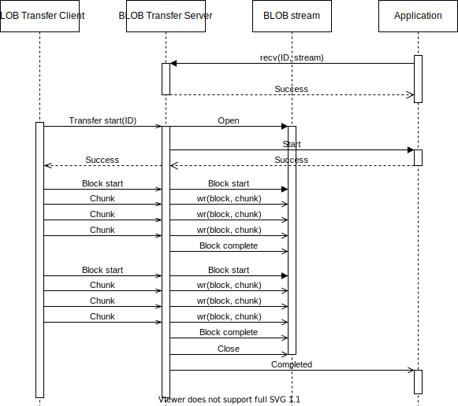

.. _bluetooth_mesh_blob_srv:

BLOB Transfer Server
####################

The Binary Large Object (BLOB) Transfer Server model implements reliable receiving of large binary objects. It serves as the backend of the :ref:`bluetooth_mesh_dfu_srv`, but can also be used for receiving other binary images.

BLOBs
*****

As described in :ref:`bluetooth_mesh_blob`, the binary objects transferred by the BLOB Transfer models are divided into blocks, which are divided into chunks. As the transfer is controlled by the BLOB Transfer Client model, the BLOB Transfer Server must allow blocks to come in any order. The chunks within a block may also come in any order, but all chunks in a block must be received before the next block is started.

The BLOB Transfer Server keeps track of the received blocks and chunks, and will process each block and chunk only once. The BLOB Transfer Server also ensures that any missing chunks are resent by the BLOB Transfer Client.

Usage
*****

The BLOB Transfer Server is instantiated on an element with a set of event handler callbacks:

.. code-block:: C

   static const struct bt_mesh_blob_srv_cb blob_cb = {
       /* Callbacks */
   };

   static struct bt_mesh_blob_srv blob_srv = {
       .cb = &blob_cb,
   };

   static struct bt_mesh_model models[] = {
       BT_MESH_MODEL_BLOB_SRV(&blob_srv),
   };

A BLOB Transfer Server is capable of receiving a single BLOB transfer at a time. Before the BLOB Transfer Server can receive a transfer, it must be prepared by the user. The transfer ID must be passed to the BLOB Transfer Server through the :c:func:`bt_mesh_blob_srv_recv` function before the transfer is started by the BLOB Transfer Client. The ID must be shared between the BLOB Transfer Client and the BLOB Transfer Server through some higher level procedure, like a vendor specific transfer management model.

Once the transfer has been set up on the BLOB Transfer Server, it's ready for receiving the BLOB. The application is notified of the transfer progress through the event handler callbacks, and the BLOB data is sent to the BLOB stream.

The interaction between the BLOB Transfer Server, BLOB stream and application is shown below:

   BLOB Transfer Server model interaction

Transfer suspension
*******************

The BLOB Transfer Server keeps a running timer during the transfer, that is reset on every received message. If the BLOB Transfer Client does not send a message before the transfer timer expires, the transfer is suspended by the BLOB Transfer Server.

The BLOB Transfer Server notifies the user of the suspension by calling the :c:member:`suspended <bt_mesh_blob_srv_cb.suspended>` callback. If the BLOB Transfer Server is in the middle of receiving a block, this block is discarded.

The BLOB Transfer Client may resume a suspended transfer by starting a new block transfer. The BLOB Transfer Server notifies the user by calling the :c:member:`resume <bt_mesh_blob_srv_cb.resume>` callback.

Transfer recovery
*****************

The state of the BLOB transfer is stored persistently. If a reboot occurs, the BLOB Transfer Server will attempt to recover the transfer. When the Bluetooth mesh subsystem is started (for instance by calling :c:func:`bt_mesh_init`), the BLOB Transfer Server will check for aborted transfers, and call the :c:member:`recover <bt_mesh_blob_srv_cb.recover>` callback if there is any. In the recover callback, the user must provide a BLOB stream to use for the rest of the transfer. If the recover callback doesn't return successfully or does not provide a BLOB stream, the transfer is abandoned. If no recover callback is implemented, transfers are always abandoned after a reboot.

After a transfer is successfully recovered, the BLOB Transfer Server enters the suspended state. It will stay suspended until the BLOB Transfer Client resumes the transfer, or the user cancels it.

.. note::
   The BLOB Transfer Client sending the transfer must support transfer recovery for the transfer to complete. If the BLOB Transfer Client has already given up the transfer, the BLOB Transfer Server will stay suspended until the application calls :c:func:`bt_mesh_blob_srv_cancel`.

API reference
*************

.. doxygengroup:: bt_mesh_blob_srv
   :project: Zephyr
   :members:
