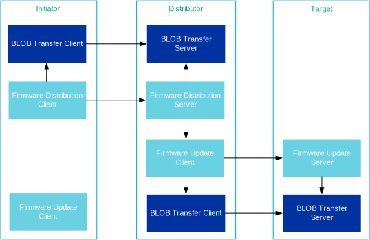
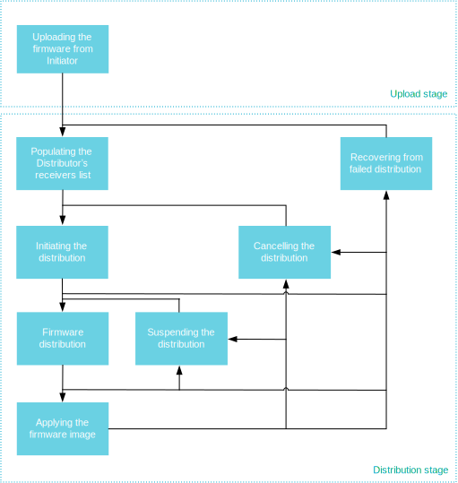

.. _bluetooth_mesh_dfu:

Device Firmware Update (DFU)
############################

Bluetooth mesh supports the distribution of firmware images across a mesh network. The Bluetooth
mesh DFU subsystem implements the Bluetooth Mesh Device Firmware Update Model specification version
1.0. The implementation is in experimental state.

Bluetooth mesh DFU implements a distribution mechanism for firmware images, and does not put any
restrictions on the size, format or usage of the images. The primary design goal of the subsystem is
to provide the qualifiable parts of the Bluetooth mesh DFU specification, and leave the usage,
firmware validation and deployment to the application.

The DFU specification is implemented in the Zephyr Bluetooth mesh DFU subsystem as three separate
models:

.. toctree::
   :maxdepth: 1

   dfu_srv
   dfu_cli
   dfd_srv

Overview
********

DFU roles
=========

The Bluetooth mesh DFU subsystem defines three different roles the mesh nodes have to assume in the
distribution of firmware images:

Target node
   Target node is the receiver and user of the transferred firmware images. All its functionality is
   implemented by the :ref:`bluetooth_mesh_dfu_srv` model. A transfer may be targeting any number of
   Target nodes, and they will all be updated concurrently.

Distributor
   The Distributor role serves two purposes in the DFU process. First, it's acting as the Target
   node in the Upload Firmware procedure, then it distributes the uploaded image to other Target
   nodes as the Distributor. The Distributor does not select the parameters of the transfer, but
   relies on an Initiator to give it a list of Target nodes and transfer parameters. The Distributor
   functionality is implemented in two models, :ref:`bluetooth_mesh_dfd_srv` and
   :ref:`bluetooth_mesh_dfu_cli`. The :ref:`bluetooth_mesh_dfd_srv` is responsible for communicating
   with the Initiator, and the :ref:`bluetooth_mesh_dfu_cli` is responsible for distributing the
   image to the Target nodes.

Initiator
   The Initiator role is typically implemented by the same device that implements the Bluetooth mesh
   :ref:`Provisioner <bluetooth_mesh_provisioning>` and :ref:`Configurator
   <bluetooth_mesh_models_cfg_cli>` roles. The Initiator needs a full overview of the potential
   Target nodes and their firmware, and will control (and initiate) all firmware updates. The
   Initiator role is not implemented in the Zephyr Bluetooth mesh DFU subsystem.

         distribution

   DFU roles and the associated Bluetooth mesh models

Bluetooth mesh applications may combine the DFU roles in any way they'd like, and even take on
multiple instances of the same role by instantiating the models on separate elements. For instance,
the Distributor and Initiator role can be combined by instantiating the
:ref:`bluetooth_mesh_dfu_cli` on the Initiator node and calling its API directly.

It's also possible to combine the Initiator and Distributor devices into a single device, and
replace the Firmware Distribution Server model with a proprietary mechanism that will access the
Firmware Update Client model directly, e.g. over a serial protocol.

.. note::
   All DFU models instantiate one or more :ref:`bluetooth_mesh_blob`, and may need to be spread over
   multiple elements for certain role combinations.

Stages
======

The Bluetooth mesh DFU process is designed to act in three stages:

Upload stage
   First, the image is uploaded to a Distributor in a mesh network by an external entity, such as a
   phone or gateway (the Initiator). During the Upload stage, the Initiator transfers the firmware
   image and all its metadata to the Distributor node inside the mesh network. The Distributor
   stores the firmware image and its metadata persistently, and awaits further instructions from the
   Initiator. The time required to complete the upload process depends on the size of the image.
   After the upload completes, the Initiator can disconnect from the network during the much more
   time-consuming Distribution stage. Once the firmware has been uploaded to the Distributor, the
   Initiator may trigger the Distribution stage at any time.

Firmware Capability Check stage (optional)
  Before starting the Distribution stage, the Initiator may optionally check if Target nodes can
  accept the new firmware. Nodes that do not respond, or respond that they can't receive the new
  firmware, are excluded from the firmware distribution process.

Distribution stage
   Before the firmware image can be distributed, the Initiator transfers the list of Target nodes
   and their designated firmware image index to the Distributor. Next, it tells the Distributor to
   start the firmware distributon process, which runs in the background while the Initiator and the
   mesh network perform other duties. Once the firmware image has been transferred to the Target
   nodes, the Distributor may ask them to apply the firmware image immediately and report back with
   their status and new firmware IDs.

Firmware images
===============

All updatable parts of a mesh node's firmware should be represented as a firmware image. Each Target
node holds a list of firmware images, each of which should be independently updatable and
identifiable.

Firmware images are represented as a BLOB (the firmware itself) with the following additional
information attached to it:

Firmware ID
   The firmware ID is used to identify a firmware image. The Initiator node may ask the Target nodes
   for a list of its current firmware IDs to determine whether a newer version of the firmware is
   available. The format of the firmware ID is vendor specific, but generally, it should include
   enough information for an Initiator node with knowledge of the format to determine the type of
   image as well as its version. The firmware ID is optional, and its max length is determined by
   :kconfig:option:`CONFIG_BT_MESH_DFU_FWID_MAXLEN`.

Firmware metadata
   The firmware metadata is used by the Target node to determine whether it should accept an
   incoming firmware update, and what the effect of the update would be. The metadata format is
   vendor specific, and should contain all information the Target node needs to verify the image, as
   well as any preparation the Target node has to make before the image is applied. Typical metadata
   information can be image signatures, changes to the node's Composition Data and the format of the
   BLOB. The Target node may perform a metadata check before accepting incoming transfers to
   determine whether the transfer should be started. The firmware metadata can be discarded by the
   Target node after the metadata check, as other nodes will never request the metadata from the
   Target node. The firmware metadata is optional, and its maximum length is determined by
   :kconfig:option:`CONFIG_BT_MESH_DFU_METADATA_MAXLEN`.

   The Bluetooth mesh DFU subsystem in Zephyr provides its own metadata format
   (:c:struct:`bt_mesh_dfu_metadata`) together with a set of related functions that can be used by
   an end product. The support for it is enabled using the
   :kconfig:option:`CONFIG_BT_MESH_DFU_METADATA` option. The format of the metadata is presented in
   the table below.

+------------------------+--------------+----------------------------------------+
| Field                  | Size (Bytes) | Description                            |
+========================+==============+========================================+
| New firmware version   | 8 B          | 1 B: Major version                     |
|                        |              | 1 B: Minor version                     |
|                        |              | 2 B: Revision                          |
|                        |              | 4 B: Build number                      |
+------------------------+--------------+----------------------------------------+
| New firmware size      | 3 B          | Size in bytes for a new firmware       |
+------------------------+--------------+----------------------------------------+
| New firmware core type | 1 B          | Bit field:                             |
|                        |              | Bit 0: Application core                |
|                        |              | Bit 1: Network core                    |
|                        |              | Bit 2: Applications specific BLOB.     |
|                        |              | Other bits: RFU                        |
+------------------------+--------------+----------------------------------------+
| Hash of incoming       | 4 B          | Lower 4 octets of AES-CMAC             |
| composition data       | (Optional)   | (app-specific-key, composition data).  |
|                        |              | This field is present, if Bit 0 is set |
|                        |              | in the New firmware core type field.   |
+------------------------+--------------+----------------------------------------+
| New number of elements | 2 B          | Number of elements on the node         |
|                        | (Optional)   | after firmware is applied.             |
|                        |              | This field is present, if Bit 0 is set |
|                        |              | in the New firmware core type field.   |
+------------------------+--------------+----------------------------------------+
| Application-specific   | <variable>   | Application-specific data to allow     |
| data for new firmware  | (Optional)   | application to execut some             |
|                        |              | vendor-specific behaviors using        |
|                        |              | this data before it can respond        |
|                        |              | with a status message.                 |
+------------------------+--------------+----------------------------------------+

Firmware URI
   The firmware URI gives the Initiator information about where firmware updates for the image can
   be found. The URI points to an online resource the Initiator can interact with to get new
   versions of the firmware. This allows Initiators to perform updates for any node in the mesh
   network by interacting with the web server pointed to in the URI. The URI must point to a
   resource using the ``http`` or ``https`` schemes, and the targeted web server must behave
   according to the Firmware Check Over HTTPS procedure defined by the specification. The firmware
   URI is optional, and its max length is determined by
   :kconfig:option:`CONFIG_BT_MESH_DFU_URI_MAXLEN`.

   .. note::

      The out-of-band distribution mechanism is not supported.

Firmware effect
---------------

A new image may have the Composition Data Page 0 different from the one allocated on a Target node.
This may have an effect on the provisioning data of the node and how the Distributor finalizes the
DFU. Depending on the availability of the Remote Provisioning Server model on the old and new image,
the device may either boot up unprovisioned after applying the new firmware or require to be
re-provisioned. The complete list of available options is defined in :c:enum:`bt_mesh_dfu_effect`:

:c:enum:`BT_MESH_DFU_EFFECT_NONE`
   The device stays provisioned after the new firmware is programmed. This effect is chosen if the
   composition data of the new firmware doesn't change.
:c:enum:`BT_MESH_DFU_EFFECT_COMP_CHANGE_NO_RPR`
   This effect is chosen when the composition data changes and the device doesn't support the remote
   provisioning. The new composition data takes place only after re-provisioning.
:c:enum:`BT_MESH_DFU_EFFECT_COMP_CHANGE`
   This effect is chosen when the composition data changes and the device supports the remote
   provisioning. In this case, the device stays provisioned and the new composition data takes place
   after re-provisioning using the Remote Provisioning models.
:c:enum:`BT_MESH_DFU_EFFECT_UNPROV`
  This effect is chosen if the composition data in the new firmware changes, the device doesn't
  support the remote provisioning, and the new composition data takes effect after applying the
  firmware.

When the Target node receives the Firmware Update Firmware Metadata Check message, the Firmware
Update Server model calls the :c:member:`bt_mesh_dfu_srv_cb.check` callback, the application can
then process the metadata and provide the effect value.

DFU procedures
**************

The DFU protocol is implemented as a set of procedures that must be performed in a certain order.

The Initiator controls the Upload stage of the DFU protocol, and all Distributor side handling of
the upload subprocedures is implemented in the :ref:`bluetooth_mesh_dfd_srv`.

The Distribution stage is controlled by the Distributor, as implemented by the
:ref:`bluetooth_mesh_dfu_cli`. The Target node implements all handling of these procedures in the
:ref:`bluetooth_mesh_dfu_srv`, and notifies the application through a set of callbacks.

   DFU stages and procedures as seen from the Distributor

Uploading the firmware
======================

The Upload Firmware procedure uses the :ref:`bluetooth_mesh_blob` to transfer the firmware image
from the Initiator to the Distributor. The Upload Firmware procedure works in two steps:

1. The Initiator generates a BLOB ID, and sends it to the Distributor's Firmware Distribution Server
   along with the firmware information and other input parameters of the BLOB transfer. The Firmware
   Distribution Server stores the information, and prepares its BLOB Transfer Server for the
   incoming transfer before it responds with a status message to the Initiator.
#. The Initiator's BLOB Transfer Client model transfers the firmware image to the Distributor's BLOB
   Transfer Server, which stores the image in a predetermined flash partition.

When the BLOB transfer finishes, the firmware image is ready for distribution. The Initiator may
upload several firmware images to the Distributor, and ask it to distribute them in any order or at
any time. Additional procedures are available for querying and deleting firmware images from the
Distributor.

The following Distributor's capabilities related to firmware images can be configured using the
configuration options:

* :kconfig:option:`CONFIG_BT_MESH_DFU_SLOT_CNT`: Amount of image slots available on the device.
* :kconfig:option:`CONFIG_BT_MESH_DFD_SRV_SLOT_MAX_SIZE`: Maximum allowed size for each image.
* :kconfig:option:`CONFIG_BT_MESH_DFD_SRV_SLOT_SPACE`: Available space for all images.

Populating the Distributor's receivers list
===========================================

Before the Distributor can start distributing the firmware image, it needs a list of Target nodes to
send the image to. The Initiator gets the full list of Target nodes either by querying the potential
targets directly, or through some external authority. The Initiator uses this information to
populate the Distributor's receivers list with the address and relevant firmware image index of each
Target node. The Initiator may send one or more Firmware Distribution Receivers Add messages to
build the Distributor's receivers list, and a Firmware Distribution Receivers Delete All message to
clear it.

The maximum number of receivers that can be added to the Distributor is configured through the
:kconfig:option:`CONFIG_BT_MESH_DFD_SRV_TARGETS_MAX` configuration option.

Initiating the distribution
===========================

Once the Distributor has stored a firmware image and received a list of Target nodes, the Initiator
may initiate the distribution procedure. The BLOB transfer parameters for the distribution are
passed to the Distributor along with an update policy. The update policy decides whether the
Distributor should request that the firmware is applied on the Target nodes or not. The Distributor
stores the transfer parameters and starts distributing the firmware image to its list of Target
nodes.

Firmware distribution
---------------------

The Distributor's Firmware Update Client model uses its BLOB Transfer Client model's broadcast
subsystem to communicate with all Target nodes. The firmware distribution is performed with the
following steps:

1. The Distributor's Firmware Update Client model generates a BLOB ID and sends it to each Target
   node's Firmware Update Server model, along with the other BLOB transfer parameters, the Target
   node firmware image index and the firmware image metadata. Each Target node performs a metadata
   check and prepares their BLOB Transfer Server model for the transfer, before sending a status
   response to the Firmware Update Client, indicating if the firmware update will have any effect on
   the Bluetooth mesh state of the node.
#. The Distributor's BLOB Transfer Client model transfers the firmware image to all Target nodes.
#. Once the BLOB transfer has been received, the Target nodes' applications verify that the firmware
   is valid by performing checks such as signature verification or image checksums against the image
   metadata.
#. The Distributor's Firmware Update Client model queries all Target nodes to ensure that they've
   all verified the firmware image.

If the distribution procedure completed with at least one Target node reporting that the image has
been received and verified, the distribution procedure is considered successful.

.. note::
   The firmware distribution procedure only fails if *all* Target nodes are lost. It is up to the
   Initiator to request a list of failed Target nodes from the Distributor and initiate additional
   attempts to update the lost Target nodes after the current attempt is finished.

Suspending the distribution
---------------------------

The Initiator can also request the Distributor to suspend the firmware distribution. In this case,
the Distributor will stop sending any messages to Target nodes. When the firmware distribution is
resumed, the Distributor will continue sending the firmware from the last successfully transferred
block.

Applying the firmware image
===========================

If the Initiator requested it, the Distributor can initiate the Apply Firmware on Target Node
procedure on all Target nodes that successfully received and verified the firmware image. The Apply
Firmware on Target Node procedure takes no parameters, and to avoid ambiguity, it should be
performed before a new transfer is initiated. The Apply Firmware on Target Node procedure consists
of the following steps:

1. The Distributor's Firmware Update Client model instructs all Target nodes that have verified the
   firmware image to apply it. The Target nodes' Firmware Update Server models respond with a status
   message before calling their application's ``apply`` callback.
#. The Target node's application performs any preparations needed before applying the transfer, such
   as storing a snapshot of the Composition Data or clearing its configuration.
#. The Target node's application swaps the current firmware with the new image and updates its
   firmware image list with the new firmware ID.
#. The Distributor's Firmware Update Client model requests the full list of firmware images from
   each Target node, and scans through the list to make sure that the new firmware ID has replaced
   the old.

.. note::
   During the metadata check in the distribution procedure, the Target node may have reported that
   it will become unprovisioned after the firmware image is applied. In this case, the Distributor's
   Firmware Update Client model will send a request for the full firmware image list, and expect no
   response.

Cancelling the distribution
===========================

The firmware distribution can be cancelled at any time by the Initiator. In this case, the
Distributor starts the cancelling procedure by sending a cancelling message to all Target nodes. The
Distributor waits for the response from all Target nodes. Once all Target nodes have replied, or the
request has timed out, the distribution procedure is cancelled. After this the distribution
procedure can be started again from the ``Firmware distribution`` section.

API reference
*************

This section lists the types common to the Device Firmware Update mesh models.

.. doxygengroup:: bt_mesh_dfd
   :project: Zephyr
   :members:

.. doxygengroup:: bt_mesh_dfu
   :project: Zephyr
   :members:

.. doxygengroup:: bt_mesh_dfu_metadata
   :project: Zephyr
   :members:
