.. _autopts-linux:

AutoPTS on Linux
################

This tutorial shows how to setup AutoPTS client on Linux with AutoPTS server running on Windows 10
virtual machine. Tested with Ubuntu 20.4 and Linux Mint 20.4.

You must have a Zephyr development environment set up. See
:ref:`getting_started` for details.

Supported methods to test zephyr bluetooth host:

- Testing Zephyr Host Stack on QEMU

- Testing Zephyr Host Stack on :ref:`native_sim <native_sim>`

- Testing Zephyr combined (controller + host) build on Real hardware (such as nRF52)

For running with QEMU or :ref:`native_sim <native_sim>`, see :ref:`bluetooth_qemu_native`.

.. contents::
    :local:
    :depth: 2

Setup Linux
===========

Install nrftools (only required in the actual hardware test mode)
=================================================================

Download latest nrftools (version >= 10.12.1) from site
https://www.nordicsemi.com/Software-and-tools/Development-Tools/nRF-Command-Line-Tools/Download.

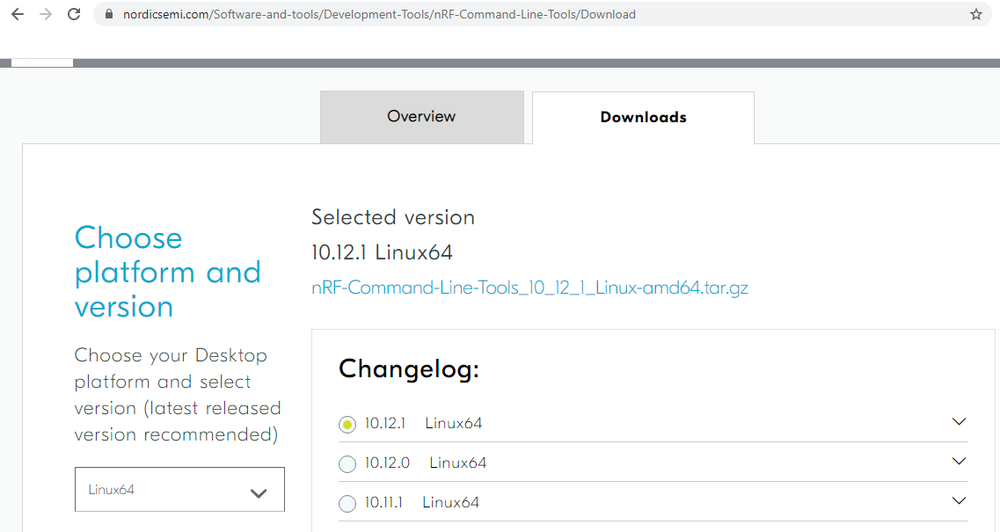

After you extract archive, you will see 2 .deb files, e.g.:

- JLink_Linux_V688a_x86_64.deb

- nRF-Command-Line-Tools_10_12_1_Linux-amd64.deb

and README.md. To install the tools, double click on each .deb file or follow
instructions from README.md.

Setup Windows 10 virtual machine
==================================

Choose and install your hypervisor like VMWare Workstation(preferred) or
VirtualBox. On VirtualBox could be some issues, if your host has fewer than 6 CPU.

Create Windows virtual machine instance. Make sure it has at least 2 cores and
installed guest extensions.

Setup tested with VirtualBox 6.1.18 and VMWare Workstation 16.1.1 Pro.

Update Windows
---------------

Update Windows in:

Start -> Settings -> Update & Security -> Windows Update

Setup static IP
----------------

WMWare Works
^^^^^^^^^^^^^

On Linux, open Virtual Network Editor app and create network:

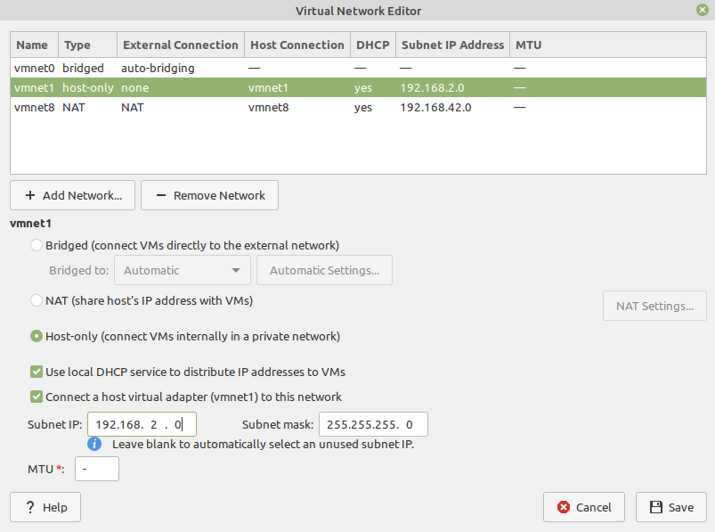

Open virtual machine network settings. Add custom adapter:

.. image:: vmware_static_ip_2.png
   :height: 400
   :width: 500
   :align: center

If you type 'ifconfig' in terminal, you should be able to find your host IP:

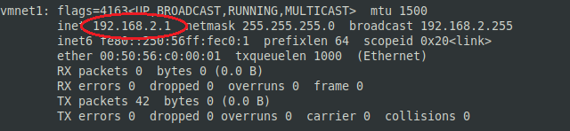

VirtualBox
^^^^^^^^^^^^^

Go to:

File -> Host Network Manager

and create network:

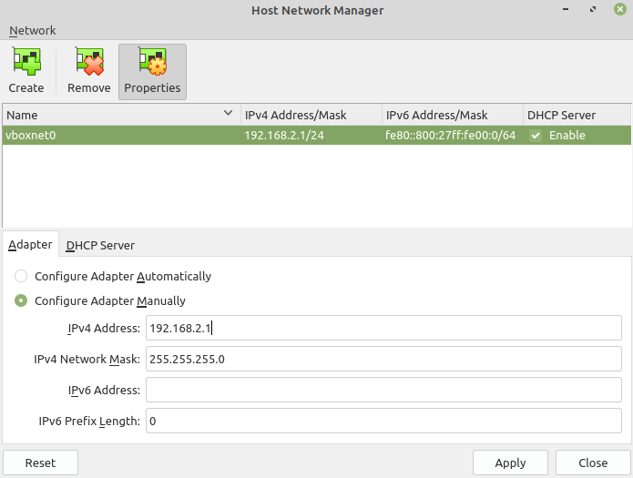

Open virtual machine network settings. On adapter 1 you will have created by default NAT.
Add adapter 2:

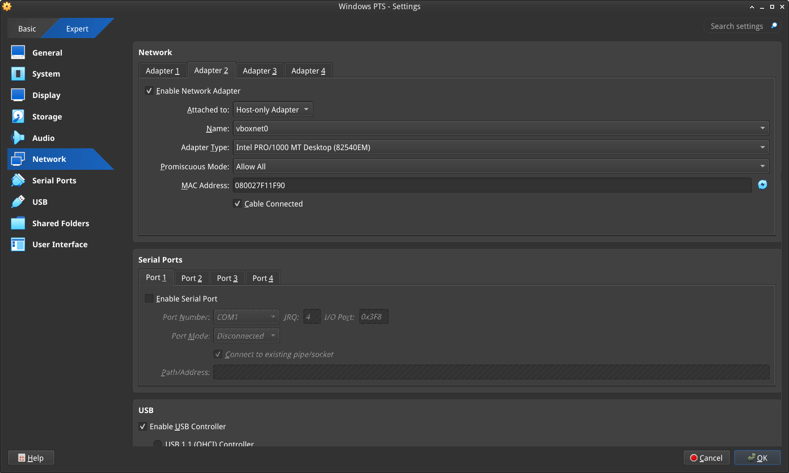

Windows
^^^^^^^^
Setup static IP on Windows virtual machine. Go to

Settings -> Network & Internet -> Ethernet -> Unidentified network -> Edit

and set:

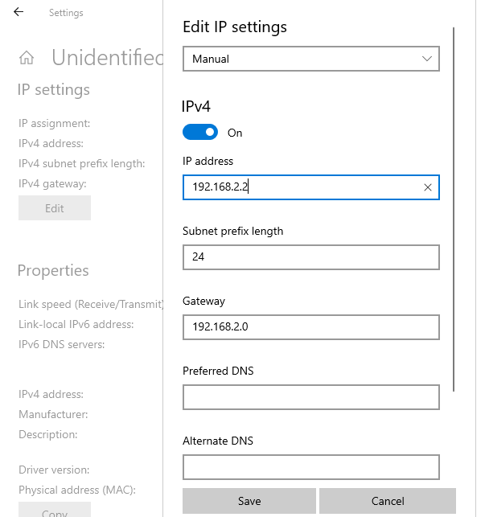

Install Python 3
-----------------

Download and install latest `Python 3 <https://www.python.org/downloads/>`_ on Windows.
Let the installer add the Python installation directory to the PATH and
disable the path length limitation.

.. image:: install_python1.png
   :height: 300
   :width: 450
   :align: center

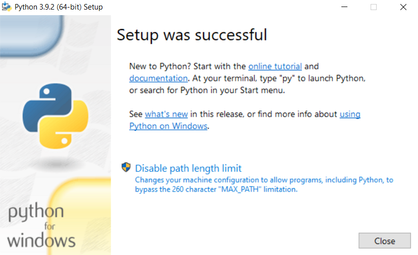

Install Git
------------

Download and install `Git <https://git-scm.com/downloads>`_.
During installation enable option: Enable experimental support for pseudo
consoles. We will use Git Bash as Windows terminal.

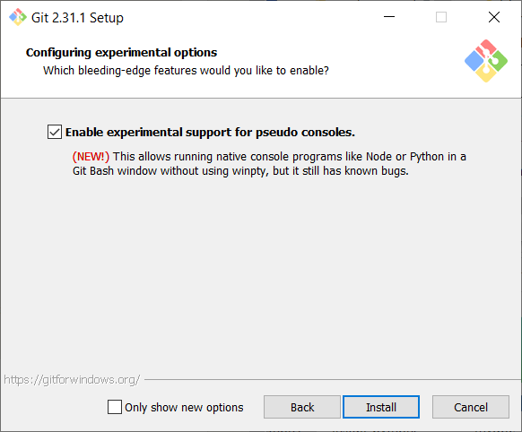

Install PTS 8
--------------

On Windows virtual machine, install latest PTS from https://www.bluetooth.org.
Remember to install drivers from installation directory
"C:/Program Files (x86)/Bluetooth SIG/Bluetooth PTS/PTS Driver/win64/CSRBlueCoreUSB.inf"

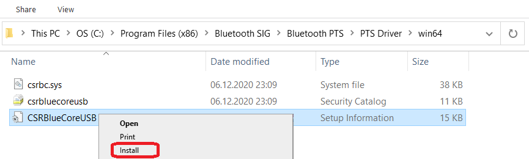

.. note::

    Starting with PTS 8.0.1 the Bluetooth Protocol Viewer is no longer included.
    So to capture Bluetooth events, you have to download it separately.

Connect PTS dongle
--------------------

With VirtualBox there should be no problem. Just find dongle in Devices -> USB and connect.

With VMWare you might need to use some trick, if you cannot find dongle in
VM -> Removable Devices. Type in Linux terminal:

.. code-block::

    usb-devices

and find in output your PTS Bluetooth USB dongle

.. image:: usb-devices_output.png
   :height: 100
   :width: 500
   :align: center

Note Vendor and ProdID number. Close VMWare Workstation and open .vmx of your virtual machine
(path similar to /home/codecoup/vmware/Windows 10/Windows 10.vmx) in text editor.
Write anywhere in the file following line:

.. code-block::

    usb.autoConnect.device0 = "0x0a12:0x0001"

just replace 0x0a12 with Vendor number and 0x0001 with ProdID number you found earlier.

Connect devices (only required in the actual hardware test mode)
================================================================

.. image:: devices_1.png
   :height: 400
   :width: 600
   :align: center

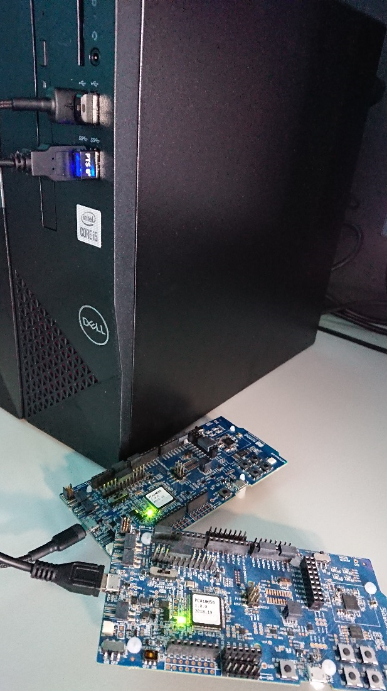

Flash board (only required in the actual hardware test mode)
============================================================

On Linux, go to ~/zephyrproject. There should be already ~/zephyrproject/build
directory. Flash board:

.. code-block::

    west flash

Setup auto-pts project
=======================

AutoPTS client on Linux
------------------------

Clone auto-pts project:

.. code-block::

    git clone https://github.com/intel/auto-pts.git

Install socat, that is used to transfer BTP data stream from UART's tty file:

.. code-block::

    sudo apt-get install python-setuptools socat

Install required python modules:

.. code-block::

   cd auto-pts
   pip3 install --user wheel
   pip3 install --user -r autoptsclient_requirements.txt

Autopts server on Windows virtual machine
------------------------------------------
In Git Bash, clone auto-pts project repo:

.. code-block::

    git clone https://github.com/intel/auto-pts.git

Install required python modules:

.. code-block::

   cd auto-pts
   pip3 install --user wheel
   pip3 install --user -r autoptsserver_requirements.txt

Restart virtual machine.

Running AutoPTS
================

Server and client by default will run on localhost address. Run server:

.. code-block::

    python ./autoptsserver.py

.. image:: autoptsserver_run_2.png
   :height: 120
   :width: 700
   :align: center

Testing Zephyr Host Stack on QEMU:

.. code-block::

    # A Bluetooth controller needs to be mounted.
    # For running with HCI UART, please visit: https://docs.zephyrproject.org/latest/samples/bluetooth/hci_uart/README.html#bluetooth-hci-uart

    python ./autoptsclient-zephyr.py "C:\Users\USER_NAME\Documents\Profile Tuning Suite\PTS_PROJECT\PTS_PROJECT.pqw6" \
    	~/zephyrproject/build/zephyr/zephyr.elf -i SERVER_IP -l LOCAL_IP

Testing Zephyr Host Stack on :ref:`native_sim <native_sim>`:

.. code-block::

    # A Bluetooth controller needs to be mounted.
    # For running with HCI UART, please visit: https://docs.zephyrproject.org/latest/samples/bluetooth/hci_uart/README.html#bluetooth-hci-uart

    west build -b native_sim zephyr/tests/bluetooth/tester/ -DEXTRA_CONF_FILE=overlay-native.conf

    sudo python ./autoptsclient-zephyr.py "C:\Users\USER_NAME\Documents\Profile Tuning Suite\PTS_PROJECT\PTS_PROJECT.pqw6" \
    	~/zephyrproject/build/zephyr/zephyr.exe -i SERVER_IP -l LOCAL_IP --hci 0

Testing Zephyr combined (controller + host) build on nRF52:

.. note::

    If the error "ImportError: No module named pywintypes" appeared after the fresh setup,
    uninstall and install the pywin32 module:

    .. code-block::

      pip install --upgrade --force-reinstall pywin32

Run client:

.. code-block::

    python ./autoptsclient-zephyr.py zephyr-master ~/zephyrproject/build/zephyr/zephyr.elf -t /dev/ACM0 \
    	-b nrf52 -l 192.168.2.1 -i 192.168.2.2

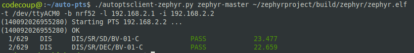

At the first run, when Windows asks, enable connection through firewall:

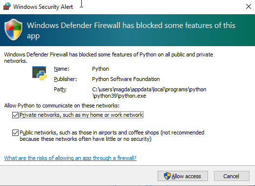

Troubleshooting
================

- "After running one test, I need to restart my Windows virtual machine to run another, because of fail verdict from APICOM in PTS logs."

It means your virtual machine has not enough processor cores or memory. Try to add more in
settings. Note that a host with 4 CPUs could be not enough with VirtualBox as hypervisor.
In this case, choose rather VMWare Workstation.

- "I cannot start autoptsserver-zephyr.py. I always got error:"

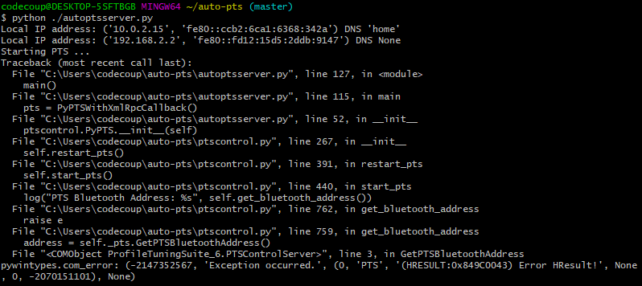

One or more of the following steps should help:

- Close all PTS Windows.

- Replug PTS bluetooth dongle.

- Delete temporary workspace. You will find it in auto-pts-code/workspaces/zephyr/zephyr-master/ as temp_zephyr-master. Be careful, do not remove the original one zephyr-master.pqw6.

- Restart Windows virtual machine.
