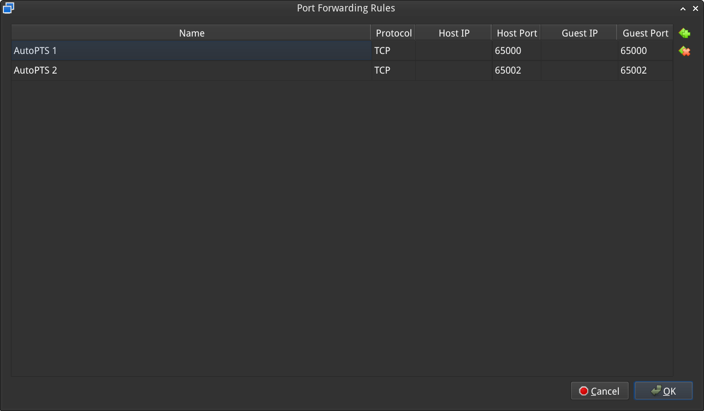

.. _autopts-linux:

AutoPTS on Linux
################

This tutorial shows how to setup AutoPTS client on Linux with AutoPTS server running on Windows 10
virtual machine. Tested with Ubuntu 20.4 and Linux Mint 20.4.

You must have a Zephyr development environment set up. See
:ref:`getting_started` for details.

Supported methods to test zephyr bluetooth host:

- Testing Zephyr Host Stack on QEMU

- Testing Zephyr Host Stack on :zephyr:board:`native_sim <native_sim>`

- Testing Zephyr combined (controller + host) build on Real hardware (such as nRF52)

For running with QEMU or :zephyr:board:`native_sim <native_sim>`, see :ref:`bluetooth_qemu_native`.

.. contents::
    :local:
    :depth: 2

Setup Linux
***********

Please follow :ref:`getting_started` on how to setup Linux for building and flashing applications.

Setup Windows 10/11 virtual machine
***********************************

Choose and install your hypervisor like VMWare Workstation(preferred) or
VirtualBox. On VirtualBox could be some issues, if your host has fewer than 6 CPU.

Create Windows virtual machine instance. Make sure it has at least 2 cores and
installed guest extensions.

Setup tested with VirtualBox 7.2.4 and VMWare Workstation 16.1.1 Pro.

Update Windows
==============

Update Windows in:

Start -> Settings -> Update & Security -> Windows Update

Setup NAT
=========

It is possible to use NAT and portforwarding to setup communication between a Linux host and a
Windows guest. This is easiest setup for VirtualBox, and does not require any static IPs to be
configured, and will not get blocked by the Windows Firewall.

VirtualBox
----------

Open virtual machine network settings. On adapter 1 you will have created by default NAT.
Open the Port Forwarding menu an add the ports you want.

.. image:: virtualbox_nat_1.png
   :width: 500
   :align: center

For example setting up the following will allow you to use
``localhost:65000`` and ``localhost:65002`` (or ``127.0.0.0:65000`` and ``127.0.0.0:65002``)
to connect to an AutoPTS Server in Windows running on ports 65000 and 65002.

Setup static IP
===============

If you cannot or do not want to use NAT it is possible to configure a static IP.

VMWare Works
------------

On Linux, open Virtual Network Editor app and create network:

.. image:: vmware_static_ip_1.png
   :height: 400
   :width: 500
   :align: center

Open virtual machine network settings. Add custom adapter:

.. image:: vmware_static_ip_2.png
   :height: 400
   :width: 500
   :align: center

If you type 'ifconfig' in terminal, you should be able to find your host IP:

.. image:: vmware_static_ip_3.png
   :height: 150
   :width: 550
   :align: center

VirtualBox
----------

VirtualBox on Linux, macOS and Solaris Oracle VM VirtualBox will only allow IP addresses in
``192.168.56.0/21`` range to be assigned to host-only adapters, so if using a static address with
VirtualBox this is the only address range you can use.

Go to:

File -> Tools -> Network Manager

and create network:

.. image:: virtualbox_static_ip_1.png
   :width: 500
   :align: center

Open virtual machine network settings. On adapter 1 you will have created by default NAT.
Add adapter 2:

.. image:: virtualbox_static_ip_2.png
   :width: 500
   :align: center

Windows
-------
Setup static IP on Windows virtual machine. Go to

Settings -> Network & Internet -> Ethernet -> Unidentified network -> Edit

and set:

.. image:: windows_static_ip.png
   :height: 400
   :width: 400
   :align: center

Install Python 3
================

Download and install latest `Python 3 <https://www.python.org/downloads/>`_ on Windows.
Let the installer add the Python installation directory to the PATH and
disable the path length limitation.

.. image:: install_python1.png
   :height: 300
   :width: 450
   :align: center

.. image:: install_python2.png
   :height: 300
   :width: 450
   :align: center

Install Git
===========

Download and install `Git <https://git-scm.com/downloads>`_.
During installation enable option: Enable experimental support for pseudo
consoles. We will use Git Bash as Windows terminal.

.. image:: install_git.png
   :height: 350
   :width: 400
   :align: center

Install PTS
===========

On Windows virtual machine, install the latest PTS from https://pts.bluetooth.com/download.
Remember to install drivers from installation directory
"C:/Program Files (x86)/Bluetooth SIG/Bluetooth PTS/PTS Driver/win64/CSRBlueCoreUSB.inf"

.. image:: install_pts_drivers.png
   :height: 250
   :width: 850
   :align: center

.. note::

    Starting with PTS 8.0.1 the Bluetooth Protocol Viewer is no longer included.
    So to capture Bluetooth events, you have to download it separately.

Connect PTS dongle
==================

With VirtualBox there should be no problem. Just find dongle in Devices -> USB and connect.

With VMWare you might need to use some trick, if you cannot find dongle in
VM -> Removable Devices. Type in Linux terminal:

.. code-block::

    usb-devices

and find in output your PTS Bluetooth USB dongle

.. image:: usb-devices_output.png
   :height: 100
   :width: 500
   :align: center

Note Vendor and ProdID number. Close VMWare Workstation and open .vmx of your virtual machine
(path similar to /home/codecoup/vmware/Windows 10/Windows 10.vmx) in text editor.
Write anywhere in the file following line:

.. code-block::

    usb.autoConnect.device0 = "0x0a12:0x0001"

just replace 0x0a12 with Vendor number and 0x0001 with ProdID number you found earlier.

Connect devices (only required in the actual hardware test mode)
****************************************************************

.. image:: devices_1.png
   :height: 400
   :width: 600
   :align: center

.. image:: devices_2.png
   :height: 700
   :width: 500
   :align: center

Setup auto-pts project
**********************

AutoPTS client on Linux
=======================

Clone auto-pts project:

.. code-block::

    git clone https://github.com/auto-pts/auto-pts.git

Install socat, that is used to transfer BTP data stream from UART's tty file:

.. code-block::

    sudo apt-get install python-setuptools socat

Install required python modules:

.. code-block::

   cd auto-pts
   pip3 install --user -r autoptsclient_requirements.txt

Autopts server on Windows virtual machine
=========================================
In Git Bash, clone auto-pts project repo:

.. code-block::

    git clone https://github.com/auto-pts/auto-pts.git

Install required python modules:

.. code-block::

   cd auto-pts
   pip3 install --user wheel
   pip3 install --user -r autoptsserver_requirements.txt

Restart virtual machine.

Running AutoPTS
***************

Please follow the information from
https://github.com/zephyrproject-rtos/zephyr/tree/main/tests/bluetooth/tester on how to build,
flash and run the Bluetooth Tester application.

Server and client by default will run on localhost address.
Run the server in the Windows virtual machine:

.. code-block::

    python ./autoptsserver.py

.. image:: autoptsserver_run_2.png
   :height: 120
   :width: 700
   :align: center

See also https://github.com/auto-pts/auto-pts for additional information on how to run auto-pts.

Testing Zephyr Host Stack on hardware
=====================================

.. code-block::

    python ./autoptsclient-zephyr.py zephyr-master -t /dev/ttyACM0 -b BOARD -i SERVER_IP -l LOCAL_IP

Where ``/dev/ttyACM0`` is the tty for the board,
``BOARD`` is the board to use (e.g. ``nrf53_audio``),
``SERVER_IP`` is the IP of the AutoPTS server,
``LOCAL_IP`` is the local IP of the Linux machine.

Testing Zephyr Host Stack on QEMU
=================================

A Bluetooth controller needs to be mounted.
For running with HCI UART, please visit :zephyr:code-sample:`bluetooth_hci_uart`.

.. code-block::

    python ./autoptsclient-zephyr.py zephyr-master BUILD_DIR/zephyr/zephyr.elf -i SERVER_IP -l LOCAL_IP

Where ``BUILD_DIR`` is the build directory,
``SERVER_IP`` is the IP of the AutoPTS server,
``LOCAL_IP`` is the local IP of the Linux machine.

Testing Zephyr Host Stack on :zephyr:board:`native_sim <native_sim>`
====================================================================

When tester application has been built for :zephyr:board:`native_sim <native_sim>` it produces a
``zephyr.exe`` file, that can be run as a native Linux application.
Depending on your system,
you may need to perform the following steps to successfully run ``zephyr.exe``.

Setting capabilities
--------------------

Since the application will need access to connect to a socket for HCI,
you may need to perform the following

.. code-block::

    setcap cap_net_raw,cap_net_admin,cap_sys_admin+ep zephyr.exe

This is not required if you run ``zephyr.exe`` or ``./autoptsclient-zephyr.py`` with e.g. ``sudo``.

Downing the HCI controller
--------------------------

You may also need to "down" or "power off" the HCI controller before running ``zephyr.exe``.
This can be done either with ``hciconfig`` as

.. code-block::

    hciconfig hciX down

Where ``hciX`` is a value like ``hci0``. You may run ``hciconfig`` to get a list of your HCI devices.

Since ``hciconfig`` is deprecated on some systems, you may need to use

.. code-block::

    btmgmt -i hciX power off

Similar to ``hciconfig``, ``btmgmt info`` may be used to list current controllers and their states.

Both ``hciconfig`` and ``btmgmt`` may require ``sudo`` when powering down a controller.

Running the client
------------------

The application can be run as

.. code-block::

    python ./autoptsclient-zephyr.py zephyr-master --hci HCI BUILD_DIR/zephyr/zephyr.exe -i SERVER_IP -l LOCAL_IP

Where ``HCI`` is the HCI index, e.g. ``0`` or ``1``,
``BUILD_DIR`` is the build directory,
``SERVER_IP`` is the IP of the AutoPTS server,
``LOCAL_IP`` is the local IP of the Linux machine.

Troubleshooting
****************

After running one test, I need to restart my Windows virtual machine to run another, because of fail verdict from APICOM in PTS logs
====================================================================================================================================

It means your virtual machine has not enough processor cores or memory. Try to add more in
settings. Note that a host with 4 CPUs could be not enough with VirtualBox as hypervisor.
In this case, choose rather VMWare Workstation.

I cannot start autoptsserver-zephyr.py. I always get a Python error
===================================================================

.. image:: autoptsserver_typical_error.png
   :height: 300
   :width: 650
   :align: center

One or more of the following steps should help:

- Close all PTS Windows.

- Replug PTS bluetooth dongle.

- Delete temporary workspace. You will find it in auto-pts-code/workspaces/zephyr/zephyr-master/ as temp_zephyr-master. Be careful, do not remove the original one zephyr-master.pqw6.

- Restart Windows virtual machine.

The PTS automation window keeps opening and closing
===================================================

This indicates that it fails to capture a PTS dongle.
If the AutoPTS server is able to find and use a PTS dongle,
then the title of the window will show the Bluetooth address of the dongle.
If this does not happen then ensure that the dongle is plugged in, updated and recognized by PTS.

If it still fails to run tests after this,
please ensure that the Bluetooth Protocol Viewer is installed.
