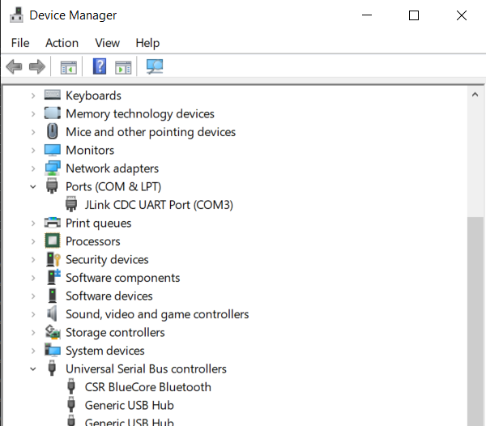
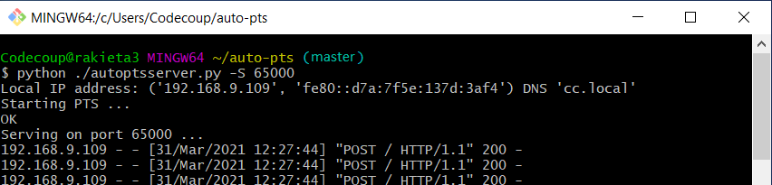
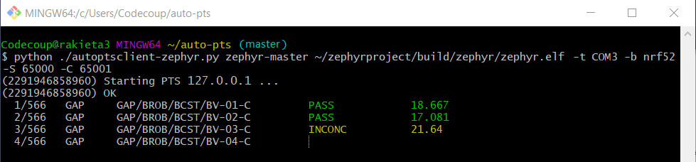
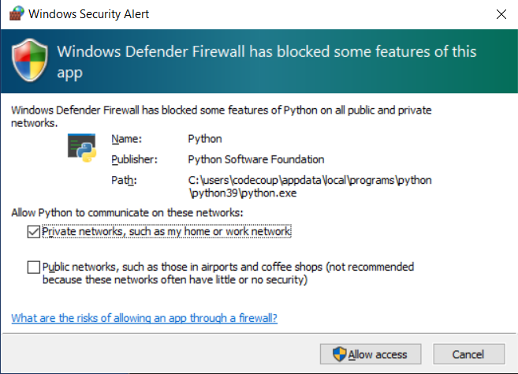

.. _autopts-win10:

AutoPTS on Windows 10 with nRF52 board
#######################################

This tutorial shows how to setup AutoPTS client and server to run both on
Windows 10. We use WSL1 with Ubuntu only to build a Zephyr project to
an elf file, because Zephyr SDK is not available on Windows yet.
Tutorial covers only nrf52840dk.

.. contents::
    :local:
    :depth: 2

Update Windows and drivers
===========================

Update Windows in:

Start -> Settings -> Update & Security -> Windows Update

Update drivers, following the instructions from your hardware vendor.

Install Python 3
=================

Download and install `Python 3 <https://www.python.org/downloads/>`_.
Setup was tested with versions >=3.8. Let the installer add the Python
installation directory to the PATH and disable the path length limitation.

.. image:: install_python1.png
   :height: 300
   :width: 450
   :align: center

.. image:: install_python2.png
   :height: 300
   :width: 450
   :align: center

Install Git
============

Download and install `Git <https://git-scm.com/downloads>`_.
During installation enable option: Enable experimental support for pseudo
consoles. We will use Git Bash as Windows terminal.

.. image:: install_git.png
   :height: 350
   :width: 400
   :align: center

Install PTS 8
==============

Install latest PTS from https://www.bluetooth.org. Remember to install
drivers from installation directory
"C:/Program Files (x86)/Bluetooth SIG/Bluetooth PTS/PTS Driver/win64/CSRBlueCoreUSB.inf"

.. image:: install_pts_drivers.png
   :height: 250
   :width: 850
   :align: center

.. note::

    Starting with PTS 8.0.1 the Bluetooth Protocol Viewer is no longer included.
    So to capture Bluetooth events, you have to download it separately.

Setup Zephyr project for Windows
=================================

Perform Windows setup from `Getting Started Guide <https://docs.zephyrproject.org/latest/getting_started/index.html>`_.

Install nrftools
=================

On Windows download latest nrftools (version >= 10.12.1) from site
https://www.nordicsemi.com/Software-and-tools/Development-Tools/nRF-Command-Line-Tools/Download
and run default install.

.. image:: download_nrftools_windows.png
   :height: 350
   :width: 500
   :align: center

Connect devices
================

.. image:: devices_1.png
   :height: 400
   :width: 600
   :align: center

.. image:: devices_2.png
   :height: 700
   :width: 500
   :align: center

Flash board
============

In Device Manager find COM port of your nrf board. In my case it is COM3.

In Git Bash, go to zephyrproject

.. code-block::

    cd ~/zephyrproject

Build the auto-pts tester app

.. code-block::

    west build -p auto -b nrf52840dk/nrf52840 zephyr/tests/bluetooth/tester/

You can display flashing options with:

.. code-block::

    west flash --help

and flash board with built earlier elf file:

.. code-block::

    west flash --skip-rebuild --board-dir /dev/ttyS2 --elf-file ~/zephyrproject/build/zephyr/zephyr.elf

Note that west does not accept COMs, so use /dev/ttyS2 as the COM3 equivalent,
/dev/ttyS2 as the COM3 equivalent, etc.(/dev/ttyS + decremented COM number).

Setup auto-pts project
=======================

In Git Bash, clone project repo:

.. code-block::

    git clone https://github.com/intel/auto-pts.git

Go into the project folder:

.. code-block::

    cd auto-pts

Install required python modules:

.. code-block::

   pip3 install --user wheel
   pip3 install --user -r autoptsserver_requirements.txt
   pip3 install --user -r autoptsclient_requirements.txt

Install socat.exe
==================

Download and extract socat.exe from https://sourceforge.net/projects/unix-utils/files/socat/1.7.3.2/
into folder ~/socat-1.7.3.2-1-x86_64/.

.. image:: download_socat.png
   :height: 400
   :width: 450
   :align: center

Add path to directory of socat.exe to PATH:

.. image:: add_socat_to_path.png
   :height: 400
   :width: 450
   :align: center

Running AutoPTS
================

Server and client by default will run on localhost address. Run server:

.. code-block::

    python ./autoptsserver.py -S 65000

.. note::

    If the error "ImportError: No module named pywintypes" appeared after the fresh setup,
    uninstall and install the pywin32 module:

    .. code-block::

        pip install --upgrade --force-reinstall pywin32

Run client:

.. code-block::

    python ./autoptsclient-zephyr.py zephyr-master ~/zephyrproject/build/zephyr/zephyr.elf -t COM3 -b nrf52 -S 65000 -C 65001

At the first run, when Windows asks, enable connection through firewall:

Troubleshooting
================

- "When running actual hardware test mode, I have only BTP TIMEOUTs."

This is a problem with connection between auto-pts client and board. There are many possible causes. Try:

- Clean your auto-pts and zephyr repos with

.. warning::

    This command will force the irreversible removal of all uncommitted files in the repo.

.. code-block::

    git clean -fdx

then build and flash tester elf again.

- If you have set up Windows on virtual machine, check if guest extensions are installed properly or change USB compatibility mode in VM settings to USB 2.0.

- Check, if firewall in not blocking python.exe or socat.exe.

- Check if board sends ready event after restart (hex 00 00 80 ff 00 00). Open serial connection to board with e.g. PuTTy with proper COM and baud rate. After board reset you should see some strings in console.

- Check if socat.exe creates tunnel to board. Run in console

.. code-block::

    socat.exe -x -v tcp-listen:65123 /dev/ttyS2,raw,b115200

where /dev/ttyS2 is the COM3 equivalent. Open PuTTY, set connection type to Raw, IP to 127.0.0.1, port to 65123. After board reset you should see some strings in console.
