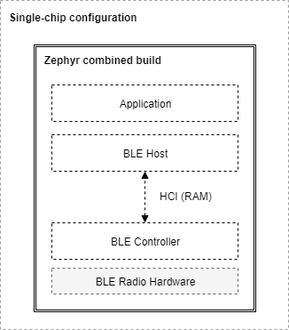

.. _bluetooth-arch:

Stack Architecture
##################

Overview
********

This page describes the software architecture of Zephyr's Bluetooth protocol
stack.

.. note::
   Zephyr supports mainly Bluetooth Low Energy (LE), the low-power
   version of the Bluetooth specification. Zephyr also has limited support
   for portions of the BR/EDR Host.

.. _bluetooth-layers:

Bluetooth LE Layers
===================

There are 3 main layers that together constitute a full Bluetooth Low Energy
protocol stack:

* **Host**: This layer sits right below the application, and is comprised of
  multiple (non real-time) network and transport protocols enabling
  applications to communicate with peer devices in a standard and interoperable
  way.
* **Controller**: The Controller implements the Link Layer (LE LL), the
  low-level, real-time protocol which provides, in conjunction with the Radio
  Hardware, standard-interoperable over-the-air communication. The LL schedules
  packet reception and transmission, guarantees the delivery of data, and
  handles all the LL control procedures.
* **Radio Hardware**: Hardware implements the required analog and digital
  baseband functional blocks that permit the Link Layer firmware to send and
  receive in the 2.4GHz band of the spectrum.

.. _bluetooth-hci:

Host Controller Interface
=========================

The `Bluetooth Specification`_ describes the format in which a Host must
communicate with a Controller. This is called the Host Controller Interface
(HCI) protocol. HCI can be implemented over a range of different physical
transports like UART, SPI, or USB. This protocol defines the commands that a Host
can send to a Controller and the events that it can expect in return, and also
the format for user and protocol data that needs to go over the air. The HCI
ensures that different Host and Controller implementations can communicate
in a standard way making it possible to combine Hosts and Controllers from
different vendors.

.. _bluetooth-configs:

Configurations
==============

The three separate layers of the protocol and the standardized interface make
it possible to implement the Host and Controller on different platforms. The two
following configurations are commonly used:

* **Single-chip configuration**: In this configuration, a single microcontroller
  implements all three layers and the application itself. This can also be called a
  system-on-chip (SoC) implementation. In this case the Bluetooth Host and the Bluetooth
  Controller communicate directly through function calls and queues in RAM. The
  Bluetooth specification does not specify how HCI is implemented in this
  single-chip configuration and so how HCI commands, events, and data flows between
  the two can be implementation-specific. This configuration is well suited for
  those applications and designs that require a small footprint and the lowest
  possible power consumption, since everything runs on a single IC.
* **Dual-chip configuration**: This configuration uses two separate ICs,
  one running the Application and the Host, and a second one with the Controller
  and the Radio Hardware. This is sometimes also called a connectivity-chip
  configuration. This configuration allows for a wider variety of combinations of
  Hosts when using the Zephyr OS as a Controller. Since HCI ensures
  interoperability among Host and Controller implementations, including of course
  Zephyr's very own Bluetooth Host and Controller, users of the Zephyr Controller can
  choose to use whatever Host running on any platform they prefer. For example,
  the host can be the Linux Bluetooth Host stack (BlueZ) running on any processor
  capable of supporting Linux. The Host processor may of course also run Zephyr
  and the Zephyr OS Bluetooth Host. Conversely, combining an IC running the Zephyr
  Host with an external Controller that does not run Zephyr is also supported.

.. _bluetooth-build-types:

Build Types
===========

The Zephyr software stack as an RTOS is highly configurable, and in particular,
the Bluetooth subsystem can be configured in multiple ways during the build process to
include only the features and layers that are required to reduce RAM and ROM
footprint as well as power consumption. Here's a short list of the different
Bluetooth-enabled builds that can be produced from the Zephyr project codebase:

* **Controller-only build**: When built as a Bluetooth Controller, Zephyr includes
  the Link Layer and a special application. This application is different
  depending on the physical transport chosen for HCI:

  * :zephyr:code-sample:`bluetooth_hci_uart`
  * :zephyr:code-sample:`bluetooth_hci_usb`
  * :zephyr:code-sample:`bluetooth_hci_spi`

  This application acts as a bridge between the UART, SPI or USB peripherals and
  the Controller subsystem, listening for HCI commands, sending application data
  and responding with events and received data.  A build of this type sets the
  following Kconfig option values:

  * :kconfig:option:`CONFIG_BT` ``=y``
  * :kconfig:option:`CONFIG_BT_HCI` ``=y``
  * :kconfig:option:`CONFIG_BT_HCI_RAW` ``=y``

  The controller itself needs to be enabled as well, typically by making sure the
  corresponding device tree node is enabled.

* **Host-only build**: A Zephyr OS Host build will contain the Application and
  the Bluetooth Host, along with an HCI driver (UART or SPI) to interface with an
  external Controller chip.
  A build of this type sets the following Kconfig option values:

  * :kconfig:option:`CONFIG_BT` ``=y``
  * :kconfig:option:`CONFIG_BT_HCI` ``=y``

  Additionally, if the platform supports also a local controller, it needs to be
  disabled, typically by disabling the corresponding device tree node. This is done
  together with enabling the device tree node for some other HCI driver and making
  sure that the ``zephyr,bt-hci`` device tree chosen property points at it.

  All of the samples located in ``samples/bluetooth`` except for the ones
  used for Controller-only builds can be built as Host-only

* **Combined build**: This includes the Application, the Host and the
  Controller, and it is used exclusively for single-chip (SoC) configurations.
  A build of this type sets the following Kconfig option values:

  * :kconfig:option:`CONFIG_BT` ``=y``
  * :kconfig:option:`CONFIG_BT_HCI` ``=y``

  The controller itself needs to be enabled as well, typically by making sure the
  corresponding device tree node is enabled.

  All of the samples located in ``samples/bluetooth`` except for the ones
  used for Controller-only builds can be built as Combined

The picture below shows the SoC or single-chip configuration when using a Zephyr
combined build (a build that includes both a Bluetooth Host and a Controller in the
same firmware image that is programmed onto the chip):

   A Combined build on a Single-Chip configuration

When using connectivity or dual-chip configurations, several Host and Controller
combinations are possible, some of which are depicted below:

.. figure:: img/ble_cfg_dual.png
   :align: center
   :alt: Bluetooth dual-chip configuration builds

   Host-only and Controller-only builds on dual-chip configurations

When using a Zephyr Host (left side of image), two instances of Zephyr OS
must be built with different configurations, yielding two separate images that
must be programmed into each of the chips respectively. The Host build image
contains the application, the Bluetooth Host and the selected HCI driver (UART or
SPI), while the Controller build runs either the
:zephyr:code-sample:`bluetooth_hci_uart`, or the
:zephyr:code-sample:`bluetooth_hci_spi` app to provide an interface to
the Bluetooth Controller.

This configuration is not limited to using a Zephyr OS Host, as the right side
of the image shows. One can indeed take one of the many existing GNU/Linux
distributions, most of which include Linux's own Bluetooth Host (BlueZ), to connect it
via UART or USB to one or more instances of the Zephyr OS Controller build.
BlueZ as a Host supports multiple Controllers simultaneously for applications
that require more than one Bluetooth radio operating at the same time but sharing the
same Host stack.

Source tree layout
******************

The stack is split up as follows in the source tree:

``subsys/bluetooth/host``
  :ref:`The host stack <bluetooth_le_host>`. This is where the HCI command and
  event handling as well as connection tracking happens. The implementation of
  the core protocols such as L2CAP, ATT, and SMP is also here.

``subsys/bluetooth/controller``
  :ref:`Bluetooth LE Controller <bluetooth-ctlr-arch>` implementation.
  Implements the controller-side of HCI, the Link Layer as well as access to the
  radio transceiver.

``include/bluetooth/``
  :ref:`Public API <bluetooth_api>` header files. These are the header files
  applications need to include in order to use Bluetooth functionality.

``drivers/bluetooth/``
  HCI transport drivers. Every HCI transport needs its own driver. For example,
  the two common types of UART transport protocols (3-Wire and 5-Wire)
  have their own drivers.

``samples/bluetooth/``
  :zephyr:code-sample-category:`Sample Bluetooth code <bluetooth>`. This is a good reference to
  get started with Bluetooth application development.

``tests/bluetooth/``
  Test applications. These applications are used to verify the
  functionality of the Bluetooth stack, but are not necessary the best
  source for sample code (see ``samples/bluetooth`` instead).

``doc/connectivity/bluetooth/``
  Extra documentation, such as PICS documents.

.. _Bluetooth Specification: https://www.bluetooth.com/specifications/bluetooth-core-specification
