.. _bluetooth-ctlr-arch:

Bluetooth Low Energy Controller
###############################

Overview
********

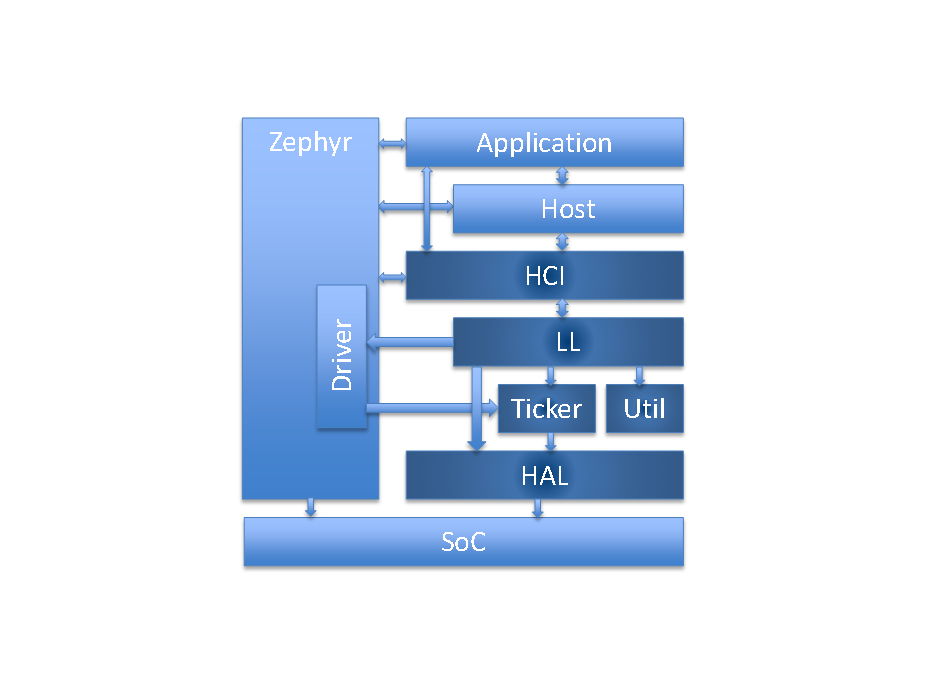

#. HCI

   * Host Controller Interface, Bluetooth standard
   * Provides Zephyr Bluetooth HCI Driver

#. HAL

   * Hardware Abstraction Layer
   * Vendor Specific, and Zephyr Driver usage

#. Ticker

   * Soft real time radio/resource scheduling

#. LL_SW

   * Software-based Link Layer implementation
   * States and roles, control procedures, packet controller

#. Util

   * Bare metal memory pool management
   * Queues of variable count, lockless usage
   * FIFO of fixed count, lockless usage
   * Mayfly concept based deferred ISR executions

Architecture
************

Execution Overview
==================

.. image:: img/ctlr_exec_overview.png

Architecture Overview
=====================

.. image:: img/ctlr_arch_overview.png

Scheduling
**********

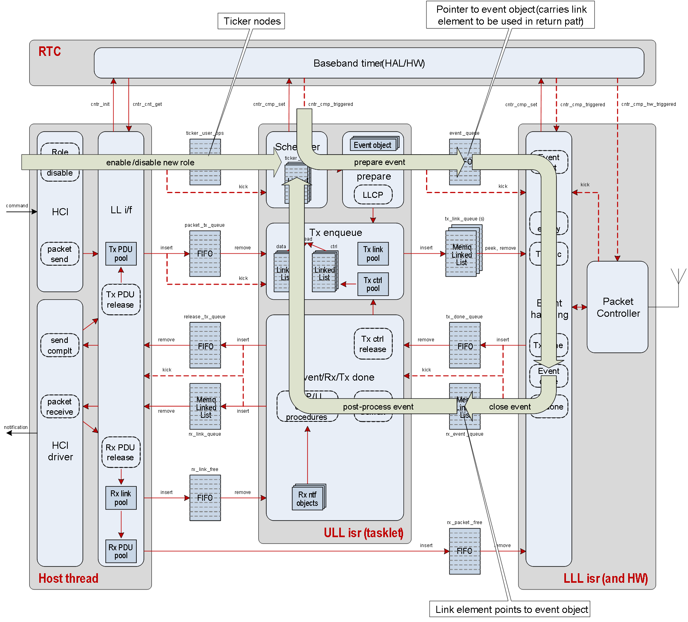

Ticker
======

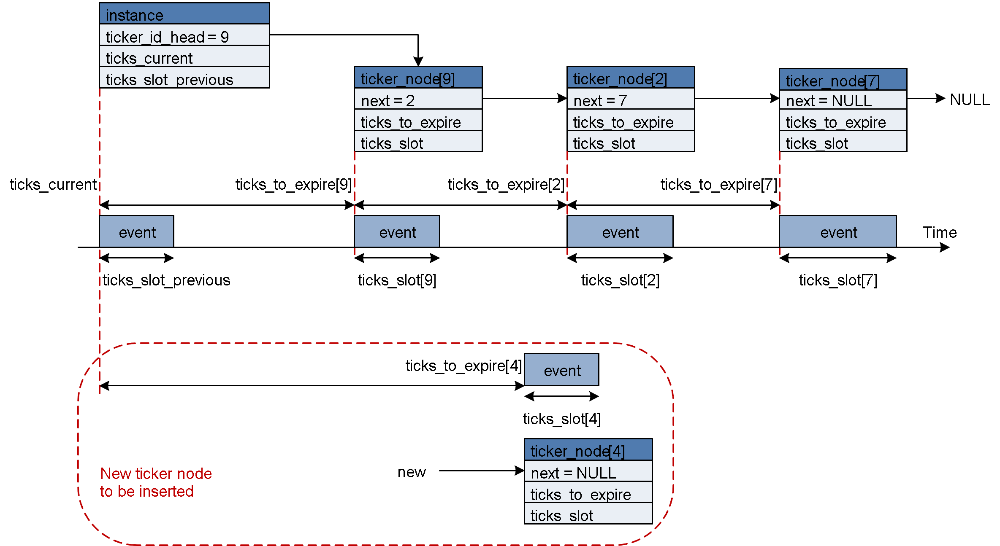

Upper Link Layer and Lower Link Layer
=====================================

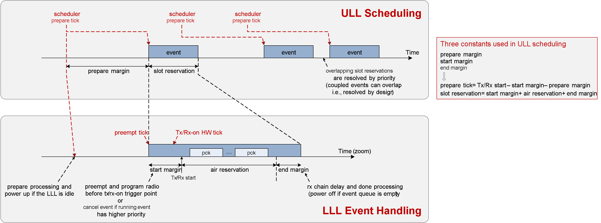

Scheduling Variants
===================

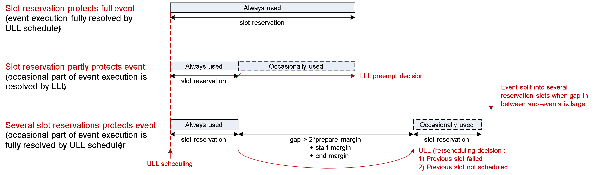

ULL and LLL Timing
==================

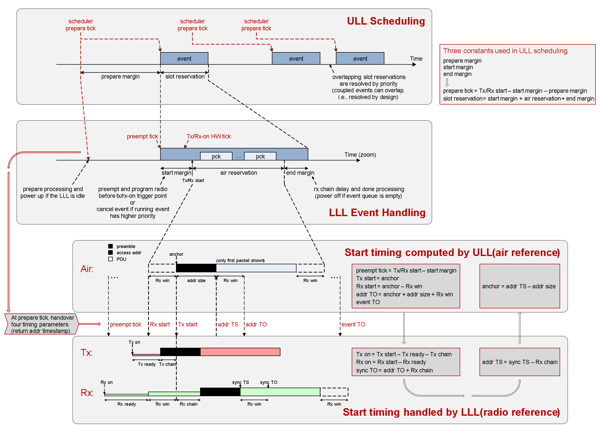

Event Handling
**************

.. image:: img/ctlr_sched_event_handling.png

Scheduling Closely Spaced Events
================================

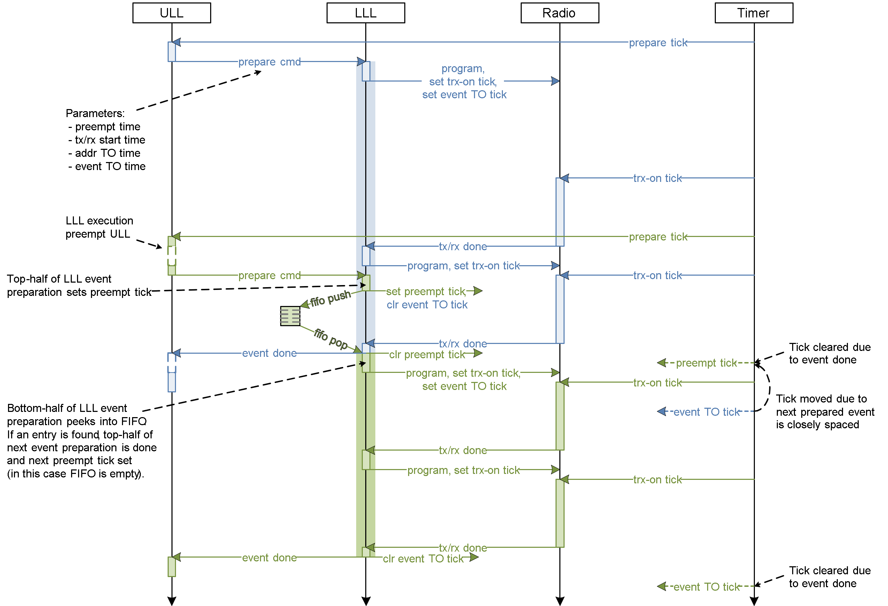

Aborting Active Event
=====================

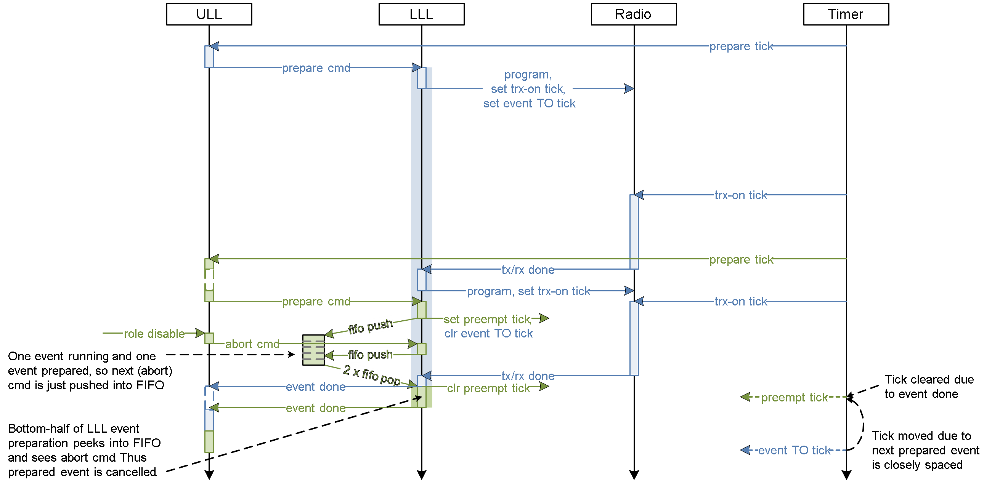

Cancelling Pending Event
========================

.. image:: img/ctlr_sched_msc_event_cancel.png

Pre-emption of Active Event
===========================

.. image:: img/ctlr_sched_msc_event_preempt.png

Data Flow
*********

Transmit Data Flow
==================

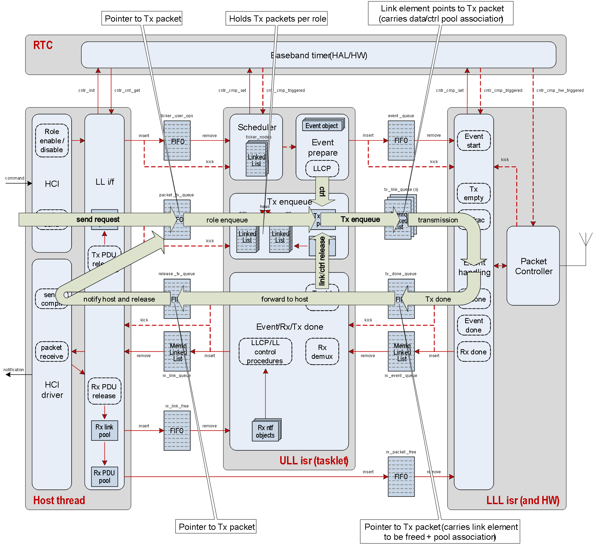

Receive Data Flow
=================

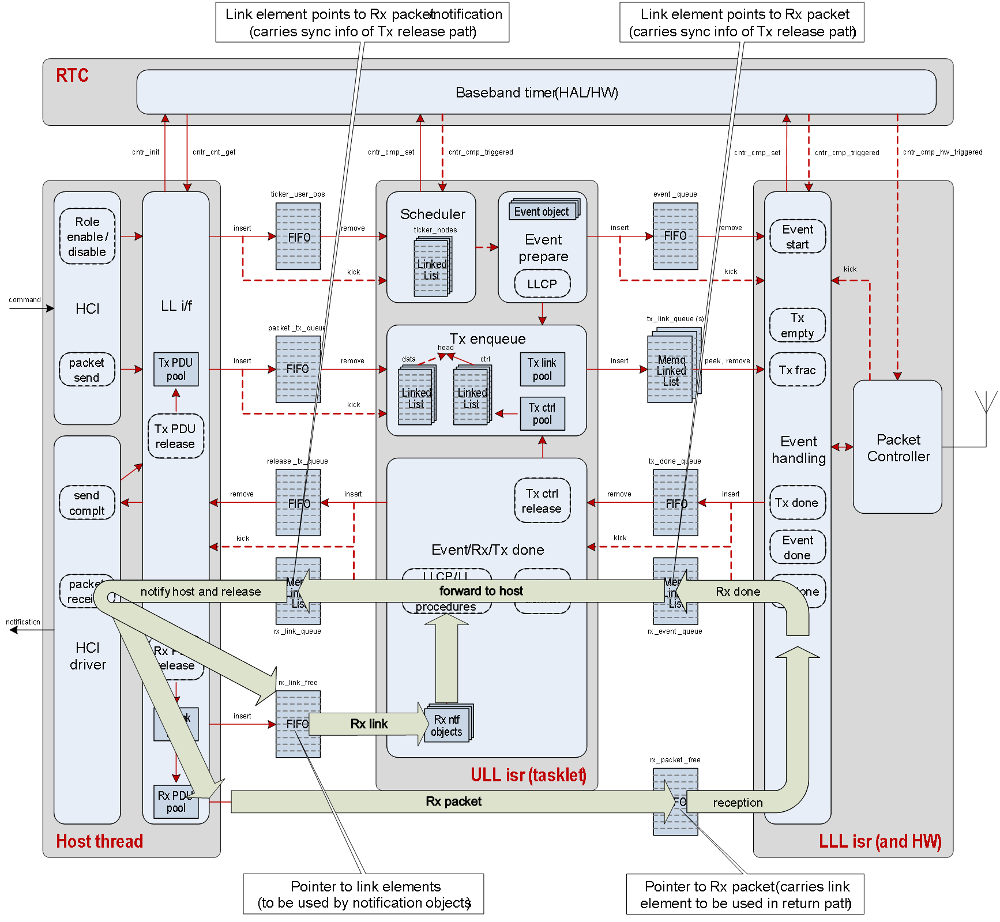

Execution Priorities
********************

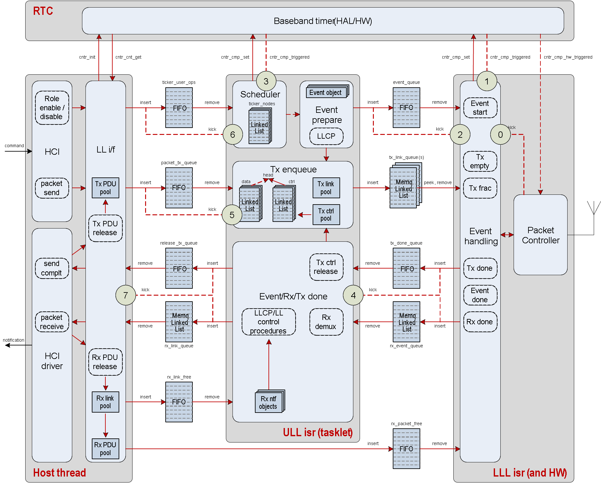

- Event handle (0, 1) < Event preparation (2, 3) < Event/Rx done (4) < Tx
  request (5) < Role management (6) < Host (7).

- LLL is vendor ISR, ULL is Mayfly ISR concept, Host is kernel thread.

Lower Link Layer
****************

LLL Execution
=============

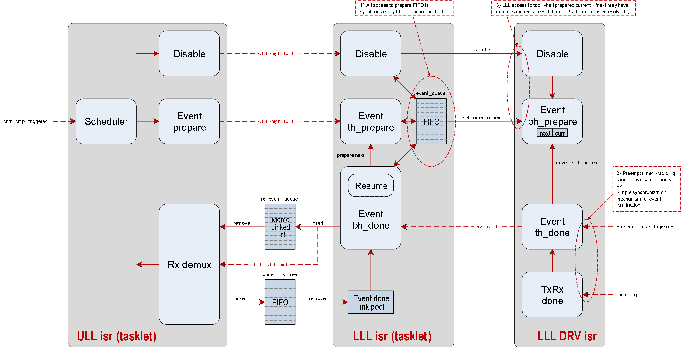

LLL Resume
----------

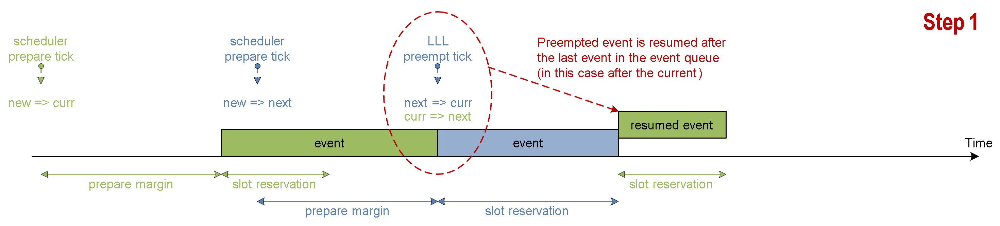

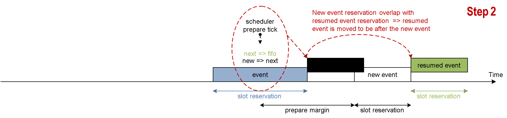

Bare metal utilities
********************

Memory FIFO and Memory Queue
============================

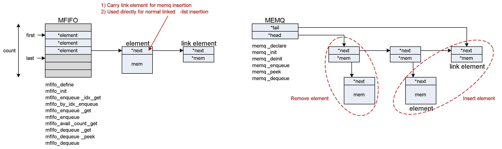

Mayfly
======

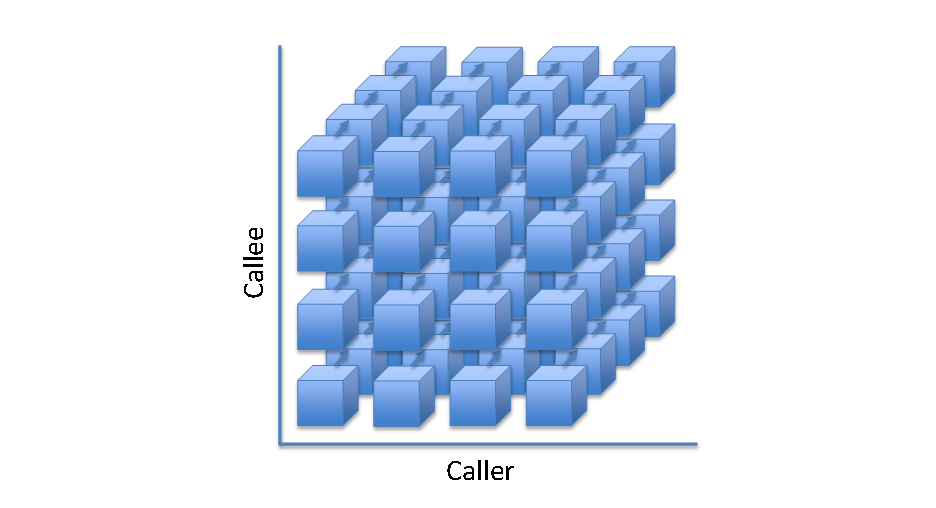

* Mayfly are multi-instance scalable ISR execution contexts
* What a Work is to a Thread, Mayfly is to an ISR
* List of functions executing in ISRs
* Execution priorities map to IRQ priorities
* Facilitate cross execution context scheduling
* Race-to-idle execution
* Lock-less, bare metal

Legacy Controller
*****************

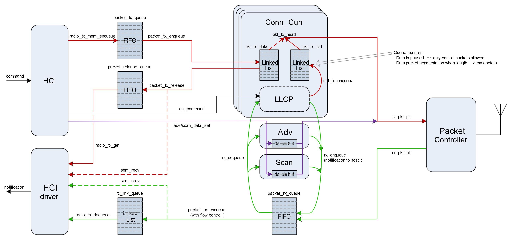

Bluetooth Low Energy Controller - Vendor Specific Details
*********************************************************

Hardware Requirements
=====================

Nordic Semiconductor
--------------------

The Nordic Semiconductor Bluetooth Low Energy Controller implementation
requires the following hardware peripherals.

.. list-table:: SoC Peripheral Use
   :header-rows: 1
   :widths: 15 15 15 10 50

   * - Resource
     - nRF Peripheral
     - # instances
     - Zephyr Driver Accessible
     - Description
   * - Clock
     - NRF_CLOCK
     - 1
     - Yes
     - * A Low Frequency Clock (LFCLOCK) or sleep clock, for low power
         consumption between Bluetooth radio events
       * A High Frequency Clock (HFCLOCK) or active clock, for high precision
         packet timing and software based transceiver state switching with
         inter-frame space (tIFS) timing inside Bluetooth radio events
   * - RTC [a]_
     - NRF_RTC0
     - 1
     - **No**
     - * Uses 2 capture/compare registers
   * - Timer
     - NRF_TIMER0 or NRF_TIMER4 [1]_, and NRF_TIMER1 [0]_
     - 2 or 1 [1]_
     - **No**
     - * 2 instances, one each for packet timing and tIFS software switching,
         respectively
       * 7 capture/compare registers (3 mandatory, 1 optional for ISR profiling,
         4 for single timer tIFS switching) on first instance
       * 4 capture/compare registers for second instance, if single tIFS timer
         is not used.
   * - PPI [b]_
     - NRF_PPI
     - 21 channels (20 [2]_), and 2 channel groups [3]_
     - Yes [4]_
     - * Used for radio mode switching to achieve tIFS timings, for PA/LNA
         control
   * - DPPI [c]_
     - NRF_DPPI
     -  20 channels, and 2 channel groups [3]_
     - Yes [4]_
     - * Used for radio mode switching to achieve tIFS timings, for PA/LNA
         control
   * - SWI [d]_
     - NRF_SWI4 and NRF_SWI5, or NRF_SWI2 and NRF_SWI3 [5]_
     - 2
     - **No**
     - * 2 instances, for Lower Link Layer and Upper Link Layer Low priority
         execution context
   * - Radio
     - NRF_RADIO
     - 1
     - **No**
     - * 2.4 GHz radio transceiver with multiple radio standards such as 1 Mbps,
         2 Mbps and Coded PHY S2/S8 Long Range Bluetooth Low Energy technology
   * - RNG [e]_
     - NRF_RNG
     - 1
     - Yes
     -
   * - ECB [f]_
     - NRF_ECB
     - 1
     - **No**
     -
   * - CBC-CCM [g]_
     - NRF_CCM
     - 1
     - **No**
     -
   * - AAR [h]_
     - NRF_AAR
     - 1
     - **No**
     -
   * - GPIO [i]_
     - NRF_GPIO
     - 2 GPIO pins for PA and LNA, 1 each
     - Yes
     - * Additionally, 10 Debug GPIO pins (optional)
   * - GPIOTE [j]_
     - NRF_GPIOTE
     - 1
     - Yes
     - * Used for PA/LNA
   * - TEMP [k]_
     - NRF_TEMP
     - 1
     - Yes
     - * For RC sourced LFCLOCK calibration
   * - UART [l]_
     - NRF_UART0
     - 1
     - Yes
     - * For HCI interface in Controller only builds
   * - IPC [m]_
     - NRF_IPC [5]_
     - 1
     - Yes
     - * For HCI interface in Controller only builds

.. [a] Real Time Counter (RTC)
.. [b] Programmable Peripheral Interconnect (PPI)
.. [c] Distributed Programmable Peripheral Interconnect (DPPI)
.. [d] Software Interrupt (SWI)
.. [e] Random Number Generator (RNG)
.. [f] AES Electronic Codebook Mode Encryption (ECB)
.. [g] Cipher Block Chaining (CBC) - Message Authentication Code with Counter
       Mode encryption (CCM)
.. [h] Accelerated Address Resolver (AAR)
.. [i] General Purpose Input Output (GPIO)
.. [j] GPIO tasks and events (GPIOTE)
.. [k] Temperature sensor (TEMP)
.. [l] Universal Asynchronous Receiver Transmiter (UART)
.. [m] Interprocess Communication peripheral (IPC)

.. [0] :kconfig:option:`CONFIG_BT_CTLR_TIFS_HW` ``=n``
.. [1] :kconfig:option:`CONFIG_BT_CTLR_SW_SWITCH_SINGLE_TIMER` ``=y``
.. [2] When not using pre-defined PPI channels
.. [3] For software-based tIFS switching
.. [4] Drivers that use nRFx interfaces
.. [5] For nRF53x Series
