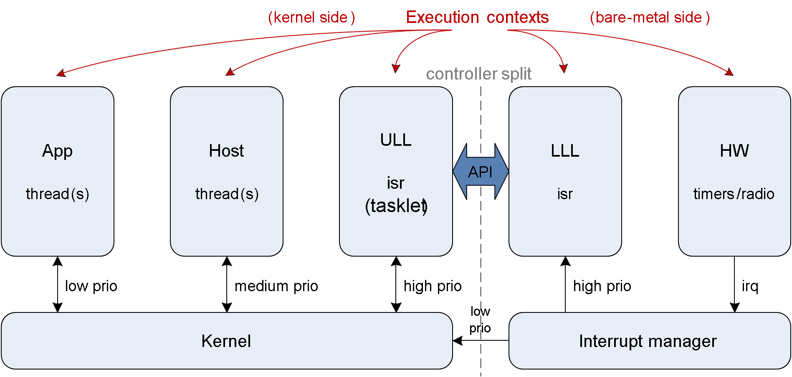
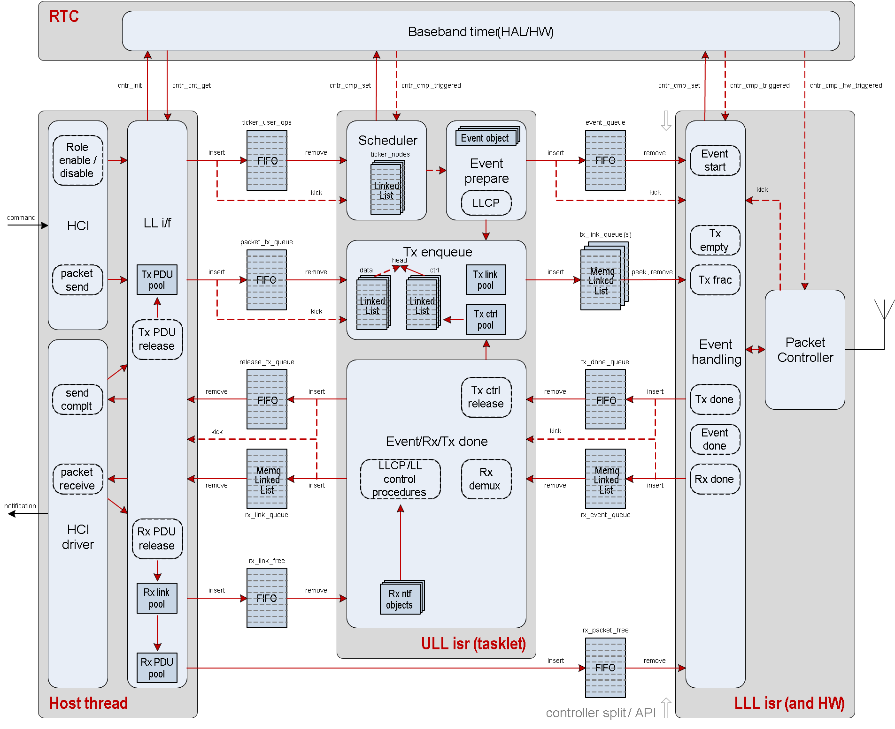
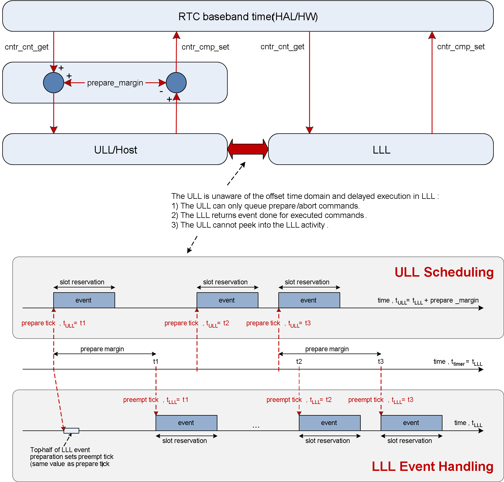
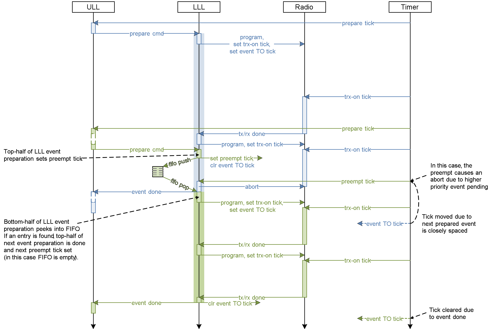

.. _bluetooth-ctlr-arch:

Bluetooth Low Energy Controller
###############################

Overview
********

.. image:: img/ctlr_overview.png

#. HCI

   * Host Controller Interface, Bluetooth standard
   * Provides Zephyr Bluetooth HCI Driver

#. HAL

   * Hardware Abstraction Layer
   * Vendor Specific, and Zephyr Driver usage

#. Ticker

   * Soft real time radio/resource scheduling

#. LL_SW

   * Software-based Link Layer implementation
   * States and roles, control procedures, packet controller

#. Util

   * Bare metal memory pool management
   * Queues of variable count, lockless usage
   * FIFO of fixed count, lockless usage
   * Mayfly concept based deferred ISR executions

Architecture
************

Execution Overview
==================

Architecture Overview
=====================

Scheduling
**********

.. image:: img/ctlr_sched.png

Ticker
======

.. image:: img/ctlr_sched_ticker.png

Upper Link Layer and Lower Link Layer
=====================================

.. image:: img/ctlr_sched_ull_lll.png

Scheduling Variants
===================

.. image:: img/ctlr_sched_variant.png

ULL and LLL Timing
==================

.. image:: img/ctlr_sched_ull_lll_timing.png

Event Handling
**************

Scheduling Closely Spaced Events
================================

.. image:: img/ctlr_sched_msc_close_events.png

Aborting Active Event
=====================

.. image:: img/ctlr_sched_msc_event_abort.png

Cancelling Pending Event
========================

.. image:: img/ctlr_sched_msc_event_cancel.png

Pre-emption of Active Event
===========================

Data Flow
*********

Transmit Data Flow
==================

.. image:: img/ctlr_dataflow_tx.png

Receive Data Flow
=================

.. image:: img/ctlr_dataflow_rx.png

Execution Priorities
********************

.. image:: img/ctlr_exec_prio.png

- Event handle (0, 1) < Event preparation (2, 3) < Event/Rx done (4) < Tx
  request (5) < Role management (6) < Host (7).

- LLL is vendor ISR, ULL is Mayfly ISR concept, Host is kernel thread.

Lower Link Layer
****************

LLL Execution
=============

.. image:: img/ctlr_exec_lll.png

LLL Resume
----------

.. image:: img/ctlr_exec_lll_resume_top.png

.. image:: img/ctlr_exec_lll_resume_bottom.png

Bare metal utilities
********************

Memory FIFO and Memory Queue
============================

.. image:: img/ctlr_mfifo_memq.png

Mayfly
======

.. image:: img/ctlr_mayfly.png

* Mayfly are multi-instance scalable ISR execution contexts
* What a Work is to a Thread, Mayfly is to an ISR
* List of functions executing in ISRs
* Execution priorities map to IRQ priorities
* Facilitate cross execution context scheduling
* Race-to-idle execution
* Lock-less, bare metal

Legacy Controller
*****************

.. image:: img/ctlr_legacy.png

Bluetooth Low Energy Controller - Vendor Specific Details
*********************************************************

Hardware Requirements
=====================

Nordic Semiconductor
--------------------

The Nordic Semiconductor Bluetooth Low Energy Controller implementation
requires the following hardware peripherals.

#. Clock

   * A Low Frequency Clock (LFCLOCK) or sleep clock, for low power consumption
     between Bluetooth radio events
   * A High Frequency Clock (HFCLOCK) or active clock, for high precision
     packet timing and software based transceiver state switching with
     inter-frame space (tIFS) timing inside Bluetooth radio events

#. Real Time Counter (RTC)

   * 1 instance
   * 2 capture/compare registers

#. Timer

   * 2 instances, one each for packet timing and tIFS software switching,
     respectively
   * 7 capture/compare registers (3 mandatory, 1 optional for ISR profiling, 4
     for single timer tIFS switching) on first instance
   * 4 capture/compare registers for second instance, if single tIFS timer is
     not used.

#. Programmable Peripheral Interconnect (PPI)

   * 21 channels (20 channels when not using pre-defined channels)
   * 2 channel groups for software-based tIFS switching

#. Distributed Programmable Peripheral Interconnect (DPPI)

   * 20 channels
   * 2 channel groups for s/w tIFS switching

#. Software Interrupt (SWI)

   * 3 instances, for Lower Link Layer, Upper Link Layer High priority, and
     Upper Link Layer Low priority execution

#. Radio

   * 2.4 GHz radio transceiver with multiple radio standards such as 1 Mbps, 2
     Mbps and Long Range Bluetooth Low Energy technology

#. Random Number Generator (RNG)

   * 1 instance

#. AES electronic codebook mode encryption (ECB)

   * 1 instance

#. Cipher Block Chaining - Message Authentication Code with Counter Mode
   encryption (CCM)

   * 1 instance

#. Accelerated address resolver (AAR)

   * 1 instance

#. GPIO

   * 2 GPIO pins for PA and LNA, 1 each.
   * 10 Debug GPIO pins (optional)

#. GPIO tasks and events (GPIOTE)

   * 1 instance
   * 1 channel for PA/LNA

#. Temperature sensor (TEMP)

   * For RC calibration

#. Interprocess Communication peripheral (IPC)

   * For HCI interface

#. UART

   * For HCI interface
