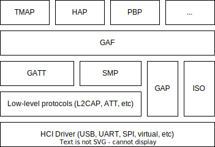
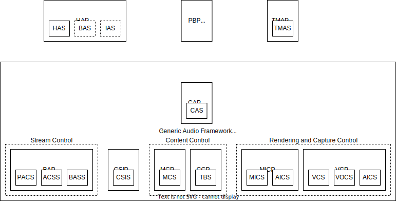
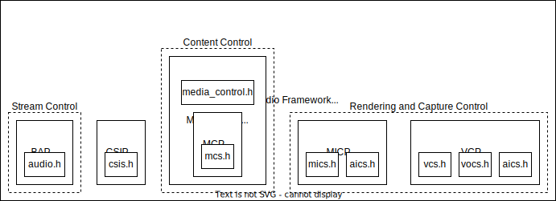
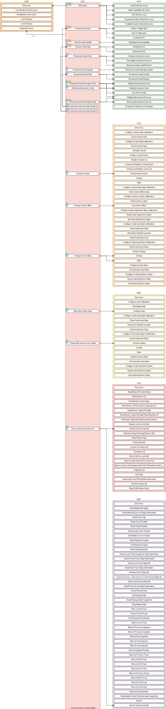

.. _bluetooth_le_audio_arch:

LE Audio Stack
##############

   Bluetooth Audio Architecture

Generic Audio Framework (GAF)
*****************************
The Generic Audio Framework (GAF) is considered the middleware of the Bluetooth
LE Audio architecture. The GAF contains the profiles and services that allows
higher layer applications and profiles to set up streams, change volume, control
media and telephony and more. The GAF builds on GATT, GAP and isochronous
channels (ISO).

GAF uses GAP to connect, advertise and synchronize to other devices.
GAF uses GATT to configure streams, associate streams with content
(e.g. media or telephony), control volume and more.
GAF uses ISO for the audio streams themselves, both as unicast (connected)
audio streams or broadcast (unconnected) audio streams.

GAF mandates the use of the LC3 codec, but also supports other codecs.

   Generic Audio Framework

The top-level profiles TMAP and HAP are not part of the GAF, but rather provide
top-level requirements for how to use the GAF.

GAF has been implemented in Zephyr with the following structure.

   Zephyr Generic Audio Framework

Bluetooth Audio Stack Status
============================

The following table shows the current status and support of the profiles in the
Bluetooth Audio Stack.

.. table:: Bluetooth Audio Profile status
   :widths: auto

   +--------+-------------------------------+---------+------------------+-----------------------+--------------------------------------------------+
   | Module | Role                          | Version | Added in Release | Status                | Remaining                                        |
   +========+===============================+=========+==================+=======================+==================================================+
   | VCP    | Volume Renderer               | 1.0     | 2.6              | - Feature complete    | - Sample Application                             |
   |        |                               |         |                  | - Shell Module        |                                                  |
   |        |                               |         |                  | - BSIM test           |                                                  |
   |        +-------------------------------+---------+------------------+-----------------------+--------------------------------------------------+
   |        | Volume Controller             | 1.0     | 2.6              | - Feature complete    | - Sample Application                             |
   |        |                               |         |                  | - Shell Module        |                                                  |
   |        |                               |         |                  | - BSIM test           |                                                  |
   +--------+-------------------------------+---------+------------------+-----------------------+--------------------------------------------------+
   | MICP   | Microphone Device             | 1.0     | 2.7              | - Feature complete    | - Sample Application                             |
   |        |                               |         |                  | - Shell Module        |                                                  |
   |        |                               |         |                  | - BSIM test           |                                                  |
   |        +-------------------------------+---------+------------------+-----------------------+--------------------------------------------------+
   |        | Microphone Controller         | 1.0     | 2.7              | - Feature complete    | - Sample Application                             |
   |        |                               |         |                  | - Shell Module        |                                                  |
   |        |                               |         |                  | - BSIM test           |                                                  |
   +--------+-------------------------------+---------+------------------+-----------------------+--------------------------------------------------+
   | CSIP   | Set Member                    | 1.0.1   | 3.0              | - Feature complete    | - Sample Application                             |
   |        |                               |         |                  | - Shell Module        |                                                  |
   |        |                               |         |                  | - BSIM test           |                                                  |
   |        +-------------------------------+---------+------------------+-----------------------+--------------------------------------------------+
   |        | Set Coordinator               | 1.0.1   | 3.0              | - Feature complete    | - Sample Application                             |
   |        |                               |         |                  | - Shell Module        |                                                  |
   |        |                               |         |                  | - BSIM test           |                                                  |
   +--------+-------------------------------+---------+------------------+-----------------------+--------------------------------------------------+
   | CCP    | Call Control Server           | 1.0     | 3.0              | - Feature complete    | - API refactor                                   |
   |        |                               |         |                  | - Shell Module        | - Sample Application                             |
   |        |                               |         |                  | - BSIM test           |                                                  |
   |        +-------------------------------+---------+------------------+-----------------------+--------------------------------------------------+
   |        | Call Control Client           | 1.0     | 3.0              | - Feature complete    | - API refactor                                   |
   |        |                               |         |                  | - Shell Module        | - Sample Application                             |
   |        |                               |         |                  | - BSIM test           |                                                  |
   +--------+-------------------------------+---------+------------------+-----------------------+--------------------------------------------------+
   | MCP    | Media Control Server          | 1.0     | 3.0              | - Feature complete    | - API refactor                                   |
   |        |                               |         |                  | - Shell Module        | - Support for multiple instances and connections |
   |        |                               |         |                  | - BSIM test           | - Sample Application                             |
   |        +-------------------------------+---------+------------------+-----------------------+--------------------------------------------------+
   |        | Media Control Client          | 1.0     | 3.0              | - Feature complete    | - API refactor                                   |
   |        |                               |         |                  | - Shell Module        | - Sample Application                             |
   |        |                               |         |                  | - BSIM test           |                                                  |
   +--------+-------------------------------+---------+------------------+-----------------------+--------------------------------------------------+
   | BAP    | Unicast Server                | 1.0.1   | 3.0              | - Feature complete    |                                                  |
   |        |                               |         |                  | - Shell Module        |                                                  |
   |        |                               |         |                  | - BSIM test           |                                                  |
   |        |                               |         |                  | - Sample Application  |                                                  |
   |        +-------------------------------+---------+------------------+-----------------------+--------------------------------------------------+
   |        | Unicast Client                | 1.0.1   | 3.0              | - Feature complete    |                                                  |
   |        |                               |         |                  | - Shell Module        |                                                  |
   |        |                               |         |                  | - BSIM test           |                                                  |
   |        |                               |         |                  | - Sample Application  |                                                  |
   |        +-------------------------------+---------+------------------+-----------------------+--------------------------------------------------+
   |        | Broadcast Source              | 1.0.1   | 3.0              | - Feature complete    |                                                  |
   |        |                               |         |                  | - Shell Module        |                                                  |
   |        |                               |         |                  | - BSIM test           |                                                  |
   |        |                               |         |                  | - Sample Application  |                                                  |
   |        +-------------------------------+---------+------------------+-----------------------+--------------------------------------------------+
   |        | Broadcast Sink                | 1.0.1   | 3.0              | - Feature complete    |                                                  |
   |        |                               |         |                  | - Shell Module        |                                                  |
   |        |                               |         |                  | - BSIM test           |                                                  |
   |        |                               |         |                  | - Sample Application  |                                                  |
   |        +-------------------------------+---------+------------------+-----------------------+--------------------------------------------------+
   |        | Scan Delegator                | 1.0.1   | 3.3              | - Feature complete    |                                                  |
   |        |                               |         |                  | - Shell Module        |                                                  |
   |        |                               |         |                  | - BSIM test           |                                                  |
   |        |                               |         |                  | - Sample Application  |                                                  |
   |        +-------------------------------+---------+------------------+-----------------------+--------------------------------------------------+
   |        | Broadcast Assistant           | 1.0.1   | 3.3              | - Feature complete    |                                                  |
   |        |                               |         |                  | - Shell Module        |                                                  |
   |        |                               |         |                  | - BSIM test           |                                                  |
   |        |                               |         |                  | - Sample Application  |                                                  |
   +--------+-------------------------------+---------+------------------+-----------------------+--------------------------------------------------+
   | CAP    | Acceptor                      | 1.0     | 3.2              | - Feature complete    | - Sample Application                             |
   |        |                               |         |                  | - Shell Module        |                                                  |
   |        |                               |         |                  | - BSIM test           |                                                  |
   |        +-------------------------------+---------+------------------+-----------------------+--------------------------------------------------+
   |        | Initiator                     | 1.0     | 3.3              | - Feature complete    | - Sample Application                             |
   |        |                               |         |                  | - Shell Module        |                                                  |
   |        |                               |         |                  | - BSIM test           |                                                  |
   |        +-------------------------------+---------+------------------+-----------------------+--------------------------------------------------+
   |        | Commander                     |         |                  | - WIP                 | - Feature complete                               |
   |        |                               |         |                  |                       | - Shell Module                                   |
   |        |                               |         |                  |                       | - BSIM test                                      |
   |        |                               |         |                  |                       | - Sample Application                             |
   +--------+-------------------------------+---------+------------------+-----------------------+--------------------------------------------------+
   | HAP    | Hearing Aid                   | 1.0     | 3.1              | - Feature complete    |                                                  |
   |        |                               |         |                  | - Shell Module        |                                                  |
   |        |                               |         |                  | - BSIM test           |                                                  |
   |        |                               |         |                  | - Sample Application  |                                                  |
   |        +-------------------------------+---------+------------------+-----------------------+--------------------------------------------------+
   |        | Hearing Aid Unicast Client    | 1.0     | 3.1              | - Feature complete    |                                                  |
   |        |                               |         |                  | - Shell Module        |                                                  |
   |        |                               |         |                  | - BSIM test           |                                                  |
   |        |                               |         |                  | - Sample Application  |                                                  |
   |        +-------------------------------+---------+------------------+-----------------------+--------------------------------------------------+
   |        | Hearing Aid Remote Controller |         |                  | - WIP                 | - Feature complete                               |
   |        |                               |         |                  |                       | - Shell Module                                   |
   |        |                               |         |                  |                       | - BSIM test                                      |
   |        |                               |         |                  |                       | - Sample Application                             |
   +--------+-------------------------------+---------+------------------+-----------------------+--------------------------------------------------+
   | TMAP   | Call Gateway                  | 1.0     | 3.4              | - Feature complete    |                                                  |
   |        |                               |         |                  | - Shell Module        |                                                  |
   |        |                               |         |                  | - BSIM test           |                                                  |
   |        |                               |         |                  | - Sample Application  |                                                  |
   |        +-------------------------------+---------+------------------+-----------------------+--------------------------------------------------+
   |        | Call Terminal                 | 1.0     | 3.4              | - Feature complete    |                                                  |
   |        |                               |         |                  | - Shell Module        |                                                  |
   |        |                               |         |                  | - BSIM test           |                                                  |
   |        |                               |         |                  | - Sample Application  |                                                  |
   |        +-------------------------------+---------+------------------+-----------------------+--------------------------------------------------+
   |        | Unicast Media Sender          | 1.0     | 3.4              | - Feature complete    |                                                  |
   |        |                               |         |                  | - Shell Module        |                                                  |
   |        |                               |         |                  | - BSIM test           |                                                  |
   |        |                               |         |                  | - Sample Application  |                                                  |
   |        +-------------------------------+---------+------------------+-----------------------+--------------------------------------------------+
   |        | Unicast Media Receiver        | 1.0     | 3.4              | - Feature complete    |                                                  |
   |        |                               |         |                  | - Shell Module        |                                                  |
   |        |                               |         |                  | - BSIM test           |                                                  |
   |        |                               |         |                  | - Sample Application  |                                                  |
   |        +-------------------------------+---------+------------------+-----------------------+--------------------------------------------------+
   |        | Broadcast Media Sender        | 1.0     | 3.4              | - Feature complete    |                                                  |
   |        |                               |         |                  | - Shell Module        |                                                  |
   |        |                               |         |                  | - BSIM test           |                                                  |
   |        |                               |         |                  | - Sample Application  |                                                  |
   |        +-------------------------------+---------+------------------+-----------------------+--------------------------------------------------+
   |        | Broadcast Media Receiver      | 1.0     | 3.4              | - Feature complete    |                                                  |
   |        |                               |         |                  | - Shell Module        |                                                  |
   |        |                               |         |                  | - BSIM test           |                                                  |
   |        |                               |         |                  | - Sample Application  |                                                  |
   +--------+-------------------------------+---------+------------------+-----------------------+--------------------------------------------------+
   | PBP    | Public Broadcast Source       |         | 3.5              | - Feature complete    |                                                  |
   |        |                               |         |                  | - Shell Module        |                                                  |
   |        |                               |         |                  | - BSIM test           |                                                  |
   |        |                               |         |                  | - Sample Application  |                                                  |
   |        +-------------------------------+---------+------------------+-----------------------+--------------------------------------------------+
   |        | Public Broadcast Sink         |         | 3.5              | - Feature complete    |                                                  |
   |        |                               |         |                  | - Shell Module        |                                                  |
   |        |                               |         |                  | - BSIM test           |                                                  |
   |        |                               |         |                  | - Sample Application  |                                                  |
   |        +-------------------------------+---------+------------------+-----------------------+--------------------------------------------------+
   |        | Public Broadcast Assistant    |         |                  |                       | - Feature complete                               |
   |        |                               |         |                  |                       | - Shell Module                                   |
   |        |                               |         |                  |                       | - BSIM test                                      |
   |        |                               |         |                  |                       | - Sample Application                             |
   +--------+-------------------------------+---------+------------------+-----------------------+--------------------------------------------------+
   | GMAP   | Unicast Game Gateway          |         | 3.5              | - Feature complete    | - Sample Application                             |
   |        |                               |         |                  | - Shell Module        |                                                  |
   |        |                               |         |                  | - BSIM test           |                                                  |
   |        |                               |         |                  |                       |                                                  |
   |        +-------------------------------+---------+------------------+-----------------------+--------------------------------------------------+
   |        | Unicast Game Terminal         |         | 3.5              | - Feature complete    | - Sample Application                             |
   |        |                               |         |                  | - Shell Module        |                                                  |
   |        |                               |         |                  | - BSIM test           |                                                  |
   |        |                               |         |                  |                       |                                                  |
   |        +-------------------------------+---------+------------------+-----------------------+--------------------------------------------------+
   |        | Broadcast Game Sender         |         | 3.5              | - Feature complete    | - Sample Application                             |
   |        |                               |         |                  | - Shell Module        |                                                  |
   |        |                               |         |                  | - BSIM test           |                                                  |
   |        |                               |         |                  |                       |                                                  |
   |        +-------------------------------+---------+------------------+-----------------------+--------------------------------------------------+
   |        | Broadcast Game Receiver       |         | 3.5              | - Feature complete    | - Sample Application                             |
   |        |                               |         |                  | - Shell Module        |                                                  |
   |        |                               |         |                  | - BSIM test           |                                                  |
   |        |                               |         |                  |                       |                                                  |
   +--------+-------------------------------+---------+------------------+-----------------------+--------------------------------------------------+

Using the Bluetooth Audio Stack
===============================

To use any of the profiles in the Bluetooth Audio Stack, including the top-level
profiles outside of GAF, :kconfig:option:`CONFIG_BT_AUDIO` shall be enabled.
This Kconfig option allows the enabling of the individual profiles inside of the
Bluetooth Audio Stack. Each profile can generally be enabled on its own, but
enabling higher-layer profiles (such as CAP, TMAP and HAP) will typically
require enabling some of the lower layer profiles.

It is, however, possible to create a device that uses e.g. only Stream Control
(with just the BAP), without using any of the content control or
rendering/capture control profiles, or vice versa. Using the higher layer
profiles will however typically provide a better user experience and better
interoperability with other devices.

Common Audio Profile (CAP)
--------------------------

The Common Audio Profile introduces restrictions and requirements on the lower layer profiles.
The procedures in CAP works on one or more streams for one or more devices. Is it thus possible via
CAP to do a single function call to setup multiple streams across multiple devices.

The figure below shows a complete structure of the procedures in CAP and
how they correspond to procedures from the other profiles. The circles with I, A and C show whether
the procedure has active involvement or requirements from the CAP Initiator, CAP Accept and CAP
Commander roles respectively.

   Common Audio Profile Procedures

The API reference for CAP can be found in :ref:`Common Audio Profile <bluetooth_cap>`.

Stream Control (BAP)
--------------------

Stream control is implemented by the Basic Audio Profile. This profile
defines multiple roles:

* Unicast Client
* Unicast Server
* Broadcast Source
* Broadcast Sink
* Scan Delegator (not yet implemented)
* Broadcast assistant (not yet implemented)

Each role can be enabled individually, and it is possible to support more than
one role.

The API reference for stream control can be found in
:ref:`Bluetooth Audio <bluetooth_audio>`.

Rendering and Capture Control
-----------------------------

Rendering and capture control is implemented by the Volume Control Profile
(VCP) and Microphone Control Profile (MICP).

The VCP implementation supports the following roles

* Volume Control Service (VCS) Server
* Volume Control Service (VCS) Client

The MICP implementation supports the following roles

* Microphone Control Profile (MICP) Microphone Device (server)
* Microphone Control Profile (MICP) Microphone Controller (client)

The API reference for volume control can be found in
:ref:`Bluetooth Volume Control <bluetooth_volume>`.

The API reference for Microphone Control can be found in
:ref:`Bluetooth Microphone Control <bluetooth_microphone>`.

Content Control
---------------

Content control is implemented by the Call Control Profile (CCP) and
Media Control Profile (MCP).

The CCP implementation is not yet implemented in Zephyr.

The MCP implementation supports the following roles

* Media Control Service (MCS) Server via the Media Proxy module
* Media Control Client (MCC)

The API reference for media control can be found in
:ref:`Bluetooth Media Control <bluetooth_media>`.

Generic TBS and Generic MCS
~~~~~~~~~~~~~~~~~~~~~~~~~~~

Both the Telephone Bearer Service (TBS) used by CCP and the Media Control Service (MCS) used by MCP
have the concept of generic instances of the services called Generic TBS (GTBS) and
Generic MCS (GMCS).

While these share a common name prefix, the behavior of these two may be significantly different.

Generic TBS
^^^^^^^^^^^

The TBS spec defines GTBS as

   GTBS provides a single point of access and exposes a representation of its internal telephone
   bearers into a single telephone bearer.
   This service provides telephone status and control of the device as a single unit with a
   single set of characteristics.
   It is left up to the implementation to determine what telephone bearer a characteristic of
   GTBS represents at any time.
   There is no specified manner of representing a characteristic from each individual TBS that
   resides on the device to the same characteristic of the GTBS.

   For example, if there is more than one TBS on a device and each has a unique telephone bearer
   name (e.g., Name1 and Name2),
   the way the GTBS represents the telephone bearer name is left up to the implementation.
   GTBS is suited for clients that do not need to access or control all the
   information available on specific telephone bearers.

This means that a GTBS instance represents one or more telephone bearers.
A telephone bearer could be any application on a device that can handle (telephone) calls,
such as the default Call application on a smartphone,
but also other applications such as Signal, Discord, Teams, Slack, etc.

GTBS may be standalone (i.e.the device only has a GTBS instance without any TBS instances),
and the behavior of the GTBS is mostly left up to the implementation.
In Zephyr the implementation of GBTS is that it contains some generic information,
such as the provider name which is defined to  simply be "Generic TBS",
but the majority of the information in the GTBS instance in Zephyr has been implemented to be a
union of the data of the other bearers.
For example if you have a bearer for regular phone calls and
Teams and have an active call in both bearers,
then each of those bearers will report a single call,
but the GTBS instance will report 2 calls,
making it possible for a simple Call Control Client to control all calls from a single bearer.
Similarly the supported URIs for each bearer are also made into a union in GTBS, and when placing
a call using the GTBS the server will pick the most suited bearer depending on the URI.
For example calls with URI `tel` would go to the regular phone application,
and calls with the URI `skype` would go to the Teams application.

In conclusion the GTBS implementation in Zephyr is a union of the non-generic telephone bearers.

Generic MCS
^^^^^^^^^^^

The MCS spec defines GMCS as

   The GMCS provides status and control of media playback for the device as a single unit.
   An MCS instance describes and controls the media playback for a
   specific media player within the device.
   A device implements MCS instances to allow clients to access the
   separate internal media player entities.

and where the behavior of GMCS is defined as

   ... the behavior of MCS and GMCS is identical,
   and all the characteristics and the characteristics' behaviors are the same.
   The term “MCS” is used throughout the document.
   Unless otherwise specifically stated in this specification,
   the same meaning applies to GMCS as well.

This means that a GMCS instance works the same way as an MCS instance,
and it follows that GMCS

   controls the media playback for a specific media player within the device

A media player on a device could be anything that plays media,
such as a Spotify or Youtube application on a smartphone.
Thus if a device has multiple MCS instances,
then each of these control media for that specific application,
but the GMCS also controls media playback for a specific media player.
GMCS can thus be considered a pointer to a specific MCS instance,
and control either e.g. Spotify or Youtube, but not both.

The MCS spec does however provide an example of GMCS where a device can

   Implement a GMCS that provides status and control of media playback for the device as a whole.

Which may indicate that an implementation may use GMCS to represent all media players with GMCS and
not a specific media player as stated above. In the case where a device does not have any MCS
instances and only GMCS, then GMCS will point to a generic instance.

The Zephyr implementation of MCS and GMCS is incomplete,
and currently only supports instantiating a single instance that can either be an MCS or GMCS.
This means that the implementation is neither complete nor spec-compliant.

Difference between GTBS and GMCS
^^^^^^^^^^^^^^^^^^^^^^^^^^^^^^^^

The definitions and implementations of GTBS and GMCS as stated above are notably different.
GTBS works as a union between the other TBS instances (if any),
and GMCS works as a pointer to a specific MCS instance (if any).
This effectively means that a simple Call Control Client can control all calls just using GTBS,
but a Media Control Client may only be able to control a single player using GMCS.

Coordinated Sets
----------------

Coordinated Sets is implemented by the Coordinated Sets Identification Profile
(CSIP).

The CSIP implementation supports the following roles

* Coordinated Set Identification Service (CSIP) Set Member
* Coordinated Set Identification Service (CSIP) Set Coordinator

The API reference for media control can be found in
:ref:`Bluetooth Coordinated Sets <bluetooth_coordinated_sets>`.
