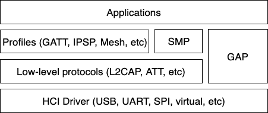

.. _bluetooth_le_host:

LE Host
#######

The Bluetooth Host implements all the higher-level protocols and
profiles, and most importantly, provides a high-level API for
applications. The following diagram depicts the main protocol & profile
layers of the host.

   Bluetooth Host protocol & profile layers.

Lowest down in the host stack sits a so-called HCI driver, which is
responsible for abstracting away the details of the HCI transport. It
provides a basic API for delivering data from the controller to the
host, and vice-versa.

Perhaps the most important block above the HCI handling is the Generic
Access Profile (GAP). GAP simplifies Bluetooth LE access by defining
four distinct roles of BLE usage:

* Connection-oriented roles

  * Peripheral (e.g. a smart sensor, often with a limited user interface)

  * Central (typically a mobile phone or a PC)

* Connection-less roles

  * Broadcaster (sending out BLE advertisements, e.g. a smart beacon)

  * Observer (scanning for BLE advertisements)

Each role comes with its own build-time configuration option:
:kconfig:option:`CONFIG_BT_PERIPHERAL`, :kconfig:option:`CONFIG_BT_CENTRAL`,
:kconfig:option:`CONFIG_BT_BROADCASTER` & :kconfig:option:`CONFIG_BT_OBSERVER`. Of the
connection-oriented roles central implicitly enables observer role, and
peripheral implicitly enables broadcaster role. Usually the first step
when creating an application is to decide which roles are needed and go
from there. Bluetooth Mesh is a slightly special case, requiring at
least the observer and broadcaster roles, and possibly also the
Peripheral role. This will be described in more detail in a later
section.

Peripheral role
===============

Most Zephyr-based BLE devices will most likely be peripheral-role
devices. This means that they perform connectable advertising and expose
one or more GATT services. After registering services using the
:c:func:`bt_gatt_service_register` API the application will typically
start connectable advertising using the :c:func:`bt_le_adv_start` API.

There are several peripheral sample applications available in the tree,
such as :zephyr_file:`samples/bluetooth/peripheral_hr`.

Central role
============

Central role may not be as common for Zephyr-based devices as peripheral
role, but it is still a plausible one and equally well supported in
Zephyr. Rather than accepting connections from other devices a central
role device will scan for available peripheral device and choose one to
connect to. Once connected, a central will typically act as a GATT
client, first performing discovery of available services and then
accessing one or more supported services.

To initially discover a device to connect to the application will likely
use the :c:func:`bt_le_scan_start` API, wait for an appropriate device
to be found (using the scan callback), stop scanning using
:c:func:`bt_le_scan_stop` and then connect to the device using
:c:func:`bt_conn_le_create`. If the central wants to keep
automatically reconnecting to the peripheral it should use the
:c:func:`bt_le_set_auto_conn` API.

There are some sample applications for the central role available in the
tree, such as :zephyr_file:`samples/bluetooth/central_hr`.

Observer role
=============

An observer role device will use the :c:func:`bt_le_scan_start` API to
scan for device, but it will not connect to any of them. Instead it will
simply utilize the advertising data of found devices, combining it
optionally with the received signal strength (RSSI).

Broadcaster role
================

A broadcaster role device will use the :c:func:`bt_le_adv_start` API to
advertise specific advertising data, but the type of advertising will be
non-connectable, i.e. other device will not be able to connect to it.

Connections
===========

Connection handling and the related APIs can be found in the
:ref:`Connection Management <bluetooth_connection_mgmt>` section.

Security
========

To achieve a secure relationship between two Bluetooth devices a process
called pairing is used. This process can either be triggered implicitly
through the security properties of GATT services, or explicitly using
the :c:func:`bt_conn_security` API on a connection object.

To achieve a higher security level, and protect against
Man-In-The-Middle (MITM) attacks, it is recommended to use some
out-of-band channel during the pairing. If the devices have a sufficient
user interface this "channel" is the user itself. The capabilities of
the device are registered using the :c:func:`bt_conn_auth_cb_register`
API.  The :c:struct:`bt_conn_auth_cb` struct that's passed to this API has
a set of optional callbacks that can be used during the pairing - if the
device lacks some feature the corresponding callback may be set to NULL.
For example, if the device does not have an input method but does have a
display, the ``passkey_entry`` and ``passkey_confirm`` callbacks would
be set to NULL, but the ``passkey_display`` would be set to a callback
capable of displaying a passkey to the user.

Depending on the local and remote security requirements & capabilities,
there are four possible security levels that can be reached:

    :c:enumerator:`BT_SECURITY_L1`
        No encryption and no authentication.

    :c:enumerator:`BT_SECURITY_L2`
        Encryption but no authentication (no MITM protection).

    :c:enumerator:`BT_SECURITY_L3`
        Encryption and authentication using the legacy pairing method
        from Bluetooth 4.0 and 4.1.

    :c:enumerator:`BT_SECURITY_L4`
        Encryption and authentication using the LE Secure Connections
        feature available since Bluetooth 4.2.

.. note::
  Mesh has its own security solution through a process called
  provisioning. It follows a similar procedure as pairing, but is done
  using separate mesh-specific APIs.

L2CAP
=====

L2CAP stands for the Logical Link Control and Adaptation Protocol. It is
a common layer for all communication over Bluetooth connections, however
an application comes in direct contact with it only when using it in the
so-called Connection-oriented Channels (CoC) mode. More information on
this can be found in the :ref:`L2CAP API section <bt_l2cap>`.

GATT
====

The Generic Attribute Profile is the most common means of communication
over LE connections. A more detailed description of this layer and the
API reference can be found in the
:ref:`GATT API reference section <bt_gatt>`.

Mesh
====

Mesh is a little bit special when it comes to the needed GAP roles. By
default, mesh requires both observer and broadcaster role to be enabled.
If the optional GATT Proxy feature is desired, then peripheral role
should also be enabled.

The API reference for mesh can be found in the
:ref:`Mesh API reference section <bluetooth_mesh>`.

LE Audio
========
The LE audio is a set of profiles and services that utilizes GATT and
Isochronous Channel to provide audio over Bluetooth Low Energy.
The architecture and API references can be found in
:ref:`Bluetooth Audio Architecture <bluetooth_le_audio_arch>`.

.. _bluetooth-persistent-storage:

Persistent storage
==================

The Bluetooth host stack uses the settings subsystem to implement
persistent storage to flash. This requires the presence of a flash
driver and a designated "storage" partition on flash. A typical set of
configuration options needed will look something like the following:

  .. code-block:: cfg

    CONFIG_BT_SETTINGS=y
    CONFIG_FLASH=y
    CONFIG_FLASH_PAGE_LAYOUT=y
    CONFIG_FLASH_MAP=y
    CONFIG_NVS=y
    CONFIG_SETTINGS=y

Once enabled, it is the responsibility of the application to call
settings_load() after having initialized Bluetooth (using the
:c:func:`bt_enable` API).
