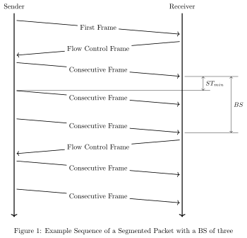

.. _can_isotp:

ISO-TP Transport Protocol
#########################

.. contents::
    :local:
    :depth: 2

Overview
********

ISO-TP is a transport protocol defined in the ISO-Standard ISO15765-2 Road
vehicles - Diagnostic communication over Controller Area Network (DoCAN).
Part2: Transport protocol and network layer services. As its name already
implies, it is originally designed, and still used in road vehicle diagnostic
over Controller Area Networks. Nevertheless, it's not limited to applications in
road vehicles or the automotive domain.

This transport protocol extends the limited payload data size for classical
CAN (8 bytes) and CAN FD (64 bytes) to theoretically four gigabytes.
Additionally, it adds a flow control mechanism to influence the sender's
behavior. ISO-TP segments packets into small fragments depending on the payload
size of the CAN frame. The header of those segments is called Protocol Control
Information (PCI).

Packets smaller or equal to seven bytes on Classical CAN are called
single-frames (SF). They don't need to fragment and do not have any flow-control.

Packets larger than that are segmented into a first-frame (FF) and as many
consecutive-frames (CF) as required. The FF contains information about the length of
the entire payload data and additionally, the first few bytes of payload data.
The receiving peer sends back a flow-control-frame (FC) to either deny,
postpone, or accept the following consecutive frames.
The FC also defines the conditions of sending, namely the block-size (BS) and
the minimum separation time between frames (STmin). The block size defines how
many CF the sender is allowed to send, before he has to wait for another FC.

API Reference
*************

.. doxygengroup:: can_isotp
.. _isotp-automotive-diagnostics:

Automotive Diagnostics Integration
##################################

ISO-TP serves as the transport layer for Unified Diagnostic Services (UDS, ISO 14229) in automotive ECUs, enabling multi-frame diagnostic communication over CAN. This section provides guidance on using Zephyr's ISO-TP implementation for vehicle diagnostics, focusing on deterministic execution, modular integration, and safety considerations in production environments.

UDS Compatibility
*****************

Zephyr's ISO-TP supports the transport requirements of UDS by handling segmentation and reassembly of diagnostic requests and responses. Key features include:

- **Multi-frame Support**: Use first-frames (FF) for payloads exceeding single-frame limits, followed by consecutive-frames (CF) controlled via flow-control-frames (FC).
- **Service Mapping**: UDS services (e.g., Diagnostic Session Control - 0x10, Read DTC Information - 0x19) map directly to ISO-TP payloads. Ensure FC parameters like block size (BS) and separation time (STmin) align with UDS timing requirements (e.g., P2 server timeouts).
- **Addressing Modes**: Configure for functional (broadcast) or physical (point-to-point) addressing as per ISO 14229. Fixed addressing (e.g., SAE J1939) can be enabled via :kconfig:option:`CONFIG_ISOTP_FIXED_ADDR`.

Gaps in basic ISO-TP may require extensions for full UDS compliance, such as custom security layers or response validation—consider production stacks for these.

ECU Integration Best Practices
******************************

For deterministic execution in automotive ECUs:

- **CAN Configuration**: Enable ISO-TP with :kconfig:option:`CONFIG_CAN_ISOTP=y` and set buffers appropriately (e.g., :kconfig:option:`CONFIG_ISOTP_RX_BUFFER_SIZE=512` for handling large UDS responses).
- **Real-Time Considerations**: Use dedicated threads or ISRs for ISO-TP handling to avoid blocking the main ECU loop. Set STmin to 0-127 ms based on system load; avoid dynamic allocation in callbacks for predictability.
- **Error Handling**: Implement retries for lost FC frames and monitor CAN errors via Zephyr's CAN API. In safety-aligned systems (e.g., ISO 26262), integrate with watchdogs and fault injection testing.
- **Portability**: Abstract CAN drivers for hardware like STM32 or NXP controllers. Test on simulators (e.g., POSIX native board) before deploying to real ECUs.

Sample Configuration and Usage
******************************

Enable in ``prj.conf``:

.. code-block:: cfg

   CONFIG_CAN=y
   CONFIG_CAN_ISOTP=y
   CONFIG_ISOTP_TX_BLOCK_SIZE=8
   CONFIG_ISOTP_BS_TIMEOUT=1000  # 1 second block size timeout for UDS flows

Example code for sending a UDS request (e.g., ECU Reset - 0x11 0x01) and receiving response:

.. code-block:: c

   #include <zephyr/canbus/isotp.h>

   static const struct isotp_fc_opts fc_opts = {
       .bs = 8,     /* Block size */
       .stmin = 5,  /* Separation time minimum, in ms */
   };

   static const struct isotp_msg_id rx_addr = {
       .std_id = 0x7E8,  /* Standard CAN ID for response */
       .ide = 0,         /* Non-extended ID */
       .use_ext_addr = 0 /* No extended addressing */
   };

   static const struct isotp_msg_id tx_addr = {
       .std_id = 0x7E0,  /* Standard CAN ID for request */
       .ide = 0,
       .use_ext_addr = 0
   };

   void send_uds_request(void)
   {
       struct isotp_send_ctx ctx;
       uint8_t req[] = {0x11, 0x01};  /* UDS: ECU Reset, hard reset */
       uint8_t resp[64];
       size_t resp_len = sizeof(resp);
       int ret;

       ret = isotp_bind(&ctx, &rx_addr, &tx_addr, &fc_opts, K_FOREVER);
       if (ret < 0) {
           printk("Failed to bind ISO-TP: %d\n", ret);
           return;
       }

       ret = isotp_send(&ctx, req, sizeof(req), K_MSEC(1000));
       if (ret < 0) {
           printk("Failed to send: %d\n", ret);
       } else {
           ret = isotp_recv(&ctx, resp, &resp_len, K_MSEC(2000));
           if (ret >= 0) {
               printk("Received response of length %zu\n", resp_len);
           }
       }

       isotp_unbind(&ctx);
   }

This example demonstrates basic UDS over ISO-TP; for production use, add session management and error codes.

Further Resources
*****************

- See the :ref:`ISO-TP sample <isotp-sample>` for basic messaging.
- For advanced diagnostics, explore community extensions or commercial stacks optimized for Zephyr-based ECUs.
