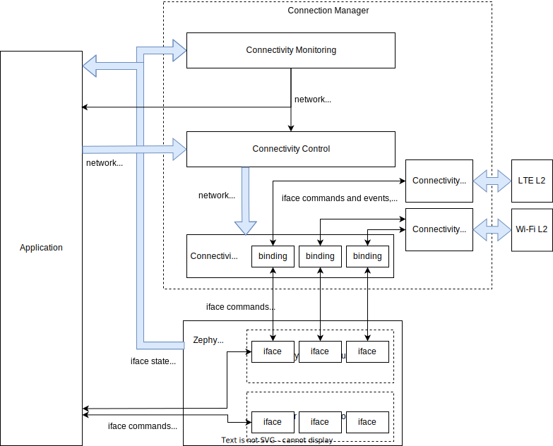

.. _conn_mgr_impl:

Connectivity Implementations
############################

.. _conn_mgr_impl_overview:

Overview
========

Connectivity implementations are technology-specific modules that allow specific Zephyr ifaces to support :ref:`Connectivity Control <conn_mgr_control>`.
They are responsible for translating generic :ref:`connectivity control API <conn_mgr_control_api>` calls into hardware-specific operations.
They are also responsible for implementing standardized :ref:`persistence and timeout <conn_mgr_control_persistence_timeouts>` behaviors.

See the :ref:`implementation guidelines <conn_mgr_impl_guidelines>` for details on writing conformant connectivity implementations.

.. _conn_mgr_impl_architecture:

Architecture
============

The :ref:`implementation API <conn_mgr_impl_api>` allows connectivity implementations to be :ref:`defined <conn_mgr_impl_defining>` at build time using :c:macro:`CONN_MGR_CONN_DEFINE`.

This creates a static instance of the :c:struct:`conn_mgr_conn_impl` struct, which then stores a reference to the passed in :c:struct:`conn_mgr_conn_api` struct (which should be populated with implementation callbacks).

Once defined, you can reference implementations by name and bind them to any unbound iface using :c:macro:`CONN_MGR_BIND_CONN`.
Make sure not to accidentally bind two connectivity implementations to a single iface.

Once the iface is bound, :ref:`connectivity control API <conn_mgr_control_api>` functions can be called on the iface, and they will be translated to the corresponding implementation functions in :c:struct:`conn_mgr_conn_api`.

Binding an iface does not directly modify its :c:struct:`iface struct <net_if>`.

Instead, an instance of :c:struct:`conn_mgr_conn_binding` is created and appended an internal :ref:`iterable section <iterable_sections_api>`.

This binding structure will contain a reference to the bound iface, the connectivity implementation it is bound to, as well as a pointer to a per-iface :ref:`context pointer <conn_mgr_impl_ctx>`.

This iterable section can then be iterated over to find out what (if any) connectivity implementation has been bound to a given iface.
This search process is used by most of the functions in the :ref:`connectivity control API <conn_mgr_control_api>`.
As such, these functions should be called sparingly, due to their relatively high search cost.

A single connectivity implementation may be bound to multiple ifaces.
See :ref:`conn_mgr_impl_guidelines_no_instancing` for more details.

.. _conn_mgr_integration_diagram_detailed:

    A detailed view of how Connection Manager integrates with Zephyr and the application.

    See :ref:`here <conn_mgr_integration_diagram_simple>` for a simplified version.

.. _conn_mgr_impl_ctx:

Context Pointer
===============

Since a single connectivity implementation may be shared by several Zephyr ifaces, each binding instantiates a context container (of :ref:`configurable type <conn_mgr_impl_declaring>`) unique to that binding.
Each binding is then instantiated with a reference to that container, which implementations can then use to access per-iface state information.

See also :ref:`conn_mgr_impl_guidelines_binding_access` and :ref:`conn_mgr_impl_guidelines_no_instancing`.

.. _conn_mgr_impl_defining:

Defining an implementation
==========================

A connectivity implementation may be defined as follows:

.. code-block:: c

   /* Create the API implementation functions */
   int my_connect_impl(struct conn_mgr_conn_binding *const binding) {
           /* Cause your underlying technology to associate */
   }
   int my_disconnect_impl(struct conn_mgr_conn_binding *const binding) {
           /* Cause your underlying technology to disassociate */
   }
   void my_init_impl(struct conn_mgr_conn_binding *const binding) {
           /* Perform any required initialization for your underlying technology */
   }

   /* Declare the API struct */
   static struct conn_mgr_conn_api my_impl_api = {
           .connect = my_connect_impl,
           .disconnect = my_disconnect_impl,
           .init = my_init_impl,
           /* ... so on */
   };

   /* Define the implementation (named MY_CONNECTIVITY_IMPL) */
   CONN_MGR_CONN_DEFINE(MY_CONNECTIVITY_IMPL, &my_impl_api);

.. note::
   This does not work unless you also :ref:`declare the context pointer type <conn_mgr_impl_declaring_ctx>`.

.. _conn_mgr_impl_declaring:

Declaring an implementation publicly
====================================

Once defined, you can make a connectivity implementation available to other compilation units by declaring it (in a header file) as follows:

.. code-block:: c
   :caption: ``my_connectivity_header.h``

   CONN_MGR_CONN_DECLARE_PUBLIC(MY_CONNECTIVITY_IMPL);

The header file that contains this declaration must be included in any compilation units that need to reference the implementation.

.. _conn_mgr_impl_declaring_ctx:

Declaring a context type
========================

For :c:macro:`CONN_MGR_CONN_DEFINE` to work, you must declare a corresponding context pointer type.
This is because all connectivity bindings contain a :ref:`conn_mgr_impl_ctx` of their associated context pointer type.

If you are using :c:macro:`CONN_MGR_CONN_DECLARE_PUBLIC`, declare this type alongside the declaration:

.. code-block:: c
   :caption: ``my_connectivity_impl.h``

   #define MY_CONNECTIVITY_IMPL_CTX_TYPE struct my_context_type *
   CONN_MGR_CONN_DECLARE_PUBLIC(MY_CONNECTIVITY_IMPL);

Then, make sure to include the header file before calling :c:macro:`CONN_MGR_CONN_DEFINE`:

.. code-block:: c
   :caption: ``my_connectivity_impl.c``

   #include "my_connectivity_impl.h"

   CONN_MGR_CONN_DEFINE(MY_CONNECTIVITY_IMPL, &my_impl_api);

Otherwise, it is sufficient to simply declare the context pointer type immediately before the call to :c:macro:`CONN_MGR_CONN_DEFINE`:

.. code-block:: c

   #define MY_CONNECTIVITY_IMPL_CTX_TYPE struct my_context_type *
   CONN_MGR_CONN_DEFINE(MY_CONNECTIVITY_IMPL, &my_impl_api);

.. note::

   Naming is important.
   Your context pointer type declaration must use the same name as your implementation declaration, but with ``_CTX_TYPE`` appended.

   In the previous example, the context type is named ``MY_CONNECTIVITY_IMPL_CTX_TYPE``, because ``MY_CONNECTIVITY_IMPL`` was used as the connectivity implementation name.

If your connectivity implementation does not need a context pointer, simply declare the type as void:

.. code-block:: c

   #define MY_CONNECTIVITY_IMPL_CTX_TYPE void *

.. _conn_mgr_impl_binding:

Binding an iface to an implementation
=====================================

A defined connectivity implementation may be bound to an iface by calling :c:macro:`CONN_MGR_BIND_CONN` anywhere after the iface's device definition:

.. code-block:: c

	/* Define an iface */
	NET_DEVICE_INIT(my_iface,
		/* ... the specifics here don't matter ... */
	);

	/* Now bind MY_CONNECTIVITY_IMPL to that iface --
	 * the name used should match with the above
	 */
	CONN_MGR_BIND_CONN(my_iface, MY_CONNECTIVITY_IMPL);

.. _conn_mgr_impl_guidelines:

Connectivity implementation guidelines
======================================

Rather than implement all features centrally, Connection Manager relies on each connectivity implementation to implement many behaviors and features individually.

This approach allows Connection Manager to remain lean, and allows each connectivity implementation to choose the most appropriate approach to these behaviors for itself.
However, it relies on trust that all connectivity implementations will faithfully implement the features that have been delegated to them.

To maintain consistency between all connectivity implementations, observe the following guidelines when writing your own implementation:

.. _conn_mgr_impl_guidelines_timeout_persistence:

*Completely implement timeout and persistence*
----------------------------------------------

All connectivity implementations must offer complete support for :ref:`timeout and persistence <conn_mgr_control_persistence_timeouts>`, such that a user can disable or enable these features, regardless of the inherent behavior of the underlying technology.
In other words, no matter how the underlying technology behaves, your implementation must make it appear to the end user to behave exactly as specified in the :ref:`conn_mgr_control_persistence_timeouts` section.

See :ref:`conn_mgr_impl_timeout_persistence` for a detailed technical discussion on implementing timeouts and persistence.

.. _conn_mgr_impl_guidelines_conformity:

*Conform to API specifications*
-------------------------------

Each :c:struct:`implementation API function <conn_mgr_conn_api>` you implement should behave as-described in the corresponding connectivity control API function.

For example, your implementation of :c:member:`conn_mgr_conn_api.connect` should conform to the behavior described for :c:func:`conn_mgr_if_connect`.

.. _conn_mgr_impl_guidelines_preconfig:

*Allow connectivity pre-configuration*
--------------------------------------

Connectivity implementations should provide means for applications to pre-configure all necessary connection parameters (for example, network SSID, or PSK, if applicable), before the call to :c:func:`conn_mgr_if_connect`.
It should not be necessary to provide this information as part of, or following the :c:func:`conn_mgr_if_connect` call, although implementations :ref:`should await this information if it is not provided <conn_mgr_impl_guidelines_await_config>`.

.. _conn_mgr_impl_guidelines_await_config:

*Await valid connectivity configuration*
----------------------------------------

If network association fails because the application pre-configured invalid connection parameters, or did not configure connection parameters at all, this should be treated as a network failure.

In other words, the connectivity implementation should not give up on the connection attempt, even if valid connection parameters have not been configured.

Instead, the connectivity implementation should asynchronously wait for valid connection parameters to be configured, either indefinitely, or until the configured :ref:`connectivity timeout <conn_mgr_control_timeouts>` elapses.

.. _conn_mgr_impl_guidelines_iface_state_reporting:

*Implement iface state reporting*
---------------------------------

All connectivity implementations must keep bound iface state up to date.

To be specific:

* Set the iface to dormant, carrier-down, or both during :c:member:`binding init <conn_mgr_conn_api.init>`.

  *  See :ref:`net_if_interface_state_management` for details regarding iface carrier and dormant states.

* Update dormancy and carrier state so that the iface is non-dormant and carrier-up whenever (and only when) association is complete and connectivity is ready.
* Set the iface either to dormant or to carrier-down as soon as interruption of service is detected.

  * It is acceptable to gate this behind a small timeout (separate from the connection timeout) for network technologies where service is commonly intermittent.

* If the technology also handles IP assignment, ensure those IP addresses are :ref:`assigned to the iface <net_if_interface_ip_management>`.

.. note::

   iface state updates do not necessarily need to be performed directly by connectivity implementations.

   For instance:

   * IP assignment is not necessary if :ref:`DHCP <dhcpv4_interface>` is used for the iface.
   * The connectivity implementation does not need to update iface dormancy if the underlying :ref:`L2 implementation <net_l2_interface>` already does so.

.. _conn_mgr_impl_guidelines_iface_state_writeonly:

*Do not use iface state as implementation state*
------------------------------------------------

Zephyr ifaces may be accessed from other threads without respecting the binding mutex.
As such, Zephyr iface state may change unpredictably during connectivity implementation callbacks.

Therefore, do not base implementation behaviors on iface state.

Keep iface state updated to reflect network availability, but do not read iface state for any purpose.

If you need to keep track of dormancy or IP assignment, use a separate state variable stored in the :ref:`context pointer <conn_mgr_impl_ctx>`.

.. _conn_mgr_impl_guidelines_non_interference:

*Remain non-interferent*
------------------------

Connectivity implementations should not prevent applications from interacting directly with associated technology-specific APIs.

In other words, it should be possible for an application to directly use your underlying technology without breaking your connectivity implementation.

If exceptions to this are absolutely necessary, they should be constrained to specific API calls and should be documented.

.. note::

   While connectivity implementations must not break, it is acceptable for implementations to have potentially unexpected behavior if applications attempt to directly control the association state.

   For instance, if an application directly instructs an underlying technology to disassociate, it would be acceptable for the connectivity implementation to interpret this as an unexpected connection loss and immediately attempt to re-associate.

.. _conn_mgr_impl_guidelines_non_blocking:

*Remain non-blocking*
---------------------

All connectivity implementation callbacks should be non-blocking.

For instance, calls to :c:member:`conn_mgr_conn_api.connect` should initiate a connection process and return immediately.

One exception is :c:member:`conn_mgr_conn_api.init`, whose implementations are permitted to block.

However, bear in mind that blocking during this callback will delay system init, so still consider offloading time-consuming tasks to a background thread.

.. _conn_mgr_impl_guidelines_immediate_api_readiness:

*Make API immediately ready*
----------------------------

Connectivity implementations must be ready to receive API calls immediately after :c:member:`conn_mgr_conn_api.init`.

For instance, a call to :c:member:`conn_mgr_conn_api.connect` must eventually lead to an association attempt, even if called immediately after :c:member:`conn_mgr_conn_api.init`.

If the underlying technology cannot be made ready for connect commands immediately when :c:member:`conn_mgr_conn_api.init` is called, calls to :c:member:`conn_mgr_conn_api.connect` must be queued in a non-blocking fashion, and then executed later when ready.

.. _conn_mgr_impl_guidelines_context_pointer:

*Do not store state information outside the context pointer*
------------------------------------------------------------

Connection Manager provides a context pointer to each binding.

Connectivity implementations should store all state information in this context pointer.

The only exception is connectivity implementations that are meant to be bound to only a single iface.
Such implementations may use statically declared state instead.

See also :ref:`conn_mgr_impl_guidelines_no_instancing`.

.. _conn_mgr_impl_guidelines_iface_access:

*Access ifaces only through binding structs*
--------------------------------------------

Do not use statically declared ifaces or externally acquire references to ifaces.

For example, do not use :c:func:`net_if_get_default` under the assumption that the bound iface will be the default iface.

Instead, always use the :c:member:`iface pointer <conn_mgr_conn_binding.iface>` provided by the relevant :c:struct:`binding struct <conn_mgr_conn_binding>`.
See also :ref:`conn_mgr_impl_guidelines_binding_access`.

.. _conn_mgr_impl_guidelines_bindings_optional:

*Make implementations optional at compile-time*
-----------------------------------------------

Connectivity implementations should provide a Kconfig option to enable or disable the implementation without affecting bound iface availability.

In other words, it should be possible to configure builds that include Connectivity Manager, as well as the iface that would have been bound to the implementation, but not the implementation itself, nor its binding.

.. _conn_mgr_impl_guidelines_no_instancing:

*Do not instance implementations*
---------------------------------

Do not declare a separate connectivity implementation for every iface you are going to bind to.

Instead, bind one global connectivity implementation to all of your ifaces, and use the context pointer to store state relevant to individual ifaces.

See also :ref:`conn_mgr_impl_guidelines_binding_access` and :ref:`conn_mgr_impl_guidelines_iface_access`.

.. _conn_mgr_impl_guidelines_binding_access:

*Do not access bindings without locking them*
---------------------------------------------

Bindings may be accessed and modified at random by multiple threads, so modifying or reading from a binding without first :c:func:`locking it <conn_mgr_binding_lock>` may lead to unpredictable behavior.

This applies to all descendents of the binding, including anything in the :ref:`context container <conn_mgr_impl_ctx>`.

Make sure to :c:func:`unlock <conn_mgr_binding_unlock>` the binding when you are done accessing it.

.. note::

   A possible exception to this rule is if the resource in question is inherently thread-safe.

   However, be careful taking advantage of this exception.
   It may still be possible to create a race condition, for instance when accessing multiple thread-safe resources simultaneously.

   Therefore, it is recommended to simply always lock the binding, whether or not the resource being accessed is inherently thread-safe.

.. _conn_mgr_impl_guidelines_support_builtins:

*Do not disable built-in features*
----------------------------------

Do not attempt to prevent the use of built-in features (such as :ref:`conn_mgr_control_persistence_timeouts` or :ref:`conn_mgr_control_automations`).

All connectivity implementations must fully support these features.
Implementations must not attempt to force certain features to be always enabled or always disabled.

.. _conn_mgr_impl_guidelines_trigger_events:

*Trigger connectivity control events*
-------------------------------------

Connectivity control :ref:`network management <net_mgmt_interface>` events are not triggered automatically by Connection Manager.

Connectivity implementations must trigger these events themselves.

Trigger :c:macro:`NET_EVENT_CONN_CMD_IF_TIMEOUT` when a connection :ref:`timeout <conn_mgr_control_timeouts>` occurs.
See :ref:`conn_mgr_control_events_timeout` for details.

Trigger :c:macro:`NET_EVENT_CONN_IF_FATAL_ERROR` when a fatal (non-recoverable) connection error occurs.
See :ref:`conn_mgr_control_events_fatal_error` for details.

See :ref:`net_mgmt_interface` for details on firing network management events.

.. _conn_mgr_impl_timeout_persistence:

Implementing timeouts and persistence
=====================================

First, see :ref:`conn_mgr_control_persistence_timeouts` for a high-level description of the expected behavior of timeouts and persistence.

Connectivity implementations must fully conform to that description, regardless of the behavior of the underlying connectivity technology.

Sometimes this means writing extra logic in the connectivity implementation to fake certain behaviors.
The following sections discuss various common edge-cases and nuances and how to handle them.

.. _conn_mgr_impl_tp_inherent_persistence:

*Inherently persistent technologies*
------------------------------------

If the underlying technology automatically attempts to reconnect or retry connection after connection loss or failure, the connectivity implementation must manually cancel such attempts when they are in conflict with timeout or persistence settings.

For example:

  * If the underlying technology automatically attempts to reconnect after losing connection, and persistence is disabled for the iface, the connectivity implementation should immediately cancel this reconnection attempt.
  * If a connection attempt times out on an iface whose underlying technology does not have a built-in timeout, the connectivity implementation must simulate a timeout by cancelling the connection attempt manually.

.. _conn_mgr_impl_tp_inherent_nonpersistence:

*Technologiess that give up on connection attempts*
---------------------------------------------------

If the underlying technology has no mechanism to retry connection attempts, or would give up on them before the user-configured timeout, or would not reconnect after connection loss, the connectivity implementation must manually re-request connection to counteract these deviances.

* If your underlying technology is not persistent, you must manually trigger reconnect attempts when persistence is enabled.
* If your underlying technology does not support a timeout, you must manually cancel connection attempts if the timeout is enabled.
* If your underlying technology forces a timeout, you must manually trigger a new connection attempts if that timeout is shorter than the Connection Manager timeout.

.. _conn_mgr_impl_tp_assoc_retry:

*Technologies with association retry*
-------------------------------------

Many underlying technologies do not usually associate in a single attempt.

Instead, these underlying technologies may need to make multiple back-to-back association attempts in a row, usually with a small delay.

In these situations, the connectivity implementation should treat this series of back-to-back association sub-attempts as a single unified connection attempt.

For instance, after a sub-attempt failure, persistence being disabled should not prevent further sub-attempts, since they all count as one single overall connection attempt.
See also :ref:`conn_mgr_impl_tp_persistence_during_connect`.

At which point a series of failed sub-attempts should be considered a failure of the connection attempt as a whole is up to each implementation to decide.

If the connection attempt crosses this threshold, but the configured timeout has not yet elapsed, or there is no timeout, sub-attempts should continue.

.. _conn_mgr_impl_tp_persistence_during_connect:

*Persistence during connection attempts*
----------------------------------------

Persistence should not affect any aspect of implementation behavior during a connection attempt.
Persistence should only affect whether or not connection attempts are automatically triggered after a connection loss.

The configured timeout should fully determine whether connection retry should be performed.

.. _conn_mgr_impl_api:

Implementation API
==================

Include header file :file:`include/zephyr/net/conn_mgr_connectivity_impl.h` to access these.

Only for use by connectivity implementations.

.. doxygengroup:: conn_mgr_connectivity_impl
