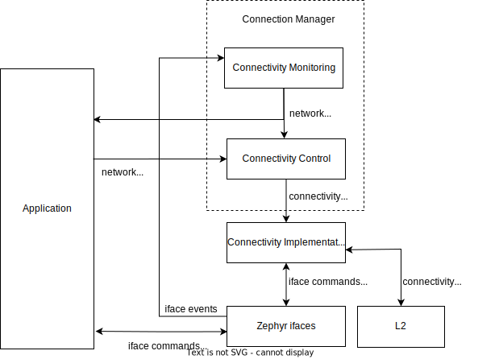

.. _conn_mgr_overview:

Overview
########

Connection Manager is a collection of optional Zephyr features that aim to allow applications to monitor and control connectivity (access to IP-capable networks) with minimal concern for the specifics of underlying network technologies.

Using Connection Manager, applications can use a single abstract API to control network association and monitor Internet access, and avoid excessive use of technology-specific boilerplate.

This allows an application to potentially support several very different connectivity technologies (for example, Wi-Fi and LTE) with a single codebase.

Applications can also use Connection Manager to generically manage and use multiple connectivity technologies simultaneously.

Structure
=========

Connection Manager is split into the following two subsystems:

* :ref:`Connectivity monitoring <conn_mgr_monitoring>` (header file :file:`include/zephyr/net/conn_mgr_monitoring.h`) monitors all available :ref:`Zephyr network interfaces (ifaces) <net_if_interface>` and triggers :ref:`network management <net_mgmt_interface>` events indicating when IP connectivity is gained or lost.

* :ref:`Connectivity control <conn_mgr_control>` (header file :file:`include/zephyr/net/conn_mgr_connectivity.h`) provides an abstract API for controlling iface network association.

.. _conn_mgr_integration_diagram_simple:

    A simplified view of how Connection Manager integrates with Zephyr and the application.

    See :ref:`here <conn_mgr_integration_diagram_detailed>` for a more detailed version.

.. _conn_mgr_monitoring:

Connectivity monitoring
#######################

Connectivity monitoring tracks all available ifaces (whether or not they support :ref:`Connectivity control <conn_mgr_control>`) as they transition through various :ref:`operational states <net_if_interface_state_management>` and acquire or lose assigned IP addresses.

Each available iface is considered ready if it meets the following criteria:

* The iface is admin-up

  * This means the iface has been instructed to become operational-up (ready for use). This is done by a call to :c:func:`net_if_up`.

* The iface is oper-up

  * This means the interface is completely ready for use; It is online, and if applicable, has associated with a network.
  * See :ref:`net_if_interface_state_management` for details.

* The iface has at least one assigned IP address

  * Both IPv4 and IPv6 addresses are acceptable.
    This condition is met as soon as one or both of these is assigned.
  * See :ref:`net_if_interface` for details on iface IP assignment.

* The iface has not been ignored

  * Ignored ifaces are always treated as unready.
  * See :ref:`conn_mgr_monitoring_ignoring_ifaces` for more details.

.. note::

   Typically, iface state and IP assignment are updated either by the iface's :ref:`L2 implementation <net_l2_interface>` or bound :ref:`connectivity implementation <conn_mgr_impl>`.

   See :ref:`conn_mgr_impl_guidelines_iface_state_reporting` for details.

A ready iface ceases to be ready the moment any of the above conditions is lost.

When at least one iface is ready, the :c:macro:`NET_EVENT_L4_CONNECTED` :ref:`network management <net_mgmt_interface>` event is triggered, and IP connectivity is said to be ready.

Afterwards, ifaces can become ready or unready without firing additional events, so long as there always remains at least one ready iface.

When there are no longer any ready ifaces left, the :c:macro:`NET_EVENT_L4_DISCONNECTED` :ref:`network management <net_mgmt_interface>` event is triggered, and IP connectivity is said to be unready.

.. _conn_mgr_monitoring_usage:

Usage
=====

Connectivity monitoring is enabled if the :kconfig:option:`CONFIG_NET_CONNECTION_MANAGER` Kconfig option is enabled.

To receive connectivity updates, create and register a listener for the :c:macro:`NET_EVENT_L4_CONNECTED` and :c:macro:`NET_EVENT_L4_DISCONNECTED` :ref:`network management <net_mgmt_interface>` events:

.. code-block:: c

   /* Callback struct where the callback will be stored */
   struct net_mgmt_event_callback l4_callback;

   /* Callback handler */
   static void l4_event_handler(struct net_mgmt_event_callback *cb,
                                uint32_t event, struct net_if *iface)
   {
           if (event == NET_EVENT_L4_CONNECTED) {
                   LOG_INF("Network connectivity gained!");
           } else if (event == NET_EVENT_L4_DISCONNECTED) {
                   LOG_INF("Network connectivity lost!");
           }

           /* Otherwise, it's some other event type we didn't register for. */
   }

   /* Call this before Connection Manager monitoring initializes */
   static void my_application_setup(void)
   {
           /* Configure the callback struct to respond to (at least) the L4_CONNECTED
            * and L4_DISCONNECTED events.
            *
            *
            * Note that the callback may also be triggered for events other than those specified here!
            * (See the net_mgmt documentation)
            */
           net_mgmt_init_event_callback(
                   &l4_callback, l4_event_handler,
                   NET_EVENT_L4_CONNECTED | NET_EVENT_L4_DISCONNECTED
           );

           /* Register the callback */
           net_mgmt_add_event_callback(&l4_callback);
   }

See :ref:`net_mgmt_listening` for more details on listening for net_mgmt events.

.. note::
   To avoid missing initial connectivity events, you should register your listener(s) before Connection Manager monitoring initializes.
   See :ref:`conn_mgr_monitoring_missing_notifications` for strategies to ensure this.

.. _conn_mgr_monitoring_missing_notifications:

Avoiding missed notifications
=============================

Connectivity monitoring may trigger events immediately upon initialization.

If your application registers its event listeners after connectivity monitoring initializes, it is possible to miss this first wave of events, and not be informed the first time network connectivity is gained.

If this is a concern, your application should :ref:`register its event listeners <conn_mgr_monitoring_usage>` before connectivity monitoring initializes.

Connectivity monitoring initializes using the :c:macro:`SYS_INIT` ``APPLICATION`` initialization priority specified by the :kconfig:option:`CONFIG_NET_CONNECTION_MANAGER_MONITOR_PRIORITY` Kconfig option.

You can register your callbacks before this initialization by using :c:macro:`SYS_INIT` with an earlier initialization priority than this value, for instance priority 0:

.. code-block:: C

   static int my_application_setup(void)
   {
	   /* Register callbacks here */
	   return 0;
   }

   SYS_INIT(my_application_setup, APPLICATION, 0);

If this is not feasible, you can instead request that connectivity monitoring resend the latest connectivity events at any time by calling :c:func:`conn_mgr_mon_resend_status`:

.. code-block:: C

   static void my_late_application_setup(void)
   {
     /* Register callbacks here */

     /* Once done, request that events be re-triggered */
     conn_mgr_mon_resend_status();
   }

.. _conn_mgr_monitoring_ignoring_ifaces:

Ignoring ifaces
===============

Applications can request that ifaces be ignored by Connection Manager by calling :c:func:`conn_mgr_ignore_iface` with the iface to be ignored.

Alternatively, an entire :ref:`L2 implementation <net_l2_interface>` can be ignored by calling :c:func:`conn_mgr_ignore_l2`.

This has the effect of individually ignoring all the ifaces using that :ref:`L2 implementation <net_l2_interface>`.

While ignored, the iface is treated by Connection Manager as though it were unready for network traffic, no matter its actual state.

This may be useful, for instance, if your application has configured one or more ifaces that cannot (or for whatever reason should not) be used to contact the wider Internet.

:ref:`Bulk convenience functions <conn_mgr_control_api_bulk>` optionally skip ignored ifaces.

See :c:func:`conn_mgr_ignore_iface` and :c:func:`conn_mgr_watch_iface` for more details.

.. _conn_mgr_monitoring_api:

Connectivity monitoring API
===========================

Include header file :file:`include/zephyr/net/conn_mgr_monitoring.h` to access these.

.. doxygengroup:: conn_mgr

.. _conn_mgr_control:

Connectivity control
####################

Many network interfaces require a network association procedure to be completed before being usable.

For such ifaces, connectivity control can provide a generic API to request network association (:c:func:`conn_mgr_if_connect`) and disassociation (:c:func:`conn_mgr_if_disconnect`).
Network interfaces implement support for this API by :ref:`binding themselves to a connectivity implementation <conn_mgr_impl_binding>`.

Using this API, applications can associate with networks with minimal technology-specific boilerplate.

Connectivity control also provides the following additional features:

* Standardized :ref:`persistence and timeout <conn_mgr_control_persistence_timeouts>` behaviors during association.
* :ref:`Bulk functions <conn_mgr_control_api_bulk>` for controlling the admin state and network association of all available ifaces simultaneously.
* Optional :ref:`convenience automations <conn_mgr_control_automations>` for common connectivity actions.

.. _conn_mgr_control_operation:

Basic operation
===============

The following sections outline the basic operation of Connection Manager's connectivity control.

.. _conn_mgr_control_operation_binding:

Binding
-------

Before an iface can be commanded to associate or disassociate using Connection Manager, it must first be bound to a :ref:`connectivity implementation <conn_mgr_impl>`.
Binding is performed by the provider of the iface, not by the application (see :ref:`conn_mgr_impl_binding`), and can be thought of as an extension of the iface declaration.

Once an iface is bound, all connectivity commands passed to it (such as :c:func:`conn_mgr_if_connect` or :c:func:`conn_mgr_if_disconnect`) will be routed to the corresponding implementation function in the connectivity implementation.

.. note::

  To avoid inconsistent behavior, all connectivity implementations must adhere to the :ref:`implementation guidelines <conn_mgr_impl_guidelines>`.

.. _conn_mgr_control_operation_connecting:

Connecting
----------

Once a bound iface is admin-up (see :ref:`net_if_interface_state_management`), :c:func:`conn_mgr_if_connect` can be called to cause it to associate with a network.

If association succeeds, the connectivity implementation will mark the iface as operational-up (see :ref:`net_if_interface_state_management`).

If association fails unrecoverably, the :ref:`fatal error event <conn_mgr_control_events_fatal_error>` will be triggered.

You can configure an optional :ref:`timeout <conn_mgr_control_timeouts>` for this process.

.. note::
   The :c:func:`conn_mgr_if_connect` function is intentionally minimalistic, and does not take any kind of configuration.
   Each connectivity implementation should provide a way to pre-configure or automatically configure any required association settings or credentials.
   See :ref:`conn_mgr_impl_guidelines_preconfig` for details.

.. _conn_mgr_control_operation_loss:

Connection loss
---------------

If connectivity is lost due to external factors, the connectivity implementation will mark the iface as operational-down.

Depending on whether :ref:`persistence <conn_mgr_control_persistence>` is set, the iface may then attempt to reconnect.

.. _conn_mgr_control_operation_disconnection:

Manual disconnection
--------------------

The application can also request that connectivity be intentionally abandoned by calling :c:func:`conn_mgr_if_disconnect`.

In this case, the connectivity implementation will disassociate the iface from its network and mark the iface as operational-down (see :ref:`net_if_interface_state_management`).
A new connection attempt will not be initiated, regardless of whether persistence is enabled.

.. _conn_mgr_control_persistence_timeouts:

Timeouts and Persistence
========================

Connection Manager requires that all connectivity implementations support the following standard key features:

* :ref:`Connection timeouts <conn_mgr_control_timeouts>`
* :ref:`Connection persistence <conn_mgr_control_persistence>`

These features describe how ifaces should behave during connect and disconnect events.
You can individually set them for each iface.

.. note::
   It is left to connectivity implementations to successfully and accurately implement these two features as described below.
   See :ref:`conn_mgr_impl_timeout_persistence` for more details from the connectivity implementation perspective.

.. _conn_mgr_control_timeouts:

Connection Timeouts
-------------------

When :c:func:`conn_mgr_if_connect` is called on an iface, a connection attempt begins.

The connection attempt continues indefinitely until it succeeds, unless a timeout has been specified for the iface (using :c:func:`conn_mgr_if_set_timeout`).

In that case, the connection attempt will be abandoned if the timeout elapses before it succeeds.
If this happens, the :ref:`timeout event<conn_mgr_control_events_timeout>` is raised.

.. _conn_mgr_control_persistence:

Connection Persistence
----------------------

Each iface also has a connection persistence setting that you can enable or disable by setting the :c:enumerator:`~conn_mgr_if_flag.CONN_MGR_IF_PERSISTENT` flag with :c:func:`conn_mgr_binding_set_flag`.

This setting specifies how the iface should handle unintentional connection loss.

If persistence is enabled, any unintentional connection loss will initiate a new connection attempt, with a new timeout if applicable.

Otherwise, the iface will not attempt to reconnect.

.. note::
   Persistence not does affect connection attempt behavior.
   Only the timeout setting affects this.

   For instance, if a connection attempt on an iface times out, the iface will not attempt to reconnect, even if it is persistent.

   Conversely, if there is not a specified timeout, the iface will try to connect forever until it succeeds, even if it is not persistent.

   See :ref:`conn_mgr_impl_tp_persistence_during_connect` for the equivalent implementation guideline.

.. _conn_mgr_control_events:

Control events
==============

Connectivity control triggers :ref:`network management <net_mgmt_interface>` events to inform the application of important state changes.

See :ref:`conn_mgr_impl_guidelines_trigger_events` for the corresponding connectivity implementation guideline.

.. _conn_mgr_control_events_fatal_error:

Fatal Error
-----------

The :c:macro:`NET_EVENT_CONN_IF_FATAL_ERROR` event is raised when an iface encounters an error from which it cannot recover (meaning any subsequent attempts to associate are guaranteed to fail, and all such attempts should be abandoned).

Handlers of this event will be passed a pointer to the iface for which the fatal error occurred.
Individual connectivity implementations may also pass an application-specific data pointer.

.. _conn_mgr_control_events_timeout:

Timeout
-------

The :c:macro:`NET_EVENT_CONN_IF_TIMEOUT` event is raised when an :ref:`iface association <conn_mgr_control_operation_connecting>` attempt :ref:`times out <conn_mgr_control_timeouts>`.

Handlers of this event will be passed a pointer to the iface that timed out attempting to associate.

.. _conn_mgr_control_events_listening:

Listening for control events
----------------------------

You can listen for control events as follows:

.. code-block:: c

   /* Declare a net_mgmt callback struct to store the callback */
   struct net_mgmt_event_callback my_conn_evt_callback;

   /* Declare a handler to receive control events */
   static void my_conn_evt_handler(struct net_mgmt_event_callback *cb,
                                   uint32_t event, struct net_if *iface)
   {
           if (event == NET_EVENT_CONN_IF_TIMEOUT) {
                   /* Timeout occurred, handle it */
           } else if (event == NET_EVENT_CONN_IF_FATAL_ERROR) {
                   /* Fatal error occurred, handle it */
           }

           /* Otherwise, it's some other event type we didn't register for. */
   }

   int main()
   {
           /* Configure the callback struct to respond to (at least) the CONN_IF_TIMEOUT
            * and CONN_IF_FATAL_ERROR events.
            *
            * Note that the callback may also be triggered for events other than those specified here!
            * (See the net_mgmt documentation)
            */

           net_mgmt_init_event_callback(
                   &conn_mgr_conn_callback, conn_mgr_conn_handler,
                       NET_EVENT_CONN_IF_TIMEOUT | NET_EVENT_CONN_IF_FATAL_ERROR
           );

           /* Register the callback */
           net_mgmt_add_event_callback(&conn_mgr_conn_callback);
           return 0;
   }

See :ref:`net_mgmt_listening` for more details on listening for net_mgmt events.

.. _conn_mgr_control_automations:

Automated behaviors
===================

There are a few actions related to connectivity that are (by default at least) performed automatically for the user.

.. _conn_mgr_control_automations_auto_up:

.. topic:: Automatic admin-up

   In Zephyr, ifaces are automatically taken admin-up (see :ref:`net_if_interface_state_management` for details on iface states) during initialization.

   Applications can disable this behavior by setting the :c:enumerator:`~net_if_flag.NET_IF_NO_AUTO_START` interface flag with :c:func:`net_if_flag_set`.

.. _conn_mgr_control_automations_auto_connect:

.. topic:: Automatic connect

   By default, Connection Manager will automatically connect any :ref:`bound <conn_mgr_impl_binding>` iface that becomes admin-up.

   Applications can disable this by setting the :c:enumerator:`~conn_mgr_if_flag.CONN_MGR_IF_NO_AUTO_CONNECT` connectivity flag with :c:func:`conn_mgr_if_set_flag`.

.. _conn_mgr_control_automations_auto_down:

.. topic:: Automatic admin-down

   By default, Connection Manager will automatically take any bound iface admin-down if it has given up on associating.

   Applications can disable this for all ifaces by disabling the :kconfig:option:`CONFIG_NET_CONNECTION_MANAGER_AUTO_IF_DOWN` Kconfig option, or for individual ifaces by setting the :c:enumerator:`~conn_mgr_if_flag.CONN_MGR_IF_NO_AUTO_DOWN` connectivity flag with :c:func:`conn_mgr_if_set_flag`.

.. _conn_mgr_control_api:

Connectivity control API
========================

Include header file :file:`include/zephyr/net/conn_mgr_connectivity.h` to access these.

.. doxygengroup:: conn_mgr_connectivity

.. _conn_mgr_control_api_bulk:

Bulk API
--------

Connectivity control provides several bulk functions allowing all ifaces to be controlled at once.

You can restrict these functions to operate only on non-:ref:`ignored <conn_mgr_monitoring_ignoring_ifaces>` ifaces if desired.

Include header file :file:`include/zephyr/net/conn_mgr_connectivity.h` to access these.

.. doxygengroup:: conn_mgr_connectivity_bulk
