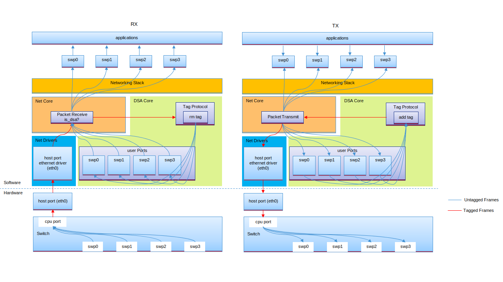

.. _dsa:

Distributed Switch Architecture (DSA)
#####################################

.. contents::
    :local:
    :depth: 2

Distributed Switch Architecture (DSA) is not something new. It has been a mature
subsystem in Linux for many years. This document just skips the background,
terms and any knowledge related description, as user may find all of these in
`Linux DSA documentation`_.

DSA switch TX/RX process
************************

The DSA switch TX/RX process is as below.

Host interface
**************

Host interface network devices use regular and unmodified ethernet driver working
as DSA conduit port, which manages the switch through processor.

Switch interface
****************

The switch interfaces are also exposed as standard ethernet interfaces in zephyr.
The one connected to conduit port work as CPU port, and the others for user purpose
work as user ports.

Switch tagging protocols
************************

Generally, switch tagging protocols are vendor specific. They all contain something which:

- identifies which port the Ethernet frame came from/should be sent to
- provides a reason why this frame was forwarded to the management interface

And tag on the packets to give them a switch frame header. But there are also tag-less case.
It depends on the vendor.

Networking stack process
************************

In order to have the DSA subsystem process the Ethernet switch specific tagging protocol
via conduit port.

For RX path, put ``dsa_recv()`` at beginning of ``net_recv_data()`` in ``subsys/net/ip/net_core.c``
to handle first for untagging and re-directing interface.

For TX path, the switch interfaces register as standard ethernet devices with ``dsa_xmit()``
as ``ethernet_api->send``. The ``dsa_xmit()`` processes the tagging and re-directing to conduit
port work.

DSA device driver support
*************************

As the DSA core driver interacts with subsystems/drivers including MDIO, PHY and device tree to
to support the common DSA setup and working process. The device driver support is much easy.

For device tree, the switch description should be following the ``dts/bindings/dsa/dsa.yaml``.

For device driver, all needed to prepare are :c:struct:`dsa_api`, private data if has, and
:c:struct:`dsa_port_config`. The macro functions could be utilized. And below is an example
of i.MX NETC.

- :c:macro:`DSA_SWITCH_INST_INIT`
- :c:macro:`DSA_PORT_INST_INIT`

.. code-block:: c

   #define DSA_NETC_PORT_INST_INIT(port, n)                                                    \
           COND_CODE_1(DT_NUM_PINCTRL_STATES(port),                                            \
                           (PINCTRL_DT_DEFINE(port);), (EMPTY))                                \
           struct dsa_netc_port_config dsa_netc_##n##_##port##_config = {                      \
                   .pincfg = COND_CODE_1(DT_NUM_PINCTRL_STATES(port),                          \
                                   (PINCTRL_DT_DEV_CONFIG_GET(port)), NULL),                   \
                   .phy_mode = NETC_PHY_MODE(port),                                            \
           };                                                                                  \
           struct dsa_port_config dsa_##n##_##port##_config = {                                \
                   .use_random_mac_addr = DT_NODE_HAS_PROP(port, zephyr_random_mac_address),   \
                   .mac_addr = DT_PROP_OR(port, local_mac_address, {0}),                       \
                   .port_idx = DT_REG_ADDR(port),                                              \
                   .phy_dev = DEVICE_DT_GET_OR_NULL(DT_PHANDLE(port, phy_handle)),             \
                   .phy_mode = DT_PROP_OR(port, phy_connection_type, ""),                      \
                   .ethernet_connection = DEVICE_DT_GET_OR_NULL(DT_PHANDLE(port, ethernet)),   \
                   .prv_config = &dsa_netc_##n##_##port##_config,                              \
           };                                                                                  \
           DSA_PORT_INST_INIT(port, n, &dsa_##n##_##port##_config)

   #define DSA_NETC_DEVICE(n)                                                                  \
           AT_NONCACHEABLE_SECTION_ALIGN(static netc_cmd_bd_t dsa_netc_##n##_cmd_bd[8],        \
                                         NETC_BD_ALIGN);                                       \
           static struct dsa_netc_data dsa_netc_data_##n = {                                   \
                   .cmd_bd = dsa_netc_##n##_cmd_bd,                                            \
           };                                                                                  \
           DSA_SWITCH_INST_INIT(n, &dsa_netc_api, &dsa_netc_data_##n, DSA_NETC_PORT_INST_INIT);

Common pitfalls using DSA setups
********************************

This is copied from Linux DSA documentation. It applies to zephyr too. Although conduit port and
cpu port exposed as ethernet device in zephyr, they are not able to be used.

.. note::

  Once a conduit network device is configured to use DSA (dev->dsa_ptr becomes non-NULL), and
  the switch behind it expects a tagging protocol, this network interface can only exclusively
  be used as a conduit interface. Sending packets directly through this interface (e.g.: opening
  a socket using this interface) will not make us go through the switch tagging protocol transmit
  function, so the Ethernet switch on the other end, expecting a tag will typically drop this frame.

TODO work
*********

Comparing to Linux, there are too much features to support in/based on zephyr DSA. But basically
bridge layer should be supported. Then DSA could provide two options for users to use switch ports.

- Standalone mode: all user ports work as regular ethernet devices. No switching.
- Bridge mode: switch mode enabled with adding user ports into virtual bridge device. IP address could
  be assigned to the bridge.

.. _Linux DSA documentation:
   https://www.kernel.org/doc/html/latest/networking/dsa/dsa.html
