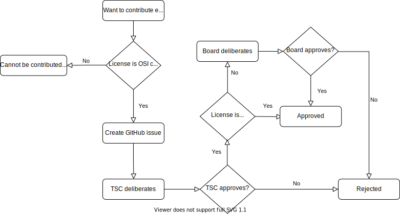

.. _external-contributions:

Contributing External Components
################################

In some cases it is desirable to leverage existing, external source code in
order to avoid re-implementing basic functionality or features that are readily
available in other open source projects.

This section describes the circumstances under which external source code can be
imported into Zephyr, and the process that governs the inclusion.

There are three main factors that will be considered during the inclusion
process in order to determine whether it will be accepted. These will be
described in the following sections.

Note that most of this page deals with external components that end up being
compiled and linked into the final image, and programmed into the target
hardware. For external tooling that is only used during compilation,
code analysis, testing or simulation please refer to the
:ref:`external-tooling` section at the end of the page.

Software License
****************

.. note::

   External source code licensed under the Apache-2.0 license is not subject to
   this section.

Integrating code into the Zephyr Project from other projects that use a license
other than the Apache 2.0 license needs to be fully understood in
context and approved by the `Zephyr governing board`_, as described in the
`Zephyr project charter`_. The board will automatically reject licenses that
have not been approved by the `Open Source Initiative (OSI)`_. See the
:ref:`external-src-process` section for more details.

.. _Zephyr governing board:
   https://www.zephyrproject.org/governance/

.. _Zephyr project charter:
   https://www.zephyrproject.org/wp-content/uploads/2023/08/LF-Zephyr-Charter-2023.08.21.pdf

.. _Open Source Initiative (OSI):
   https://opensource.org/licenses/alphabetical

By carefully reviewing potential contributions and also enforcing a :ref:`DCO`
for contributed code, we ensure that the Zephyr community can develop products
with the Zephyr Project without concerns over patent or copyright issues.

Merit
*****

Just like with any other regular contribution, one that contains external code
needs to be evaluated for merit. However, in the particular case of code that
comes from an existing project, there are additional questions that must be
answered in order to accept the contribution.
More specifically, the following will be considered by the Technical Steering
Committee and evaluated carefully before the external source code is accepted
into the project:

- Is this the most optimal way to introduce the functionality to the project?
  Both the cost of implementing this internally and the one incurred in
  maintaining an externally developed codebase need to be evaluated.
- Is the external project being actively maintained? This is particularly
  important for source code that deals with security or cryptography.
- Have alternatives to the particular implementation proposed been considered?
  Are there other open source project that implement the same functionality?

Mode of integration
*******************

There are two ways of integrating external source code into the Zephyr Project,
and careful consideration must be taken to choose the appropriate one for each
particular case.

Integration in the main tree
============================

The first way to integrate external source code into the project is to simply
import the source code files into the main ``zephyr`` repository. This
automatically implies that the imported source code becomes part of the
"mainline" codebase, which in turn requires that:

- The code is formatted according to the Zephyr :ref:`coding_style`
- The code adheres to the project's :ref:`coding_guidelines`
- The code is subject to the same checks and verification requirements as the
  rest of the code in the main tree, including static analysis
- All files contain an SPDX tag if not already present
- If the source is not Apache 2.0 licensed,
  an entry is added to the :ref:`licensing page <zephyr_licensing>`.

This mode of integration can be applicable to both small and large external
codebases, but it is typically used more commonly with the former.

Integration as a module
=======================

The second way of integrating external source code into the project is to import
the whole or parts of the third-party open source project into a separate
repository, and then include it under the form of a :ref:`module <modules>`.
With this approach the code is considered as being developed externally, and
thus it is not automatically subject to the requirements of the previous
section.

Integration in main manifest file (west.yaml)
---------------------------------------------

Integrating external code into the main :file:`west.yml` manifest file is
limited to code that is used by a Zephyr subsystem (libraries), by a platform,
drivers (HAL) or tooling needed to test or build Zephyr components.

The integration of modules in this group is validated by the Zephyr project CI,
and verified to be working with each Zephyr release.

Integrated modules will not be removed from the tree without a detailed
migration plan.

Integration as optional modules
-------------------------------

Standalone or loose integration of modules/projects without any incoming
dependencies shall be made optional and shall be kept standalone. Optional
projects that provide value to users directly and through a Zephyr subsystem or
platform shall be added to an optional manifest file that is filtered by
default. (:file:`submanifests/optional.yml`).

Such optional projects might include samples and tests in their own repositories.

There shall not be any direct dependency added in the Zephyr code tree (Git
repository) and all sample or test code shall be maintained as part of the module.

.. note::

   This is valid for all new optional modules. Existing optional modules with
   samples and test code in the Zephyr Git repository will be transitioned out
   over time.

Integration as external modules
-------------------------------

Similar to optional modules, but added to the Zephyr project as an entry in the
documentation using a pre-defined template. This type of modules exists outside the
Zephyr project manifest with documentation instructing users and developers how
to integrate the functionality.

Ongoing maintenance
*******************

Regardless of the mode of integration, external source code that is integrated
in Zephyr requires regular ongoing maintenance. The submitter of the proposal to
integrate external source code must therefore commit to maintain the integration
of such code for the foreseeable future.
This may require adding an entry in the :file:`MAINTAINERS.yml` as part of the
process.

.. _external-src-process:

Submission and review process
*****************************

Before external source code can be included in the project, it must be reviewed
and accepted by the Technical Steering Committee (TSC) and, in some cases, by
the Zephyr governing board.

A request for external source code integration must be made by creating a new
issue in the Zephyr project issue tracking system on GitHub with details
about the source code and how it integrates into the project.

Follow the steps below to begin the submission process:

#. Make sure to read through the :ref:`external-contributions` section in
   detail, so that you are informed of the criteria used by the TSC and board in
   order to approve or reject a request
#. Use the :github:`New External Source Code Issue
   <new?assignees=&labels=RFC&template=007_ext-source.md&title=>` to open an issue
#. Fill out all required sections, making sure you provide enough detail for the
   TSC to assess the merit of the request. Optionally you can also create a Pull
   Request that demonstrates the integration of the external source code and
   link to it from the issue
#. Wait for feedback from the TSC, respond to any additional questions added as
   GitHub issue comments

If, after consideration by the TSC, the conclusion is that integrating external
source code is the best solution, and the external source code is licensed under
the Apache-2.0 license, the submission process is complete and the external
source code can be integrated.

If, however, the external source code uses a license other than Apache-2.0,
then these additional steps must be followed:

#. The TSC chair will forward the link to the GitHub issue created during the
   early submission process to the Zephyr governing board for further review

#. The Zephyr governing board has two weeks to review and ask questions:

   - If there are no objections, the matter is closed. Approval can be
     accelerated by unanimous approval of the board before the two
     weeks are up

   - If a governing board member raises an objection that cannot be resolved
     via email, the board will meet to discuss whether to override the
     TSC approval or identify other approaches that can resolve the
     objections

#. On approval of the Zephyr TSC and governing board the submission process is
   complete

The flowchart below shows an overview of the process:

   Submission process

.. _external-tooling:

Contributing External Tooling
*****************************

This section deals exclusively with the inclusion of external tooling in the
Zephyr project, where tooling is defined as software that assists the
compilation, testing or simulation processes but in no case ends up being part
of the code compiled and linked into the final image. "Inclusion" in this
context means becoming part of the Zephyr default distribution either in the
main tree directly under the :file:`scripts/` folder or indirectly as a west
project in the main :file:`west.yml` manifest. Therefore, this section does not
apply to 3rd-party tooling such as toolchains, simulators or others, which may
still be referenced by the Zephyr build system or docs without being included in
Zephyr.

Tooling components must be released under a license approved by the
`Open Source Initiative (OSI)`_.

Just like with regular external components, tooling that is imported from
another project can be integrated either in the main tree or as a :ref:`west
project <west-workspace>`. Note that in this case the corresponding west project
will not be a :ref:`module <modules>`, because tooling does not make use of the
Zephyr build system and does not need to be processed by it. Please see
:ref:`modules-vs-projects` for additional information on the differences.

If the tool is integrated in the main tree it should be placed under the
:file:`scripts/` folder.
If the tool is integrated as a west project, then the project repository can be
hosted outside the zephyrproject-rtos GitHub organization, provided that the
project is made optional via the ``group-filter:`` field in the main
:file:`west.yml` manifest. More info on optional projects can be found in
:ref:`this section <west-manifest-groups>`.

The TSC must approve every Pull Request that introduces a new external tooling
component. This will be done on a case-by-case, individual analysis of the
proposed addition by the TSC representatives.

Additional considerations about the main manifest
*************************************************

In general, any additions or removals whatsoever to the ``projects:`` section of
the `main manifest file`_ requires TSC approval. This includes, but is not
limited to:

- Adding and removing groups and group filters
- Adding and removing projects
- Adding and removing ``import`` statements

.. _main manifest file:
   https://github.com/zephyrproject-rtos/zephyr/blob/main/west.yml
