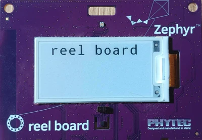

.. _getting_started:

Getting Started Guide
#####################

Follow this guide to:

- Set up a command-line Zephyr development environment on Ubuntu, macOS, or
  Windows (instructions for other Linux distributions are discussed in
  :ref:`installation_linux`)
- Get the source code
- Build, flash, and run a sample application

.. _host_setup:

Select and Update OS
********************

Click the operating system you are using.

.. tabs::

   .. group-tab:: Ubuntu

      This guide covers Ubuntu version 24.04 LTS and later.
      If you are using a different Linux distribution see :ref:`installation_linux`.

      .. code-block:: bash

         sudo apt update
         sudo apt upgrade

   .. group-tab:: macOS

      Select :menuselection:`System Settings --> General --> Software Update`
      andd install any available updates. See `this Apple support topic
      <https://support.apple.com/en-us/HT201541>`_ for more details.

      .. note::

         x86-64 macOS is not supported.

   .. group-tab:: Windows

      Select :menuselection:`Start --> Settings --> Update & Security --> Windows Update`.
      Click :guilabel:`Check for updates` and install any that are available.

.. _install-required-tools:

Install dependencies
********************

Next, install the host tools Zephyr needs to configure and build applications.
The instructions below use the recommended package manager for each operating
system so the tools are available from your terminal.

The current minimum required versions for the main dependencies are:

.. list-table::
   :header-rows: 1

   * - Tool
     - Min. Version

   * - `CMake <https://cmake.org/>`_
     - 3.28.0

   * - `Python <https://www.python.org/>`_
     - 3.12

   * - `Devicetree compiler <https://www.devicetree.org/>`_
     - 1.4.6

.. note::

   Python 3.12 is strongly recommended. Using a newer Python release may fail on some systems, for
   example when installing the required packages on Windows.

.. tabs::

   .. group-tab:: Ubuntu

      .. _install_dependencies_ubuntu:

      #. Use ``apt`` to install the required dependencies:

         .. code-block:: bash

            sudo apt install --no-install-recommends git cmake ninja-build gperf \
              ccache dfu-util device-tree-compiler wget python3-dev python3-venv python3-tk \
              xz-utils file make gcc gcc-multilib g++-multilib libsdl2-dev libmagic1

         .. note::

            Due to the unavailability of ``gcc-multilib`` and ``g++-multilib`` on AArch64
            (ARM64) systems, you may need to omit them from the list of packages to install.

      #. Verify the versions of the main dependencies installed on your system by entering:

         .. code-block:: bash

            cmake --version
            python3 --version
            dtc --version

         Check those against the versions in the table in the beginning of this section.
         Refer to the :ref:`installation_linux` page for additional information on updating
         the dependencies manually.

   .. group-tab:: macOS

      .. _install_dependencies_macos:

      #. Install `Homebrew <https://brew.sh/>`_:

         .. code-block:: bash

            /bin/bash -c "$(curl -fsSL https://raw.githubusercontent.com/Homebrew/install/HEAD/install.sh)"

      #. After the Homebrew installation script completes, follow the on-screen
         instructions to add the Homebrew installation to the path.

         .. code-block:: bash

            (echo; echo 'eval "$(/opt/homebrew/bin/brew shellenv)"') >> ~/.zprofile
            source ~/.zprofile

      #. Use ``brew`` to install the required dependencies:

         .. code-block:: bash

            brew install cmake ninja gperf python3 python-tk ccache qemu dtc libmagic wget openocd

      #. Add the Homebrew Python folder to the path so you can execute ``python`` and
         ``pip`` as well as ``python3`` and ``pip3``.

           .. code-block:: bash

              (echo; echo 'export PATH="'$(brew --prefix)'/opt/python/libexec/bin:$PATH"') >> ~/.zprofile
              source ~/.zprofile

   .. group-tab:: Windows

      .. note::

         Due to issues finding executables, the Zephyr Project doesn't
         currently support application flashing using the `Windows Subsystem
         for Linux (WSL)
         <https://msdn.microsoft.com/en-us/commandline/wsl/install_guide>`_
         (WSL).

         Therefore, we don't recommend using WSL when getting started.

      On modern versions of Windows (10 and later), install Windows Terminal from the
      Microsoft Store. The instructions below work in either ``cmd.exe`` or
      PowerShell.

      These instructions use Windows' official package manager, `winget`_. If winget
      isn't an option, install the dependencies from their respective websites and
      make sure their command line tools are on your :envvar:`PATH` :ref:`environment
      variable <env_vars>`.

      |p|

      .. _install_dependencies_windows:

      #. In modern Windows versions, winget is already pre-installed by default.
         You can verify that this is the case by typing ``winget`` in a terminal
         window. If that fails, you can then `install winget`_.

      #. Open a Command Prompt (``cmd.exe``) or PowerShell terminal window.
         To do so, press the Windows key, type ``cmd.exe`` or PowerShell and
         click on the result.

      #. Use ``winget`` to install the required dependencies:

         .. code-block:: bat

            winget install Kitware.CMake Ninja-build.Ninja oss-winget.gperf Python.Python.3.12 Git.Git oss-winget.dtc wget 7zip.7zip

      #. Close the terminal window.

      .. note::

         You may need to add the 7zip installation folder to your ``PATH``.

.. _winget: https://learn.microsoft.com/en-us/windows/package-manager/
.. _install winget: https://aka.ms/getwinget

.. _get_the_code:
.. _clone-zephyr:
.. _install_py_requirements:
.. _gs_python_deps:

Get Zephyr and install Python dependencies
******************************************

Next, use :ref:`west <west>` to create a workspace and fetch Zephyr together
with its :ref:`modules <modules>`.

These commands use :file:`zephyrproject` as the workspace name; you can choose
another name and location. You will also install Zephyr's Python dependencies in
a `Python virtual environment`_ so they stay separate from your system Python
installation.

.. _Python virtual environment: https://docs.python.org/3/library/venv.html

#. Create a new virtual environment:

   .. tabs::

      .. group-tab:: Ubuntu

         .. code-block:: bash

            python3 -m venv ~/zephyrproject/.venv

      .. group-tab:: macOS

         .. code-block:: bash

            python3 -m venv ~/zephyrproject/.venv

      .. group-tab:: Windows

         Open a ``cmd.exe`` or PowerShell terminal window **as a regular user**.

         .. tabs::

            .. code-tab:: bat

               cd %HOMEPATH%
               py -3.12 -m venv zephyrproject\.venv

            .. code-tab:: powershell

               cd $Env:HOMEPATH
               py -3.12 -m venv zephyrproject\.venv

#. Activate the virtual environment:

   .. tabs::

      .. group-tab:: Ubuntu

         .. code-block:: bash

            source ~/zephyrproject/.venv/bin/activate

      .. group-tab:: macOS

         .. code-block:: bash

            source ~/zephyrproject/.venv/bin/activate

      .. group-tab:: Windows

         .. note::

            Python's virtual environment activation in PowerShell requires
            running a script itself, which needs to be allowed.

            .. code-block:: powershell

               Set-ExecutionPolicy -ExecutionPolicy RemoteSigned -Scope CurrentUser

         .. tabs::

            .. code-tab:: bat

               zephyrproject\.venv\Scripts\activate.bat

            .. code-tab:: powershell

               zephyrproject\.venv\Scripts\Activate.ps1

   Once activated your shell will be prefixed with ``(.venv)``. The
   virtual environment can be deactivated at any time by running
   ``deactivate``.

   .. note::

      Remember to activate the virtual environment every time you start a new
      terminal session before working with Zephyr. If you don't, commands such
      as ``west`` will not be found, or may run against a different Python
      environment, leading to confusing errors.

#. Install west:

   West is Zephyr's workspace manager; the next commands use it to create and
   update the workspace.

   .. code-block:: shell

      pip install west

#. Get the Zephyr source code:

   ``west init`` creates a :term:`west workspace` and clones
   ``https://github.com/zephyrproject-rtos/zephyr`` as its :term:`manifest
   repository <west manifest repository>`.

   ``west update`` then fetches the various
   :term:`west projects <west project>` (modules) listed in Zephyr's
   :term:`west manifest` (hardware abstraction layers (HALs), libraries, etc.).

   .. tabs::

      .. group-tab:: Ubuntu

         .. only:: not release

            .. code-block:: bash

               west init -m https://github.com/zephyrproject-rtos/zephyr ~/zephyrproject
               cd ~/zephyrproject
               west update

         .. only:: release

            .. We need to use a parsed-literal here because substitutions do not work in code
               blocks. This means users can't copy-paste these lines as easily as other blocks but
               should be good enough still :)

            .. parsed-literal::

               west init -m https://github.com/zephyrproject-rtos/zephyr ~/zephyrproject --mr v |zephyr-version-ltrim|
               cd ~/zephyrproject
               west update

      .. group-tab:: macOS

         .. only:: not release

            .. code-block:: bash

               west init -m https://github.com/zephyrproject-rtos/zephyr ~/zephyrproject
               cd ~/zephyrproject
               west update

         .. only:: release

            .. parsed-literal::

               west init -m https://github.com/zephyrproject-rtos/zephyr ~/zephyrproject --mr v |zephyr-version-ltrim|
               cd ~/zephyrproject
               west update

      .. group-tab:: Windows

         .. only:: not release

            .. code-block:: bat

               west init -m https://github.com/zephyrproject-rtos/zephyr zephyrproject
               cd zephyrproject
               west update

         .. only:: release

            .. parsed-literal::

               west init -m https://github.com/zephyrproject-rtos/zephyr zephyrproject --mr v |zephyr-version-ltrim|
               cd zephyrproject
               west update

   .. tip::

      To reduce disk space usage and avoid downloading unnecessary modules or vendor HALs during
      setup, you may configure :ref:`west-manifest-groups` before running ``west update``.

#. Install Zephyr's Python dependencies:

   ``west packages`` reads the Python requirements from the checked-out Zephyr
   workspace (including its modules), so the installed packages match the Zephyr
   version you fetched.

   .. tabs::

      .. group-tab:: Ubuntu

         .. code-block:: bash

            west packages pip --install

      .. group-tab:: macOS

         .. code-block:: bash

            west packages pip --install

      .. group-tab:: Windows

         .. tabs::

            .. code-tab:: bat

               cmd /c zephyr\scripts\utils\west-packages-pip-install.cmd

            .. code-tab:: powershell

               python -m pip install @((west packages pip) -split ' ')

   .. note::

      Installing these dependencies can downgrade or upgrade west itself.

#. Export a :ref:`Zephyr CMake package <cmake_pkg>`. This registers your current
   Zephyr checkout in CMake's user package registry so ``find_package(Zephyr)``
   can locate it automatically when building applications.

   .. code-block:: shell

      west zephyr-export

Install the Zephyr SDK
**********************

The :ref:`Zephyr Software Development Kit (SDK) <toolchain_zephyr_sdk>`
contains toolchains for each of Zephyr's supported architectures. Those
toolchains include the compiler, assembler, linker, and other programs
required to build Zephyr applications for your target hardware.

It also contains additional host tools, such as custom QEMU and OpenOCD builds
that are used to emulate, flash and debug Zephyr applications.

Install the Zephyr SDK with ``west sdk install`` from the Zephyr repository:

.. tabs::

   .. group-tab:: Ubuntu

      .. code-block:: bash

         cd ~/zephyrproject/zephyr
         west sdk install

   .. group-tab:: macOS

      .. code-block:: bash

         cd ~/zephyrproject/zephyr
         west sdk install

   .. group-tab:: Windows

      .. tabs::

         .. code-tab:: bat

            cd %HOMEPATH%\zephyrproject\zephyr
            west sdk install

         .. code-tab:: powershell

            cd $Env:HOMEPATH\zephyrproject\zephyr
            west sdk install

.. tip::

   Use command options to choose the SDK installation destination or install
   only selected architecture toolchains. See ``west sdk install --help`` for
   details.

.. note::

    If you want to install Zephyr SDK without using the ``west sdk`` command,
    please see :ref:`toolchain_zephyr_sdk_install`.

.. _getting_started_run_sample:

Build the Blinky Sample
***********************

.. note::

   :zephyr:code-sample:`blinky` is compatible with most, but not all, :ref:`boards`. If your board
   does not meet Blinky's :ref:`blinky-sample-requirements`, then
   :zephyr:code-sample:`hello_world` is a good alternative.

   If you are unsure what name west uses for your board, use ``west boards`` to
   list all boards Zephyr supports. Your board's :zephyr:board-catalog:`documentation page`
   also shows the exact board target name to pass to ``west build``.

Build the :zephyr:code-sample:`blinky` with :ref:`west build <west-building>`.
Replace ``<your-board-name>`` with the name of your board:

.. tabs::

   .. group-tab:: Ubuntu

      .. code-block:: bash

         cd ~/zephyrproject/zephyr
         west build -p always -b <your-board-name> samples/basic/blinky

   .. group-tab:: macOS

      .. code-block:: bash

         cd ~/zephyrproject/zephyr
         west build -p always -b <your-board-name> samples/basic/blinky

   .. group-tab:: Windows

      .. tabs::

         .. code-tab:: bat

            cd %HOMEPATH%\zephyrproject\zephyr
            west build -p always -b <your-board-name> samples\basic\blinky

         .. code-tab:: powershell

            cd $Env:HOMEPATH\zephyrproject\zephyr
            west build -p always -b <your-board-name> samples\basic\blinky

The ``-p always`` option forces a pristine build, which removes build output
from any previous configuration. This avoids stale files when you are getting
started. Later, you can use ``-p auto`` to let ``west build`` heuristics decide
when a pristine build may be needed. See ``west build -h`` for details.

.. note::

   A board may contain one or multiple SoCs and each SoC may contain one or more
   CPU clusters. When building for such boards, specify the SoC or CPU cluster
   for which the sample must be built.
   For example to build :zephyr:code-sample:`blinky` for the ``cpuapp`` core on
   the :zephyr:board:`nrf5340dk` the board must be provided as:
   ``nrf5340dk/nrf5340/cpuapp``. See also :ref:`board_terminology` for more
   details.

Flash the Sample
****************

Connect your board, usually via USB, and turn it on if there's a power switch.
If in doubt about what to do, check your board's page in :ref:`boards`, as some
boards require a specific setup or procedure to flash them.

Flash the sample with :ref:`west flash <west-flashing>`. This programs the
application you just built onto the connected board:

.. code-block:: shell

   west flash

.. note::

    You may need to install additional :ref:`host tools <flash-debug-host-tools>`
    required by your board. The ``west flash`` command will print an error if any
    required dependencies are missing.

.. note::

    On Linux, you may need to configure udev rules before flashing with a debug
    probe for the first time. See :ref:`setting-udev-rules`.

If you're using blinky, the LED will start to blink as shown in this figure:

   Phytec :zephyr:board:`reel_board <reel_board>` running blinky

Next Steps
**********

Here are some next steps for exploring Zephyr:

* Try other :zephyr:code-sample-category:`samples`
* Learn about :ref:`application` and the :ref:`west <west>` tool
* Find out about west's :ref:`flashing and debugging <west-build-flash-debug>`
  features, or more about :ref:`flashing_and_debugging` in general
* Check out :ref:`beyond-GSG` for additional setup alternatives and ideas
* Discover :ref:`project-resources` for getting help from the Zephyr
  community

.. _help:

Asking for Help
***************

Before asking for help, search this documentation, the Zephyr project's GitHub
discussions and issues, and Discord chat history. Your question may already
have an answer there. You can also ask the :ref:`chatbot <kapa_ai>` available
from every page of this documentation.

* **Mailing Lists**: users@lists.zephyrproject.org is usually the right list to
  ask for help. `Search archives and sign up here`_.
* **GitHub**: Use `GitHub discussions`_ for questions and `GitHub issues`_ for
  bugs and feature requests.
* **Discord**: You can join with this `Discord invite`_.

When asking for help, include:

#. What you want to do
#. What you tried, including the commands you ran
#. What happened, including the full text output

Copy and paste text instead of sharing screenshots. For more than 5 lines of
terminal output, source code, or logs on Discord or GitHub, create a snippet
using three backticks.

.. _Search archives and sign up here: https://lists.zephyrproject.org/g/users
.. _GitHub discussions: https://github.com/zephyrproject-rtos/zephyr/discussions
.. _Discord invite: https://chat.zephyrproject.org
.. _GitHub issues: https://github.com/zephyrproject-rtos/zephyr/issues
