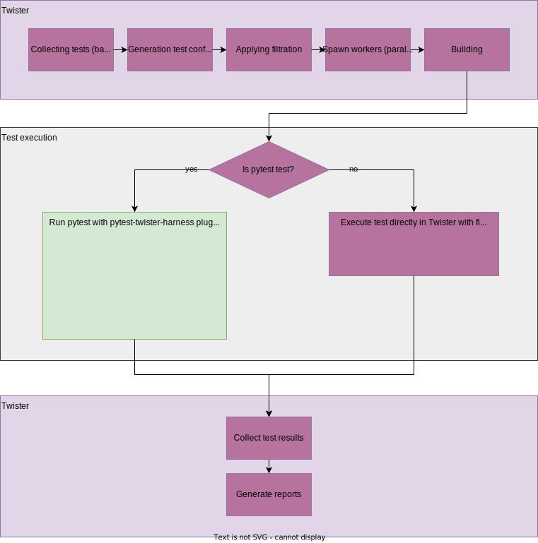

.. _integration_with_pytest:

Integration with pytest test framework
######################################

*Please mind that integration of twister with pytest is still work in progress. Not every platform
type is supported in pytest (yet). If you find any issue with the integration or have an idea for
an improvement, please, let us know about it and open a GitHub issue/enhancement.*

Introduction
************

Pytest is a python framework that *“makes it easy to write small, readable tests, and can scale to
support complex functional testing for applications and libraries”* (`<https://docs.pytest.org/en/7.3.x/>`_).
Python is known for its free libraries and ease of using it for scripting. In addition, pytest
utilizes the concept of plugins and fixtures, increasing its expendability and reusability.
A pytest plugin `pytest-twister-harness` was introduced to provide an integration between pytest
and twister, allowing Zephyr’s community to utilize pytest functionality with keeping twister as
the main framework.

Integration with twister
************************

By default, there is nothing to be done to enable pytest support in twister. The plugin is
developed as a part of Zephyr’s tree. To enable install-less operation, twister first extends
``PYTHONPATH`` with path to this plugin, and then during pytest call, it appends the command with
``-p twister_harness.plugin`` argument. If one prefers to use the installed version of the plugin,
they must add ``--allow-installed-plugin`` flag to twister’s call.

Pytest-based test suites are discovered the same way as other twister tests, i.e., by a presence
of test/sample.yaml. Inside, a keyword ``harness`` tells twister how to handle a given test.
In the case of ``harness: pytest``, most of twister workflow (test suites discovery,
parallelization, building and reporting) remains the same as for other harnesses. The change
happens during the execution step. The below picture presents a simplified overview of the
integration.

If ``harness: pytest`` is used, twister delegates the test execution to pytest, by calling it as
a subprocess. Required parameters (such as build directory, device to be used, etc.) are passed
through a CLI command. When pytest is done, twister looks for a pytest report (results.xml) and
sets the test result accordingly.

How to create a pytest test
***************************

An example folder containing a pytest test, application source code and Twister configuration .yaml
file can look like the following:

.. code-block:: none

   test_foo/
   ├─── pytest/
   │    └─── test_foo.py
   ├─── src/
   │    └─── main.c
   ├─── CMakeList.txt
   ├─── prj.conf
   └─── testcase.yaml

An example of a pytest test is given at
:zephyr_file:`samples/subsys/testsuite/pytest/shell/pytest/test_shell.py`. Using the configuration
provided in the ``testcase.yaml`` file, Twister builds the application from ``src`` and then, if the
.yaml file contains a ``harness: pytest`` entry, it calls pytest in a separate subprocess. A sample
configuration file may look like this:

.. code-block:: yaml

   tests:
      some.foo.test:
         harness: pytest
         tags: foo

By default, pytest tries to look for tests in a ``pytest`` directory located next to a directory
with binary sources. A keyword ``pytest_root`` placed under ``harness_config`` section in .yaml file
can be used to point to other files, directories or subtests (more info :ref:`here <pytest_root>`).

Pytest scans the given locations looking for tests, following its default
`discovery rules <https://docs.pytest.org/en/7.1.x/explanation/goodpractices.html#conventions-for-python-test-discovery>`_.

Passing extra arguments
=======================

There are two ways for passing extra arguments to the called pytest subprocess:

#. From .yaml file, using ``pytest_args`` placed under ``harness_config`` section - more info
   :ref:`here <pytest_args>`.
#. Through Twister command line interface as ``--pytest-args`` argument. This can be particularly
   useful when one wants to select a specific testcase from a test suite. For instance, one can use
   a command:

   .. code-block:: console

      $ ./scripts/twister --platform native_sim -T samples/subsys/testsuite/pytest/shell \
      -s samples/subsys/testsuite/pytest/shell/sample.pytest.shell \
      --pytest-args='-k test_shell_print_version'

Fixtures
********

dut
===

Give access to a `DeviceAdapter`_ type object, that represents Device Under Test. This fixture is
the core of pytest harness plugin. It is required to launch DUT (initialize logging, flash device,
connect serial etc). This fixture yields a device prepared according to the requested type
(``native``, ``qemu``, ``hardware``, etc.). All types of devices share the same API. This allows for
writing tests which are device-type-agnostic. Scope of this fixture is determined by the
``pytest_dut_scope`` keyword placed under ``harness_config`` section (more info
:ref:`here <pytest_dut_scope>`).

.. code-block:: python

   from twister_harness import DeviceAdapter

   def test_sample(dut: DeviceAdapter):
      dut.readlines_until('Hello world')

shell
=====

Provide a `Shell <shell_class_>`_ class object with methods used to interact with shell application.
It calls ``wait_for_promt`` method, to not start scenario until DUT is ready. The shell fixture
calls ``dut`` fixture, hence has access to all its methods. The ``shell`` fixture adds methods
optimized for interactions with a shell. It can be used instead of ``dut`` for tests. Scope of this
fixture is determined by the ``pytest_dut_scope`` keyword placed under ``harness_config`` section
(more info :ref:`here <pytest_dut_scope>`).

.. code-block:: python

   from twister_harness import Shell

   def test_shell(shell: Shell):
      shell.exec_command('help')

mcumgr
======

Sample fixture to wrap ``mcumgr`` command-line tool used to manage remote devices. More information
about MCUmgr can be found here :ref:`mcu_mgr`.

.. note::
   This fixture requires the ``mcumgr`` available in the system PATH

Only selected functionality of MCUmgr is wrapped by this fixture. For example, here is a test with
a fixture ``mcumgr``

.. code-block:: python

   from twister_harness import DeviceAdapter, Shell, McuMgr

   def test_upgrade(dut: DeviceAdapter, shell: Shell, mcumgr: McuMgr):
      # free the serial port for mcumgr
      dut.disconnect()
      # upload the signed image
      mcumgr.image_upload('path/to/zephyr.signed.bin')
      # obtain the hash of uploaded image from the device
      second_hash = mcumgr.get_hash_to_test()
      # test a new upgrade image
      mcumgr.image_test(second_hash)
      # reset the device remotely
      mcumgr.reset_device()
      # continue test scenario, check version etc.

Classes
*******

DeviceAdapter
=============

.. autoclass:: twister_harness.DeviceAdapter

   .. automethod:: launch

   .. automethod:: connect

   .. automethod:: readline

   .. automethod:: readlines

   .. automethod:: readlines_until

   .. automethod:: write

   .. automethod:: disconnect

   .. automethod:: close

.. _shell_class:

Shell
=====

.. autoclass:: twister_harness.Shell

   .. automethod:: exec_command

   .. automethod:: wait_for_prompt

Examples of pytest tests in the Zephyr project
**********************************************

* :zephyr:code-sample:`pytest_shell`
* MCUmgr tests - :zephyr_file:`tests/boot/with_mcumgr`
* LwM2M tests - :zephyr_file:`tests/net/lib/lwm2m/interop`
* GDB stub tests - :zephyr_file:`tests/subsys/debug/gdbstub`

FAQ
***

How to flash/run application only once per pytest session?
==========================================================

   ``dut`` is a fixture responsible for flashing/running application. By default, its scope is set
   as ``function``. This can be changed by adding to .yaml file ``pytest_dut_scope`` keyword placed
   under ``harness_config`` section:

   .. code-block:: yaml

      harness: pytest
      harness_config:
         pytest_dut_scope: session

   More info can be found :ref:`here <pytest_dut_scope>`.

How to run only one particular test from a python file?
=======================================================

   This can be achieved in several ways. In .yaml file it can be added using a ``pytest_root`` entry
   placed under ``harness_config`` with list of tests which should be run:

   .. code-block:: yaml

      harness: pytest
      harness_config:
         pytest_root:
            - "pytest/test_shell.py::test_shell_print_help"

   Particular tests can be also chosen by pytest ``-k`` option (more info about pytest keyword
   filter can be found
   `here <https://docs.pytest.org/en/latest/example/markers.html#using-k-expr-to-select-tests-based-on-their-name>`_
   ). It can be applied by adding ``-k`` filter in ``pytest_args`` in .yaml file:

   .. code-block:: yaml

      harness: pytest
      harness_config:
         pytest_args:
            - "-k test_shell_print_help"

   or by adding it to Twister command overriding parameters from the .yaml file:

   .. code-block:: console

      $ ./scripts/twister ... --pytest-args='-k test_shell_print_help'

How to get information about used device type in test?
======================================================

   This can be taken from ``dut`` fixture (which represents `DeviceAdapter`_ object):

   .. code-block:: python

      device_type: str = dut.device_config.type
      if device_type == 'hardware':
         ...
      elif device_type == 'native':
         ...

How to rerun locally pytest tests without rebuilding application by Twister?
============================================================================

   This can be achieved by running Twister once again with ``--test-only`` argument added to Twister
   command. Another way is running Twister with highest verbosity level (``-vv``) and then
   copy-pasting from logs command dedicated for spawning pytest (log started by ``Running pytest
   command: ...``).

Is this possible to run pytest tests in parallel?
=================================================

   Basically ``pytest-harness-plugin`` wasn't written with intention of running pytest tests in
   parallel. Especially those one dedicated for hardware. There was assumption that parallelization
   of tests is made by Twister, and it is responsible for managing available sources (jobs and
   hardwares). If anyone is interested in doing this for some reasons (for example via
   `pytest-xdist plugin <https://pytest-xdist.readthedocs.io/en/stable/>`_) they do so at their own
   risk.

Limitations
***********

* Not every platform type is supported in the plugin (yet).
