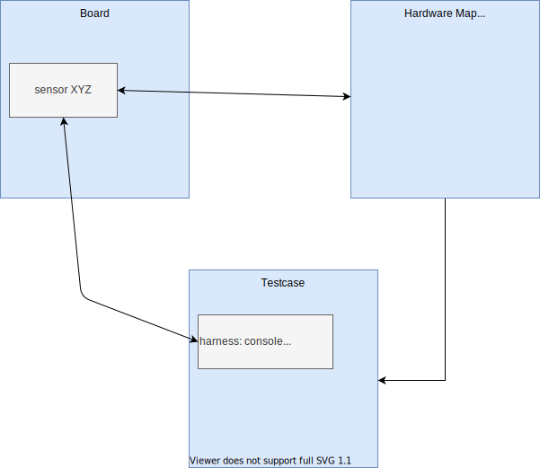

.. _twister_script:

Test Runner (Twister)
#####################

This script scans for the set of unit test applications in the git repository
and attempts to execute them. By default, it tries to build each test
case on boards marked as default in the board definition file.

The default options will build the majority of the tests on a defined set of
boards and will run in an emulated environment if available for the
architecture or configuration being tested.

In normal use, twister runs a limited set of kernel tests (inside
an emulator).  Because of its limited test execution coverage, twister
cannot guarantee local changes will succeed in the full build
environment, but it does sufficient testing by building samples and
tests for different boards and different configurations to help keep the
complete code tree buildable.

When using (at least) one ``-v`` option, twister's console output
shows for every test how the test is run (qemu, native_sim, etc.) or
whether the binary was just built.  There are a few reasons why twister
only builds a test and doesn't run it:

- The test is marked as ``build_only: true`` in its ``.yaml``
  configuration file.
- The test configuration has defined a ``harness`` but you don't have
  it or haven't set it up.
- The target device is not connected and not available for flashing
- You or some higher level automation invoked twister with
  ``--build-only``.

To run the script in the local tree, follow the steps below:

.. tabs::

   .. group-tab:: Linux

      .. code-block:: bash

         $ source zephyr-env.sh
         $ ./scripts/twister

   .. group-tab:: Windows

      .. code-block:: bat

         zephyr-env.cmd
         python .\scripts\twister

If you have a system with a large number of cores and plenty of free storage space,
you can build and run all possible tests using the following options:

.. tabs::

   .. group-tab:: Linux

      .. code-block:: bash

         $ ./scripts/twister --all --enable-slow

   .. group-tab:: Windows

      .. code-block:: bat

         python .\scripts\twister --all --enable-slow

This will build for all available boards and run all applicable tests in
a simulated (for example QEMU) environment.

If you want to run tests on one or more specific platforms, you can use
the ``--platform`` option, it is a platform filter for testing, with this
option, test suites will only be built/run on the platforms specified.
This option also supports different revisions of one same board,
you can use ``--platform board@revision`` to test on a specific revision.

The list of command line options supported by twister can be viewed using:

.. tabs::

   .. group-tab:: Linux

      .. code-block:: bash

         $ ./scripts/twister --help

   .. group-tab:: Windows

      .. code-block:: bat

         python .\scripts\twister --help

Board Configuration
*******************

To build tests for a specific board and to execute some of the tests on real
hardware or in an emulation environment such as QEMU a board configuration file
is required which is generic enough to be used for other tasks that require a
board inventory with details about the board and its configuration that is only
available during build time otherwise.

The board metadata file is located in the board directory and is structured
using the YAML markup language. The example below shows a board with a data
required for best test coverage for this specific board:

.. code-block:: yaml

  identifier: frdm_k64f
  name: NXP FRDM-K64F
  type: mcu
  arch: arm
  toolchain:
    - zephyr
    - gnuarmemb
    - xtools
  supported:
    - arduino_gpio
    - arduino_i2c
    - netif:eth
    - adc
    - i2c
    - nvs
    - spi
    - gpio
    - usb_device
    - watchdog
    - can
    - pwm
  testing:
    default: true

identifier:
  A string that matches how the board is defined in the build system. This same
  string is used when building, for example when calling ``west build`` or
  ``cmake``:

  .. code-block:: console

     # with west
     west build -b reel_board
     # with cmake
     cmake -DBOARD=reel_board ..

name:
  The actual name of the board as it appears in marketing material.
type:
  Type of the board or configuration, currently we support 2 types: mcu, qemu
simulation:
  Simulator used to simulate the platform, e.g. qemu.
arch:
  Architecture of the board
toolchain:
  The list of supported toolchains that can build this board. This should match
  one of the values used for :envvar:`ZEPHYR_TOOLCHAIN_VARIANT` when building on the command line
ram:
  Available RAM on the board (specified in KB). This is used to match testcase
  requirements.  If not specified we default to 128KB.
flash:
  Available FLASH on the board (specified in KB). This is used to match testcase
  requirements.  If not specified we default to 512KB.
supported:
  A list of features this board supports. This can be specified as a single word
  feature or as a variant of a feature class. For example:

  .. code-block:: yaml

        supported:
          - pci

  This indicates the board does support PCI. You can make a testcase build or
  run only on such boards, or:

  .. code-block:: yaml

        supported:
          - netif:eth
          - sensor:bmi16

  A testcase can both depend on 'eth' to only test ethernet or on 'netif' to run
  on any board with a networking interface.

testing:
  testing relating keywords to provide best coverage for the features of this
  board.

  default: [True|False]:
    This is a default board, it will tested with the highest priority and is
    covered when invoking the simplified twister without any additional
    arguments.
  ignore_tags:
    Do not attempt to build (and therefore run) tests marked with this list of
    tags.
  only_tags:
    Only execute tests with this list of tags on a specific platform.

  .. _twister_board_timeout_multiplier:

  timeout_multiplier: <float> (default 1)
    Multiply each test case timeout by specified ratio. This option allows to tune timeouts only
    for required platform. It can be useful in case naturally slow platform I.e.: HW board with
    power-efficient but slow CPU or simulation platform which can perform instruction accurate
    simulation but does it slowly.

Test Cases
**********

Test cases are detected by the presence of a ``testcase.yaml`` or a ``sample.yaml``
files in the application's project directory. This file may contain one or more
entries in the test section each identifying a test scenario.

The name of each testcase needs to be unique in the context of the overall
testsuite and has to follow basic rules:

#. The format of the test identifier shall be a string without any spaces or
   special characters (allowed characters: alphanumeric and [\_=]) consisting
   of multiple sections delimited with a dot (.).

#. Each test identifier shall start with a section followed by a subsection
   separated by a dot. For example, a test that covers semaphores in the kernel
   shall start with ``kernel.semaphore``.

#. All test identifiers within a testcase.yaml file need to be unique. For
   example a testcase.yaml file covering semaphores in the kernel can have:

   * ``kernel.semaphore``: For general semaphore tests
   * ``kernel.semaphore.stress``: Stress testing semaphores in the kernel.

#. Depending on the nature of the test, an identifier can consist of at least
   two sections:

   * Ztest tests: The individual testcases in the ztest testsuite will be
     concatenated to identifier in the testcase.yaml file generating unique
     identifiers for every testcase in the suite.

   * Standalone tests and samples: This type of test should at least have 3
     sections in the test identifier in the testcase.yaml (or sample.yaml) file.
     The last section of the name shall signify the test itself.

Test cases are written using the YAML syntax and share the same structure as
samples. The following is an example test with a few options that are
explained in this document.

  .. code-block:: yaml

        tests:
          bluetooth.gatt:
            build_only: true
            platform_allow: qemu_cortex_m3 qemu_x86
            tags: bluetooth
          bluetooth.gatt.br:
            build_only: true
            extra_args: CONF_FILE="prj_br.conf"
            filter: not CONFIG_DEBUG
            platform_exclude: up_squared
            platform_allow: qemu_cortex_m3 qemu_x86
            tags: bluetooth

A sample with tests will have the same structure with additional information
related to the sample and what is being demonstrated:

  .. code-block:: yaml

        sample:
          name: hello world
          description: Hello World sample, the simplest Zephyr application
        tests:
          sample.basic.hello_world:
            build_only: true
            tags: tests
            min_ram: 16
          sample.basic.hello_world.singlethread:
            build_only: true
            extra_args: CONF_FILE=prj_single.conf
            filter: not CONFIG_BT
            tags: tests
            min_ram: 16

The full canonical name for each test case is:``<path to test case>/<test entry>``

Each test block in the testcase meta data can define the following key/value
pairs:

tags: <list of tags> (required)
    A set of string tags for the testcase. Usually pertains to
    functional domains but can be anything. Command line invocations
    of this script can filter the set of tests to run based on tag.

skip: <True|False> (default False)
    skip testcase unconditionally. This can be used for broken tests.

slow: <True|False> (default False)
    Don't run this test case unless ``--enable-slow`` or ``--enable-slow-only`` was
    passed in on the command line. Intended for time-consuming test cases that
    are only run under certain circumstances, like daily builds. These test
    cases are still compiled.

extra_args: <list of extra arguments>
    Extra arguments to pass to Make when building or running the
    test case.

extra_configs: <list of extra configurations>
    Extra configuration options to be merged with a master prj.conf
    when building or running the test case. For example:

    .. code-block:: yaml

        common:
          tags: drivers adc
        tests:
          test:
            depends_on: adc
          test_async:
            extra_configs:
              - CONFIG_ADC_ASYNC=y

    Using namespacing, it is possible to apply a configuration only to some
    hardware. Currently both architectures and platforms are supported:

    .. code-block:: yaml

        common:
          tags: drivers adc
        tests:
          test:
            depends_on: adc
          test_async:
            extra_configs:
              - arch:x86:CONFIG_ADC_ASYNC=y
              - platform:qemu_x86:CONFIG_DEBUG=y

build_only: <True|False> (default False)
    If true, twister will not try to run the test even if the test is runnable
    on the platform.

    This keyword is reserved for tests that are used to test if some code
    actually builds. A ``build_only`` test is not designed to be run in any
    environment and should not be testing any functionality, it only verifies
    that the code builds.

    This option is often used to test drivers and the fact that they are correctly
    enabled in Zephyr and that the code builds, for example sensor drivers. Such
    test shall not be used to verify the functionality of the driver.

build_on_all: <True|False> (default False)
    If true, attempt to build test on all available platforms. This is mostly
    used in CI for increased coverage. Do not use this flag in new tests.

depends_on: <list of features>
    A board or platform can announce what features it supports, this option
    will enable the test only those platforms that provide this feature.

levels: <list of levels>
    Test levels this test should be part of. If a level is present, this
    test will be selectable using the command line option ``--level <level name>``

min_ram: <integer>
    minimum amount of RAM in KB needed for this test to build and run. This is
    compared with information provided by the board metadata.

min_flash: <integer>
    minimum amount of ROM in KB needed for this test to build and run. This is
    compared with information provided by the board metadata.

.. _twister_test_case_timeout:

timeout: <number of seconds>
    Length of time to run test before automatically killing it.
    Default to 60 seconds.

arch_allow: <list of arches, such as x86, arm, arc>
    Set of architectures that this test case should only be run for.

arch_exclude: <list of arches, such as x86, arm, arc>
    Set of architectures that this test case should not run on.

platform_allow: <list of platforms>
    Set of platforms that this test case should only be run for. Do not use
    this option to limit testing or building in CI due to time or resource
    constraints, this option should only be used if the test or sample can
    only be run on the allowed platform and nothing else.

integration_platforms: <YML list of platforms/boards>
    This option limits the scope to the listed platforms when twister is
    invoked with the ``--integration`` option. Use this instead of
    platform_allow if the goal is to limit scope due to timing or
    resource constraints.

platform_exclude: <list of platforms>
    Set of platforms that this test case should not run on.

extra_sections: <list of extra binary sections>
    When computing sizes, twister will report errors if it finds
    extra, unexpected sections in the Zephyr binary unless they are named
    here. They will not be included in the size calculation.

sysbuild: <True|False> (default False)
    Build the project using sysbuild infrastructure. Only the main project's
    generated devicetree and Kconfig will be used for filtering tests.
    on device testing must use the hardware map, or west flash to load
    the images onto the target. The ``--erase`` option of west flash is
    not supported with this option. Usage of unsupported options will result
    in tests requiring sysbuild support being skipped.

harness: <string>
    A harness keyword in the ``testcase.yaml`` file identifies a Twister
    harness needed to run a test successfully. A harness is a feature of
    Twister and implemented by Twister, some harnesses are defined as
    placeholders and have no implementation yet.

    A harness can be seen as the handler that needs to be implemented in
    Twister to be able to evaluate if a test passes criteria. For example, a
    keyboard harness is set on tests that require keyboard interaction to reach
    verdict on whether a test has passed or failed, however, Twister lack this
    harness implementation at the moment.

    Supported harnesses:

    - ztest
    - test
    - console
    - pytest
    - gtest
    - robot

    Harnesses ``ztest``, ``gtest`` and ``console`` are based on parsing of the
    output and matching certain phrases. ``ztest`` and ``gtest`` harnesses look
    for pass/fail/etc. frames defined in those frameworks. Use ``gtest``
    harness if you've already got tests written in the gTest framework and do
    not wish to update them to zTest. The ``console`` harness tells Twister to
    parse a test's text output for a regex defined in the test's YAML file.
    The ``robot`` harness is used to execute Robot Framework test suites
    in the Renode simulation framework.

    Some widely used harnesses that are not supported yet:

    - keyboard
    - net
    - bluetooth

    Harness ``bsim`` is implemented in limited way - it helps only to copy the
    final executable (``zephyr.exe``) from build directory to BabbleSim's
    ``bin`` directory (``${BSIM_OUT_PATH}/bin``). This action is useful to allow
    BabbleSim's tests to directly run after. By default, the executable file
    name is (with dots and slashes replaced by underscores):
    ``bs_<platform_name>_<test_path>_<test_scenario_name>``.
    This name can be overridden with the ``bsim_exe_name`` option in
    ``harness_config`` section.

platform_key: <list of platform attributes>
    Often a test needs to only be built and run once to qualify as passing.
    Imagine a library of code that depends on the platform architecture where
    passing the test on a single platform for each arch is enough to qualify the
    tests and code as passing. The platform_key attribute enables doing just
    that.

    For example to key on (arch, simulation) to ensure a test is run once
    per arch and simulation (as would be most common):

    .. code-block:: yaml

      platform_key:
        - arch
        - simulation

    Adding platform (board) attributes to include things such as soc name,
    soc family, and perhaps sets of IP blocks implementing each peripheral
    interface would enable other interesting uses. For example, this could enable
    building and running SPI tests once for each unique IP block.

harness_config: <harness configuration options>
    Extra harness configuration options to be used to select a board and/or
    for handling generic Console with regex matching. Config can announce
    what features it supports. This option will enable the test to run on
    only those platforms that fulfill this external dependency.

    The following options are currently supported:

    type: <one_line|multi_line> (required)
        Depends on the regex string to be matched

    regex: <list of regular expressions> (required)
        Strings with regular expressions to match with the test's output
        to confirm the test runs as expected.

    ordered: <True|False> (default False)
        Check the regular expression strings in orderly or randomly fashion

    repeat: <integer>
        Number of times to validate the repeated regex expression

    record: <recording options> (optional)
      regex: <regular expression> (required)
        The regular expression with named subgroups to match data fields
        at the test's output lines where the test provides some custom data
        for further analysis. These records will be written into the build
        directory 'recording.csv' file as well as 'recording' property
        of the test suite object in 'twister.json'.

        For example, to extract three data fields 'metric', 'cycles', 'nanoseconds':

        .. code-block:: yaml

          record:
            regex: "(?P<metric>.*):(?P<cycles>.*) cycles, (?P<nanoseconds>.*) ns"

    fixture: <expression>
        Specify a test case dependency on an external device(e.g., sensor),
        and identify setups that fulfill this dependency. It depends on
        specific test setup and board selection logic to pick the particular
        board(s) out of multiple boards that fulfill the dependency in an
        automation setup based on ``fixture`` keyword. Some sample fixture names
        are i2c_hts221, i2c_bme280, i2c_FRAM, ble_fw and gpio_loop.

        Only one fixture can be defined per testcase and the fixture name has to
        be unique across all tests in the test suite.

.. _pytest_root:

    pytest_root: <list of pytest testpaths> (default pytest)
        Specify a list of pytest directories, files or subtests that need to be
        executed when a test case begins to run. The default pytest directory is
        ``pytest``. After the pytest run is finished, Twister will check if
        the test case passed or failed according to the pytest report.
        As an example, a list of valid pytest roots is presented below:

        .. code-block:: yaml

            harness_config:
              pytest_root:
                - "pytest/test_shell_help.py"
                - "../shell/pytest/test_shell.py"
                - "/tmp/test_shell.py"
                - "~/tmp/test_shell.py"
                - "$ZEPHYR_BASE/samples/subsys/testsuite/pytest/shell/pytest/test_shell.py"
                - "pytest/test_shell_help.py::test_shell2_sample"  # select pytest subtest
                - "pytest/test_shell_help.py::test_shell2_sample[param_a]"  # select pytest parametrized subtest

.. _pytest_args:

    pytest_args: <list of arguments> (default empty)
        Specify a list of additional arguments to pass to ``pytest`` e.g.:
        ``pytest_args: [‘-k=test_method’, ‘--log-level=DEBUG’]``. Note that
        ``--pytest-args`` can be passed multiple times to pass several arguments
        to the pytest.

.. _pytest_dut_scope:

    pytest_dut_scope: <function|class|module|package|session> (default function)
        The scope for which ``dut`` and ``shell`` pytest fixtures are shared.
        If the scope is set to ``function``, DUT is launched for every test case
        in python script. For ``session`` scope, DUT is launched only once.

    robot_test_path: <robot file path> (default empty)
        Specify a path to a file containing a Robot Framework test suite to be run.

    bsim_exe_name: <string>
        If provided, the executable filename when copying to BabbleSim's bin
        directory, will be ``bs_<platform_name>_<bsim_exe_name>`` instead of the
        default based on the test path and scenario name.

    The following is an example yaml file with a few harness_config options.

    .. code-block:: yaml

         sample:
           name: HTS221 Temperature and Humidity Monitor
         common:
           tags: sensor
           harness: console
           harness_config:
             type: multi_line
             ordered: false
             regex:
               - "Temperature:(.*)C"
               - "Relative Humidity:(.*)%"
             fixture: i2c_hts221
         tests:
           test:
             tags: sensors
             depends_on: i2c

    The following is an example yaml file with pytest harness_config options,
    default pytest_root name "pytest" will be used if pytest_root not specified.
    please refer the examples in samples/subsys/testsuite/pytest/.

    .. code-block:: yaml

        common:
          harness: pytest
        tests:
          pytest.example.directories:
            harness_config:
              pytest_root:
                - pytest_dir1
                - $ENV_VAR/samples/test/pytest_dir2
          pytest.example.files_and_subtests:
            harness_config:
              pytest_root:
                - pytest/test_file_1.py
                - test_file_2.py::test_A
                - test_file_2.py::test_B[param_a]

    The following is an example yaml file with robot harness_config options.

    .. code-block:: yaml

        tests:
          robot.example:
            harness: robot
            harness_config:
              robot_test_path: [robot file path]

filter: <expression>
    Filter whether the testcase should be run by evaluating an expression
    against an environment containing the following values:

    .. code-block:: none

            { ARCH : <architecture>,
              PLATFORM : <platform>,
              <all CONFIG_* key/value pairs in the test's generated defconfig>,
              *<env>: any environment variable available
            }

    Twister will first evaluate the expression to find if a "limited" cmake call, i.e. using package_helper cmake script,
    can be done. Existence of "dt_*" entries indicates devicetree is needed.
    Existence of "CONFIG*" entries indicates kconfig is needed.
    If there are no other types of entries in the expression a filtration can be done without creating a complete build system.
    If there are entries of other types a full cmake is required.

    The grammar for the expression language is as follows:

    .. code-block:: antlr

        expression : expression 'and' expression
                   | expression 'or' expression
                   | 'not' expression
                   | '(' expression ')'
                   | symbol '==' constant
                   | symbol '!=' constant
                   | symbol '<' NUMBER
                   | symbol '>' NUMBER
                   | symbol '>=' NUMBER
                   | symbol '<=' NUMBER
                   | symbol 'in' list
                   | symbol ':' STRING
                   | symbol
                   ;

        list : '[' list_contents ']';

        list_contents : constant (',' constant)*;

        constant : NUMBER | STRING;

    For the case where ``expression ::= symbol``, it evaluates to ``true``
    if the symbol is defined to a non-empty string.

    Operator precedence, starting from lowest to highest:

       * or (left associative)
       * and (left associative)
       * not (right associative)
       * all comparison operators (non-associative)

    ``arch_allow``, ``arch_exclude``, ``platform_allow``, ``platform_exclude``
    are all syntactic sugar for these expressions. For instance:

    .. code-block:: none

        arch_exclude = x86 arc

    Is the same as:

    .. code-block:: none

        filter = not ARCH in ["x86", "arc"]

    The ``:`` operator compiles the string argument as a regular expression,
    and then returns a true value only if the symbol's value in the environment
    matches. For example, if ``CONFIG_SOC="stm32f107xc"`` then

    .. code-block:: none

        filter = CONFIG_SOC : "stm.*"

    Would match it.

required_snippets: <list of needed snippets>
    :ref:`Snippets <snippets>` are supported in twister for test cases that
    require them. As with normal applications, twister supports using the base
    zephyr snippet directory and test application directory for finding
    snippets. Listed snippets will filter supported tests for boards (snippets
    must be compatible with a board for the test to run on them, they are not
    optional).

    The following is an example yaml file with 2 required snippets.

    .. code-block:: yaml

        tests:
          snippet.example:
            required_snippets:
              - cdc-acm-console
              - user-snippet-example

The set of test cases that actually run depends on directives in the testcase
filed and options passed in on the command line. If there is any confusion,
running with ``-v`` or examining the discard report
(:file:`twister_discard.csv`) can help show why particular test cases were
skipped.

Metrics (such as pass/fail state and binary size) for the last code
release are stored in ``scripts/release/twister_last_release.csv``.
To update this, pass the ``--all --release`` options.

To load arguments from a file, add ``+`` before the file name, e.g.,
``+file_name``. File content must be one or more valid arguments separated by
line break instead of white spaces.

Most everyday users will run with no arguments.

Managing tests timeouts
***********************

There are several parameters which control tests timeouts on various levels:

* ``timeout`` option in each test case. See :ref:`here <twister_test_case_timeout>` for more
  details.
* ``timeout_multiplier`` option in board configuration. See
  :ref:`here <twister_board_timeout_multiplier>` for more details.
* ``--timeout-multiplier`` twister option which can be used to adjust timeouts in exact twister run.
  It can be useful in case of simulation platform as simulation time may depend on the host
  speed & load or we may select different simulation method (i.e. cycle accurate but slower
  one), etc...

Overall test case timeout is a multiplication of these three parameters.

Running in Integration Mode
***************************

This mode is used in continuous integration (CI) and other automated
environments used to give developers fast feedback on changes. The mode can
be activated using the ``--integration`` option of twister and narrows down
the scope of builds and tests if applicable to platforms defined under the
integration keyword in the testcase definition file (testcase.yaml and
sample.yaml).

Running tests on custom emulator
********************************

Apart from the already supported QEMU and other simulated environments, Twister
supports running any out-of-tree custom emulator defined in the board's :file:`board.cmake`.
To use this type of simulation, add the following properties to
:file:`custom_board/custom_board.yaml`:

.. code-block:: yaml

   simulation: custom
   simulation_exec: <name_of_emu_binary>

This tells Twister that the board is using a custom emulator called ``<name_of_emu_binary>``,
make sure this binary exists in the PATH.

Then, in :file:`custom_board/board.cmake`, set the supported emulation platforms to ``custom``:

.. code-block:: cmake

   set(SUPPORTED_EMU_PLATFORMS custom)

Finally, implement the ``run_custom`` target in :file:`custom_board/board.cmake`.
It should look something like this:

.. code-block:: cmake

   add_custom_target(run_custom
     COMMAND
     <name_of_emu_binary to invoke during 'run'>
     <any args to be passed to the command, i.e. ${BOARD}, ${APPLICATION_BINARY_DIR}/zephyr/zephyr.elf>
     WORKING_DIRECTORY ${APPLICATION_BINARY_DIR}
     DEPENDS ${logical_target_for_zephyr_elf}
     USES_TERMINAL
     )

Running Tests on Hardware
*************************

Beside being able to run tests in QEMU and other simulated environments,
twister supports running most of the tests on real devices and produces
reports for each run with detailed FAIL/PASS results.

Executing tests on a single device
===================================

To use this feature on a single connected device, run twister with
the following new options:

.. tabs::

   .. group-tab:: Linux

      .. code-block:: bash

	      scripts/twister --device-testing --device-serial /dev/ttyACM0 \
	      --device-serial-baud 115200 -p frdm_k64f  -T tests/kernel

   .. group-tab:: Windows

      .. code-block:: bat

	      python .\scripts\twister --device-testing --device-serial COM1 \
	      --device-serial-baud 115200 -p frdm_k64f  -T tests/kernel

The ``--device-serial`` option denotes the serial device the board is connected to.
This needs to be accessible by the user running twister. You can run this on
only one board at a time, specified using the ``--platform`` option.

The ``--device-serial-baud`` option is only needed if your device does not run at
115200 baud.

To support devices without a physical serial port, use the ``--device-serial-pty``
option. In this cases, log messages are captured for example using a script.
In this case you can run twister with the following options:

.. tabs::

   .. group-tab:: Linux

      .. code-block:: bash

         scripts/twister --device-testing --device-serial-pty "script.py" \
         -p intel_adsp/cavs25 -T tests/kernel

   .. group-tab:: Windows

      .. note::

         Not supported on Windows OS

The script is user-defined and handles delivering the messages which can be
used by twister to determine the test execution status.

The ``--device-flash-timeout`` option allows to set explicit timeout on the
device flash operation, for example when device flashing takes significantly
large time.

The ``--device-flash-with-test`` option indicates that on the platform
the flash operation also executes a test case, so the flash timeout is
increased by a test case timeout.

Executing tests on multiple devices
===================================

To build and execute tests on multiple devices connected to the host PC, a
hardware map needs to be created with all connected devices and their
details such as the serial device, baud and their IDs if available.
Run the following command to produce the hardware map:

.. tabs::

   .. group-tab:: Linux

      .. code-block:: bash

         ./scripts/twister --generate-hardware-map map.yml

   .. group-tab:: Windows

      .. code-block:: bat

         python .\scripts\twister --generate-hardware-map map.yml

The generated hardware map file (map.yml) will have the list of connected
devices, for example:

.. tabs::

   .. group-tab:: Linux

      .. code-block:: yaml

         - connected: true
           id: OSHW000032254e4500128002ab98002784d1000097969900
           platform: unknown
           product: DAPLink CMSIS-DAP
           runner: pyocd
           serial: /dev/cu.usbmodem146114202
         - connected: true
           id: 000683759358
           platform: unknown
           product: J-Link
           runner: unknown
           serial: /dev/cu.usbmodem0006837593581

   .. group-tab:: Windows

      .. code-block:: yaml

         - connected: true
           id: OSHW000032254e4500128002ab98002784d1000097969900
           platform: unknown
           product: unknown
           runner: unknown
           serial: COM1
         - connected: true
           id: 000683759358
           platform: unknown
           product: unknown
           runner: unknown
           serial: COM2

Any options marked as ``unknown`` need to be changed and set with the correct
values, in the above example the platform names, the products and the runners need
to be replaced with the correct values corresponding to the connected hardware.
In this example we are using a reel_board and an nrf52840dk/nrf52840:

.. tabs::

   .. group-tab:: Linux

      .. code-block:: yaml

         - connected: true
           id: OSHW000032254e4500128002ab98002784d1000097969900
           platform: reel_board
           product: DAPLink CMSIS-DAP
           runner: pyocd
           serial: /dev/cu.usbmodem146114202
           baud: 9600
         - connected: true
           id: 000683759358
           platform: nrf52840dk/nrf52840
           product: J-Link
           runner: nrfjprog
           serial: /dev/cu.usbmodem0006837593581
           baud: 9600

   .. group-tab:: Windows

      .. code-block:: yaml

         - connected: true
           id: OSHW000032254e4500128002ab98002784d1000097969900
           platform: reel_board
           product: DAPLink CMSIS-DAP
           runner: pyocd
           serial: COM1
           baud: 9600
         - connected: true
           id: 000683759358
           platform: nrf52840dk/nrf52840
           product: J-Link
           runner: nrfjprog
           serial: COM2
           baud: 9600

The baud entry is only needed if not running at 115200.

If the map file already exists, then new entries are added and existing entries
will be updated. This way you can use one single master hardware map and update
it for every run to get the correct serial devices and status of the devices.

With the hardware map ready, you can run any tests by pointing to the map

.. tabs::

   .. group-tab:: Linux

      .. code-block:: bash

         ./scripts/twister --device-testing --hardware-map map.yml -T samples/hello_world/

   .. group-tab:: Windows

      .. code-block:: bat

         python .\scripts\twister --device-testing --hardware-map map.yml -T samples\hello_world

The above command will result in twister building tests for the platforms
defined in the hardware map and subsequently flashing and running the tests
on those platforms.

.. note::

  Currently only boards with support for pyocd, nrfjprog, jlink, openocd, or dediprog
  are supported with the hardware map features. Boards that require other runners to flash the
  Zephyr binary are still work in progress.

Hardware map allows to set ``--device-flash-timeout`` and ``--device-flash-with-test``
command line options as ``flash-timeout`` and ``flash-with-test`` fields respectively.
These hardware map values override command line options for the particular platform.

Serial PTY support using ``--device-serial-pty``  can also be used in the
hardware map:

.. code-block:: yaml

   - connected: true
     id: None
     platform: intel_adsp/cavs25
     product: None
     runner: intel_adsp
     serial_pty: path/to/script.py
     runner_params:
       - --remote-host=remote_host_ip_addr
       - --key=/path/to/key.pem

The runner_params field indicates the parameters you want to pass to the
west runner. For some boards the west runner needs some extra parameters to
work. It is equivalent to following west and twister commands.

.. tabs::

   .. group-tab:: Linux

      .. code-block:: bash

         west flash --remote-host remote_host_ip_addr --key /path/to/key.pem

         twister -p intel_adsp/cavs25 --device-testing --device-serial-pty script.py
         --west-flash="--remote-host=remote_host_ip_addr,--key=/path/to/key.pem"

   .. group-tab:: Windows

      .. note::

         Not supported on Windows OS

.. note::

  For serial PTY, the "--generate-hardware-map" option cannot scan it out
  and generate a correct hardware map automatically. You have to edit it
  manually according to above example. This is because the serial port
  of the PTY is not fixed and being allocated in the system at runtime.

Fixtures
+++++++++

Some tests require additional setup or special wiring specific to the test.
Running the tests without this setup or test fixture may fail. A testcase can
specify the fixture it needs which can then be matched with hardware capability
of a board and the fixtures it supports via the command line or using the hardware
map file.

Fixtures are defined in the hardware map file as a list:

.. code-block:: yaml

      - connected: true
        fixtures:
          - gpio_loopback
        id: 0240000026334e450015400f5e0e000b4eb1000097969900
        platform: frdm_k64f
        product: DAPLink CMSIS-DAP
        runner: pyocd
        serial: /dev/ttyACM9

When running ``twister`` with ``--device-testing``, the configured fixture
in the hardware map file will be matched to testcases requesting the same fixtures
and these tests will be executed on the boards that provide this fixture.

Fixtures can also be provided via twister command option ``--fixture``, this option
can be used multiple times and all given fixtures will be appended as a list. And the
given fixtures will be assigned to all boards, this means that all boards set by
current twister command can run those testcases which request the same fixtures.

Notes
+++++

It may be useful to annotate board descriptions in the hardware map file
with additional information.  Use the ``notes`` keyword to do this.  For
example:

.. code-block:: yaml

    - connected: false
      fixtures:
        - gpio_loopback
      id: 000683290670
      notes: An nrf5340dk/nrf5340 is detected as an nrf52840dk/nrf52840 with no serial
        port, and three serial ports with an unknown platform.  The board id of the serial
        ports is not the same as the board id of the development kit.  If you regenerate
        this file you will need to update serial to reference the third port, and platform
        to nrf5340dk/nrf5340/cpuapp or another supported board target.
      platform: nrf52840dk/nrf52840
      product: J-Link
      runner: jlink
      serial: null

Overriding Board Identifier
+++++++++++++++++++++++++++

When (re-)generated the hardware map file will contain an ``id`` keyword
that serves as the argument to ``--board-id`` when flashing.  In some
cases the detected ID is not the correct one to use, for example when
using an external J-Link probe.  The ``probe_id`` keyword overrides the
``id`` keyword for this purpose.   For example:

.. code-block:: yaml

    - connected: false
      id: 0229000005d9ebc600000000000000000000000097969905
      platform: mimxrt1060_evk
      probe_id: 000609301751
      product: DAPLink CMSIS-DAP
      runner: jlink
      serial: null

Quarantine
++++++++++

Twister allows user to provide configuration files defining a list of tests or
platforms to be put under quarantine. Such tests will be skipped and marked
accordingly in the output reports. This feature is especially useful when
running larger test suits, where a failure of one test can affect the execution
of other tests (e.g. putting the physical board in a corrupted state).

To use the quarantine feature one has to add the argument
``--quarantine-list <PATH_TO_QUARANTINE_YAML>`` to a twister call.
Multiple quarantine files can be used.
The current status of tests on the quarantine list can also be verified by adding
``--quarantine-verify`` to the above argument. This will make twister skip all tests
which are not on the given list.

A quarantine yaml has to be a sequence of dictionaries. Each dictionary has to have
``scenarios`` and ``platforms`` entries listing combinations of scenarios and platforms
to put under quarantine. In addition, an optional entry ``comment`` can be used, where
some more details can be given (e.g. link to a reported issue). These comments will also
be added to the output reports.

When quarantining a class of tests or many scenarios in a single testsuite or
when dealing with multiple issues within a subsystem, it is possible to use
regular expressions, for example, **kernel.*** would quarantine
all kernel tests.

An example of entries in a quarantine yaml:

.. code-block:: yaml

    - scenarios:
        - sample.basic.helloworld
      comment: "Link to the issue: https://github.com/zephyrproject-rtos/zephyr/pull/33287"

    - scenarios:
        - kernel.common
        - kernel.common.(misra|tls)
        - kernel.common.nano64
      platforms:
        - .*_cortex_.*
        - native_sim

To exclude a platform, use the following syntax:

.. code-block:: yaml

    - platforms:
      - qemu_x86
      comment: "broken qemu"

Additionally you can quarantine entire architectures or a specific simulator for executing tests.

Test Configuration
******************

A test configuration can be used to customize various aspects of twister
and the default enabled options and features. This allows tweaking the filtering
capabilities depending on the environment and makes it possible to adapt and
improve coverage when targeting different sets of platforms.

The test configuration also adds support for test levels and the ability to
assign a specific test to one or more levels. Using command line options of
twister it is then possible to select a level and just execute the tests
included in this level.

Additionally, the test configuration allows defining level
dependencies and additional inclusion of tests into a specific level if
the test itself does not have this information already.

In the configuration file you can include complete components using
regular expressions and you can specify which test level to import from
the same file, making management of levels easier.

To help with testing outside of upstream CI infrastructure, additional
options are available in the configuration file, which can be hosted
locally. As of now, those options are available:

- Ability to ignore default platforms as defined in board definitions
  (Those are mostly emulation platforms used to run tests in upstream
  CI)
- Option to specify your own list of default platforms overriding what
  upstream defines.
- Ability to override `build_on_all` options used in some testcases.
  This will treat tests or sample as any other just build for default
  platforms you specify in the configuration file or on the command line.
- Ignore some logic in twister to expand platform coverage in cases where
  default platforms are not in scope.

Platform Configuration
======================

The following options control platform filtering in twister:

- `override_default_platforms`: override default key a platform sets in board
  configuration and instead use the list of platforms provided in the
  configuration file as the list of default platforms. This option is set to
  False by default.
- `increased_platform_scope`: This option is set to True by default, when
  disabled, twister will not increase platform coverage automatically and will
  only build and run tests on the specified platforms.
- `default_platforms`: A list of additional default platforms to add. This list
  can either be used to replace the existing default platforms or can extend it
  depending on the value of `override_default_platforms`.

And example platforms configuration:

.. code-block:: yaml

	platforms:
	  override_default_platforms: true
	  increased_platform_scope: false
	  default_platforms:
	    - qemu_x86

Test Level Configuration
========================

The test configuration allows defining test levels, level dependencies and
additional inclusion of tests into a specific test level if the test itself
does not have this information already.

In the configuration file you can include complete components using
regular expressions and you can specify which test level to import from
the same file, making management of levels simple.

And example test level configuration:

.. code-block:: yaml

	levels:
	  - name: my-test-level
	    description: >
	      my custom test level
	    adds:
	      - kernel.threads.*
	      - kernel.timer.behavior
	      - arch.interrupt
	      - boards.*

Combined configuration
======================

To mix the Platform and level configuration, you can take an example as below:

An example platforms plus level configuration:

.. code-block:: yaml

	platforms:
	  override_default_platforms: true
	  default_platforms:
	    - frdm_k64f
	levels:
	  - name: smoke
	    description: >
	        A plan to be used verifying basic zephyr features.
	  - name: unit
	    description: >
	        A plan to be used verifying unit test.
	  - name: integration
	    description: >
	        A plan to be used verifying integration.
	  - name: acceptance
	    description: >
	        A plan to be used verifying acceptance.
	  - name: system
	    description: >
	        A plan to be used verifying system.
	  - name: regression
	    description: >
	        A plan to be used verifying regression.

To run with above test_config.yaml file, only default_platforms with given test level
test cases will run.

.. tabs::

   .. group-tab:: Linux

      .. code-block:: bash

         scripts/twister --test-config=<path to>/test_config.yaml
          -T tests --level="smoke"

Running in Tests in Random Order
********************************
Enable ZTEST framework's :kconfig:option:`CONFIG_ZTEST_SHUFFLE` config option to
run your tests in random order.  This can be beneficial for identifying
dependencies between test cases. For native_sim platforms, you can provide
the seed to the random number generator by providing ``-seed=value`` as an
argument to twister. See :ref:`Shuffling Test Sequence <ztest_shuffle>` for more
details.

Robot Framework Tests
*********************
Zephyr supports `Robot Framework <https://robotframework.org/>`_ as one of solutions for automated testing.

Robot files allow you to express interactive test scenarios in human-readable text format and execute them in simulation or against hardware.
At this moment Zephyr integration supports running Robot tests in the `Renode <https://renode.io/>`_ simulation framework.

To execute a Robot test suite with twister, run the following command:

.. tabs::

   .. group-tab:: Linux

      .. code-block:: bash

         $ ./scripts/twister --platform hifive1 --test samples/subsys/shell/shell_module/sample.shell.shell_module.robot

   .. group-tab:: Windows

      .. code-block:: bat

         python .\scripts\twister --platform hifive1 --test samples/subsys/shell/shell_module/sample.shell.shell_module.robot

It's also possible to run it by `west` directly, with:

.. code-block:: bash

   $ ROBOT_FILES=shell_module.robot west build -p -b hifive1 -s samples/subsys/shell/shell_module -t run_renode_test

Writing Robot tests
===================

For the list of keywords provided by the Robot Framework itself, refer to `the official Robot documentation <https://robotframework.org/robotframework/>`_.

Information on writing and running Robot Framework tests in Renode can be found in `the testing section <https://renode.readthedocs.io/en/latest/introduction/testing.html>`_ of Renode documentation.
It provides a list of the most commonly used keywords together with links to the source code where those are defined.

It's possible to extend the framework by adding new keywords expressed directly in Robot test suite files, as an external Python library or, like Renode does it, dynamically via XML-RPC.
For details see the `extending Robot Framework <https://robotframework.org/robotframework/latest/RobotFrameworkUserGuide.html#extending-robot-framework>`_ section in the official Robot documentation.

Running a single testsuite
==========================

To run a single testsuite instead of a whole group of test you can run:

.. code-block:: bash

   $ twister -p qemu_riscv32 -s tests/kernel/interrupt/arch.shared_interrupt
