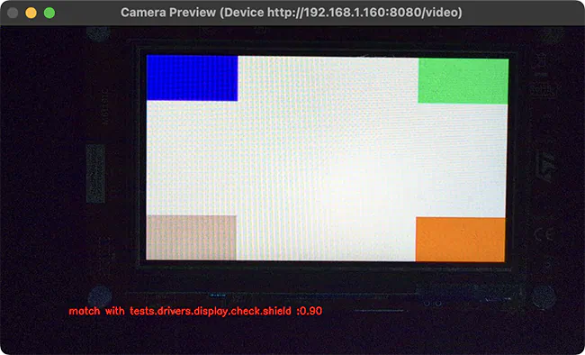

.. _twister_display_capture_harness:

Display capture
###############

The ``display_capture`` harness is used to verify display driver functionality by capturing and
analyzing display output using a camera. It integrates with pytest to perform automated visual
testing using video fingerprints.

         with a text overlay indicating a successful test match.

   Window being displayed for a "compare" run where fingerprint is a 90% match with the reference.

Hardware setup
==============

The display capture harness requires:

- UVC compatible camera with at least 2 megapixels (e.g., 1080p resolution)
- Light-blocking enclosure or black curtain to ensure consistent lighting
- PC host with camera connection for capturing display output
- DUT connected to the same PC for flashing and serial console access

Configuration
=============

The harness uses a YAML configuration file that defines camera settings, test parameters, and video
signature analysis options. A typical configuration is shown below:

.. code-block:: yaml
   :caption: display_config.yaml

    case_config:
      device_id: 0
      res_x: 1280
      res_y: 720
      fps: 30
      run_time: 20
    test:
      timeout: 30
      prompt: "screen starts"
      expect: ["tests.drivers.display.check.shield"]
    plugins:
      - name: signature
        module: plugins.signature_plugin
        class: VideoSignaturePlugin
        status: enable
        config:
          operations: "compare"  # or "generate"
          metadata:
            name: "tests.drivers.display.check.shield"
            platform: "frdm_mcxn947"
          directory: "./fingerprints"
          duration: 100
          method: "combined"
          threshold: 0.65
          phash_weight: 0.35
          dhash_weight: 0.25
          histogram_weight: 0.2
          edge_ratio_weight: 0.1
          gradient_hist_weight: 0.1

- ``case_config`` - This section defines to the general camera settings and duration of the test.

  - ``device_id`` - The camera device ID (defaults to 0). Any valid OpenCV camera identifier, which
    can be:

    - An integer for local cameras (use 0 for the first camera, 1 for the second, etc).
    - A device path string such as ``/dev/video0`` on Linux.
    - An IP video stream URL such as ``rtsp://192.168.1.100:8554/stream`` for network cameras.

  - ``res_x`` - The horizontal resolution of the camera (integer, defaults to 1280).
  - ``res_y`` - The vertical resolution of the camera (integer, defaults to 720).
  - ``fps`` - The frames per second of the camera (integer, defaults to 30).
  - ``run_time`` - The duration of the test in seconds (integer, defaults to 20).

- ``test`` - This section contains the test configuration for device interaction.

  - ``timeout`` - Maximum time in seconds to wait for the prompt to appear on the device UART
    output (integer, defaults to 30).
  - ``prompt`` - The string pattern to wait for in the device UART output before starting the
    display capture. This can be a regular expression (string, defaults to ``uart:~$``).
  - ``expect`` - A list of expected test result strings that must match the results returned by
    the application. The test passes if the captured results match this list (list of strings,
    defaults to ``['PASS']``).

- ``plugins`` - This section contains the configuration for the plugins processing the camera
  frames. Only the ``VideoSignaturePlugin`` plugin is currently supported, and it takes the
  following configuration options:

  - ``operations`` - The operation to perform when running the test (string). Must be set to either
    ``generate`` to capture fingerprints or ``compare`` to compare the captured fingerprints with
    the reference fingerprints.
  - ``metadata`` - Metadata information for fingerprint identification (optional).

    - ``name`` - Test case name identifier (string).
    - ``platform`` - Target platform identifier (string).

  - ``directory`` - The directory where the fingerprints are stored (string, defaults to
    ``./fingerprints``).
  - ``duration`` - The number of frames to analyze (integer). More frames takes longer but generate
    more accurate fingerprints).
  - ``method`` - The method used to generate display fingerprints (string, defaults to
    ``combined``). Must be set to either of the following values: ``phash``, ``dhash``,
    ``histogram``, or ``combined``.

    ``phash`` (Perceptual Hash)
      Captures overall visual structure and layout. Best for detecting major rendering issues, e.g.
      UI elements being positioned incorrectly.
    ``dhash`` (Difference Hash)
      Detects brightness patterns and gradients. Sensitive to contrast changes, e.g. brightness or
      contrast problems.
    ``histogram`` (Color Histogram)
      Analyzes color distribution. Fast at detecting obvious color problems, e.g. color swap bugs.
    ``combined`` (recommended method)
      Weights all methods together ( see :samp:`{method}_weight` option below ) for robust
      comparison. Provides balanced detection of both major and subtle visual issues.

  - ``threshold`` - The similarity score above which it is considered that there is a match between
    the reference and the captured fingerprints (optional float, defaults to 0.65).
  - ``phash_weight`` - The weight for the phash method (optional float, defaults to 0.35)
  - ``dhash_weight`` - The weight for the dhash method (optional float, defaults to 0.25)
  - ``histogram_weight`` - The weight for the histogram method (optional float, defaults to 0.2)
  - ``gradient_hist_weight`` - The weight for the gradient histogram method (optional float, defaults to 0.1)
  - ``edge_ratio_weight`` - The weight for the edge ratio method (optional float, defaults to 0.1)

The configuration file path is specified in the test's ``testcase.yaml`` via the
``display_capture_config`` harness configuration option using the :envvar:`DISPLAY_TEST_DIR`
environment variable:

.. code-block:: yaml

    harness: display_capture
    harness_config:
      pytest_dut_scope: session
      fixture: fixture_display
      display_capture_config: "${DISPLAY_TEST_DIR}/display_config.yaml"

Workflow
========

First, generate **reference fingerprints** for a known-good display output:

.. code-block:: bash

    # Build and flash the display test
    west build -b <board> tests/drivers/display/display_check
    west flash

    # Configure for fingerprint generation mode by setting the 'operations' field to 'generate'
    # in the configuration file.

    # Generate fingerprints
    export DISPLAY_TEST_DIR=<path-to-config-directory>
    west twister --device-testing --hardware-map map.yml \
        -T tests/drivers/display/display_check/

Fingerprints are stored in the directory specified in the ``directory`` field of the configuration
file, and organized by test name and platform as defined in the ``metadata`` field of the
configuration file.

Once the fingerprints have been generated, you can run the test(s) again, this time in **comparison
mode**:

.. code-block:: bash

    # Set the 'operations' field to 'compare' in the configuration file.

    export DISPLAY_TEST_DIR=<path-to-fingerprints-parent-directory>
    west twister --device-testing --hardware-map map.yml \
        -T tests/drivers/display/display_check/

The harness compares captured video against reference fingerprints using the configured signature
methods and thresholds. If the similarity score between reference and captured fingerprints exceeds
the configured ``threshold``, the test passes.

.. note::

   - The test name in the DUT's ``testcase.yaml`` must match the ``name`` field in the fingerprint's
     metadata configuration.
   - Multiple fingerprints can be stored in one directory for comprehensive validation, though this
     increases comparison time.
   - Fingerprints are specific to both the test scenario and platform.
