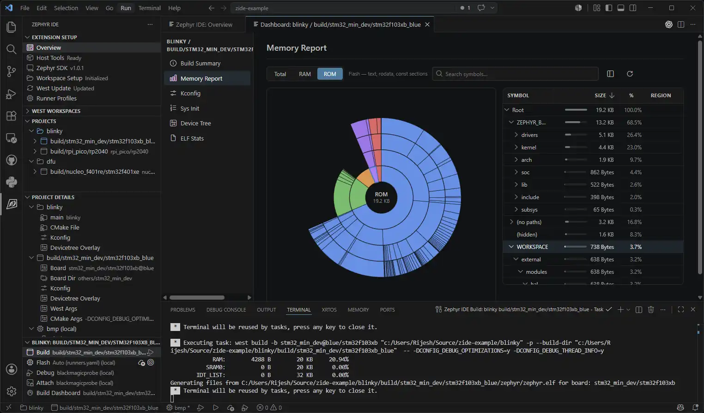

.. _ide_for_zephyr:

IDE for Zephyr
##############

`IDE for Zephyr`_ is a Visual Studio Code (VS Code) extension for Zephyr RTOS development.
It supports **host tool management**, **west workspace setup**, **SDK management**, **project
creation**, **build/flash**, and **debugging**.

Key features
************

- Integrate with Cortex-Debug for ST-Link, J-Link, OpenOCD, Black Magic Probe, and other
  probes via the built-in ``zephyr-ide-cortex`` and ``zephyr-ide-west`` debugger types that
  auto-resolve ELF, GDB, and runner paths
- Integrate with clangd or C/C++ for IntelliSense
- Explore memory usage, Kconfig, and devicetree from the Build Dashboard; view ROM and RAM
  as a sunburst chart without leaving VS Code
- Edit Kconfig options interactively with the built-in editor
- Add, run, and reconfigure Twister tests from the project panel
- Install native host tools (CMake, Python 3, Ninja, DTC, gcc, etc.) automatically on
  Linux, macOS, and Windows
- Install and manage Zephyr SDK versions and per-architecture toolchains
- Add projects from existing applications or Zephyr samples, with multiple builds and
  per-build board and configuration overrides
- Store project configuration in a version-controllable :file:`.vscode/zephyr-ide.json`, which
  can specify SDKs, packages, and blobs

Compatibility
*************

- Windows
- Linux
- macOS

Getting started
***************

#. Install the extension

   Install IDE for Zephyr from the `VS Code Marketplace`_ or the `Open VSX Registry`_.

   An extension pack bundling Cortex-Debug, C/C++, Serial Monitor, Devicetree LSP, and
   CMake support is also available on the `VS Code Marketplace (Extension Pack)`_ and
   the `Open VSX Registry (Extension Pack)`_.

#. Open the Overview Page and Install Host Tools

   Click the :guilabel:`Host Tools` card. The extension verifies that the required build
   dependencies (CMake, Python 3, Ninja, DTC, gcc, etc.) are on the PATH and can install any
   missing tools automatically.

#. Configure a West workspace

   Click the :guilabel:`Workspace` card and choose a setup method:

   - **IDE for Zephyr Workspace from Git** — clone a repository that already contains a
     pre-configured IDE for Zephyr workspace.
   - **West Workspace from Git** — clone an existing west-based Zephyr repository.
   - **Standard Workspace** — create a fresh workspace with a Python virtual environment,
     west installation, and Zephyr repository initialization.
   - **Open Current Directory** — adopt an existing :file:`.west` folder or link to an
     external Zephyr installation via :envvar:`ZEPHYR_BASE`.

   - This step also prompts you to install a Zephyr SDK if needed. You can manage SDKs later
     from the :guilabel:`Zephyr SDK` card on the Overview page.

   .. figure:: img/ide_for_zephyr_workspace_setup.webp
      :align: center
      :alt: Workspace setup options in IDE for Zephyr

#. Add a project and a build

   In the Project panel, click :guilabel:`Add Project` to add an existing application
   or copy a Zephyr sample as a starting point.

   After adding a project, click :guilabel:`Add Build` to create a build configuration.
   Select the target board and, optionally, a runner profile. Each project can have
   multiple builds targeting different boards or configurations.

#. Build and flash the application

   Use the status bar buttons or the :guilabel:`Project Build` panel to build, flash, or
   run a pristine build. Build output is shown in the integrated terminal.

#. Configure and run a debug session

   IDE for Zephyr ships a built-in ``zephyr-ide-west`` debugger type that reads
   :file:`runners.yaml` from the active build and translates it into a Cortex-Debug
   session automatically. No :file:`.vscode/launch.json` entry is required to get
   started. The ``zephyr-ide-west`` provider accepts the arguments you would pass to
   ``west debugserver``, while the ``zephyr-ide-cortex`` provider accepts the arguments you
   would pass to ``cortex-debug`` directly. You can also set up your own launch
   configuration and bind it to a build. The extension provides commands that can be
   resolved on launch.

   To add a launch configuration manually, use the minimal form:

   .. code-block:: json

      {
        "name": "Zephyr IDE: Debug",
        "type": "zephyr-ide-west",
        "request": "launch"
      }

   The built-in provider selects the runner from :file:`runners.yaml`, resolves the ELF
   and GDB paths, and forwards the session to Cortex-Debug.

Sharing project configuration
*****************************

Project settings, builds, runner profiles, Kconfig overlays, devicetree overlays, and
per-build west and CMake arguments are stored in :file:`.vscode/zephyr-ide.json`. The
file is human-readable and can be committed to version control so team members share the
same workspace configuration.

Useful links
************

- Explore the `Extension repository`_
- Read the `Full documentation`_
- Try the `Sample project`_

.. _IDE for Zephyr:
   https://marketplace.visualstudio.com/items?itemName=mylonics.zephyr-ide
.. _VS Code Marketplace:
   https://marketplace.visualstudio.com/items?itemName=mylonics.zephyr-ide
.. _Open VSX Registry:
   https://open-vsx.org/extension/mylonics/zephyr-ide
.. _VS Code Marketplace (Extension Pack):
   https://marketplace.visualstudio.com/items?itemName=mylonics.zephyr-ide-extension-pack
.. _Open VSX Registry (Extension Pack):
   https://open-vsx.org/extension/mylonics/zephyr-ide-extension-pack
.. _Extension repository: https://github.com/mylonics/zephyr-ide
.. _Full documentation: https://zephyr-ide.mylonics.com/
.. _Getting started video: https://www.youtube.com/watch?v=Asfolnh9kqM
.. _Sample project: https://github.com/mylonics/zephyr-ide-sample-project
