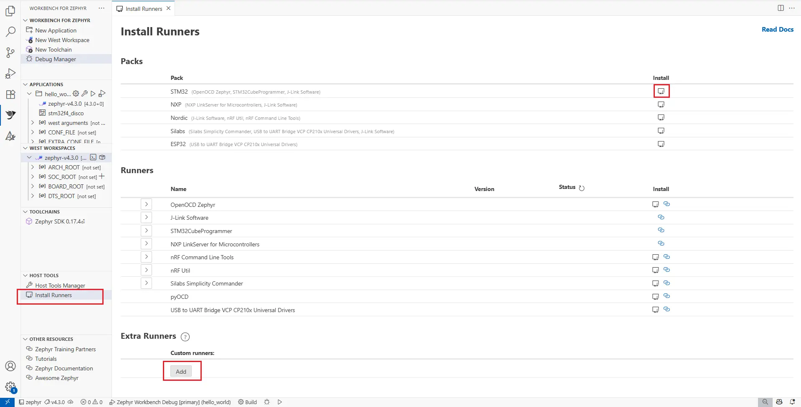

.. _workbench_for_zephyr:

Workbench for Zephyr (Visual Studio Code)
#########################################

Ac6 :guilabel:`Workbench for Zephyr` is a Visual Studio Code extension that adds Zephyr development support, including **SDK management**, **project wizard**, **build/flash**, and **debugging**.

Check the `Getting started tutorial`_ for a walkthrough.

Key features
************

- Install native :guilabel:`Host Tools` (python, cmake, ...)
- Install and assign Zephyr SDK
- Import West workspaces
- Create and import Zephyr applications
- Build and Flash applications
- Debug applications
- Install Runners automatically
- Memory and Static analysis
- Compatible with Windows, Linux, and macOS

Getting started
***************

#. Install the extension

   Install `Workbench for Zephyr`_ from the VS Code Marketplace.

#. Open the Workbench for Zephyr extension

   In the Activity Bar, click the :guilabel:`Workbench for Zephyr` icon.

#. Install Host Tools

   Click :guilabel:`Install Host Tools` to download and install the native tools
   (typically into ``${USERDIR}/.zinstaller``).

   .. figure:: img/workbench_for_zephyr_install_host_tools.webp
      :width: 800px
      :align: center
      :alt: Installing Host Tools in Workbench for Zephyr

   .. note::

      Some tools may require administrator privileges.

#. Import a toolchain

   Click :guilabel:`Import Toolchain`, choose the SDK version/toolchains you need, and select the
   destination folder. The SDK provides toolchains used to build and debug Zephyr applications.

   .. figure:: img/workbench_for_zephyr_toolchain.webp
      :width: 800px
      :align: center
      :alt: Importing a toolchain (Zephyr SDK) in Workbench for Zephyr

#. Initialize / Import a West workspace

   Click :guilabel:`Initialize workspace` and fill the workspace information. For example:

   .. list-table::
      :header-rows: 1

      * - Field
        - Example
      * - Source location
        - From template
      * - Path
        - ``https://github.com/zephyrproject-rtos/zephyr``
      * - Minimal
        - Enabled
      * - Template
        - STM32
      * - Branch
        - ``v4.3.0``
      * - Location
        - Enter the directory where the west workspace will be imported (the directory name will serve as workspace name)

   .. figure:: img/workbench_for_zephyr_west_workspace.webp
      :width: 800px
      :align: center
      :alt: Initialize or import a west workspace in Workbench for Zephyr

   Workbench will create the workspace and parse the west manifest to configure projects.

#. Create a new application

   On Workbench for Zephyr, new projects are based on samples from Zephyr sources.

   - Click :guilabel:`Create New Application`.
   - Select the :guilabel:`West Workspace` to attach to.
   - Select the :guilabel:`Zephyr SDK` to use.
   - Select the target :guilabel:`Board` (for example, ``ST STM32F4 Discovery``).
   - Select the :guilabel:`Sample` project to base on (for example, ``hello_world``).
   - Enter the project name.
   - Enter the project location.

   .. figure:: img/workbench_for_zephyr_application.webp
      :width: 800px
      :align: center
      :alt: Creating a new application from a sample in Workbench for Zephyr

#. Build the application

   Click :guilabel:`Build` in the status bar, or select the application folder to build.
   Build output is shown in the integrated terminal.

   .. figure:: img/workbench_for_zephyr_build.webp
      :width: 800px
      :align: center
      :alt: Building an application in Workbench for Zephyr

#. Configure and run a debug session

   Use :guilabel:`Debug Manager` to generate/update :file:`.vscode/launch.json`:

   - Generated ELF (Program Path)
   - SVD file (optional)
   - GDB/port/address (if needed)
   - Debug server/runner (OpenOCD, J-Link, LinkServer, pyOCD, ...)

   .. figure:: img/workbench_for_zephyr_debug_manager.webp
      :width: 800px
      :align: center
      :alt: Debug Manager in Workbench for Zephyr

   Then start debugging normally via :guilabel:`Run and Debug` 

Install Runners
***************

Workbench for Zephyr can provide installers for some runners (for example, OpenOCD and STM32CubeProgrammer).
Use :guilabel:`Install Runners` to view supported tools and install them (or open the vendor website).

Useful links
************

- You can explore our `Extension repository`_
- For more details, check out our `Full documentation`_

.. _Extension repository: https://github.com/Ac6Embedded/vscode-zephyr-workbench
.. _Full documentation: https://z-workbench.com/
.. _Workbench for Zephyr: https://marketplace.visualstudio.com/items?itemName=Ac6.zephyr-workbench
.. _Getting started tutorial: https://www.youtube.com/watch?v=1RB0G16rJk0