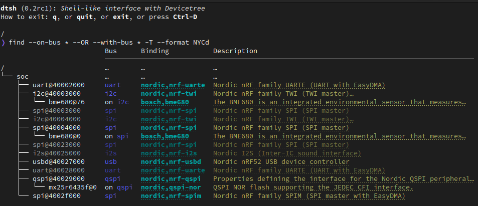
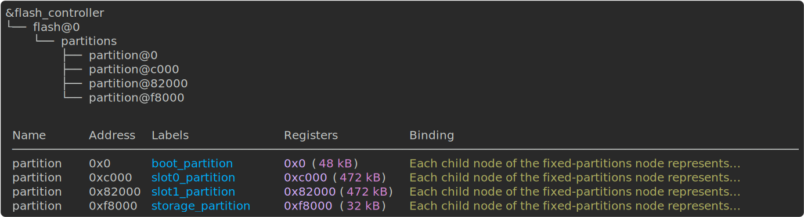
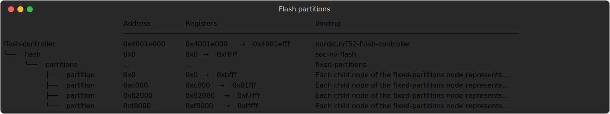
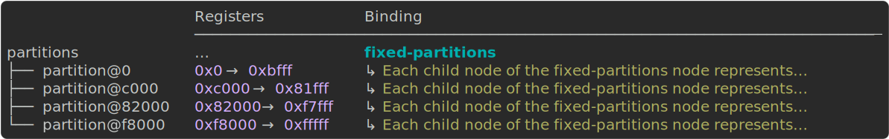
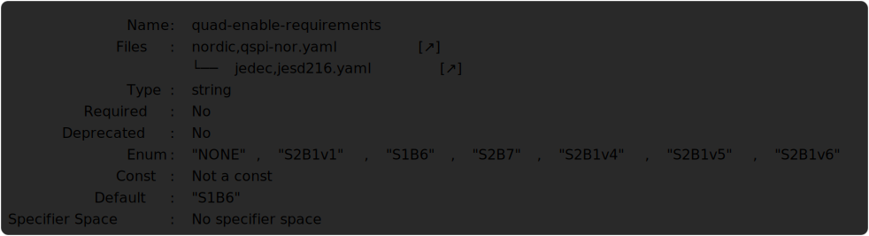
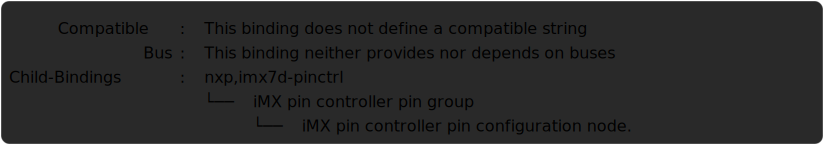
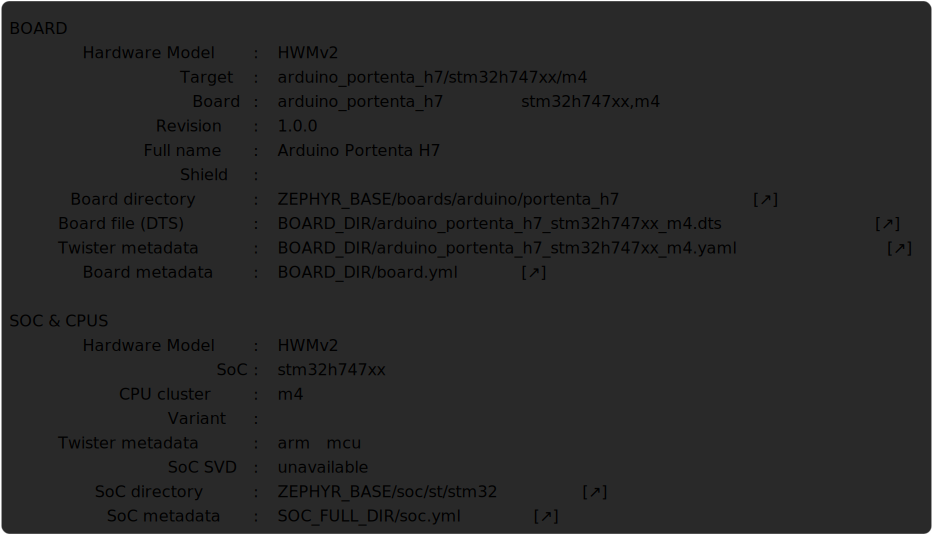
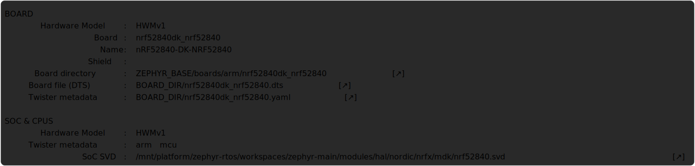
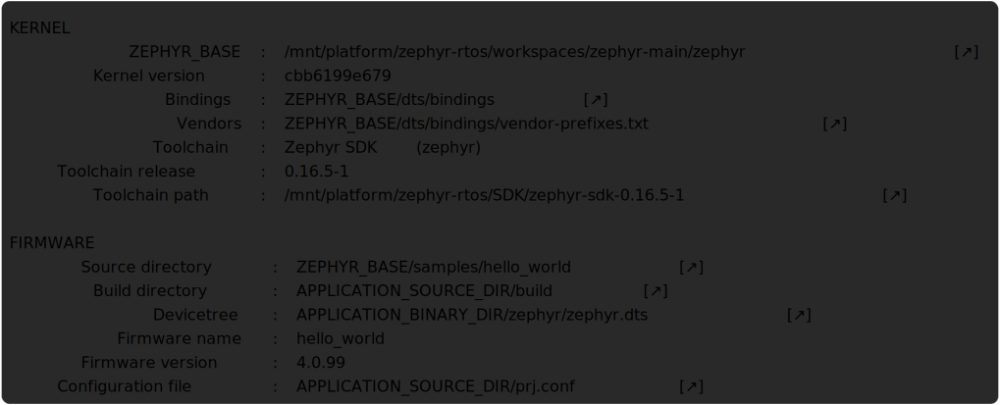

.. _dtsh-handbook:

DTSh's Handbook
###############



  ``find --on-bus * --OR --with-bus * -T --format NYCd``


.. _dtsh-usage:

Usage
*****

Once installed, the Devicetree Shell is available as the ``dtsh`` command:

.. code-block:: none

   $ dtsh -h
   usage: dtsh [-h] [-b DIR] [-u] [--preferences FILE] [--theme FILE] [-c CMD] [-f FILE] [-i] [DTS]

   shell-like interface with Devicetree

   options:
     -h, --help            show this help message and exit

   open a DTS file:
     -b DIR, --bindings DIR
                           directory to search for binding files
     DTS                   path to the DTS file

   user files:
     -u, --user-files      initialize per-user configuration files and exit
     --preferences FILE    load additional preferences file
     --theme FILE          load additional styles file

   session control:
     -c CMD                execute CMD at startup (may be repeated)
     -f FILE               execute batch commands from FILE at startup
     -i, --interactive     enter interactive loop after batch commands

.. _dtsh-typical-use:

Typical Use
===========

Early at build-time, during the `configuration phase <Zephyr-Configuration Phase_>`_,
Zephyr *assembles* the final `devicetree <DTSpec-The Devicetree_>`_ that will represent
the system hardware during the actual build phase.

This devicetree is saved in `Devicetree Source Format <DTSpec-DTS_>`_ (DTS)
as ``build/zephyr/zephyr.dts`` for *debugging* purpose.

The typical DTSh's use case is to open this DTS file generated at build-time, e.g.:

.. code-block:: none

   $ cd zephyr/samples/sensor/bme680
   $ cmake -B build -DBOARD=nrf52840dk/nrf52840
   $ dtsh build/zephyr/zephyr.dts
   dtsh (0.2.4): A Devicetree Shell
   How to exit: q, or quit, or exit, or press Ctrl-D

   /
   > ls -l
    Name              Labels          Binding
    ───────────────────────────────────────────────────────
    chosen
    aliases
    soc
    pin-controller    pinctrl         nordic,nrf-pinctrl
    entropy_bt_hci    rng_hci         zephyr,bt-hci-entropy
    sw-pwm            sw_pwm          nordic,nrf-sw-pwm
    cpus
    leds                              gpio-leds
    pwmleds                           pwm-leds
    buttons                           gpio-keys
    connector         arduino_header  arduino-header-r3
    analog-connector  arduino_adc     arduino,uno-adc

The above example should *always* work:

- regardless of the installation method (e.g. using ``cmake`` directly without West)
- regardless of whether ``ZEPHYR_BASE`` is set
- regardless of whether you target a `supported board <Zephyr-Boards_>`_
  or a `custom board <Zephyr-Board Porting Guide_>`_

Here, DTSh retrieves *all it needs*, and especially where to search for the
binding files, from the CMake cache content in ``CMakeCache.txt``::

   build/
   ├── CMakeCache.txt
   └── zephyr/
       └── zephyr.dts

.. tip::

   - In this context, no need to pass the DTS file path to DTSh: by default it will try
     to open the devicetree at ``build/zephyr/zephyr.dts``;
     ``dtsh /path/to/project/build/zephyr/zephyr.dts`` would also work,
     you don't need to call ``dtsh`` from the project's root
   - To open *your* devicetree: ``cd <project> && cmake -B build -DBOARD=<board> && dtsh``,
     or if using West ``cd <project> && west build && dtsh``


.. _dtsh-other-uses:

Other Uses
==========

As we've seen, DTSh first tries to retrieve the bindings Zephyr has used at build-time,
when the DTS file was generated, from the CMake cache.
This is the most straight forward way to get a complete and legit bindings search path.

When this fails, DTSh will then try to work out the search path
Zephyr would use if it were to generate the DTS *now*
(`Where Bindings Are Located <Zephyr-Where Bindings Are Located_>`_): bindings found in
``$ZEPHYR_BASE/dts/bindings`` and other *default* directories should still cover
the most simple use cases (e.g. Zephyr samples).

.. code-block:: none

   $ export ZEPHYR_BASE=/path/to/zephyrproject/zephyr
   $ dtsh /path/to/zephyr.dts

This default behavior does not address all situations, though:

- you may need additional binding files from a custom location,
  which we can't guess without the CMake cache
- you're not working with Zephyr

For these use cases, the ``-b --bindings`` option permits to explicitly enumerate all the directories
to search in::

   $ dtsh --bindings dir1 --bindings dir2 foobar.dts

Where:

- ``dir1`` and ``dir1``, and their sub-directories, shall contain all necessary YAML binding files
  in Zephyr's `Devicetree Binding Syntax <Zephyr-Binding Syntax_>`_,
  even if not working with Zephyr
- one of these directories may provide a valid vendors file, e.g. ``dir1/vendor-prefixes.txt``


.. _dtsh-configuration:

Configuration
=============

Users can tweak DTSh appearance and behavior by overriding its defaults in configuration files:

- ``dtsh.ini``: to override global preferences (see :ref:`dtsh-preferences`)
- ``theme.ini``: to override styles and colors (see :ref:`dtsh-themes`)

These (optional) files must be located in a platform-dependent directory,
e.g. ``~/.config/dtsh`` on GNU/Linux systems.

Running ``dtsh`` with the ``-u --user-files`` option will initialize configuration templates
in the expected location:

.. code-block:: none

  $ dtsh -u
  User preferences: ~/.config/dtsh/dtsh.ini
  User theme: ~/.config/dtsh/theme.ini

.. tip::

   DTSh won't override a user file that already exists: manually remove the file(s),
   and run the command again.

Additionally:

- the ``--preferences FILE`` option permits to specify an additional preferences file to load
- the ``--theme FILE`` option permits to specify an additional theme file to load


.. _dtsh-ini-format:

Configuration Format
--------------------

Configuration files are simple INI files that contain key-value pairs.

Values support *interpolation* with the ``${key}`` (preferences) or ``%(key)s`` (themes) syntax:

.. code-block:: none

   # Define a key.
   wchar.ellipsis = \u2026

   # Reference it with interpolation.
   et_caetera = Et caetera${wchar.ellipsis}

   # Use $$ to escape the dollar sign.
   dollar = This is the dollar sign: $$

Values are typed:

String
   Strings may contain Unicode characters as literals
   or 4-digit hexadecimal code points.

   It's necessary to double-quote strings only when:

   - the string value actually ends with spaces
   - the string value contains the double quote character

   Leading and trailing double quotes are always striped.

Boolean
   Valid values (case-insensitive):

   - True: ``1``, ``yes``, ``true``, and ``on``
   - False: ``0``, ``no``, ``false``, and ``off``

Integer
   Integers in base-10, base-2 (prefix ``0b``), base-8 (prefix ``0o``),
   and base-16 (prefix ``Ox``) are supported.

   Prefixes are case insensitive.

Float
  Decimal (e.g. ``0.1``) and scientific (e.g. ``1e-1``) notations are supported.


.. _dtsh-shell:

The Shell
*********

DTSh is a command line interface for *navigating*, *visualizing* and *searching* a devicetree
that actually resembles a usual POSIX shell:

- hierarchical file system metaphor
- Unix-like command names and command line syntax
- Unix-like command output redirection
- auto-completion, command history
- *standard* keybindings (Zsh, Bash, Emacs, GDB, etc)


.. _dtsh-fs-metaphor:

Hierarchical File System Metaphor
=================================

In POSIX systems, all directories are part of a global file system tree,
the root of which is denoted ``/``.

DTSh shows a devicetree as such a *hierarchical file system*,
where a Devicetree *path name* (`DTSpec 2.2.3`_) may represent:

- a node that appears as a *file* whose name would be the *node name* (`DTSpec 2.2.1`_),
  and whose content would be the node's properties
- a branch that appears as a *directory* of nodes

Devicetree path names are *absolute device paths*.

A *current working branch* is defined, allowing support for *relative device paths*.
The usual :ref:`cd <dtsh-builtin-cd>` command navigates through the devicetree.

Paths may contain the *path references*:

-  ``.`` represents the current path, typically the current working branch
-  ``..`` represents the path to the parent of the current path

Paths may start with a DTS *label* (`DTSpec 6.2`_): ``&i2c0`` represents the absolute path
to the devicetree node with label "i2c0".

The devicetree root *directory* is its own parent.

The expression bellow is then a valid (though convoluted and useless) path
to the ``flash-controller@4001e000`` device:

.. code-block:: none

  &i2c0/bme680@76/../../../soc/./flash-controller@4001e000


.. _dtsh-cmdline:

The Command Line
================

A ``dtsh`` *command line* is parsed into a *command string*, possibly followed by
an *output redirection*:

.. code-block:: none

   COMMAND_LINE := COMMAND_STRING [REDIRECTION]

Command lines are entered and edited at :ref:`the prompt <dtsh-prompt>`.


.. _dtsh-cmdstr:

Command Strings
---------------

``dtsh`` command strings conform to `GNU getopt`_ syntax:

.. code-block:: none

   COMMAND_STRING := COMMAND [OPTION...] [PARAM...]

where:

- ``COMMAND``: the command name, e.g. ``ls``
- ``OPTION``: the options the command is invoked with, e.g. ``--enabled-only``
- ``PARAM``: the parameters the command is invoked with, e.g. a devicetree path

``OPTION`` and ``PARAM`` are not positional: ``ls -l /soc`` is equivalent to ``ls /soc -l``.

An option may accept:

- a short name, starting with a single ``-`` (e.g. ``-h``)
- and/or a long name, starting with ``--`` (e.g. ``--help``)

Short option names can combine: ``-lR`` is equivalent to ``-l -R``.

An option may require an argument value, e.g. ``find  --with-reg-size >0x1000``.

.. note::

   An argument value can contain spaces if quoted: ``find --with-reg-size "> 0x1000"``
   will as expected match nodes with a register whose size is greater than 4 kB,
   but ``find --with-reg-size > 0x1000`` would complain that ``>`` alone is an invalid expression.

Options semantic should be consistent across commands,
e.g. ``-l`` always means *use a long listing format*.

``dtsh`` also tries to re-use *well-known* option names,
e.g. ``-r`` for *reverse* or ``-R`` for *recursive*.


.. _dtsh-redir2fs:

Output Redirection
------------------

Command output redirection *mimics* the Unix syntax:

- starts with either ``>`` (create), or ``>>`` (append to)
- followed by a file path, the (case insensitive) extension of which will determine the file format
  (HTML, SVG, default is text)

*Appending* to structured contents (HTML, SVG) is supported.

For example, the command line bellow will save the tree of the flash partitions
to the file ``flash.svg`` in the current working directory, in SVG format:

.. code-block:: none

   /
   > tree &flash_controller > flash.svg


Then, the command line bellow will *append* details about individual partitions:

.. code-block:: none

   /
   > ls --format naLrC &flash0/partitions >> flash.svg




  ``flash.svg``

.. note::

   By default, DTSh won't overwrite existing files, to prevent unintentional operations, e.g.:

   .. code-block:: none

      /
      > ls > ~/.bashrc
      dtsh: file exists: '.bashrc'

   This precaution is however relaxed when appending (``>>``) commands output to an existing file.
   To never overwrite files, set ``pref.fs.no_overwrite_strict`` in your
   preferences (see :ref:`dtsh-prefs-fs`)::

      pref.fs.no_overwrite_strict = yes

When redirecting to *styled* outputs (HTML, SVG), the final appearance is determined by:

- the colors and font effects (e.g. *italic*) used by DTSh to style commands output,
  which can be thoroughly configured with :ref:`user themes <dtsh-themes>`
- but also an HTML/SVG theme, setting basics like the default foreground and background colors,
  which can be changed in user preferences (``pref.{html,svg}.theme``)

By default, the HTML and SVG files generated by DTSh will have the same appearance,
and correspond to reading in a console with a dark color profile.

All of this doesn't always come together very well, e.g. when it comes to printing:

- a lighter background color, or no background color at all, would probably better fit
- but then, you won't want DTSh to style some outputs with too light foreground colors

The recommended approach is to craft specialized :ref:`theme <dtsh-themes>` and :ref:`preferences <dtsh-preferences>` files for these particular use cases.

Refer to :ref:`Output redirection preferences <dtsh-prefs-redir2fs>` for all available options.


.. _dtsh-format-output:

Format Commands Output
======================

We here first consider the DTSh commands that will eventually enumerate devicetree nodes,
like *shell* commands may list files or directories.

Nodes may be represented:

- by a path: this is the default, and the DTSh command's output should then follow the layout
  of its Unix-like homonym (e.g. ``ls``, ``find`` or ``tree``)
- using a *long listing format*: the command's output is then formatted in columns,
  like the Unix command ``ls`` that will also show owner, permissions and file size
  when the ``-l`` option is set

DTSh generalizes and extends this approach to all commands that enumerate nodes:

- the ``-l`` option enables long listing formats
- the ``--format FMT`` option explicitly sets what information is shown (the columns)
  through the ``FMT`` :ref:`format string <dtsh-fmtstr>`
- ``--format FMT`` implies ``-l``
- what the ``-l`` option alone will show depends on configurable defaults

Such formatted outputs include :ref:`list <dtsh-formatted-lists>`
and :ref:`tree <dtsh-formatted-trees>` views produced by ``alias``, ``chosen``, ``ls``, ``find`` and ``tree``.
They use *styles* (colors, font effects) and special characters (box drawing) to represent *things*.

For commands that do not format node lists or trees, and thus do not support ``--format FMT``,
``-l`` still switches to such *rich* outputs using styles and formatting, and generally more detailed command responses.

.. tip::

   DTSh is a bit biased toward POSIX shells' users, for who it should make sense to default
   to POSIX-like output:

   - by default commands output will sound familiar, and nothing is printed that the user
     has not explicitly asked for
   - then, adding DTSh format strings (``--format FMT``) will select the relevant columns to show
     on a per-command basis

   This behavior can however be overridden by setting the ``pref.always_longfmt`` preference: the
   ``-l`` flag will then be implied wherever supported, and outputs will be formatted
   according to configurable defaults.
   Although ``--format`` will still permit to select columns on a per-command basis,
   there's no syntax to get the POSIX-like output back when this preference is set.


.. _dtsh-fmtstr:

Format Strings
--------------

A *format string* is simply a list of *specifier* characters,
each of which appending a *column* to the formatted output.

For example, the format string "Nd" specifies the *Name* and *Description* columns:

.. code-block:: none

   /soc
   > ls --format Nd
    Name                           Description
    ────────────────────────────────────────────────────────────────────────────────────────
    interrupt-controller@e000e100  ARMv7-M NVIC (Nested Vectored Interrupt Controller)
    timer@e000e010                 ARMv7-M System Tick
    ficr@10000000                  Nordic FICR (Factory Information Configuration Registers)


.. list-table:: Format string specifiers
   :widths: auto
   :align: center

   * - ``a``
     - unit address
   * - ``A``
     - node aliases
   * - ``b``
     - bus of appearance
   * - ``B``
     - supported bus protocols
   * - ``c``
     - compatible strings
   * - ``C``
     - binding's compatible or headline
   * - ``d``
     - binding's description
   * - ``D``
     - node dependencies
   * - ``i``
     - generated interrupts
   * - ``K``
     - all labels and aliases
   * - ``l``
     - device label
   * - ``L``
     - DTS labels
   * - ``N``
     - node name
   * - ``n``
     - unit name
   * - ``o``
     - dependency ordinal (aka ``dts_ord``)
   * - ``p``
     - path name
   * - ``r``
     - registers (base address and size)
   * - ``R``
     - registers (address range)
   * - ``s``
     - status string
   * - ``T``
     - dependent nodes
   * - ``v``
     - vendor name
   * - ``X``
     - child-binding depth
   * - ``Y``
     - bus information


.. _dtsh-formatted-lists:

Formatted Lists
---------------

A *formatted list* is basically a table:

- the format string describes the ordered columns
- each node in the list appends a table row

This is the view most commands will produce by default when using long listing formats.

.. code-block:: none

   /
   > ls leds -l
    Name   Labels  Binding
    ──────────────────────────────────
    led_0  led0    GPIO LED child node
    led_1  led1    GPIO LED child node
    led_2  led2    GPIO LED child node
    led_3  led3    GPIO LED child node

When no format string is explicitly set with ``--format FMT``,
the default format configured by the ``pref.list.fmt`` preference is used.

:ref:`Preferences for formatted lists <dtsh-prefs-lists>` also include e.g. whether to show
the table header row or how to represent missing values (*placeholders*).


.. _dtsh-formatted-trees:

Formatted Trees
---------------

A *formatted tree* is actually a 2-sided view:

- left-side: the actual node tree
- right-side: a detailed list-view
- the first column specified by the format string tells how to represent the tree anchors (left-side),
  while the remaining specifiers describe the detailed view columns (right-side)

Formatted trees are produced:

- by commands whose natural semantic is to output trees, e.g. ``tree -l``
- when the user explicitly asks for a tree-like representation, e.g. ``find -l -T``

.. code-block:: none

   /
   > find --on-bus * --format NYC -T
                             Bus      Binding
                             ────────────────────────
   /                         …        …
   └── soc                   …        …
       ├── i2c@40003000      i2c      nordic,nrf-twi
       │   └── bme680@76     on i2c   bosch,bme680
       ├── spi@40004000      spi      nordic,nrf-spi
       │   └── bme680@0      on spi   bosch,bme680
       └── qspi@40029000     qspi     nordic,nrf-qspi
           └── mx25r6435f@0  on qspi  nordic,qspi-nor

When no format string is explicitly set with ``--format FMT``,
the default format configured by the ``pref.tree.fmt`` preference is used.

:ref:`Preferences for formatted trees <dtsh-prefs-trees>` also include e.g. whether to show
the table header row or how to represent missing values (*placeholders*).


.. _dtsh-sort-output:

Sort Commands Output
====================

When a command eventually enumerate nodes, ordering its output means ordering the nodes.

When the command outputs a list (e.g. ``ls`` or ``find``),
the nodes are eventually sorted at once as a whole.

When the command outputs a tree (e.g. ``tree`` or ``find -T``),
nodes are sorted branch by branch while walking through the devicetree (*children ordering*).

How nodes are sorted is specified with the ``--order-by KEY`` command option,
where ``KEY`` is simply a single-character identifier for the order relationship.

The ``-r`` command option will reverse the command's output.

.. note::

   When no order relationship is explicitly set,
   nodes are expected to appear in the order they appear
   when walking through the DTS file.


.. _dtsh-sort-keys:

Sort Keys
---------

A sort *key* identifies an node order relationship.

.. list-table:: Sort keys
   :widths: auto
   :align: center

   * - ``a``
     - sort by unit address
   * - ``A``
     - sort by aliases
   * - ``B``
     - sort by supported bus protocols
   * - ``b``
     - sort by bus of appearance
   * - ``c``
     - sort by compatible strings
   * - ``C``
     - sort by binding
   * - ``i``
     - sort by IRQ numbers
   * - ``I``
     - sort by IRQ priorities
   * - ``l``
     - sort by device label
   * - ``L``
     - sort by node labels
   * - ``N``
     - sort by node name
   * - ``n``
     - sort by unit name
   * - ``o``
     - sort by dependency ordinal
   * - ``p``
     - sort by node path
   * - ``r``
     - sort by register addresses
   * - ``s``
     - sort by register sizes
   * - ``v``
     - sort by vendor name
   * - ``X``
     - sort by child-binding depth


.. tip::

   - When applicable, sort keys and format specifiers will represent the same *aspect* of a node,
     e.g. ``a`` represents unit addresses both in format strings and as a sort key.
   - Any ordering relationship can be applied to any set of nodes, e.g. sorting by IRQ numbers
     even though not all nodes generate interrupts


.. _dtsh-sort-directions:

Sort Directions
---------------

In the default direction (*ascending*), nodes for which the sort key has no value will appear last
(after all nodes for which the sort key has a value): e.g. devices that do not generate interrupts
will appear last.

In reversed order (*descending* direction), nodes for which the sort key has no value will appear
first (before the nodes for which the sort key has a value): e.g. devices that do not generate
interrupts will appear first.

If the sort key admits multiple values (e.g. register sizes), for each node:

- the lowest value (e.g. the smallest register size) is used in the ascending direction
- the highest value (e.g. the largest register size) is used in the descending direction

To improve legibility, key values may also be sorted *horizontally*.

For example, when sorting nodes by register sizes in the ascending direction
(``--order-by s``):

.. code-block:: none

   timer@e000e010                 0xe000e010 16 bytes
   gpio@50000000                  0x50000000 512 bytes, 0x50000500 768 bytes
   gpio@50000300                  0x50000300 512 bytes, 0x50000800 768 bytes
   ...
   qspi@40029000                  0x40029000 4 kB, 0x12000000 128 MB
   pwm@4002d000                   0x4002d000 4 kB
   spi@4002f000                   0x4002f000 4 kB
   crypto@5002a000                0x5002a000 4 kB, 0x5002b000 4 kB
   memory@20000000                0x20000000 256 kB

And, when sorting nodes by register sizes in the descending direction
(``--order-by s -r``):

.. code-block:: none

   qspi@40029000                  0x12000000 128 MB, 0x40029000 4 kB
   memory@20000000                0x20000000 256 kB
   crypto@5002a000                0x5002a000 4 kB, 0x5002b000 4 kB
   spi@4002f000                   0x4002f000 4 kB
   pwm@4002d000                   0x4002d000 4 kB
   ...
   gpio@50000300                  0x50000800 768 bytes, 0x50000300 512 bytes
   gpio@50000000                  0x50000500 768 bytes, 0x50000000 512 bytes
   timer@e000e010                 0xe000e010 16 bytes


.. tip::

   In the above example, notice how ``qspi@40029000`` appears in the default ascending
   direction::

      0x40029000 4 kB, 0x12000000 128 MB

   Compared to the reverse descending direction::

     0x12000000 128 MB, 0x40029000 4 kB


.. _dtsh-search-devicetree:

Search the Devicetree
=====================

Searching the devicetree for devices, bindings, buses or interrupts is simply matching
nodes with criteria, each of which represents a predicate applied to an aspect of the node.

A predicate is specified either as a *text pattern* or an *integer expression*,
depending on the node aspect it applies to: e.g. matching compatible strings involves strings,
while matching addresses or sizes involves integers.

Criteria may be chained.

See also the :ref:`find <dtsh-builtin-find>` command for detailed examples.


.. _dtsh-txt-search:

Text Patterns
-------------

A criterion that applies to a node aspect that has a natural textual representation
is specified by a text *pattern*, and may behave as a Regular Expression match
or a plain text search.

When the criterion is a RE match (``-E`` command flag), any character in the pattern
may be interpreted as special character:

- in particular, ``*`` will represent a repetition qualifier,
  not a wild-card for any character: e.g. the pattern "*" would be invalid because
  *there's nothing to repeat*
- parenthesis will group sub-expressions, as in ``(image|storage).*``
- brackets will mark the beginning and end of a character set, as in ``i[\d]c``

When the criterion is not a RE match (default), but the pattern contains at least one ``*``:

- ``*`` is actually interpreted as a wild-card and not a repetition qualifier:
  here "*" is a valid expression that actually means *anything*, and will match
  any node for which the aspect has a value, e.g. ``--on-bus *`` will match
  all nodes that appear on a bus
- the criterion behaves as a string-match: ``*pattern`` means ends with "pattern",
  and ``pattern*`` means starts with "pattern" (``*pattern*`` would be a convoluted syntax
  for a plain text search)

Eventually, when the criterion is not a RE match, and the pattern does not contain any ``*``,
a *plain text search* happens.

.. tip::

   When the command option ``-i`` is set, text patterns are assumed case-insensitive.

.. list-table:: Text-based criteria
   :widths: auto
   :align: center

   * - ``--also-known-as``
     - match labels or aliases
   * - ``--chosen-for``
     - match chosen nodes
   * - ``--on-bus``
     - match buse of appearance
   * - ``--with-alias``
     - match aliases
   * - ``--with-binding``
     - match binding's compatible or headline
   * - ``--with-bus``
     - match supported bus protocols
   * - ``--with-compatible``
     - match compatible strings
   * - ``--with-description``
     - grep binding's description
   * - ``--with-device-label``
     - match device label
   * - ``--with-label``
     - match node labels
   * - ``--with-name``
     - match node name
   * - ``--with-status``
     - match status string
   * - ``--with-unit-name``
     - match unit name
   * - ``--with-vendor``
     - match vendor prefix or name


.. _dtsh-int-search:

Integer Expressions
-------------------

A criterion that applies to a node aspect that has a natural integer representation
is specified by an *integer expression*:

- a wild-card character alone "*" will match any node for which the aspect has a value,
  e.g. ``--with-irq-number *`` would match any node that generates interrupts
- an integer value alone (decimal or hexadecimal) will match nodes for which the aspect has
  this exact value, e.g. ``--with-irq-number 1`` would match nodes that generate IRQ 1
- a comparison operator followed by an integer value will match nodes for which the expression
  evaluates to true, e.g. ``--with-reg-size >0x1000`` would match nodes that have a register
  whose size is greater than 4 kB

Simple comparison operators are supported: ``<``, ``>``, ``<=``, ``>=``, ``!=``, ``=``
(where the later is equivalent to no operator).

Eventually, an integer expression may end with a SI unit (``kB``, ``MB`` and ``GB``), e.g.:

.. code-block:: none

   --with-reg-size "256 kB"
   --with-reg-size >=4kB
   --with-reg-size "> 1 MB"

.. tip::

   SI units are case-insensitive and can be truncated to the first letter, e.g.:

   .. code-block:: none

      --with-reg-size 256k
      --with-reg-size >4K
      --with-reg-size ">= 1M"

.. list-table:: Integer-based criteria
   :widths: auto
   :align: center

   * - ``--with-dts-ord``
     - match dependency ordinal
   * - ``--with-irq-number``
     - match IRQ numbers
   * - ``--with-irq-priority``
     - match IRQ priorities
   * - ``--with-reg-addr``
     - match register addresses
   * - ``--with-reg-size``
     - match register sizes
   * - ``--with-unit-addr``
     - match unit addresse
   * - ``--with-binding-depth``
     - match child-binding depth


.. _dtsh-criterion-chains:

Criterion Chains
----------------

By default, chained criteria evaluate as a logical conjunction:

.. code-block:: none

   --also-known-as partition --with-reg-size >64kB

would match nodes that have a register larger than 64 kB,
and a label or an alias that contains the string "partition".

When the ``--OR`` option is set, the criterion chain will instead evaluate
as a logical disjunction of all criteria.
For example, the chain bellow would match nodes that are either a bus device
or a device connected to a bus:

.. code-block:: none

   --with-bus * --OR --on-bus *

A logical negation may eventually be applied to the criterion chain with the option ``--NOT``:

.. code-block:: none

   /
   > find --NOT --with-description *
   .
   ./chosen
   ./aliases
   ./soc
   ./cpus

``NOT`` and ``OR`` can combine: they then both apply to the whole criterion chain.

.. note::

   Since, like any option, ``NOT`` and ``OR`` are not positional,
   they always apply to the whole chain, such that the expressions bellow all
   are valid syntax for the same semantic, not different predicates:

   .. code-block:: none

      --NOT --with-compatible * --OR --with-binding *

      --with-compatible * --OR --NOT --with-binding *

      --with-compatible * --with-binding * --NOT --OR


.. _dtsh-batch:

Batch Mode
==========

For scripting and automation, DTSh can execute non-interactively:

- a series of commands passed as program arguments: ``dtsh -c CMD1 -c CMD2 ...``
- commands from a script file: ``dtsh -f FILE``

In either case:

- these batch commands are executed first
- the ``-i --interactive`` option permits to enter the interactive loop
  after they have been executed (the default is to exit ``dtsh``)

A typical use of batch commands or files is for automatic generation
of documentation.


.. _dtsh-batch-cmds:

Batch Commands
--------------

Providing DTSh command lines as program arguments is appropriate for executing
a few relatively short commands.

.. tip::

   When using a POSIX shell, the ``-c`` option is handy for defining aliases,
   e.g.:

   .. code-block:: sh

      # An alias to export the devicetree to HTML,
      # without leaving the operating system shell.
      alias dts2html='dtsh -c "tree --format NKiYcd > devicetree.html"'


.. _dtsh-batch-script:

Batch Files
-----------

DTSh scripts are text files containing ``dtsh`` command lines:

- one command per line
- lines starting with "#" are comments

.. tip::

   Combined with the pager, scripts allow to create simple *presentations*:

   1. a command is executed, and its output is paged
   2. speaker can talk with the command's output as supporting *slide*
   3. speaker exits the pager (:kbd:`q`) to advance to the next command,
      i.e. the next slide

   .. code-block:: sh

      # presentation.dtsh: DTSh sample script

      # Start with the tree of buses and connected devices: speaker will
      # press "q" when done
      find --with-bus * --OR --on-bus * --format NYcd -T --pager

      # Let's look at the Flash partitions.
      #
      # 1st, the controller: : speaker will press "q" when done
      cat &flash_controller -A --pager
      # Then partitions with addresses and sizes: speaker will press "q"
      # when done
      tree &flash_controller --format NrC --pager

      # Lets talk about DTS labels: speaker will press "q" when done
      find --with-label * -l --pager

   If the script is run with ``-i``, e.g. ``dtsh -f presentation.dtsh -i``,
   DTSh will enter the interactive loop after the last command: speaker can then
   navigate the command history to re-open *slides* while answering questions.


.. _dtsh-preferences:

User Preferences
================

User *preferences* permit to override DTSh defaults for:

- the prompt
- command output redirection
- the contents of formatted lists and trees
- common symbols and other miscellaneous configuration options

Preferences are loaded in that order:

1. DTSh loads default values for all defined configuration options
2. if a user preferences file exists, e.g. ``~/.config/dtsh.ini`` on GNU Linux,
   it's loaded, overriding the default values with the options it contains
3. if an additional preferences file is specified with the command
   option ``--preferences``, it's eventually loaded, overriding previous values
   with the options it contains

See also :ref:`dtsh-configuration`.


.. _dtsh-prefs-misc:

General Preferences
-------------------

``pref.always_longfmt``
    Whether to assume the flag *use a long listing format* (``-l``) is always set
    (see :ref:`dtsh-format-output`).

    Default: No

``pref.sizes_si``
    Whether to print sizes in SI units (bytes, kB, MB, GB).

    Sizes are otherwise printed in hexadecimal bytes.

    Default: Yes

``pref.hex_upper``
    Whether to print hexadecimal digits upper case (e.g. ``OXFF`` rather than ``0xff``).

    May improve legibility or accessibility for some users.

    Default: No


.. _dtsh-prefs-prompt:

The Prompt
----------

``prompt.wchar``
   Default prompt.

   This is the character (or string) from which are derived the ANSI prompts bellow.

   Default: Medium Right-Pointing Angle Bracket Ornament (``\u276D``)

``prompt.default``
   ANSI prompt.

   Default: Medium Right-Pointing Angle Bracket Ornament, slate blue

``prompt.alt``
   ANSI prompt for the error state.

   This prompt is used after a command has failed, and until a command succeeds.

   Default: Medium Right-Pointing Angle Bracket Ornament, dark red

``prompt.sparse``
   Whether to insert a newline between a command output and the next prompt.

   Default: Yes

.. tip::

   To simply change the prompt character (Unicode ``U+276D``), no need to
   actually mess with the ANSI strings, just set ``prompt.wchar`` to your liking.


.. _dtsh-prefs-fs:

File System Access
------------------

``pref.fs.hide_dotted``
   Whether to hide files and directories whose name starts with ``.``.

   These are commonly hidden file system entries on POSIX-like systems.

   Default: Yes

``pref.fs.no_spaces``
   Whether to forbid spaces in paths when redirecting commands output to files.

   Default: Yes

``pref.fs.no_overwrite``
   Whether to forbid command output redirection to overwrite existing files,
   excepted may be when appending, see bellow.

   Default: Yes

``pref.fs.no_overwrite_strict``
   Whether to forbid command output redirection to overwrite existing files,
   even for appending.

   Default: No


.. _dtsh-prefs-redir2fs:

Output Redirection
------------------

``pref.redir2.maxwidth``
   Maximum width in number of characters for command output redirection.

   VT-like terminals do not scroll horizontally, and will crop or wrap what's
   printed to match the current terminal width.

   When redirecting commands output to files, this may unnecessarily limit the width
   of the produced documents (SVG, HTML and plain text): these will be used in viewers
   (e.g. a text editor or Web brower) that can handle outputs significantly wider
   than the current width of the console (e.g. with horizontal scrolling).

   This preference configures the maximum width, in number of characters,
   of the virtual console DTSh will actually redirect the command's output to.

   Default: 255

``pref.html.theme``
   Preferred default text and background colors to use when redirecting command
   outputs to HTML files.

   Possible values:

   - ``svg``: default theme for SVG and HTML documents
     (looks like reading in a console with a dark color profile)
   - ``html``: theme recommended for printable HTML documents (no background)
   - ``dark``: darker
   - ``light``: lighter
   - ``night``: darkest, highest contrasts

   Default: ``svg``

``pref.html.font_family``
   Preferred font to use when redirecting command outputs to HTML files.

   This the family name, e.g. "Courier New".

   Multiple coma separated values allowed, e.g. "Source Code Pro, Courier"

   The generic ``monospace`` family is automatically appended last.

   .. tip::

      Choosing a font family:

      - the "Courier New" font family is installed nearly everywhere,
        but will unlikely provide all box drawing characters required
        to properly render (sharp) trees and tables
      - "DejaVu Sans Mono" is almost as widespread, and trees and tables
        should render fine, at least for the default HTML font size (``medium``)
      - fonts families like "Source Code Pro" are quite popular among software engineers,
        and may offer better rendering for non default font sizes

      The HTML client should pick up the first font it finds: to use the
      default monospace font configured in e.g. your browser's settings,
      just leave this preference empty.

   Default: ``DejaVu Sans Mono``

``pref.html.font_size``
   Preferred font size to use when redirecting command outputs to HTML files.

   Any valid value for CSS ``font-size:`` is allowed, e.g.:

   - predefined absolute sizes, e.g.: ``xx-small``, ``medium``, ``xxx-large``
   - relative sizes, e.g.: ``smaller``, ``larger``
   - arbitrary absolute values: ``18px``, ``0.8em``

   Default: ``medium``

``pref.html.compact``
  By default, DTSh will insert a blank line between command outputs when appending
  to an existing file.

  Although this is necessary when redirecting to raw text files, this seems
  like too much when formatting to HTML, where successive command outputs
  are already rendered as successive paragraphs (``<pre>``).

  When this preference is set, DTSh won't separate successive captured commands
  by an additional blank line.

  Default: Yes

``pref.svg.theme``
   Preferred default text and background colors to use when redirecting
   command outputs to SVG files.

   Possible values:

   - ``svg``: default theme for SVG and HTML documents
     (looks like reading in a console with a dark color profile)
   - ``html``: theme recommended for printable HTML documents (no background)
   - ``dark``: darker
   - ``light``: lighter
   - ``night``: darkest, highest contrasts

   Default: ``svg``

``pref.svg.font_family``
   Preferred font to use when redirecting command outputs to SVG files.

   This the family name, e.g. "Courier New".

   Multiple coma separated values allowed, e.g. "Source Code Pro, Courier New".

   The generic ``monospace`` family is automatically appended as fallback.

   .. note::

      "Fira Code" is the default font expected by the rich API
      when exporting to SVG:

      - it's thus well tested
      - the complete CSS specification (faces definitions, reliable source URL
        from which to download the actual fonts) is included in the SVG format
        string of the rich library
      - but keep in mind that this CSS specification will be lost
        if the SVG file is used in an HTML ```` tag

   Default: ``Fira Code, DejaVu Sans Mono``

``pref.svg.font_ratio``
   Font aspect ratio to use when redirecting command outputs to SVG files.

   This is the width to height ratio, which varies with fonts.

   Most monospace fonts will render fine with a 3:5 ratio.

   Default: 0.61 (Fira Code)

``pref.svg.title``
   An optional title to use in SVG files.
   If appending, the title won't repeat nor change.

   Default: No title

``pref.svg.decorations``
   Whether to decorate the SVG output with macOS-like window buttons.
   If appending, the window decoration won't repeat.

   Default: No



  SVG redirection with a title and macOS-like window buttons

``pref.svg.compact``
  By default, DTSh will insert a blank line between commands output when appending
  to an existing file.

  Although this is necessary when redirecting to raw text files, this may seem
  like too much with formatted contents such as SVG, which already includes
  some margins and padding.

  Compact output won't separate successive captured commands by
  an additional blank line.

  Default: No


.. _dtsh-prefs-highlighting:

Syntax Highlighting
-------------------

.. tip::

   When redirecting commands output to HTML or SVG files,
   configure a syntax highlighting theme (aka Pygments) matching
   the HTML or SVG default background color.

``pref.dts.theme``
   Pygments theme for DTS syntax highlighting.

   E.g.:

   - dark: "monokai", "dracula", "material"
   - light: "bw", "sas", "arduino"

   See `Pygments styles <Pygments styles_>`_.

   Default: ``monokai``

``pref.yaml.theme``
   Pygments theme for YAML syntax highlighting.

   E.g.:

   - dark: "monokai", "dracula", "material"
   - light: "bw", "sas", "arduino"

   See `Pygments styles <Pygments styles_>`_.

   Default: ``monokai``

``pref.yaml.actionable_type``
    How to render :ref:`hyperlinks <dtsh-hyperlinks>` to included YAML files.

    Possible values:

    - ``none``: don't make text actionable
    - ``link``: let the terminal alone handle the rendering,
      typically with a dashed line bellow the text to link
    - ``alt``: append an alternative actionable view next to the text

    Default: ``link``


.. _dtsh-prefs-lists:

Formatted Lists
---------------

``pref.list.headers``
   Whether to show the header row.

   Default: Yes

``pref.list.place_holder``
   Place holder text for missing values.

   Default: None (*blank*)

``pref.list.fmt``
   Default :ref:`format string <dtsh-fmtstr>` (*columns*) to use in formatted lists.

   Default: ``NLC`` (node name, labels and binding)

``pref.list.actionable_type``
    How to render :ref:`actionable text <dtsh-hyperlinks>` (*hyperlinks*)
    in formatted lists.

    Possible values:

    - ``none``: don't make text actionable
    - ``link``: let the terminal alone handle the rendering,
      typically with a dashed line bellow the text to link
    - ``alt``: append an alternative actionable view next to the text

    Default: ``link``

``pref.list.multi``
   Whether to allow multiple-line cells in formatted lists.

   May improve legibility when focusing on properties that have multiple values
   like registers or dependencies (*required-by* and *depends-on*).

   Default: No


.. _dtsh-prefs-trees:

Formatted Trees
---------------

``pref.tree.headers``
   Whether to show the header row in 2-sided views.

   Default: Yes

``pref.tree.place_holder``
   Place holder text for missing values.

   Default: ``${wchar.ellipsis}``

``pref.tree.fmt``
   Default :ref:`format string <dtsh-fmtstr>` (*columns*) to use in formatted trees.

   Default: ``Nd`` (node name and description)

``pref.tree.actionable_type``
   How to render :ref:`actionable text <dtsh-hyperlinks>` (*hyperlinks*)
   in tree anchors.

   Possible values:

   - ``none``: don't make text actionable
   - ``link``: let the terminal alone handle the rendering,
     typically with a dashed line bellow the text to link
   - ``alt``: append an alternative actionable view next to the text

   Default: ``none``

``pref.2sided.actionable_type``
   How to render :ref:`actionable text <dtsh-hyperlinks>` (*hyperlinks*)
   in the right pane of a 2-sided view.

   Possible values:

   - ``none``: don't make text actionable
   - ``link``: let the terminal alone handle the rendering,
     typically with a dashed line bellow the text to link
   - ``alt``: append an alternative actionable view next to the text

   Default: ``link``

.. _dtsh-prefs-child-binding-anchor:

``pref.tree.cb_anchor``
   Symbol used to anchor child-bindings to the bindings they're a child-binding of.

   Unset (left blank) to disable.

   .. note::

      Although these anchors are often informative, they may also be confusing
      when a child-binding does not immediately follow its parent
      in the right pane of the tree view.

      Consider the command output bellow:

      .. code-block:: none

         /
         > tree /soc/iomuxc@30330000 --format nC
                                                      Binding
                                                      ──────────────────────────────────────────────
         iomuxc                                       nxp,imx-iomuxc
         ├── pinctrl                                  nxp,imx7d-pinctrl
         │   ├── uart2_default                        ↳ iMX pin controller pin group
         │   │   └── group0                             ↳ iMX pin controller pin configuration node.
         │   └── i2c4_default                         ↳ iMX pin controller pin group
         │       └── group0                             ↳ iMX pin controller pin configuration node.
         ├── MX7D_PAD_GPIO1_IO08__GPIO1_IO8           ↳ MCUX RT pin mux option


      The left pane is a devicetree branch, where tree anchors are node names.

      The list view on the right pane has one column, the node's binding,
      where the ``↳`` are intended to anchor child-bindings
      to the binding they're a child of.

      Things work well under ``pinctrl``, child-bindings always immediately follow
      the binding they're a child of, and the ``↳`` rightly tag the child-binding
      and grandchild-binding of ``nxp,imx7d-pinctrl``.

      But the last binding, described as "MCUX RT pin mux option",
      isn't a child-binding of ``nxp,imx7d-pinctrl``, but of ``nxp,imx-iomuxc``,
      much more above in the list, which we don't know how to visually represent.
      This happens because ``pinctrl`` is specified by the ``nxp,imx7d-pinctrl``
      compatible string, not by the child-binding of its parent node.

      To avoid confusion, child-binding anchors are thus disabled by default.

      To visualize the *genealogy* of a binding (ancestors and descendants),
      use ``cat -Bl``.

   Default: Unset (disabled)


.. _dtsh-prefs-symbols:

Alternative Symbols
-------------------

Preferences whose keys start with ``wchar.`` permit to override the characters
DTSh will use for some common symbols:

- to work-around missing Unicode glyphs: e.g. substitute ``->`` for the right-arrow ``U+2192``
- to suit personal taste


.. _dtsh-builtins:

Built-in Commands
*****************

This is the reference manual for DTSh built-in commands.


.. _dtsh-builtin-cd:

cd
====

Change the *current working branch* used to resolve relative DT paths.

Synopsis:

.. code-block:: none

   cd [PATH]

``PATH``
  Devicetree path to the destination branch (see :ref:`dtsh-fs-metaphor`).

  If unset, defaults to the devicetree root.

  .. code-block:: none

     /
     > cd &i2c0

     /soc/i2c@40003000
     /
     > cd

     /
     >


.. _dtsh-builtin-pwd:

pwd
====

Print path of the current working branch.

.. tip::

   Use ``ls -ld`` instead to quickly get detailed information about the current working branch:

   .. code-block:: none

      /soc/flash-controller@4001e000/flash@0/partitions/partition@0
      > pwd
      /soc/flash-controller@4001e000/flash@0/partitions/partition@0

      /soc/flash-controller@4001e000/flash@0/partitions/partition@0
      > ls -ld
       Name         Labels          Binding
       ─────────────────────────────────────────────────────────────────────────────────────
       partition@0  boot_partition  Each child node of the fixed-partitions node represents…


.. _dtsh-builtin-ls:

ls
====

List branch contents like files or directories.

Synopsis:

.. code-block:: none

   ls [OPTIONS] [PATH ...]

``PATH``
   :ref:`Paths <dtsh-fs-metaphor>` of the devicetree branches to list the contents of.

   .. code-block:: none

      /
      > ls leds pwmleds
      leds:
      led_0
      led_1
      led_2
      led_3

      pwmleds:
      pwm_led_0

   Supports wild-cards (*globbing*) in the node name:

   .. code-block:: none

      /
      > ls soc/timer* -d
      soc/timer@e000e010
      soc/timer@40008000
      soc/timer@40009000
      soc/timer@4000a000
      soc/timer@4001a000
      soc/timer@4001b000

.. _dtsh-ls-options:

Options
-------

``-d``
   List nodes, not branch contents.

   .. code-block:: none

      /pin-controller
      > ls --format NC
       Name           Binding
       ────────────────────────────────────────────────────────────────
       uart0_default  nRF pin controller pin configuration state nodes.
       uart0_sleep    nRF pin controller pin configuration state nodes.
       uart1_default  nRF pin controller pin configuration state nodes.

      / pin-controller
      > ls --format NC -d
       Name            Binding
       ──────────────────────────────────
       pin-controller  nordic,nrf-pinctrl

``-l``
   Use a :ref:`long listing format <dtsh-format-output>`.

   The default :ref:`format string <dtsh-fmtstr>` is configured
   by the ``pref.list.fmt`` preference.

   See :ref:`dtsh-formatted-lists`.

``-r``
   Reverse command output, usually combined with ``--order-by``.

   See :ref:`dtsh-sort-directions`.

``-R``
   List recursively.

   .. code-block:: none

      /
      > ls /soc/flash-controller@4001e000/flash@0/partitions -R
      /soc/flash-controller@4001e000/flash@0/partitions:
      partition@0
      partition@c000
      partition@82000
      partition@f8000

      /soc/flash-controller@4001e000/flash@0/partitions/partition@0:

      /soc/flash-controller@4001e000/flash@0/partitions/partition@c000:

      /soc/flash-controller@4001e000/flash@0/partitions/partition@82000:

      /soc/flash-controller@4001e000/flash@0/partitions/partition@f8000:

   In the output above, nodes ``partition@0`` to ``partition@f8000`` appear as *empty directories*.

``--enabled-only``
   Filter out disabled nodes or branches.

``--fixed-depth DEPTH``
   Limit devicetree depth when listing recursively.

``--format FMT``
   Node output format (:ref:`dtsh-fmtstr`).

   See :ref:`dtsh-formatted-lists`.

``--order-by KEY``
   Sort nodes or branches.

   This sets the :ref:`order relationship <dtsh-sort-keys>`.

``--pager``
   Page command output.

   See :ref:`dtsh-pager`.


.. _dtsh-ls-examples:

Examples
--------

Open a quick view of the whole devicetree in the pager
(press :kbd:`q` to quit the pager):

.. code-block:: none

   /
   > ls -Rl --pager

Basic SoC memory layout, highest to lowest addresses:

.. code-block:: none

   /
   > ls soc --format nr --order-by r -r
    Name                  Registers
    ──────────────────────────────────────────────────────────────────
    interrupt-controller  0xe000e100 (3 kB)
    timer                 0xe000e010 (16 bytes)
    crypto                0x5002b000 (4 kB), 0x5002a000 (4 kB)
    gpio                  0x50000800 (768 bytes), 0x50000300 (512 bytes)
    gpio                  0x50000500 (768 bytes), 0x50000000 (512 bytes)
    spi                   0x4002f000 (4 kB)
    pwm                   0x4002d000 (4 kB)
    qspi                  0x40029000 (4 kB), 0x12000000 (128 MB)

.. tip::

   If distinguishing the leading lowercase “e” in ``0xe000e100`` proves difficult,
   try setting the ``pref.hex_upper`` preference to get ``0XE000E100`` instead
   (see :ref:`dtsh-prefs-misc`).


.. _dtsh-builtin-tree:

tree
====

List branch contents in tree-like format.

Synopsis:

.. code-block:: none

   tree [OPTIONS] [PATH ...]

``PATH``
   :ref:`Paths <dtsh-fs-metaphor>` of the devicetree branches to walk through.

   .. code-block:: none

      /
      > tree &i2c0 &i2c1
      &i2c0
      └── bme680@76

      &i2c1

   Supports wild-cards (*globbing*) in the node name:

   .. code-block:: none

      /
      > tree soc/i2c*
      soc/i2c@40003000
      └── bme680@76

      soc/i2c@40004000


.. _dtsh-tree-options:

Options
-------

``-l``
   Use a :ref:`long listing format <dtsh-format-output>`.

   The default :ref:`format string <dtsh-fmtstr>` is configured
   by the ``pref.tree.fmt`` preference.

   See :ref:`dtsh-formatted-trees`.

``-r``
   Reverse command output, usually combined with ``--order-by``.

   See :ref:`dtsh-sort-directions`.

``--enabled-only``
   Filter out disabled nodes and branches.

``--fixed-depth DEPTH``
   Limit the devicetree depth.

   .. code-block:: none

      /
      > tree soc --fixed-depth 2
      soc
      ├── interrupt-controller@e000e100
      ├── timer@e000e010
      ├── ficr@10000000
      ├── uicr@10001000
      ├── memory@20000000
      ├── clock@40000000
      ├── power@40000000
      │   ├── gpregret1@4000051c
      │   └── gpregret2@40000520

``--format FMT``
   Node output format (:ref:`dtsh-fmtstr`).

   See :ref:`dtsh-formatted-trees`.

``--order-by KEY``
   Sort nodes or branches.

   This sets the :ref:`order relationship <dtsh-sort-keys>`.

``--pager``
   Page command output.

   See :ref:`dtsh-pager`.


.. _dtsh-tree-examples:

Examples
--------

Open a tree view of the whole devicetree in the pager (press :kbd:`q` to quit the pager):

.. code-block:: none

   /
   > tree --format NKYC --pager


Tree-view of Flash memory:

.. code-block:: none

   /
   > tree &flash_controller --format Nrc
                                Registers          Compatible
                                ────────────────────────────────────────────────
   flash-controller@4001e000    0x4001e000 (4 kB)  nordic,nrf52-flash-controller
   └── flash@0                  0x0 (1 MB)         soc-nv-flash
       └── partitions                              fixed-partitions
           ├── partition@0      0x0 (48 kB)
           ├── partition@c000   0xc000 (472 kB)
           ├── partition@82000  0x82000 (472 kB)
           └── partition@f8000  0xf8000 (32 kB)

Highlight child-bindings (disabled by default, see :ref:`dtsh-prefs-child-binding-anchor`):

.. code-block:: none

   /
   > tree &flash0/partitions --format NRC



  ``tree &flash0/partitions --format NRC``


.. _dtsh-builtin-find:

find
====

Search branches for nodes matching flexible criteria (e.g. bindings, buses,
register sizes, interrupts). See also :ref:`dtsh-search-devicetree`.

Synopsis:

.. code-block:: none

   find [OPTIONS] [PATH ...]

``PATH``
   :ref:`Paths <dtsh-fs-metaphor>` of the devicetree branches to search.

   .. code-block:: none

      /
      > find &i2c0 &i2c1 -l
       Name          Labels             Binding
       ───────────────────────────────────────────────
       i2c@40003000  i2c0, arduino_i2c  nordic,nrf-twi
       bme680@76     bme680_i2c         bosch,bme680
       i2c@40004000  i2c1               nordic,nrf-twi

   Support wild-cards (*globbing*) in the node name:

   .. code-block:: none

      /
      > find soc/i2c*
      soc/i2c@40003000
      soc/i2c@40003000/bme680@76
      soc/i2c@40004000


.. _dtsh-find-options:

Options
-------

``-E``
   :ref:`Text patterns <dtsh-txt-search>` are interpreted as regular expressions.

``-i``
   Ignore case in :ref:`Text patterns <dtsh-txt-search>`.

   .. code-block:: none

      /
      > find -E -i --also-known-as "green.*led" --format pK
       Path         Also Known As
       ───────────────────────────────────────────────────────────────────
       /leds/led_0  Green LED 0, led0, led0, bootloader-led0, mcuboot-led0
       /leds/led_1  Green LED 1, led1, led1
       /leds/led_2  Green LED 2, led2, led2
       /leds/led_3  Green LED 3, led3, led3

``-l``
   Use a :ref:`long listing format <dtsh-format-output>`.

   The default :ref:`format string <dtsh-fmtstr>` is configured
   by the ``pref.list.fmt`` preference, or ``pref.tree.fmt`` when ``-T`` is set.

``-r``
   Reverse command output, usually combined with ``--order-by``.

   See :ref:`dtsh-sort-directions`.

``-T``
   List results in tree-like format.

   .. code-block:: none

      /soc
      > find -T --also-known-as partition --format NK
                                     Also Known As
                                     ──────────────────────────
      soc
      └── flash-controller@4001e000  flash_controller
        └── flash@0                  flash0
          └── partitions
              ├── partition@0        mcuboot, boot_partition
              ├── partition@c000     image-0, slot0_partition
              ├── partition@82000    image-1, slot1_partition
              └── partition@f8000    storage, storage_partition

``--count``
   Print matches count.

   .. code-block:: none

      / soc
      > find --also-known-as partition --count
      ./flash-controller@4001e000/flash@0/partitions/partition@0
      ./flash-controller@4001e000/flash@0/partitions/partition@c000
      ./flash-controller@4001e000/flash@0/partitions/partition@82000
      ./flash-controller@4001e000/flash@0/partitions/partition@f8000

      Found: 4

``--enabled-only``
   Filter out disabled nodes and branches.

``--format FMT``
   Node output format (:ref:`dtsh-fmtstr`).

   See :ref:`dtsh-formatted-lists`, or :ref:`dtsh-formatted-trees` if ``-T`` is set).

``--order-by KEY``
   Sort nodes or branches.

   This sets the :ref:`order relationship <dtsh-sort-keys>`.

``--pager``
   Page command output.

   See :ref:`dtsh-pager`.

``--on-bus PATTERN``
   Match ``PATTERN`` with the bus a nodes appears on (is connected to).

   See :ref:`dtsh-txt-search`.

``--also-known-as PATTERN``
   Match ``PATTERN`` with device labels, DTS labels and node aliases.

   See :ref:`dtsh-txt-search`.

``--chosen-for PATTERN``
   Match ``PATTERN`` with chosen nodes.

   See :ref:`dtsh-txt-search`.

   See also the :ref:`dtsh-builtin-chosen` command.

``--with-alias PATTERN``
   Match ``PATTERN`` with node aliases.

   See :ref:`dtsh-txt-search`.

   See also the :ref:`dtsh-builtin-alias` command.

``--with-binding PATTERN``
   Match ``PATTERN`` with the node's binding.

   Both the binding's compatible string and description headline are possible matches:

    .. code-block:: none

       /
       > find --with-binding DMA --format Kd
       Also Known As          Description
       ──────────────────────────────────────────────────────────────────────
       uart0                  Nordic nRF family UARTE (UART with EasyDMA)
       uart1, arduino_serial  Nordic nRF family UARTE (UART with EasyDMA)
       spi3, arduino_spi      Nordic nRF family SPIM (SPI master with EasyDMA)

   See :ref:`dtsh-txt-search`.

``--with-binding-depth EXPR``
   Match ``EXPR`` with the child-binding depths.

   The child-binding depth associated to a node is a non negative integer
   that represents *how far* we can walk the devicetree backward until
   the current node is not specified by the child-binding of its parent:

   - 0: this node is not specified by its parent's child-binding
   - 1: child-binding
   - 2: grandchild-binding
   - 3 and above: great grandchild-binding

   Nodes whose binding is a child-binding:

   .. code-block:: none

      /
      > find --with-binding-depth >0 --format NXd
      Name             Binding Depth  Description
      ────────────────────────────────────────────────────────────────────────────────────────
      partition@0            1        Each child node of the fixed-partitions node represents…
      partition@c000         1        Each child node of the fixed-partitions node represents…
      partition@82000        1        Each child node of the fixed-partitions node represents…
      partition@f8000        1        Each child node of the fixed-partitions node represents…
      uart0_default          1        nRF pin controller pin configuration state nodes.
      group1                 2        nRF pin controller pin configuration group.
      group2                 2        nRF pin controller pin configuration group.

   See :ref:`dtsh-int-search`.

``--with-bus PATTERN``
   Match ``PATTERN`` with the bus protocols a node supports (provides).

   See :ref:`dtsh-txt-search`.

``--with-compatible PATTERN``
   Match ``PATTERN`` with the node's compatible strings.

   See :ref:`dtsh-txt-search`.

``--with-description PATTERN``
   Grep the binding's description (not only the headline) for ``PATTERN``.

   .. code-block:: none

      /
      > find --with-description gpio -i --format Nd
      Name             Description
      ─────────────────────────────────────────────────────────────────────────────────────
      radio@40001000   Nordic nRF family RADIO peripheral…
      gpiote@40006000  NRF5 GPIOTE node
      gpio@50000000    NRF5 GPIO node
      gpio@50000300    NRF5 GPIO node
      leds             This allows you to define a group of LEDs. Each LED in the group is…
      led_0            GPIO LED child node
      led_1            GPIO LED child node
      buttons          Zephyr Input GPIO KEYS parent node…
      button_0         GPIO KEYS child node
      button_1         GPIO KEYS child node
      connector        GPIO pins exposed on Arduino Uno (R3) headers

   See :ref:`dtsh-txt-search`.

``--with-device-label PATTERN``
   Match ``PATTERN`` with device labels.

   .. code-block:: none

      /
      >
      find --with-device-label "Push butt" --format Nld
      Name      Label                 Description
      ────────────────────────────────────────────────────
      button_0  Push button switch 0  GPIO KEYS child node
      button_1  Push button switch 1  GPIO KEYS child node

   See :ref:`dtsh-txt-search`.

``--with-dts-ord EXPR``
   Match ``EXPR`` with the node's dependency ordinal, also known as DTS order.

   .. tip::

      This criterion can be useful for debugging Zephyr build errors mentioning these famous
      ``__device_dts_ord_`` which sometimes confuse beginners, such as e.g.:

      .. code-block:: none

         from zephyr/drivers/sensor/bme680/bme680.c:14: error: '__device_dts_ord_124'
         undeclared here (not in a function); did you mean '__device_dts_ord_14'?
         89 | #define DEVICE_NAME_GET(dev_id) _CONCAT(__device_, dev_id)
         |                                         ^~~~~~~~~

      Without going into further detail, let us remember that:

      - this dependency ordinal number identifies a node within the devicetree
      - it's defined as a non-negative integer value such that the value for a node is less
        than the value for all nodes that depend on it

      Errors like the example above typically tell that there is a device,
      here the device number 124, whose definition in the devicetree does not
      *match build-time expectations*.

      Savvy Zephyr users know they can skim through ``devicetree_generated.h``,
      and put together the relevant information (scattered among more than ten thousand lines of
      macro definitions for a simple devicetree):

      .. code-block:: none

         #define DT_N_S_soc_S_i2c_40003000_ORD 124
         #define DT_N_S_soc_S_i2c_40003000_STATUS_disabled 1
         #define DT_N_S_soc_S_i2c_40003000_S_bme680_76_ORD 125
         #define DT_N_S_soc_S_i2c_40003000_S_bme680_76_REQUIRES_ORDS 124

      It's then *clear* that the device ``/soc/i2c@40003000/bme680@76`` depends on
      the I2C bus (``/soc/i2c@40003000``), which is disabled.

      The ``find`` command allows you to reach the same conclusion in the blink of an eye:

      - ``--with-dep-ord 124`` will search for the node with dependency ordinal 124, as it says
      - ``format --psTD`` will output the node's path and status,
        then the nodes that depend on it, ending with the nodes it depends on

      .. figure:: img/dts_ord_error.png
         :align: center
         :alt: __device_dts_ord_124

         ``find --with-dep-ord 124 format --psTD``

      This example is quite artificial, and ``find`` is no silver bullet.
      But trying only takes a few seconds and might at least yield some hints.

   See :ref:`dtsh-int-search`.


``--with-irq-number EXPR``
   Match ``EXPR`` with the generated interrupts' numbers.

   See :ref:`dtsh-int-search`.

``--with-irq-priority EXPR``
   Match ``EXPR`` with the generated interrupts' priorities.

   See :ref:`dtsh-int-search`.

``--with-label PATTERN``
   Match ``PATTERN`` with the node's DTS labels.

   See :ref:`dtsh-txt-search`.

``--with-name PATTERN``
   Match ``PATTERN`` with the node's name.

   See :ref:`dtsh-txt-search`.

``--with-reg-addr EXPR``
   Match ``EXPR`` with the register addresses.

   See :ref:`dtsh-int-search`.

``--with-reg-size EXPR``
   Match ``EXPR`` with the register sizes.

   See :ref:`dtsh-int-search`.

``--with-status PATTERN``
   Match ``PATTERN`` with the node's status string.

   .. code-block:: none

      /
      > find --NOT --with-status okay --format Ns
      Name                 Status
      ─────────────────────────────
      timer@e000e010       disabled
      spi@40003000         disabled
      i2c@40004000         disabled
      timer@40008000       disabled

   See :ref:`dtsh-txt-search`.

``--with-unit-addr EXPR``
   Match ``PATTERN`` with the node's unit address.

   See :ref:`dtsh-int-search`.

``--with-unit-name PATTERN``
   Match ``PATTERN`` with the node's unit name.

   See :ref:`dtsh-txt-search`.

``--with-vendor PATTERN``
   Match ``PATTERN`` with the device vendors.

   Both vendor's name and prefix are possible matches.

   See :ref:`dtsh-txt-search`.

``--OR``
    Evaluate the criterion chain a logical disjunction.

    If unset, a logical conjunction is assumed.

    See see :ref:`dtsh-criterion-chains`.

``--NOT``
    Negate the criterion chain.

    See :ref:`dtsh-criterion-chains`.

.. tip::

   Criteria start with ``--with-`` unless another term really seems more natural,
   e.g. ``--also-known-as`` or ``--on-bus``.


.. _dtsh-find-examples:

Examples
--------

Search the devicetree for supported bus protocols and connected devices:

.. code-block:: none

   /soc
   > find --with-bus * --OR --on-bus * --enabled-only --format NYC -T
                         Bus      Binding
                         ─────────────────────────
   soc
   ├── uart@40002000     uart     nordic,nrf-uarte
   ├── i2c@40003000      i2c      nordic,nrf-twi
   │   └── bme680@76     on i2c   bosch,bme680
   ├── spi@40004000      spi      nordic,nrf-spi
   │   └── bme680@0      on spi   bosch,bme680
   ├── usbd@40027000     usb      nordic,nrf-usbd
   ├── qspi@40029000     qspi     nordic,nrf-qspi
   │   └── mx25r6435f@0  on qspi  nordic,qspi-nor
   └── spi@4002f000      spi      nordic,nrf-spim


Find devices compatible with BME sensors:

.. code-block:: none

   /
   > find --with-compatible bme --format NCY
   Name       Binding       Buses
   ───────────────────────────────
   bme680@76  bosch,bme680  on i2c
   bme680@0   bosch,bme680  on spi

Find devices that may generate the interrupt with IRQ number 0:

.. code-block:: none

   /
   > find --with-irq-number 0 --format Nid
   Name            IRQs  Description
   ───────────────────────────────────────────────────
   clock@40000000  0:1   Nordic nRF clock control node
   power@40000000  0:1   Nordic nRF power control node


Search for *large* memory resources:

.. code-block:: none

   /
   > find --with-reg-size >512k --format NrC --order-by s -r
   Name           Registers                               Binding
   ──────────────────────────────────────────────────────────────────────
   qspi@40029000  0x12000000 (128 MB), 0x40029000 (4 kB)  nordic,nrf-qspi
   flash@0        0x0 (1 MB)                              soc-nv-flash


.. _dtsh-builtin-cat:

cat
=====

Concatenate and output information about a node and its properties.
If the user does not set options to explicitly select what to **cat**,
the command will print all property values of the node parameter
or of the current working branch.

Synopsis:

.. code-block:: none

   cat [OPTIONS] [XPATH]

``XPATH``
   Extended devicetree path with support for referencing properties.

   Syntax::

      XPATH := PATH[$PROP]

   Where:

   - ``PATH`` is a usual :ref:`devicetree path <dtsh-fs-metaphor>`,
     default to the current working branch if unset
   - ``PROP`` is a property name, with support for basic *globbing*
     if ending with ``*``

   .. code-block:: none

      /soc/flash-controller@4001e000/flash@0
      > cat $w*
      wakeup-source: false
      write-block-size: < 0x04 >


   .. note::

      We can safely *hijack* the ``$`` character:

      - it's invalid in `DTSpec 2.2.1 Node Names <DTSpec 2.2.1_>`_
        and `DTSpec 2.2.3 Path Names <DTSpec 2.2.3_>`_
      - it's invalid in `DTSpec 2.2.4.1 Property Names <DTSpec 2.2.4.1_>`_


.. _dtsh-cat-options:

Options
-------

``-l``
   Use a :ref:`long listing format <dtsh-format-output>`.

   This option is:

   - required when setting more than one option among ``-DBY``
   - implied by ``-A``

   This *long listing format* is not described by a format string,
   see options ``-D``, ``-B``, and ``-Y`` instead.

``-D``
   Print the node or property description from the binding or specification file.

``-B``
   Print detailed views of node bindings or property specifications.

``-Y``
   Show YAML binding or specification files.

   .. figure:: img/catY.svg
      :align: center
      :alt: YAML view

      ``cat -Yl &i2c0``

``-A``
   Show summary about a node or property. Shortcut for ``-DBYl``.


``--expand-included``
   Whether to expand the contents of included YAML files.

   Bu default, only the hierarchy of included files is shown.

``--pager``
   Page command output.

   See :ref:`dtsh-pager`.


.. tip::

   Consider using the pager whenever the output is expected to be longer
   than a short description, in particular when using ``-Y`` or ``-A``.


.. _dtsh-cat-examples:

Examples
--------

Default POSIX-like output, *file contents* are node property values:

.. code-block:: none

   /
   > cat &flash0
   wakeup-source: false
   zephyr,pm-device-runtime-auto: false
   compatible: "soc-nv-flash"
   reg: < 0x00 0x100000 >
   erase-block-size: < 0x1000 >
   write-block-size: < 0x04 >

Using **cat** to find out *properties lineage*:

.. code-block:: none

   /
   > cat &qspi/mx25r6435f@0$quad-enable-requirements -Bl



   ``cat &qspi/mx25r6435f@0$quad-enable-requirements -Bl``

.. tip::

      In the command above, we read that the property ``quad-enable-requirements``
      is introduced in ``jedec,jesd216.yaml``,
      and  modified last in ``nordic,qspi-nor.yaml`` (to set a default value).

Using **cat** to find out *bindings genealogy*:

.. code-block:: none

   /
   > cat -B /soc/iomuxc@30330000/pinctrl/i2c1_default/group0
   grandchild-binding of nxp,imx7d-pinctrl

   /
   > cat -B /soc/iomuxc@30330000/pinctrl/i2c1_default
   child-binding of nxp,imx7d-pinctrl


Or more visually *visually* (*centered* on ``&pinctrl/i2c1_default``):

.. code-block:: none

   /
   > cat -Bl /soc/iomuxc@30330000/pinctrl/i2c1_default



   ``cat -Bl &pinctrl/i2c1_default``

In the above command output, we see that the node ``&pinctrl/i2c1_default`` is specified
by a binding without compatible string, with description "iMX pin controller pin group",
which is a child-binding of the compatible ``nxp,imx7d-pinctrl``,
and has a child-binding with description "iMX pin controller pin configuration node".

Use *globbing* to output selected related property values:

.. code-block:: none

   /
   > cat &qspi$pin* -l
    Property       Type          Value
    ───────────────────────────────────────────────
    pinctrl-0      phandles      < &qspi_default >
    pinctrl-1      phandles      < &qspi_sleep >
    pinctrl-names  string-array  "default", "sleep"


.. tip::

   ``cat -DBl`` is handy for grasping what a node is for:

   .. figure:: img/catDBl.svg
      :align: center
      :alt: catDBl.svg

      ``cat -DBl &pinctrl``


.. _dtsh-builtin-alias:

alias
=====

List aliased nodes.

Synopsis:

.. code-block:: none

   alias [OPTIONS] [NAME]

``NAME``
   The alias name to search for.

   Partial matches are also answered: a ``led`` parameter value would match
   aliases "led0", "led1", etc.

   If not set, **alias** will enumerate all aliased nodes.

See also `DTSpec 3.3 /aliases node <DTSpec 3.3_>`_.


.. _dtsh-alias-options:

Options
-------

``-l``
   Use a :ref:`long listing format <dtsh-format-output>`.

   Default to ``pC`` when ``--format FMT`` is not set.

   See :ref:`dtsh-formatted-lists`.

``--enabled-only``
   Filter out disabled nodes.

``--format FMT``
   Node output format (:ref:`dtsh-fmtstr`).

   See :ref:`dtsh-formatted-lists`.


.. _dtsh-alias-examples:

Examples
--------

Led devices are usually aliased:

.. code-block:: none

   /
   >
   alias -l led
                       Path                Binding
                       ───────────────────────────────────────
   led0            ->  /leds/led_0         GPIO LED child node
   led1            ->  /leds/led_1         GPIO LED child node
   led2            ->  /leds/led_2         GPIO LED child node
   led3            ->  /leds/led_3         GPIO LED child node
   pwm-led0        ->  /pwmleds/pwm_led_0  PWM LED child node
   bootloader-led0 ->  /leds/led_0         GPIO LED child node
   mcuboot-led0    ->  /leds/led_0         GPIO LED child node

.. tip::

   In the command output above, "->" has been substituted for
   the default Unicode *Rightwards arrow* (``U+2192``)
   by setting the user preference ``wchar.arrow_right``.


.. _dtsh-builtin-chosen:

chosen
======

List chosen nodes.

Synopsis:

.. code-block:: none

   chosen [OPTIONS] [NAME]

``NAME``
   The chosen name to search for.

   Partial matches are also answered: a ``sram`` parameter value would match
   the chosen name "zephyr,sram".

   If not set, **chosen** will enumerate all chosen nodes.

See also `DTSpec 3.6 /chosen node <DTSpec 3.6_>`_.


.. _dtsh-chosen-options:

Options
-------

``-l``
   Use a :ref:`long listing format <dtsh-format-output>`.

   Default to ``NC`` when ``--format FMT`` is not set.

   See :ref:`dtsh-formatted-lists`.

``--enabled-only``
   Filter out disabled nodes.

``--format FMT``
   Node output format (:ref:`dtsh-fmtstr`).

   See :ref:`dtsh-formatted-lists`.


.. _dtsh-chosen-examples:

Examples
--------

Get the source of entropy:

.. code-block:: none

   /
   > find --chosen-for entropy -l
   Name             Labels  Binding
   ───────────────────────────────────────
   random@4000d000  rng     nordic,nrf-rng

Find RAM size:

.. code-block:: none

   /
   > chosen ram --format nrd
                  Name    Registers            Description
                  ─────────────────────────────────────────────────────────────
   zephyr,sram -> memory  0x20000000 (256 kB)  Generic on-chip SRAM description


.. _dtsh-builtin-uname:

uname
=====

Print system information (board, SoC, kernel, firmware).

Synopsis:

.. code-block:: none

   uname [OPTIONS]

By default, print the board selected at build-time:

.. code-block:: none

   /
   > uname
   nrf52840dk/nrf52840 nRF52840-DK-NRF52840


.. note::

   **uname** responses are build-time information derived, in one way or another,
   from the contents of the CMake cache file DTSh was able to find.

   Additionally, the available hardware information depends on the Zephyr
   hardware model the devicetree (DTS) was generated with.
   In particular, the SoC, CPU and most board metadata can only
   be reliably retrieved with Zephyr HWMv2.

   Refer to the `Board Porting Guide <Zephyr-Board Porting Guide_>`_
   for differences between hardware models.

.. _dtsh-uname-options:

Options
-------

.. tip::

   **uname** has two distinct sets of options for setting its output:

   - ``-mpro`` (``-a``): resemble their POSIX counterpart, concatenate the
     requested values into a single line output
   - ``--summary FMT`` (``-S``): print a formatted summary with the requested
     sections

``-m --machine``
   Print the machine hardware name (aka ``BOARD``, and possibly a human
   readable name retrieved from available metadata).

   .. code-block::

      /
      > uname -m
      arduino_portenta_h7@4.10.0/stm32h747xx/m7 Arduino Portenta H7 (M7)

``-p --processor``
   Print the processor (SoC).

   SoC and CPU are available only with HWMv2.

   .. code-block::

      /
      > uname -p
      stm32h747xx,m7

``-r --kernel-version``
   Print Zephyr kernel and HWM versions.

   .. code-block::

      /
      > uname -r
      Zephyr-RTOS v3.7.0 (36940db938a) HWMv2

``-o --firmware``
   Print the firmware version.

   .. code-block::

      /
      > uname -o
      hello_world 3.7.0

``-l``
   Use a *long format* (*rich* styled output).

   Applicable with ``-mpro`` options, will print the same basic information
   using colors and styles.

``-a --all``
   Print all.

   Shortcut for ``-mpro``.

.. code-block:: none

   /
   > uname -a
   nrf52840dk/nrf52840 nRF52840-DK-NRF52840 — nrf52840 — Zephyr-RTOS v3.7.0 (36940db938a) HWMv2 — hello_world 3.7.0

``--summary FMT``
   Summary output format string.

   A summary can contain one or more sections among Board (``m``),
   SoC & CPU (``p``), Kernel (``r``) and Firmware (``o``).

   The summary format string represents the selected sections: for example,
   the option ``--summary mp`` requests a summary with the Board
   and SoC & CPU sections.

``-S``
   Print hardware and system summary.

   Commodity for ``--summary mpro``.

``-Y``
   Show YAML.

   In summaries, expand the contents of YAML metadata files.

``--pager``
   Page command output.

   See :ref:`dtsh-pager`.


.. _dtsh-uname-examples:

Examples
--------

Using **uname** to retrieve hardware information:

.. code-block:: none

   /
   > uname --summary mp



   ``uname --summary mp``

.. tip::

   In the above example, the revision is not given as part of
   the ``BOARD`` target: it's the default version retrieved from board metadata.

   Similarly, DTSh can retrieve an omitted SoC if unique.

With Zephyr hardware model HWMv1, e.g. Zephyr 3.6:

.. code-block:: none

   /
   > uname -r
   Zephyr-RTOS v3.6.0 (468eb56cf24) HWMv1



   ``uname --summary mp`` (HWMv1)


Using **uname** to retrieve software information:

.. code-block:: none

   /
   > uname --summary ro




   ``uname --summary ro``


Browse all available build-time information:

.. code-block:: none

   /
   > uname -SY --pager


.. _dtsh-tui:

Textual User Interface
***********************

DTSh's command line interface is quite simple:

- a prompt with some state information
- command line auto-completion and history
- *standard* keybindings
- integration with the system pager

The appearance is configurable with user themes.

.. tip::

   Command line history and auto-completion helps:

   - typing only few keystrokes
   - discovering and memorizing the commands and their options


.. _dtsh-prompt:

The Prompt
==========

Once its configuration is loaded, and the devicetree model is initialized,
DTSh will clear the Terminal and start an interactive session with the root node
as current working branch:

.. code-block:: none

   dtsh (0.2.4): A Devicetree Shell
   How to exit: q, or quit, or exit, or press Ctrl-D

   /
   > cd &i2c0

   /soc/i2c@40003000
   >

The prompt contains some basic state information:

- the current working branch is reminded above the actual prompt line
- the prompt changes appearance (e.g. turns red) when a command fails,
  and returns to its default appearance when a command succeeds

Convenient key bindings are available when entering commands at the prompt:

- :ref:`dtsh-keys-cmdline`
- :ref:`dtsh-keys-history`

.. tip::

   The default prompt character is actually *Medium Right-Pointing Angle Bracket Ornament*
   (``U+276D``): the rationale for choosing an *exotic* character is to better
   distinguish the Devicetree shell prompt from the OS shell.

   If that does not work for you, just change it in your preferences, e.g.::

     # Prompt used for the examples in this documentation.
     prompt.wchar = >

     # Note: the dollar sign is used for interpolation, and must be escaped.
     prompt.wchar = $$

  Refer to the :ref:`prompt preferences <dtsh-prefs-prompt>` for details.

.. note::

   On POSIX-like systems, :kbd:`Ctrl-D` (at the beginning of an empty line) closes the DTSh session
   by *signaling* the end of the input *file* (``EOF``).

   **On Windows systems**, it seems that you instead have to *send* :kbd:`Ctrl-Z` to the
   Terminal input to achieve the same signaling.


.. _dtsh-autocomp:

Auto-completion
===============

Auto-completion is triggered by first pressing the :kbd:`TAB` key twice (``[TAB][TAB]``)
at the end of a word or after a space: this builds and shows the list of
completion candidates (also termed *completion states*).

Auto-completion is contextual, and may propose:

- commands
- command options
- valid values for command arguments (e.g. compatible strings or order relationships)
- valid values for command parameters (e.g. devicetree paths or alias names)
- files or directories (when redirecting commands output)

If there's is no candidate, or if the command line is otherwise invalid (e.g. undefined command),
``[TAB][TAB]`` does nothing. If there's a single match, it may be substituted for the word
to complete (e.g. DTS labels).

Each subsequent ``[TAB]`` will navigate the completion states,
until the command line changes, which terminates the auto-completion context.


.. _dtsh-autocomp-cmd:

Auto-complete Commands
----------------------

Triggering auto-completion anywhere from an empty command line will list all DTSh
built-in commands:

.. code-block:: none

   /
   > [TAB][TAB]
   alias     list aliased nodes
   cat       concat and output info about a node and its properties
   cd        change the current working branch
   chosen    list chosen nodes
   find      search branches for nodes
   ls        list branch contents
   pwd       print path of current working branch
   tree      list branch contents in tree-like format
   uname     print system information (kernel, board, SoC)

If auto-completion is triggered at the end of the first word in the command line,
only matching commands are proposed:

.. code-block:: none

   /
   > c[TAB][TAB]
   cd        change the current working branch
   chosen    list chosen nodes

.. _dtsh-autocomp-opts:

Auto-complete Options
---------------------

Auto-completion for command options is available when the command line starts with a valid
command name.

Then, triggering auto-completion for a word that starts with ``-`` will list:

- all the command options if the word to complete is ``-``,
  all options with a long name if the word to complete is ``--``
- matching options otherwise

.. code-block:: none

   /
   > alias -[TAB][TAB]
   -h --help         print command help
   -l                use a long listing format
   --enabled-only    filter out disabled nodes or branches
   --format FMT      node output format

   /
   > find --with-reg-[TAB][TAB]
   --with-reg-addr EXPR    match register addresses
   --with-reg-size EXPR    match register sizes


.. _dtsh-autocomp-args:

Auto-complete Arguments
-----------------------

Command arguments are options that expect a value.

Auto-completion for argument values is available when:

- the command line starts with a valid command name
- the word to complete follows an argument name

What auto-completion will propose then depends on the argument's semantic, e.g.:

.. code-block:: none

   /
   > find --with-compatible gpio-[TAB][TAB]
   gpio-keys    Zephyr Input GPIO KEYS parent node…
   gpio-leds    This allows you to define a group of LEDs. Each LED in the group is…

   /
   ❭ find --with-bus i2[TAB][TAB]
   i2c
   i2s

   /
   > find --order-by [TAB][TAB]
   a    sort by unit address
   A    sort by aliases
   B    sort by supported bus protocols
   ...
   s    sort by register sizes
   v    sort by vendor name
   X    sort by child-binding depth

   /
   > ls --format [TAB][TAB]
   a    unit address
   A    node aliases
   b    bus of appearance
   ...
   v    vendor name
   X    child-binding depth
   Y    bus information

.. _dtsh-autocomp-params:

Auto-complete Parameters
------------------------

Auto-completion for parameter values is available when:

- the command line starts with a valid command name
- the cursor is at a position where a parameter value is expected
  (e.g. not where an argument's value is expected)

What auto-completion will propose then depends on the parameter's semantic, e.g.:

.. code-block:: none

   /
   > alias led[TAB][TAB]
   led0
   led1
   led2
   led3

   /soc/flash-controller@4001e000/flash@0
   > ls partitions/partition@[TAB][TAB]
   partition@0
   partition@82000
   partition@c000
   partition@f8000

Auto-completion for devicetree paths also supports DTS labels:

.. code-block:: none

   /
   > ls &i2c[TAB][TAB]
   i2c0            Nordic nRF family TWI (TWI master)…
   i2c0_default    nRF pin controller pin configuration state nodes.
   i2c0_sleep      nRF pin controller pin configuration state nodes.
   i2c1            Nordic nRF family TWI (TWI master)…
   i2c1_default    nRF pin controller pin configuration state nodes.
   i2c1_sleep      nRF pin controller pin configuration state nodes.

Auto-completion for *devicetree paths* may also support property names:

.. code-block:: none

   /
   > cat &qspi$[TAB][TAB]
   compatible                       compatible strings
   interrupts                       interrupts for device
   pinctrl-0                        Pin configuration/s for the first state. Content is specific to the…
   pinctrl-1                        Pin configuration/s for the second state. See pinctrl-0.
   pinctrl-names                    Names for the provided states. The number of names needs to match the…
   reg                              register space
   reg-names                        name of each register space
   status                           indicates the operational status of a device
   wakeup-source                    Property to identify that a device can be used as wake up source…
   zephyr,pm-device-runtime-auto    Automatically configure the device for runtime power management after the…


.. _dtsh-autocomp-fs:

Auto-complete Redirection Paths
-------------------------------

Auto-completion for file system paths is available when:

- the command line starts with a valid command name
- the cursor is at a position where DTSh expects the path of the file the command's output
  should be redirected to (see :ref:`dtsh-redir2fs`)

Assuming the current working directory is the root of a Zephyr application project:

.. code-block:: none

   /
   > ls soc -lR > [TAB][TAB]
   boards/
   build/
   src/
   CMakeLists.txt
   README.rst
   prj.conf
   sample.yaml


.. tip::

   - A leading "~" is interpreted as the user directory: ``~/Doc``
     would auto-complete to e.g. ``/home/myself/Documents``

   - By default, files and directories whose name starts with "." are commonly hidden
     on POSIX-like systems, and DTSh follows this convention.

     To include these files and directories in the auto-completion candidates,
     unset ``pref.fs.hide_dotted`` (see :ref:`dtsh-prefs-fs`).


.. _dtsh-history:

Command History
===============

The command line history is accessible with intuitive keybindings:

- :kbd:`Up` to navigate the history backward
- :kbd:`Down` to navigate the history forward
- :kbd:`Ctrl-R` to *reverse* search the history

Refer to the :ref:`keybindings for command line history <dtsh-keys-history>`
for more keyboard shortcuts.

The history persists across DTSh sessions.

The command history honors the ``HISTCONTROL`` and ``HISTIGNORE`` environment
(see `Bash History Facilities`_ for details).

.. tip::

   The ``history`` file is located in the DTSh application data directory for the current user
   (see :ref:`dtsh-configuration`).

   It's a simple text file you may edit or remove.


.. _dtsh-pager:

The Pager
=========

Paging basically means viewing the command's output *page by page*,
as if it were the content of a file.

This is almost necessary when a command would output far more lines than what the Terminal
could show at once: for example, the output of ``ls -R --pager``,
that recursively (``-R``) list all devicetree nodes,
would be painful to *understand* without the ``--pager`` option.

System pagers have their own textual user interface, and offer other (basic) features
besides paging.

.. tabs::

   .. tab:: POSIX

      On POSIX-like systems (GNU Linux, macOS) the pager is typically ``less``,
      which has simple key bindings, and will preserve formatting, colors and styles.

      Useful key bindings include:

      .. list-table:: Pager key bindings (``less``)
         :widths: auto
         :align: center

         * - Down, Page Down
           - Forward one line, one window
         * - Up, Page Up
           - Backward one line, one window
         * - :kbd:`g`
           - Go to first line
         * - :kbd:`G`
           - Go to last line
         * - :kbd:`/` ``pattern``
           - Search forward for ``pattern``
         * - :kbd:`h`
           - Display the pager help
         * - :kbd:`q`
           - Exit the pager and returns to DTSh prompt

   .. tab:: Windows

      On Windows, the system pager is typically ``more``, which is usually less convenient
      than ``less`` (sic):

      - doesn't support backward movements, and will exit once the end of the command output is reached
      - styles and colors may mess with formatting

      :kbd:`h` should display the pager help, and :kbd:`q` return to the DTSh prompt.

      If unhappy with the default pager,
      try installing `GNU less compiled for Windows`_.

.. tip::

   Pagers work vertically: the command output is paged only vertically, and movements are vertical.

   To get *something* that you can also scroll horizontally, consider redirecting
   the command output to an HTML file, e.g.:

   .. code-block:: sh

      ls -R --format NcrYd > board.html


.. _dtsh-hyperlinks:

Actionable Text
===============

An *actionable text* is a TUI component that associates an action to open a resource (a link)
with the default system *viewer* for the resource's type, e.g.:

- a text editor for DTS or YAML files
- a Web browser for external links

Although all modern Terminal applications should support these hyperlinks,
their appearance and how to *action* them will vary. Typically:

- linked text (ANSI *tags*) will appear with a (possibly dashed) underline bellow,
  somewhat imitating usual *hyperlinks* in Web browsers;
  hoovering the linked text will reveal the destination, e.g. with a tooltip
- clicking the text while holding the :kbd:`Ctrl` key will open the link destination

.. tip::

   - Compatible strings and binding descriptions are actionable: this permits to easily locate
     and open related binding files.
   - If the default rendering eventually feels too invasive, try configuring alternative
     views for hyperlinks when they appear in :ref:`lists <dtsh-prefs-lists>`
     or :ref:`trees <dtsh-prefs-trees>`.
   - Links may open in inappropriate applications, or not open at all (e.g. files that end with
     ``.dts`` may be associated with DTS-encoded audio content): in this case, configure MIME types
     and associated applications at the operating system level.
   - Links are preserved when commands output are redirected to HTML files.


.. _dtsh-keys:

Key Bindings
============

DTSh relies on the standard keybindings provided by the GNU Readline library,
described in the `Bindable Readline Commands`_ documentation.

For consistency with this reference documentation (and other material like the
`GNU Emacs Reference Card`_), we'll use the GNU convention:

- *modifiers* are represented by single uppercase letters, e.g. ``C`` for *Control*
  or ``M`` for *Meta*
- keys are represented by lowercase letters

``C-a`` is then the GNU writing for :kbd:`Ctrl-A`.

.. tabs::

   .. tab:: PC

      - the *Control* modifier is usually bound to :kbd:`Ctrl Left`,
        i.e. the :kbd:`Ctrl` key located at left of the keyboard
      - the *Meta* modifier is usually bound to :kbd:`Alt Left`,
        i.e. the :kbd:`Alt` key located at left of the keyboard

   .. tab:: macOS

      The default configuration for modifier keys may not work well
      with the GNU Readline keybindings: e.g. the *Meta* modifier
      is likely bound to :kbd:`ESC`.

      Terminal.app and iTerm2 users can easily remap the modifiers
      with a more convenient configuration:
      it seems common to e.g. remap *Meta* to :kbd:`Option`
      with some settings like *Use Option as Meta key*.


.. _dtsh-keys-cmdline:

Moving and Editing
------------------

By default, moving and editing the command line happens in Emacs mode,
and the keybindings mentioned here are those of GNU Emacs (and Bash, GDB, etc).

The tables below show the most commonly used ones.

.. list-table:: Moving
   :widths: auto
   :align: center

   * - :kbd:`Home`
     - ``C-a``
     - Move cursor to beginning of command line.
   * - :kbd:`End`
     - ``C-e``
     - Move cursor to end of command line.
   * - :kbd:`Right`
     - ``C-f``
     - Move forward a character.
   * - :kbd:`Left`
     - ``C-b``
     - Move back a character.
   * - :kbd:`Ctrl-Right`
     - ``M-f``
     - Move forward to the end of the next word (letters and digits).
   * - :kbd:`Ctrl-Left`
     - ``M-b``
     - Move back to the start of the current or previous word.
   * -
     - ``C-l``
     - Clear the screen, then redraw the current line.

.. list-table:: Changing text
   :widths: auto
   :align: center

   * - ``C-t``
     - Drag the character before the cursor forward over the character at the cursor,
       moving the cursor forward as well (*transpose chars*).
   * - ``M-t``
     - Drag the word before point past the word after point, moving point past that word as well
       (*transpose words*).
   * - ``C-d``
     - Delete the following character.
   * - ``M-d``
     - Kill (*cut*) from point to the end of the current word.
   * - ``C-k``
     - Kill the text from point to the end of the line.
   * - ``C-u``
     - Kill backward from the cursor to the beginning of the current line.
   * - ``C-w``
     - Kill the word behind point.
   * - ``C-y``
     - Yank (*paste*) the top of the kill ring into the buffer at point.
   * - ``M-y``
     - Rotate the kill-ring, and yank the new top (must follow ``C-y``).
   * - ``C-_``
     - Undo some previous changes.
       Repeat this command to undo more changes.

.. note::

   Although the Readline library comes with a set of Emacs-like keybindings installed by default,
   it is possible to use different keybindings: see the `Readline Init File`_ documentation.


.. _dtsh-keys-history:

Command Line History
--------------------

Bellow are the most common keybindings for *invoking* the command history
(see `Commands For Manipulating The History`_ for a complete list).

.. list-table:: Command History
   :widths: auto
   :align: center

   * - :kbd:`Return`
     -
     - Accept the line regardless of where the cursor is.
   * - :kbd:`Up`
     - ``C-p``
     - Move back through the history list, fetching the previous command.
   * - :kbd:`Down`
     - ``C-n``
     - Move forward through the history list, fetching the next command.
   * -
     - ``M-<``
     - Move to the first line in the history.
   * -
     - ``M->``
     - Move to the end of the input history, i.e., the line currently being entered.
   * -
     - ``C-r``
     - Search backward starting at the current line and moving up through the history as necessary.
       This is an *incremental search*.

.. tip::

   An *incremental search* updates its results while typing:

   - initiate incremental search, e.g. backward with ``C-r``: a sub-prompt
     like ``(reverse-i-search):`` should replace the DTSh prompt
   - the string the prompt expects is the pattern to search the command history for:
     while typing the piece of command line to search for,
     the sub-prompt will update to show the most recent matches
   - repeat ``C-r`` to navigate the history backward as needed
   - eventually, press the :kbd:`Left` or :kbd:`Right` key to select the command line at the sub-prompt,
     and return to the DTSh prompt for further edits
   - or press :kbd:`Return` to re-execute the command line selected at the sub-prompt,
     or ``C-g`` to abort the search and return to the DTSh prompt


.. _dtsh-appearance:

Appearance
==========

DTSh associates *styles* (think basic CSS) to the different types (e.g. compatible strings,
register addresses) of information it outputs: these are configurable with user themes.

But the actual rendering will eventually depend on the Terminal application's configuration
and capabilities.


.. _dtsh-terminal:

The Terminal
------------

The terminal is expected to support the standard `ANSI escape sequences`_ (plus the `OSC 8`_
extension for *hyperlinks*): most Terminal applications used *today* on GNU Linux,
macOS (e.g. Terminal.app and iTerm2) and Windows (since `OSC 8 support for conhost and terminal`_)
should be fine.

DTSh commands output may involve a few Unicode glyphs for common symbols like ellipsis, arrows
and box-drawing: if any appear to be missing, either configure
:ref:`alternative symbols <dtsh-prefs-symbols>` in a preferences file,
or install a *no tofu* monospace font (e.g. Source Code Pro) to use in the terminal.

.. tip::

   To address accessibility issues, or improve an unpleasant user experience:

   - first, try configuring the terminal itself: font, text and background colors,
     colors palette, options like *Show bold text in bright colors*
     (these are often grouped as *profiles*)
   - once it's mostly legible and pleasant, adjust DTSh styles and colors with a
     :ref:`user theme <dtsh-themes>`
   - it's recommended to run DTSh full screen or in a wide/maximized window

   If trees in the Terminal look like the examples in this documentation,
   you're missing the Unicode range ``2500—257F``.


.. _dtsh-themes:

User Themes
-----------

A *theme* is a collection of *styles*, each of which is consistently used to represent a type
of information: e.g. by default compatible strings are always green,
and things that behave like *symbolic links* (e.g. aliases) are all italics.

A style has the form ``[STYLE] [FG] [on BG]`` where:

- ``STYLE`` is an optional style applied to the text, e.g. "bold" or "italic"
- ``FG`` is the text foreground color, e.g. "dark_green" or "#005f00"
- ``BG`` is the text background color

Colors and such are subjective, and a theme that pleases one person may cause accessibility
issues (or headaches) to another. To address this legit concern, DTSh supports user themes
that will override the default styles.

Styles are loaded in that order:

1. DTSh loads default values for all defined styles
2. if a user theme file exists, e.g. ``~/.config/theme.ini`` on GNU Linux,
   it's loaded, overriding the default styles
3. if an additional theme file is specified with the command option ``--theme``,
   it's eventually loaded, overriding previous styles

Initialize a theme template with ``dtsh -u`` if not already done
(see :ref:`dtsh-configuration`).

Comments in the template file should be sufficient to understand how to write styles,
and identify which style applies to which type of information.
The INI syntax itself is reminded in :ref:`dtsh-ini-format`.


.. include:: bib.rst

.. meta::
   :keywords: zephyr, devicetree, dts, viewer, user interface
