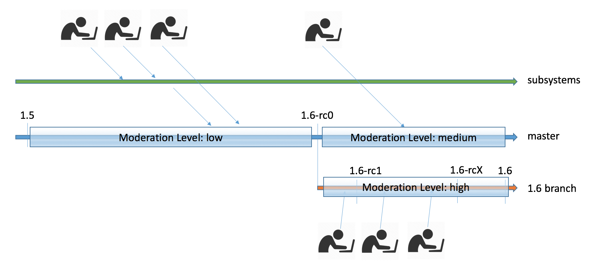

.. _development_model:

Development Model
#################

Terminology
***********

- mainline: The main tree where the core functionality and core features are
  being developed.
- subsystem/feature branch: is a branch within the same repository. In our case,
  we will use the term branch also when referencing branches not in the same
  repository, which are a copy of a repository sharing the same history.
- upstream: A parent branch the source code is based on. This is the branch you
  pull from and push to, basically your upstream.
- LTS: Long Term Support

Release Cycle
*************

The Zephyr project releases on a time-based cycle, rather than a feature-driven
one. Zephyr releases represent an aggregation of the work of many contributors,
companies, and individuals from the community.

A time-based release process enables the Zephyr project to provide users with a
balance of the latest technologies and features and excellent overall quality. A
roughly 3-month release cycle allows the project to coordinate development of
the features that have actually been implemented, allowing the project to
maintain the quality of the overall release without delays because of one or two
features that are not ready yet.

The Zephyr release model is loosely based on the Linux kernel model:

- Release tagging procedure:

  - linear mode on master,
  - release branches for maintenance after release tagging.
- Each release period will consist of a merge window period followed by one or
  more release candidates on which only stabilization changes, bug fixes, and
  documentation can be merged in.

  - Merge window mode: all changes are accepted (subject to approval from the
    respective maintainers.)
  - When the merge window is closed, the gatekeeper lays a vN-rc1 tag and the tree
    enters the release candidate phase
  - CI sees the tag, builds and runs tests; QA analyses the report from the
    build and test run and gives an ACK/NAK to the build
  - The gatekeeper, with QA and any other needed input, determines if the release
    candidate is a go for release
  - If it is a go for a release, the gatekeeper lays a tag release vN at the same
    point
- Development on new features continues in feature branches. Once features are
  ready, they are submitted to mainline during the merge window period and after
  the release is tagged.

.. figure:: release_cycle.png
    :align: center
    :alt: Release Cycle
    :figclass: align-center

    Release Cycle

Merge Window
*************

A relatively straightforward discipline is followed with regard to the merging
of patches for each release.  At the beginning of each development cycle, the
"merge window" is said to be open.  At that time, code which is deemed to be
sufficiently stable (and which is accepted by the development community) is
merged into the mainline tree.  The bulk of changes for a new development cycle
(and all of the major changes) will be merged during this time.

The merge window lasts for approximately two months.  At the end of this time,
the gatekeeper will declare that the window is closed and release the first of
the release candidates.  For the codebase release which is destined to be 0.4.0,
for example, the release which happens at the end of the merge window will be
called 0.4.0-rc1.  The -rc1 release is the signal that the time to merge new
features has passed, and that the time to stabilize the next release of the code
base has begun.

Over the next weeks, only patches which fix problems should be submitted to the
mainline.  On occasion, a more significant change will be allowed, but such
occasions are rare and require a TSC approval (Change Control Board). As a
general rule, if you miss the merge window for a given feature, the best thing
to do is to wait for the next development cycle.  (An occasional exception is
made for drivers for previously unsupported hardware; if they do not touch any
other in-tree code, they cannot cause regressions and should be safe to add at
any time).

As fixes make their way into the mainline, the patch rate will slow over time.
The mainline gatekeeper releases new -rc drops once or twice a week; a normal
series will get up to somewhere between -rc4 and -rc6 before the code base is
considered to be sufficiently stable and the final 0.4.x release is made.

At that point, the whole process starts over again.

    Merge Window

Here is the description of the various moderation levels:

- Low:

  - Major New Features
  - Bug Fixes
  - Refactoring
  - Structure/Directory Changes
- Medium:

  - Bug Fixes, all priorities
  - Enhancements
  - Minor “self-contained” New Features
- High:

  - Bug Fixes: P1 and P2
  - Documentation + Test Coverage

Release Versions
****************

The following syntax should be used for releases and tags in Git:

- Release [Major].[Minor].[Patch Level]
- Release Candidate [Major].[Minor].[Patch Level]-rc[RC Number]
- Tagging:

  - v[Major].[Minor].[Patch Level]-rc[RC Number]
  - v[Major].[Minor].[Patch Level]
  - v[Major].[Minor].99 - A tag applied to master branch to signify that work on
    v[Major].[Minor+1] has started. For example, v1.7.99 will be tagged at the
    start of v1.8 process. The tag corresponds to
    VERSION_MAJOR/VERSION_MINOR/PATCHLEVEL macros as defined for a
    work-in-progress master version. Presence of this tag allows generation of
    sensible output for "git describe" on master, as typically used for
    automated builds and CI tools.

Long Term Support (LTS)
***********************

Long-term support releases are designed to be supported for a longer than normal
period and will be the basis for products and certification for various usages.

The LTS is released every 2 years.

An LTS release will be branched and maintained independently of the mainline
tree.

.. figure:: lts.png
    :align: center
    :alt: Long Term Support Release
    :figclass: align-center

    Long Term Support Release

Changes and fixes flow in both directions, however, changes from master to
LTS branch will be limited to fixes that apply to both branches and for existing
features only.

All fixes for LTS that apply to the mainline tree are pushed to
mainline as well.

Development Environment and Tools
*********************************

Code Review
============

GitHub is intended to provide a framework for reviewing every commit before it
is accepted into the code base. Changes, in the form of Pull Requests (PR) are
uploaded to GitHub but don’t actually become a part of the project until they’ve
been reviewed, passed a series of checks (CI) and approved by maintainers.
GitHub is used to support the standard open source practice of submitting
patches, which are then reviewed by the project members before being applied to
the code base.

The Zephyr project uses GitHub for code reviews and GIT tree management. When
submitting a change or an enhancement to any Zephyr component, a developer should
use GitHub. GitHub automatically assigns a responsible reviewer on a component
basis, as defined in the CODEOWNERS file stored with the code tree in the Zephyr
project repository. A limited set of release managers are allowed to merge a PR
into the master branch once reviews are complete.

Continuous Integration
=======================

All changes submitted to GitHub are subject to sanity tests that are run on
emulated platforms and architectures to identify breakage and regressions that
can be immediately identified.  Sanity testing additionally performs build tests
of a representative number of boards and platforms (subject to hardware
availability in the CI infrastructure). Documentation changes are also verified
through review and build testing to verify doc generation will be successful.

Any failures found during the CI test run will result in a negative review.
Developers are expected to fix issues and rework their patches and submit again.

The CI infrastructure currently runs the following tests:

- Run '''checkpatch''' for code style issues (can vote -1 on errors)
- Gitlint: Git commit style based on project requirements
- License Check: Check for conflicting licenses
- Run '''sanitycheck''' script:

  - Run kernel tests in QEMU (can vote -1 on errors)
  - Build various samples for different boards (can vote -1 on errors)

Dealing with Proposals and RFCs
*******************************

Feature or enhancement proposals for Zephyr are used to propose a new design or
modify an existing feature and get it approved. To better integrate with the
current tools used in the project and to enable traceability and archiving of
such proposals a unified format for enhancement proposals is used.

Procedures
==========

Maintain such proposals in a document format (similar to the documentation
format used in the kernel source tree, using restructured Text) in a GitHub
repository. The review and approval process of GitHub could be used for
approving such proposals as well, so there will be no need for a dedicated tool.

Process
========

- Open an Improvement GitHub Issue with an abstract and the proposal itself
- Send an RFC with the abstract to the mailing list with an abstract and the
  link to the detailed proposal
- Approve/Reject/Defer based on feedback and comments

Bug Reporting and Feature Tracking
***********************************

To maintain traceability and relation between proposals, changes, features, and
issues, cross-referencing a commit with a GitHub Issue and vice versa should be
done. Any changes that originate from a tracked feature or issue should contain
a reference to the feature by mentioning the corresponding Issue or pull-request id.

At any time it should be possible to establish the origin of a change and the
reason behind it by following the references in the code.

Communication and Collaboration
********************************

The Zephyr project mailing lists are important tools used as the primary
communication tool by project member, contributors, and the community. The
mailing list is open for topics related to the project and should be used for
collaboration among team members working on the same feature or subsystem or for
discussion project direction and daily development of the code base. In general,
bug reports and issues should be entered and tracked in the bug tracking system
(GitHub Issues) and not broadcasted to the mailing list, the same applies to
code reviews. Code should be submitted to GitHub using the appropriate tools.

Code Flow and Branches
**********************

Introduction
============

Development in topic branches before features go to mainline allows teams to work
independently on a subsystem or a feature, improves efficiency and turnaround
time and encourages collaboration and streamlines communication between
developers.

Changes submitted to a development branch can evolve and improve incrementally
in a branch before they are finally submitted to the mainline tree for final
integration.

By dedicating an isolated branch to each feature or subsystem, it’s
possible to initiate in-depth discussions around new additions before
integrating them into the official project.

Individual code changes and fixes can still be submitted to the main tree
without going through a development branch, however, such changes can be
redirected to a branch owner if the change is deemed to be part of a subsystem
that is maintained in a branch and needs review from subject matter experts
working in a branch. This might be needed to avoid conflicts when changes to the
same files and subsystems happen at the same time.

Roles and Responsibilities
==========================

Development topic branch owners have the following responsibilities:

- Use the infrastructure and tools provided by the project (GitHub, Git)
- Review changes coming from team members and request review from branch owners
  when submitting changes.
- Keep the branch in sync with upstream and update on regular basis.
- Push changes frequently to upstream using the following methods:

  - GitHub changes: for example, when reviews have not been done in local branch
    (one-man branch).
  - Merge requests: When a set of changes has been done in a local branch and
    has been reviewed and tested in a feature branch.
