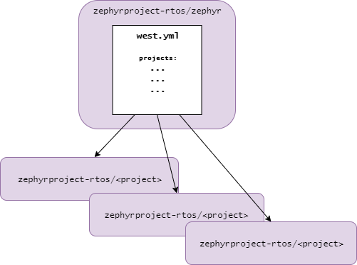

.. _repo-structure:

Repository structure
####################

Introduction
************

The Zephyr Project codebase was, for a long time, contained in a single `Git`_
repository. As the project evolved, it became clear that, :ref:`due to multiple
reasons <west-why-multi-repo>`, the project's code and supporting files needed
to be split out into a set of repositories instead.

To that end a new tool, :ref:`west`, was developed and introduced to ease the
burden of managing multiple Git repositories.

Structure
*********

The Zephyr Project codebase is composed of several `Git`_ repositories,
organized in a :ref:`star topology <west-topologies>` as depicted below.

    Zephyr repository structure

There are two types of repositories as shown by the figure:

  * The `manifest repository`_ or also commonly named the "zephyr" repository
    contains the `west.yml`_ :ref:`manifest file <west-manifests>` that
    lists all other repositories that the manifest repository depends on.
  * The project repositories are the ones containing :ref:`west projects
    <west-installation>`. Most (but not all) of those west projects are also
    :ref:`modules <modules>`.

All repositories are hosted under the `zephyrproject-rtos`_ GitHub organization,
since only repositories hosted under it are allowed to be featured in the
official Zephyr manifest file. This ensures that the repositories and all
referenced revisions will always be available to Zephyr users.

.. _branches:

Branches
********

Both the `manifest repository`_ and the project repositories may include the
following branches:

``master``
  Which contains the latest state of development. In the case of :ref:`modules
  <modules>` that fork an external project this may not reflect the latest state
  of the upstream project's development, since projects are upmerged manually
  when required by Zephyr itself.

``topic-\*``
  Topic branches that are used for shared development of a new feature

``vx.y-branch``
  Branches which track maintenance releases based on a major
  release

``backport-*``
  Branches that are created automatically when a Pull Request is labeled to be
  backported to a ``vx.y-branch``

Development in topic branches before features go to mainline allows teams to
work independently on a subsystem or a feature, improves efficiency and
turnaround time, and encourages collaboration and streamlines communication
between developers.

Changes submitted to a development topic branch can evolve and improve
incrementally in a branch, before they are submitted to the mainline tree for
final integration.

By dedicating an isolated branch to complex features, it's
possible to initiate in-depth discussions around new additions before
integrating them into the official project.

Topic branches
==============

Development topic branch owners have the following responsibilities:

- Use the infrastructure and tools provided by the project (GitHub, Git)
- Review changes coming from team members and request review from branch owners
  when submitting changes.
- Keep the branch in sync with upstream and update on a regular basis.
- Push changes frequently to upstream using the following methods:

  - GitHub pull requests: for example, when reviews have not been done in the local
    branch (one-man branch).
  - Merge requests: When a set of changes has been done in a local branch and
    has been reviewed and tested in a topic branch.

.. _Git: https://git-scm.com/
.. _zephyrproject-rtos: https://github.com/zephyrproject-rtos
.. _manifest repository: https://github.com/zephyrproject-rtos/zephyr
.. _west.yml: https://github.com/zephyrproject-rtos/zephyr/blob/master/west.yml
