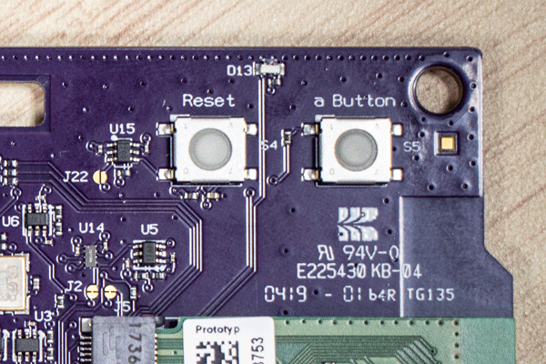

.. _getting_started:

Getting Started Guide
#####################

Follow this guide to:

- Set up a command-line Zephyr development environment on Ubuntu, macOS, or
  Windows (instructions for other Linux distributions are discussed in
  :ref:`installation_linux`)
- Get the source code
- Build, flash, and run a sample application

.. _host_setup:

.. rst-class:: numbered-step

Select and Update OS
********************

Click the operating system you are using.

.. tabs::

   .. group-tab:: Ubuntu

      This guide covers Ubuntu version 18.04 LTS and later.

      .. code-block:: bash

         sudo apt update
         sudo apt upgrade

   .. group-tab:: macOS

      On macOS Mojave or later, select *System Preferences* >
      *Software Update*. Click *Update Now* if necessary.

      On other versions, see `this Apple support topic
      <https://support.apple.com/en-us/HT201541>`_.

   .. group-tab:: Windows

      Select *Start* > *Settings* > *Update & Security* > *Windows Update*.
      Click *Check for updates* and install any that are available.

.. _install-required-tools:

.. rst-class:: numbered-step

Install dependencies
********************

Next, you'll install some host dependencies using your package manager.

.. tabs::

   .. group-tab:: Ubuntu

      #. Use ``apt`` to install dependencies:

         .. code-block:: bash

            sudo apt install --no-install-recommends git cmake ninja-build gperf \
              ccache dfu-util device-tree-compiler wget \
              python3-dev python3-pip python3-setuptools python3-tk python3-wheel xz-utils file \
              make gcc gcc-multilib g++-multilib libsdl2-dev

      #. Verify the version of cmake installed on your system using::

            cmake --version

         If it's not version 3.13.1 or higher, follow these steps to
         add the `Kitware third-party apt repository <https://apt.kitware.com/>`__
         to get an updated version of cmake.

         a) Add the Kitware signing key:

            .. code-block:: bash

               wget -O - https://apt.kitware.com/keys/kitware-archive-latest.asc 2>/dev/null | sudo apt-key add -

         b) Add the Kitware apt repository for your OS release. For Ubuntu
            18.04 LTS:

            .. code-block:: bash

               sudo apt-add-repository 'deb https://apt.kitware.com/ubuntu/ bionic main'

         c) Then install the updated cmake with ``apt``:

            .. code-block:: bash

               sudo apt update
               sudo apt install cmake

   .. group-tab:: macOS

      #. Install `Homebrew <https://brew.sh/>`_:

         .. code-block:: bash

            /usr/bin/ruby -e "$(curl -fsSL https://raw.githubusercontent.com/Homebrew/install/master/install)"

      #. Use ``brew`` to install dependencies:

         .. code-block:: bash

            brew install cmake ninja gperf python3 ccache qemu dtc

   .. group-tab:: Windows

      .. note::

         Due to issues finding executables, the Zephyr Project doesn't
         currently support application flashing using the `Windows Subsystem
         for Linux (WSL)
         <https://msdn.microsoft.com/en-us/commandline/wsl/install_guide>`_
         (WSL).

         Therefore, we don't recommend using WSL when getting started.

      These instructions must be run in a ``cmd.exe`` command prompt. The
      required commands differ on PowerShell.

      These instructions rely on `Chocolatey`_. If Chocolatey isn't an option,
      you can install dependencies from their respective websites and ensure
      the command line tools are on your :envvar:`PATH` :ref:`environment
      variable <env_vars>`.

      |p|

      #. `Install chocolatey`_

      #. Open an **Administrator** ``cmd.exe`` window: press the Windows key,
         type "cmd.exe", right-click the result, and choose "Run as
         Administrator".

      #. Disable global confirmation to avoid having to confirm
         installation of individual programs:

         .. code-block:: console

            choco feature enable -n allowGlobalConfirmation

      #. Use ``choco`` to install dependencies:

         .. code-block:: console

            choco install cmake --installargs 'ADD_CMAKE_TO_PATH=System'
            choco install ninja gperf python git

      #. Open a new ``cmd.exe`` window **as a regular user** to continue.

.. _Chocolatey: https://chocolatey.org/
.. _Install chocolatey: https://chocolatey.org/install

.. _get_the_code:
.. _clone-zephyr:
.. _install_py_requirements:
.. _gs_python_deps:

.. rst-class:: numbered-step

Get Zephyr and install Python dependencies
******************************************

Next, clone Zephyr and its :ref:`modules <modules>` into a new :ref:`west
<west>` workspace named :file:`zephyrproject`. You'll also install Zephyr's
additional Python dependencies.

.. tabs::

   .. group-tab:: Ubuntu

      #. Install west, and make sure :file:`~/.local/bin` is on your
         :envvar:`PATH` :ref:`environment variable <env_vars>`:

         .. code-block:: bash

            pip3 install --user -U west
            echo 'export PATH=~/.local/bin:"$PATH"' >> ~/.bashrc
            source ~/.bashrc

      #. Get the Zephyr source code:

         .. code-block:: bash

            west init ~/zephyrproject
            cd ~/zephyrproject
            west update

      #. Export a :ref:`Zephyr CMake package <cmake_pkg>`. This allows CMake to
         automatically load boilerplate code required for building Zephyr
         applications.

         .. code-block:: console

            west zephyr-export

      #. Zephyr's ``scripts/requirements.txt`` file declares additional Python
         dependencies. Install them with ``pip3``.

         .. code-block:: bash

            pip3 install --user -r ~/zephyrproject/zephyr/scripts/requirements.txt

   .. group-tab:: macOS

      #. Install west:

         .. code-block:: bash

            pip3 install west

      #. Get the Zephyr source code:

         .. code-block:: bash

            west init ~/zephyrproject
            cd ~/zephyrproject
            west update

      #. Export a :ref:`Zephyr CMake package <cmake_pkg>`. This allows CMake to
         automatically load boilerplate code required for building Zephyr
         applications.

         .. code-block:: console

            west zephyr-export

      #. Zephyr's ``scripts/requirements.txt`` file declares additional Python
         dependencies. Install them with ``pip3``.

         .. code-block:: bash

            pip3 install -r ~/zephyrproject/zephyr/scripts/requirements.txt

   .. group-tab:: Windows

      #. Install west:

         .. code-block:: bash

            pip3 install west

      #. Get the Zephyr source code:

         .. code-block:: bat

            cd %HOMEPATH%
            west init zephyrproject
            cd zephyrproject
            west update

      #. Export a :ref:`Zephyr CMake package <cmake_pkg>`. This allows CMake to
         automatically load boilerplate code required for building Zephyr
         applications.

         .. code-block:: console

            west zephyr-export

      #. Zephyr's ``scripts/requirements.txt`` file declares additional Python
         dependencies. Install them with ``pip3``.

         .. code-block:: bat

            pip3 install -r %HOMEPATH%\zephyrproject\zephyr\scripts\requirements.txt

.. rst-class:: numbered-step

Install a Toolchain
*******************

A toolchain provides a compiler, assembler, linker, and other programs required
to build Zephyr applications.

.. tabs::

   .. group-tab:: Ubuntu

      The Zephyr Software Development Kit (SDK) contains toolchains for each of
      Zephyr's supported architectures. It also includes additional host tools,
      such as custom QEMU binaries and a host compiler.

      |p|

      #. Download the `latest SDK installer
         <https://github.com/zephyrproject-rtos/sdk-ng/releases>`_:

         .. code-block:: bash

            cd ~
            wget https://github.com/zephyrproject-rtos/sdk-ng/releases/download/v0.11.3/zephyr-sdk-0.11.3-setup.run

      #. Run the installer, installing the SDK in :file:`~/zephyr-sdk-0.11.3`:

         .. code-block:: bash

            chmod +x zephyr-sdk-0.11.3-setup.run
            ./zephyr-sdk-0.11.3-setup.run -- -d ~/zephyr-sdk-0.11.3

         .. note::
            It is recommended to install the Zephyr SDK at one of the following locations:

            * ``$HOME/zephyr-sdk[-x.y.z]``
            * ``$HOME/.local/zephyr-sdk[-x.y.z]``
            * ``$HOME/.local/opt/zephyr-sdk[-x.y.z]``
            * ``$HOME/bin/zephyr-sdk[-x.y.z]``
            * ``/opt/zephyr-sdk[-x.y.z]``
            * ``/usr/zephyr-sdk[-x.y.z]``
            * ``/usr/local/zephyr-sdk[-x.y.z]``

            where ``[-x.y.z]`` is optional text, and can be any text, for example ``-0.11.3``.

            If installing the Zephyr SDK outside any of those locations, please read: :ref:`zephyr_sdk`

            You cannot move the SDK directory after you have installed it.

      #. Install `udev <https://en.wikipedia.org/wiki/Udev>`_ rules, which
         allow you to flash most Zephyr boards as a regular user:

         .. code-block:: bash

            sudo cp ~/zephyr-sdk-0.11.3/sysroots/x86_64-pokysdk-linux/usr/share/openocd/contrib/60-openocd.rules /etc/udev/rules.d
            sudo udevadm control --reload

   .. group-tab:: macOS

      Follow the instructions in :ref:`gs_toolchain`. Note that the Zephyr SDK
      is not available on macOS.

      Do not forget to set the required :ref:`environment variables <env_vars>`
      (:envvar:`ZEPHYR_TOOLCHAIN_VARIANT` and toolchain specific ones).

   .. group-tab:: Windows

      Follow the instructions in :ref:`gs_toolchain`. Note that the Zephyr SDK
      is not available on Windows.

      Do not forget to set the required :ref:`environment variables <env_vars>`
      (:envvar:`ZEPHYR_TOOLCHAIN_VARIANT` and toolchain specific ones).

.. _getting_started_run_sample:

.. rst-class:: numbered-step

Build the Blinky Sample
***********************

.. note::

   Blinky is compatible with most, but not all, :ref:`boards`. If your board
   does not meet Blinky's :ref:`blinky-sample-requirements`, then
   :ref:`hello_world` is a good alternative.

Build the :ref:`blinky-sample` with :ref:`west build <west-building>`, changing
``<your-board-name>`` appropriately for your board:

.. tabs::

   .. group-tab:: Ubuntu

      .. code-block:: bash

         cd ~/zephyrproject/zephyr
         west build -p auto -b <your-board-name> samples/basic/blinky

   .. group-tab:: macOS

      .. code-block:: bash

         cd ~/zephyrproject/zephyr
         west build -p auto -b <your-board-name> samples/basic/blinky

   .. group-tab:: Windows

      .. code-block:: bat

         cd %HOMEPATH%\zephyrproject\zephyr
         west build -p auto -b <your-board-name> samples\basic\blinky

The ``-p auto`` option automatically cleans byproducts from a previous build
if necessary, which is useful if you try building another sample.

.. rst-class:: numbered-step

Flash the Sample
****************

Connect your board, usually via USB, and turn it on if there's a power switch.
If in doubt about what to do, check your board's page in :ref:`boards`.

Then flash the sample using :ref:`west flash <west-flashing>`:

.. code-block:: console

   west flash

You may need to install additional :ref:`host tools <debug-host-tools>`
required by your board. The ``west flash`` command will print an error if any
required dependencies are missing.

If you're using blinky, the LED will start to blink as shown in this figure:

   Phytec :ref:`reel_board <reel_board>` running blinky

Next Steps
**********

Here are some next steps for exploring Zephyr:

* Try other :ref:`samples-and-demos`
* Learn about :ref:`application` and the :ref:`west <west>` tool
* Find out about west's :ref:`flashing and debugging <west-build-flash-debug>`
  features, or more about :ref:`debugging` in general
* Check out :ref:`beyond-GSG` for additional setup alternatives and ideas
* Discover :ref:`project-resources` for getting help from the Zephyr
  community
