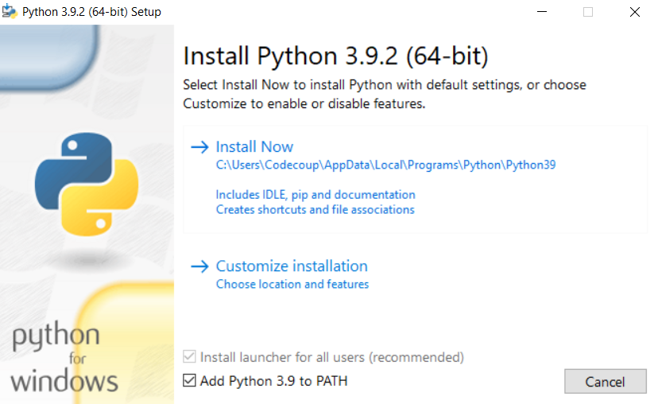
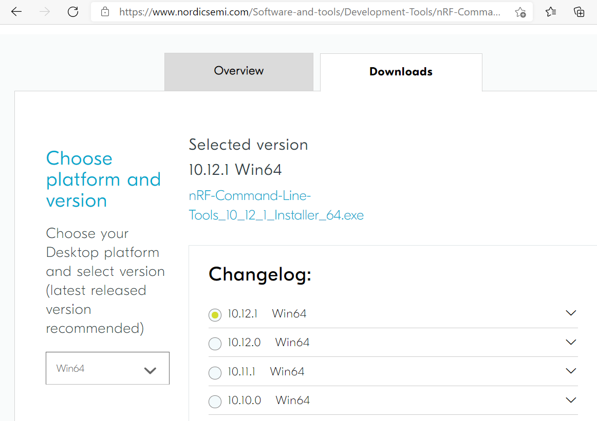
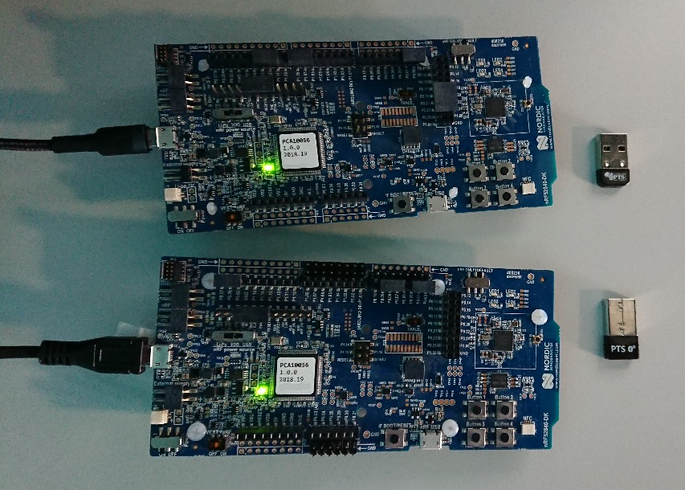
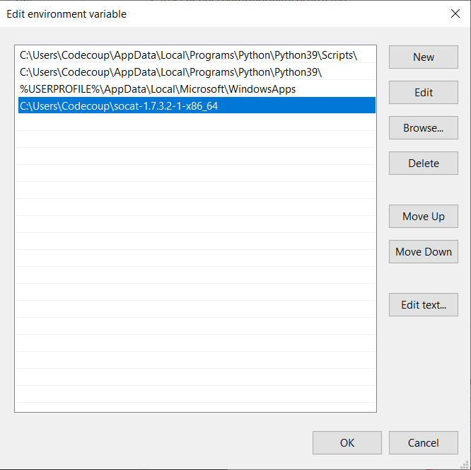

.. _autopts-win10:

AutoPTS on Windows 10 with nRF52 board
#######################################

Overview
========

This tutorial shows how to setup AutoPTS client and server to run both on
Windows 10. We use WSL1 with Ubuntu only to build a Zephyr project to
an elf file, because Zephyr SDK is not available on Windows yet.
Tutorial covers only nrf52840dk.

Update Windows and drivers
===========================

Update Windows in:

Start -> Settings -> Update & Security -> Windows Update

Update drivers, following the instructions from your hardware vendor.

Install Python 3
=================

Download and install `Python 3 <https://www.python.org/downloads/>`_.
Setup was tested with versions >=3.8. Let the installer add the Python
installation directory to the PATH and disable the path length limitation.

.. image:: install_python2.png
   :height: 300
   :width: 450
   :align: center

Install Git
============

Download and install `Git <https://git-scm.com/downloads>`_.
During installation enable option: Enable experimental support for pseudo
consoles. We will use Git Bash as Windows terminal.

.. image:: install_git.png
   :height: 350
   :width: 400
   :align: center

Install PTS 8
==============

Install latest PTS from https://www.bluetooth.org. Remember to install
drivers from installation directory
"C:/Program Files (x86)/Bluetooth SIG/Bluetooth PTS/PTS Driver/win64/CSRBlueCoreUSB.inf"

.. image:: install_pts_drivers.png
   :height: 250
   :width: 850
   :align: center

.. note::

    Starting with PTS 8.0.1 the Bluetooth Protocol Viewer is no longer included.
    So to capture Bluetooth events, you have to download it separately.

Setup Zephyr project for Windows
=================================

Setup from Zephyr site https://docs.zephyrproject.org/latest/getting_started/index.html:

Open Git Bash and go to home:

.. code-block::

    cd ~

Install west:

.. code-block::

    pip3 install west

Get the Zephyr source code:

.. code-block::

    west init zephyrproject

Go into freshly created folder:

.. code-block::

    cd zephyrproject

Run:

.. code-block::

    west update

Export a Zephyr CMake package. This allows CMake to automatically load
boilerplate code required for building Zephyr applications:

.. code-block::

    west zephyr-export

Zephyr’s scripts/requirements.txt file declares additional Python
dependencies. Install them with pip:

.. code-block::

    pip3 install -r ~\zephyrproject\zephyr\scripts\requirements.txt

Setup WSL1 with Ubuntu 20.4
============================

Setup Install Ubuntu 20.4 on `WSL1 <https://docs.microsoft.com/en-us/windows/wsl/install-win10>`_.
Open PowerShell as Administrator and run:

.. code-block::

   dism.exe /online /enable-feature /featurename:Microsoft-Windows-Subsystem-Linux /all /norestart

Restart Windows. After restart, open Microsoft Store and install Ubuntu 20.4 LTS.

.. image:: install_ubuntu_on_wsl.png
   :height: 350
   :width: 500
   :align: center

Run Ubuntu. You will be asked to create a user account and password:

.. image:: ubuntu_first_launch.png
   :height: 150
   :width: 800
   :align: center

When finished, run commands:

.. code-block::

    sudo apt update
    sudo apt upgrade

Install python3:

.. code-block::

    sudo apt install python3

Install pip:

.. code-block::

    sudo apt install python3-pip

Install west:

.. code-block::

    pip3 install --user -U west

Export local bin to PATH:

.. code-block::

    echo 'export PATH=~/.local/bin:"$PATH"' >> ~/.bashrc

Reload PATH:

.. code-block::

    source ~/.bashrc

Install cmake:

.. code-block::

    sudo apt install cmake

Go to your zephyrproject:

.. code-block::

    cd /mnt/c/Users/Codecoup/zephyrproject

and then run:

.. code-block::

    west zephyr-export
    pip3 install --user wheel
    pip3 install --user -r /mnt/c/Users/codecoup/zephyrproject/zephyr/scripts/requirements.txt

Check if all modules have been installed:

.. code-block::

    pip3 list

If modules still will be missing, just install them with:

.. code-block::

    pip3 install <module_name>

Install Ninja:

.. code-block::

    pip3 install ninja

Go to home:

.. code-block::

    cd ~

Download latest toolchain installer from https://github.com/zephyrproject-rtos/sdk-ng/releases. Move it to ~

.. code-block::

    mv /mnt/c/Users/Codecoup/Downloads/zephyr-sdk-<your_version>-setup.run ~

Give permissions to the installer:

.. code-block::

    chmod +x zephyr-sdk-<your_version>-setup.run

and run the installer:

.. code-block::

    ./zephyr-sdk-<your_version>-setup.run -- -d ~/zephyr-sdk-<your_version>

Copy rules:

.. code-block::

    sudo cp ~/zephyr-sdk-<your_version>/sysroots/x86_64-pokysdk-linux/usr/share/openocd/contrib/60-openocd.rules /etc/udev/rules.d

Restart the Ubuntu machine. You may want to shutdown all WSL consoles from
Windows's Git Bash:

.. code-block::

    wsl --shutdown

After Ubuntu restart, go to:

.. code-block::

    cd /mnt/c/Users/codecoup/zephyrproject

and test if west can build:

.. code-block::

    west build -p auto -b nrf52840dk_nrf52840 zephyr/tests/bluetooth/tester/

From now on, you can build projects by typing in Windows's Git Bash:

.. code-block::

    wsl -d Ubuntu-20.04 -u codecoup -- bash -c -i "cd /mnt/c/Users/Codecoup/zephyrproject/ ; west build -p auto -b nrf52840dk_nrf52840 zephyr/tests/bluetooth/tester/"

Install nrftools
=================

On Windows download latest nrftools (version >= 10.12.1) from site
https://www.nordicsemi.com/Software-and-tools/Development-Tools/nRF-Command-Line-Tools/Download
and run default install.

Connect devices
================

.. image:: devices_2.png
   :height: 700
   :width: 500
   :align: center

Flash board
============

In Device Manager find COM port of your nrf board. In my case it is COM3.

.. image:: device_manager.png
   :height: 400
   :width: 450
   :align: center

In Git Bash, go to zephyrproject

.. code-block::

    cd ~/zephyrproject

You can display flashing options with:

.. code-block::

    west flash --help

and flash board with built earlier elf file:

.. code-block::

    west flash --skip-rebuild --board-dir /dev/ttyS2 --elf-file ~/zephyrproject/build/zephyr/zephyr.elf

Note that west does not accept COMs, so use /dev/ttyS2 as the COM3 equivalent,
/dev/ttyS2 as the COM3 equivalent, etc.(/dev/ttyS + decremented COM number).

Setup auto-pts project
=======================

In Git Bash, clone project repo:

.. code-block::

    git clone https://github.com/intel/auto-pts.git

Go into the project folder:

.. code-block::

    cd auto-pts

Install required python modules:

.. code-block::

   pip3 install --user wheel
   pip3 install --user -r autoptsserver_requirements.txt
   pip3 install --user -r autoptsclient_requirements.txt

Install socat.exe
==================

Download and extract socat.exe from https://sourceforge.net/projects/unix-utils/files/socat/1.7.3.2/
into folder ~/socat-1.7.3.2-1-x86_64/.

.. image:: download_socat.png
   :height: 400
   :width: 450
   :align: center

Add path to directory of socat.exe to PATH:

Running AutoPTS
================

Server and client by default will run on localhost address. Run server:

.. code-block::

    python ./autoptsserver.py -S 65000

.. image:: autoptsserver_run.png
   :height: 200
   :width: 800
   :align: center

.. note::

    If the error "ImportError: No module named pywintypes" appeared after the fresh setup,
    uninstall and install the pywin32 module:

    .. code-block::

        pip install --upgrade --force-reinstall pywin32

Run client:

.. code-block::

    python ./autoptsclient-zephyr.py zephyr-master ~/zephyrproject/build/zephyr/zephyr.elf -t COM3 -b nrf52 -S 65000 -C 65001

.. image:: autoptsclient_run.png
   :height: 200
   :width: 800
   :align: center

At the first run, when Windows asks, enable connection through firewall:

.. image:: allow_firewall.png
   :height: 450
   :width: 600
   :align: center

Troubleshooting
================

- "When running actual hardware test mode, I have only BTP TIMEOUTs."

This is a problem with connection between auto-pts client and board. There are many possible causes. Try:

- Clean your auto-pts and zephyr repos with

.. warning::

    This command will force the irreversible removal of all uncommitted files in the repo.

.. code-block::

    git clean -fdx

then build and flash tester elf again.

- If you have set up Windows on virtual machine, check if guest extensions are installed properly or change USB compatibility mode in VM settings to USB 2.0.

- Check, if firewall in not blocking python.exe or socat.exe.

- Check if board sends ready event after restart (hex 00 00 80 ff 00 00). Open serial connection to board with e.g. PuTTy with proper COM and baud rate. After board reset you should see some strings in console.

- Check if socat.exe creates tunel to board. Run in console

.. code-block::

    socat.exe -x -v tcp-listen:65123 /dev/ttyS2,raw,b115200

where /dev/ttyS2 is the COM3 equivalent. Open PuTTY, set connection type to Raw, IP to 127.0.0.1, port to 65123. After board reset you should see some strings in console.
