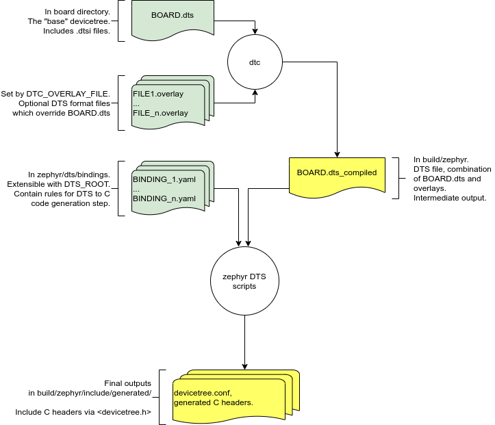

.. _device-tree:

Devicetree
##########

Zephyr uses the *devicetree* data structure to describe the hardware available
on a board, as well as its initial configuration in an application. Note that
"devicetree" -- without spaces -- is preferred to "devicetree". The
`Devicetree specification`_ fully defines this data structure and its source
and binary representations.

.. _device-tree-intro:

Introduction
************

.. _Devicetree specification: https://www.devicetree.org/

This figure shows how devicetree fits into the Zephyr build system:

.. figure:: zephyr_dt_build_flow.png
   :figclass: align-center

   Devicetree build flow

Zephyr's build system can use a devicetree to generate C language code. This
code generation uses rules in additional files called :ref:`devicetree bindings
<bindings>` to control how devicetree data is converted to C definitions. The
generated code can be included by Zephyr :ref:`device drivers <device_drivers>`
and other C sources. The C macros generated by this process all begin with
``DT_``.

This differs significantly from how devicetree is used on Linux. The
Linux kernel would instead read the entire devicetree data structure in its
binary form, parsing it at runtime in order to load and initialize device
drivers. Zephyr does not work this way because the size of the devicetree
binary and associated handling code would be too large to fit comfortably on
the relatively constrained devices Zephyr supports.

As the name indicates, a devicetree is a tree. The human-readable text format
for this tree is called DTS (for devicetree source), and is defined in the
Devicetree Specification. Here is an example DTS file:

.. code-block:: none

   /dts-v1/;

   / {
           a-node {
                   subnode_label: a-sub-node {
                           foo = <3>;
                   };
           };
   };

This example has three nodes:

#. A root node
#. A node named ``a-node``, which is a child of the root node
#. A node named ``a-sub-node``, which is a child of ``a-node``

Nodes can be given *labels*, which are unique shorthands that can be used to
refer to the labeled node elsewhere in the devicetree. Above, ``a-sub-node``
has label ``subnode_label``.

Devicetree nodes have *paths* identifying their locations in the tree. Like
Unix file system paths, devicetree paths are strings separated by slashes
(``/``), and the root node's path is a single slash: ``/``. Otherwise, each
node's path is formed by concatenating the node's ancestors' names with the
node's own name, separated by slashes. For example, the full path to
``a-sub-node`` is ``/a-node/a-sub-node``.

Devicetree nodes can also have *properties*. Properties are name/value
pairs. The values are simple byte arrays. Node ``a-sub-node`` has a property
named ``foo``, whose value is a 32-bit big-endian unsigned integer with value
3. The size and type of ``foo``\ 's value are implied by the enclosing angle
brackets (``<`` and ``>``) in the DTS. Refer to the Devicetree Specification
for a complete list of ways to write a property value in a DTS file.

In practice, devicetree nodes correspond to some hardware, and the node
hierarchy reflects the hardware's physical layout. For example, let's consider
a board with three I2C peripherals connected to an I2C bus master on an SoC,
like this:

.. figure:: zephyr_dt_i2c_high_level.png
   :alt: representation of a board with three I2C peripherals
   :figclass: align-center

Nodes corresponding to the I2C bus master and each I2C peripheral would be
present in this board's devicetree. Reflecting the hardware layout, the
devicetree's peripheral nodes would be children of the bus master node. Similar
conventions exist for representing other types of hardware in devicetree.

The corresponding DTS would look something like this:

.. code-block:: none

   / {
           soc {
                   i2c-bus-master {
                           i2c-peripheral-1 {
                           };
                           i2c-peripheral-2 {
                           };
                           i2c-peripheral-3 {
                           };
                   };
           };
   };

Properties are used in practice to describe or configure the hardware the node
represents. For example, an I2C peripheral's node has a property whose value is
the peripheral's address on the bus.

Here's a tree representing the same example, but with real-world node
names and properties you might see when working with I2C devices.

.. figure:: zephyr_dt_i2c_example.png
   :figclass: align-center

   I2C devicetree example with real-world names and properties

Above, node names -- like ``i2c@40003000`` -- are at the top of each node, with
a gray background, except for the root node, which is shown using its path
``/``. Properties are shown as ``name=value`` pairs below the node names.

Some important properties are:

- **compatible**: this says what "kind" of device the node represents. Its
  value is a null-terminated string in the format "vendor,device", like
  ``"avago,apds9960"``, or a sequence of these, like ``"ti,hdc",
  "ti,hdc1010"``. The build system uses the compatible property to find the
  right bindings for the node.
- **label**: the device's name according to Zephyr's :ref:`device_drivers`. The
  value can be passed to :c:func:`device_get_binding()` to retrieve the
  corresponding driver-level :ref:`struct device* <device_struct>`. This
  pointer can then be passed to the correct driver API by application code to
  interact with the device. For example, calling
  ``device_get_binding("I2C_0")`` would return a pointer to a device
  structure which could be passed to :ref:`I2C API <i2c_api>` functions like
  :c:func:`i2c_transfer()`. The generated C header will also contain a macro
  which expands to this string.
- **reg**: information used to address the device. This could be a
  memory-mapped I/O address range (as with ``i2c@40003000``\ 's reg property),
  an I2C bus address (as with ``apds9960@39`` and its devicetree siblings), a
  SPI chip select line, or some other value depending on the kind of device the
  node represents.

This tree has the following DTS.

.. code-block:: none

   / {
           soc {
                   i2c@40003000 {
                           compatible = "nordic,nrf-twim";
                           label = "I2C_0";
                           reg = <0x40003000 0x1000>;

                           apds9960@39 {
                                   compatible = "avago,apds9960";
                                   label = "APDS9960";
                                   reg = <0x39>;
                           };
                           ti_hdc@43 {
                                   compatible = "ti,hdc", "ti,hdc1010";
                                   label = "HDC1010;
                                   reg = <0x43>;
                           };
                           mma8652fc@1d {
                                   compatible = "nxp,fxos8700", "nxp,mma8652fc";
                                   label = "MMA8652FC";
                                   reg = <0x1d>;
                           };
                   };
           };
   };

Input and output files
**********************

The first figure in the :ref:`device-tree-intro` shows how devicetree fits into
the Zephyr build system. This section describes the input and output files in
more detail.

   Devicetree input (green) and output (yellow) files

DTS files usually have ``.dts`` or ``.dtsi`` (for Devicetree Source Include)
extensions. Zephyr's build system looks for a file named :file:`BOARD.dts` in
the board definition directory; this file contains the board's base
devicetree. See :ref:`dt_k6x_example` for real-world examples.

The build system combines the board's DTS with additional input files called
*overlays* to produce a final devicetree source file. Overlays are also written
in the DTS format, but have a :file:`.overlay` extension to make it clear that
they're overlays. You can specify the overlay files to use at build time using
the :makevar:`DTC_OVERLAY_FILE` CMake variable described in
:ref:`important-build-vars`. The build system also looks for devicetree
overlays in several locations by default; see :ref:`application_dt` for the
list.

Overlays can be used to add or delete nodes from the tree, or to modify node
properties and their values. Along with Kconfig, devicetree overlays let you
reconfigure the kernel and device drivers without modifying their source code.

Before they are combined, the C preprocessor is run on :file:`BOARD.dts` and any
overlays. This allows these files to use C macros and include directives.

The combined devicetree is written to a DTS file named
:file:`BOARD.dts_compiled` in the application build directory. This file
contains the final devicetree.

This devicetree and the set of :ref:`bindings` are then used to generate C
definitions using scripts in :zephyr_file:`scripts/dts/`. These definitions can
be included via the ``generated_dts_board.h`` header file, which the build
system places on the C preprocessor include path. This file is not generated;
it is in :zephyr_file:`include/generated_dts_board.h`.  (Its name was chosen
for backwards compatibility.)

**Do not include the generated C headers in the build directory directly**. Use
``generated_dts_board.h`` instead.

Zephyr device drivers typically use information from ``generated_dts_board.h``
to statically allocate and initialize :ref:`struct device <device_struct>`
instances. Property values from ``generated_dts_board.h`` are usually stored in
ROM in the value pointed to by a ``device->config->config_info`` field. For
example, a ``struct device`` corresponding to an I2C peripheral would store the
peripheral address in its ``reg`` property there.

Application source code with a pointer to the ``struct device`` can then pass
it to driver APIs in :zephyr_file:`include/drivers/`. These API functions
usually take a ``struct device*`` as their first argument. This allows the
driver API to use information from devicetree to interact with the device
hardware.

Temporary "fixup" files are currently required for devicetree support on most
devices.  These fixup files by default reside in the board and soc directories
and are named ``dts_fixup.h``. These fixup files map the generated include
information to the current driver/source usage. They exist for historical
reasons; Zephyr is moving away from needing or using these files.

.. _dt_k6x_example:

Example: FRDM-K64F and Hexiwear K64
===================================

.. Give the filenames instead of the full paths below, as it's easier to read.
   The cramped 'foo.dts<path>' style avoids extra spaces before commas.

The FRDM-K64F and Hexiwear K64 board devicetrees are defined in
:zephyr_file:`frdm_k64fs.dts <boards/arm/frdm_k64f/frdm_k64f.dts>` and
:zephyr_file:`hexiwear_k64.dts <boards/arm/hexiwear_k64/hexiwear_k64.dts>`
respectively. Both boards have NXP SoCs from the same Kinetis SoC family, the
K6X.

Common devicetree definitions for K6X are stored in :zephyr_file:`nxp_k6x.dtsi
<dts/arm/nxp/nxp_k6x.dtsi>`, which is included by both board :file:`.dts`
files. :zephyr_file:`nxp_k6x.dtsi<dts/arm/nxp/nxp_k6x.dtsi>` in turn includes
:zephyr_file:`armv7-m.dtsi<dts/arm/armv7-m.dtsi>`, which has common definitions
for Arm v7-M cores.

Since :zephyr_file:`nxp_k6x.dtsi<dts/arm/nxp/nxp_k6x.dtsi>` is meant to be
generic across K6X-based boards, it leaves many devices disabled by default
using ``status`` properties.  For example, there is a CAN controller defined as
follows (with unimportant parts skipped):

.. code-block:: none

   can0: can@40024000 {
   	...
   	status = "disabled";
   	...
   };

It is up to the board :file:`.dts` or application overlay files to enable these
devices as desired, by setting ``status = "okay"``. The board :file:`.dts`
files are also responsible for any board-specific configuration of the device,
such as adding nodes for on-board sensors, LEDs, buttons, etc.

For example, FRDM-K64 (but not Hexiwear K64) :file:`.dts` enables the CAN
controller and sets the bus speed:

.. code-block:: none

   &can0 {
   	status = "okay";
   	bus-speed = <125000>;
   };

The ``&can0 { ... };`` syntax adds/overrides properties on the node with label
``can0``, i.e. the ``can@4002400`` node defined in the :file:`.dtsi` file.

Other examples of board-specific customization is pointing properties in
``aliases`` and ``chosen`` to the right nodes (see :ref:`dt-alias-chosen`), and
making GPIO/pinmux assignments.

.. _dt_vs_kconfig:

Devicetree vs Kconfig
*********************

Along with devicetree, Zephyr also uses the Kconfig language to configure the
source code. Whether to use devicetree or Kconfig for a particular purpose can
sometimes be confusing. This section should help you decide which one to use.

In short:

* Use devicetree to describe **hardware** and its **boot-time configuration**.
  Examples include peripherals on a board, boot-time clock frequencies,
  interrupt lines, etc.
* Use Kconfig to configure **software support** to build into the final
  image. Examples include whether to add networking support, which drivers are
  needed by the application, etc.

In other words, devicetree mainly deals with hardware, and Kconfig with
software.

For example, consider a board containing a SoC with 2 UART, or serial port,
instances.

* The fact that the board has this UART **hardware** is described with two UART
  nodes in the devicetree. These provide the UART type (via the ``compatible``
  property) and certain settings such as the address range of the hardware
  peripheral registers in memory (via the ``reg`` property).
* Additionally, the UART **boot-time configuration** is also described with
  devicetree. This could include configuration such as the RX IRQ line's
  priority and the UART baud rate. These may be modifiable at runtime, but
  their boot-time configuration is described in devicetree.
* Whether or not to include **software support** for UART in the build is
  controlled via Kconfig. Applications which do not need to use the UARTs can
  remove the driver source code from the build using Kconfig, even though the
  board's devicetree still includes UART nodes.

As another example, consider a device with a 2.4GHz, multi-protocol radio
supporting both the Bluetooth Low Energy and 802.15.4 wireless technologies.

* Devicetree should be used to describe the presence of the radio **hardware**,
  what driver or drivers it's compatible with, etc.
* **Boot-time configuration** for the radio, such as TX power in dBm, should
  also be specified using devicetree.
* Kconfig should determine which **software features** should be built for the
  radio, such as selecting a BLE or 802.15.4 protocol stack.

There are two noteworthy **exceptions** to these rules:

* Devicetree's ``chosen`` keyword, which allows the user to select a specific
  instance of a hardware device to be used for a particular purpose. An example
  of this is selecting a particular UART for use as the system's console.
* Devicetree's ``status`` keyword, which allows the user to enable or disable a
  particular instance of a hardware device. This takes precedence over related
  Kconfig options which serve a similar purpose.

Currently supported boards
**************************

Devicetree is currently supported on all embedded targets except posix
(boards/posix).

Adding support for a board
**************************

Adding devicetree support for a given board requires adding a number of files.
These files will contain the DTS information that describes a platform, the
bindings in YAML format, and any fixup files required to support the platform.

It is best practice to separate common peripheral information that could be
used across multiple cores, SoC families, or boards in :file:`.dtsi` files,
reserving the :file:`.dts` suffix for the primary DTS file for a given board.

Devicetree Source File Template
===============================

A board's :file:`.dts` file contains at least a version line, optional
includes, and a root node definition with ``model`` and ``compatible``
properties. These property values denote the particular board.

.. code-block:: none

   /dts-v1/;

   #include <vendor/soc.dtsi>

   / {
           model = "Human readable board name";
           compatible = "vendor,soc-on-your-board's-mcu";
           /* rest of file */
   };

You can use other board :file:`.dts` files as a starting point.

The following is a more precise list of required files:

* Base architecture support

  * Add architecture-specific DTS directory, if not already present.
    Example: dts/arm for Arm.
  * Add target specific devicetree files for base SoC.  These should be
    .dtsi files to be included in the board-specific devicetree files.
  * Add target specific YAML binding files in the dts/bindings/ directory.
    Create the yaml directory if not present.

* SoC family support

  * Add one or more SoC family .dtsi files that describe the hardware
    for a set of devices.  The file should contain all the relevant
    nodes and base configuration that would be applicable to all boards
    utilizing that SoC family.
  * Add SoC family YAML binding files that describe the nodes present in the .dtsi file.

* Board specific support

  * Add a board level .dts file that includes the SoC family .dtsi files
    and enables the nodes required for that specific board.
  * Board .dts file should specify the SRAM and FLASH devices, if present.

    * Flash device node might specify flash partitions. For more details see
      :ref:`flash_partitions`

  * Add board-specific YAML binding files, if required.  This would occur if the
    board has additional hardware that is not covered by the SoC family
    .dtsi/.yaml files.

* Fixup files

  * Fixup files contain mappings from existing Kconfig options to the actual
    underlying DTS derived configuration #defines.  Fixup files are temporary
    artifacts until additional DTS changes are made to make them unnecessary.

* Overlay Files (optional)

  * Overlay files contain tweaks or changes to the SoC and Board support files
    described above. They can be used to modify devicetree configurations
    without having to change the SoC and Board files. See
    :ref:`application_dt` for more information on overlay files and the Zephyr
    build system.

.. _dt-alias-chosen:

``aliases`` and ``chosen`` nodes
================================

Using an alias with a common name for a particular node makes it easier for you
to write board-independent source code. Devicetree ``aliases`` nodes  are used
for this purpose, by mapping certain generic, commonly used names to specific
hardware resources:

.. code-block:: yaml

   aliases {
      led0 = &led0;
      sw0 = &button0;
      sw1 = &button1;
      uart-0 = &uart0;
      uart-1 = &uart1;
   };

Certain software subsystems require a specific hardware resource to bind to in
order to function properly. Some of those subsystems are used with many
different boards, which makes using the devicetree ``chosen`` nodes very
convenient. By doing, so the software subsystem can rely on having the specific
hardware peripheral assigned to it. In the following example we bind the shell
to ``uart1`` in this board:

.. code-block:: yaml

   chosen {
      zephyr,shell-uart = &uart1;
   };

The full set of Zephyr-specific ``chosen`` nodes follows:

.. list-table::
   :header-rows: 1

   * - ``chosen`` node name
     - Generated symbol

   * - ``zephyr,flash``
     - ``CONFIG_FLASH``
   * - ``zephyr,sram``
     - ``CONFIG_SRAM_SIZE``/``CONFIG_SRAM_BASE_ADDRESS``
       (via ``DT_SRAM_SIZE``/``DT_SRAM_BASE_ADDRESS``)
   * - ``zephyr,ccm``
     - ``DT_CCM``
   * - ``zephyr,console``
     - ``DT_UART_CONSOLE_ON_DEV_NAME``
   * - ``zephyr,shell-uart``
     - ``DT_UART_SHELL_ON_DEV_NAME``
   * - ``zephyr,bt-uart``
     - ``DT_BT_UART_ON_DEV_NAME``
   * - ``zephyr,uart-pipe``
     - ``DT_UART_PIPE_ON_DEV_NAME``
   * - ``zephyr,bt-mon-uart``
     - ``DT_BT_MONITOR_ON_DEV_NAME``
   * - ``zephyr,uart-mcumgr``
     - ``DT_UART_MCUMGR_ON_DEV_NAME``

Adding support for devicetree in drivers
****************************************

As drivers and other source code is converted over to make use of devicetree
generated information, these drivers may require changes to match the generated
#define information.

Source Tree Hierarchy
*********************

The devicetree files are located in a couple of different directories.  The
directory split is done based on architecture, and there is also a common
directory where architecture agnostic devicetree and YAML binding files are
located.

Assuming the current working directory is the ZEPHYR_BASE, the directory
hierarchy looks like the following::

  dts/common/
  dts/<ARCH>/
  dts/bindings/
  boards/<ARCH>/<BOARD>/

The common directory contains a ``skeleton.dtsi`` which provides devicetree root
node definition.  The bindings subdirectory contains YAML binding files used
to instruct how the python DTS parsing script should extract nodes information
in a format that will be usable by the system.

Example: Subset of DTS/YAML files for NXP FRDM K64F (Subject to Change)::

  dts/arm/armv7-m.dtsi
  dts/arm/k6x/nxp_k6x.dtsi
  boards/arm/frdm_k64f/frdm_k64f.dts
  dts/bindings/interrupt-controller/arm,v7m-nvic.yaml
  dts/bindings/gpio/nxp,kinetis-gpio.yaml
  dts/bindings/pinctrl/nxp,kinetis-pinmux.yaml
  dts/bindings/serial/nxp,kinetis-uart.yaml

.. _bindings:

Devicetree Bindings
*******************

``.dts`` files describe the available hardware devices, but don't tell the
system which pieces of information are useful, or what kind of configuration
output (``#define``'s) should be generated. *Bindings* provide this
information. Bindings are files in YAML format.

Configuration output is only generated for devices that have bindings.

Nodes are mapped to bindings via their ``compatible`` string(s). Take
the following node as an example:

.. code-block:: none

   bar-device {
   	compatible = "foo-company,bar-device";
   	...
   };

This node would get mapped to a binding with this in it:

.. code-block:: yaml

   compatible: "foo-company,bar-device"

You might also run across this legacy syntax, which works the same way:

.. code-block:: yaml

   ...

   properties:
       compatible:
           constraint: "foo-company,bar-device"

       ...

Bindings are stored in :zephyr_file:`dts/bindings/`. The filename usually
matches the ``compatible`` string.

If a node has more than one ``compatible`` string, then the first binding found
is used, going from the first string to the last. For example, a node with
``compatible = "foo-company,bar-device", "generic-bar-device"`` would get
mapped to the binding for ``generic-bar-device`` if there is no binding for
``foo-company,bar-device``.

If a node appears on a bus (e.g. I2C or SPI), then the bus type is also taken
into account when mapping nodes to bindings. See the description of ``parent``
and ``child`` in the template below.

Below is a template that shows the format of binding files, stored in
:zephyr_file:`dts/binding-template.yaml`.

.. literalinclude:: ../../../dts/binding-template.yaml
   :language: yaml

.. _legacy_binding_syntax:

Legacy binding syntax
=====================

Various parts of the binding syntax were simplified and generalized for the
Zephyr 2.1 release.

The binding below shows various legacy syntax.

.. code-block:: yaml

   title: ...
   description: ...

   inherits:
       !include foo.yaml

   parent:
       bus: spi

   properties:
       compatible:
           constraint: "company,device"
           type: string-array

       frequency:
           type: int
           category: optional

   sub-node:
       properties:
           child-prop:
               type: int
               category: required

   # Assume this is a binding for an interrupt controller
   "#cells":
       - irq
       - priority
       - flags

This should now be written like this:

.. code-block:: yaml

   title: ...
   description: ...

   compatible: "company,device"

   include: foo.yaml

   parent-bus: spi

   properties:
       frequency:
           type: int
           required: false

   child-binding:
       title: ...
       description: ...

       properties:
           child-prop:
               type: int
               required: true

   interrupt-cells:
       - irq
       - priority
       - cells

The legacy syntax is still supported for backwards compatibility, but generates
deprecation warnings. Support will be dropped in the Zephyr 2.3 release.

Include files generation
************************

At build time, after a board's ``.dts`` file has been processed by the DTC
(Devicetree Compiler), a corresponding ``.dts_compiled`` file is generated
under the ``zephyr`` directory.
This ``.dts_compiled`` file is processed by the python DTS parsing script
and generates an include file named
``include/generated/generated_dts_board_unfixed.h``
that holds all the information extracted from the DTS file with
the format specified by the YAML bindings.  For example:

.. code-block:: c

   /* gpio_keys */
   #define DT_GPIO_KEYS_0		1

   /* button_0 */
   #define DT_GPIO_KEYS_BUTTON_0_GPIOS_CONTROLLER	"GPIO_2"
   #define DT_GPIO_KEYS_BUTTON_0_GPIOS_FLAGS	0
   #define DT_GPIO_KEYS_BUTTON_0_GPIOS_PIN		6
   #define DT_GPIO_KEYS_BUTTON_0_LABEL		"User SW2"

   #define DT_GPIO_KEYS_SW1_GPIOS_CONTROLLER		DT_GPIO_KEYS_BUTTON_0_GPIOS_CONTROLLER
   #define DT_GPIO_KEYS_SW1_GPIOS_FLAGS			DT_GPIO_KEYS_BUTTON_0_GPIOS_FLAGS
   #define DT_GPIO_KEYS_SW1_GPIOS_PIN			DT_GPIO_KEYS_BUTTON_0_GPIOS_PIN
   #define DT_ALIAS_SW1_GPIOS_CONTROLLE			DT_GPIO_KEYS_BUTTON_0_GPIOS_CONTROLLER
   #define DT_ALIAS_SW1_GPIOS_FLAGS			DT_GPIO_KEYS_BUTTON_0_GPIOS_FLAGS
   #define DT_ALIAS_SW1_GPIOS_PIN			DT_GPIO_KEYS_BUTTON_0_GPIOS_PIN
   #define DT_ALIAS_SW1_LABEL				DT_GPIO_KEYS_BUTTON_0_LABEL

Additionally, a file named ``generated_dts_board_fixups.h`` is
generated in the same directory concatenating all board-related fixup files.

The include file ``include/generated_dts_board.h`` includes both these generated
files, giving Zephyr C source files access to the board's devicetree information.

GPIO Nexus Nodes
****************

Each board has a set of General Purpose Input/Output (GPIO)
peripherals that can be accessed through the :ref:`GPIO<gpio>` module.
Many boards provide headers that allow :ref:`shields<shields>` from
other vendors to be mounted on their boards.  Each shield identifies
its hardware in a devicetree overlay.

GPIOs accessed by the shield peripherals must be identified using the
shield GPIO abstraction, for example from the ``arduino-r3-header``
compatible.  Boards that provide the header must map the header pins
to SOC-specific pins.  This is accomplished by including a `nexus
node`_ that looks like the following into the board devicetree file:

.. _nexus node:
    https://github.com/devicetree-org/devicetree-specification/blob/4b1dac80eaca45b4babf5299452a951008a5d864/source/devicetree-basics.rst#nexus-nodes-and-specifier-mapping

.. code-block:: none

    arduino_header: connector {
            compatible = "arduino-header-r3";
            #gpio-cells = <2>;
            gpio-map-mask = <0xffffffff 0xffffffc0>;
            gpio-map-pass-thru = <0 0x3f>;
            gpio-map = <0 0 &gpioa 0 0>,    /* A0 */
                       <1 0 &gpioa 1 0>,    /* A1 */
                       <2 0 &gpioa 4 0>,    /* A2 */
                       <3 0 &gpiob 0 0>,    /* A3 */
                       <4 0 &gpioc 1 0>,    /* A4 */
                       <5 0 &gpioc 0 0>,    /* A5 */
                       <6 0 &gpioa 3 0>,    /* D0 */
                       <7 0 &gpioa 2 0>,    /* D1 */
                       <8 0 &gpioa 10 0>,   /* D2 */
                       <9 0 &gpiob 3 0>,    /* D3 */
                       <10 0 &gpiob 5 0>,   /* D4 */
                       <11 0 &gpiob 4 0>,   /* D5 */
                       <12 0 &gpiob 10 0>,  /* D6 */
                       <13 0 &gpioa 8 0>,   /* D7 */
                       <14 0 &gpioa 9 0>,   /* D8 */
                       <15 0 &gpioc 7 0>,   /* D9 */
                       <16 0 &gpiob 6 0>,   /* D10 */
                       <17 0 &gpioa 7 0>,   /* D11 */
                       <18 0 &gpioa 6 0>,   /* D12 */
                       <19 0 &gpioa 5 0>,   /* D13 */
                       <20 0 &gpiob 9 0>,   /* D14 */
                       <21 0 &gpiob 8 0>;   /* D15 */
    };

This specifies how Arduino pin references like ``<&arduino_header 11
0>`` are converted to SOC gpio pin references like ``<&gpiob 4 0>``.

In Zephyr GPIO specifiers generally have two parameters (indicated by
``#gpio-cells = <2>``): the pin number and a set of flags.  The low 6
bits of the flags correspond to features that can be configured in
devicetree.  In some cases it's necessary to use a non-zero flag value
to tell the driver how a particular pin behaves, as with:

.. code-block:: none

    drdy-gpios = <&arduino_header 11 GPIO_ACTIVE_LOW>;

After preprocessing this becomes ``<&arduino_header 11 1>``.  Normally
the presence of such a flag would cause the map lookup to fail,
because there is no map entry with a non-zero flags value.  The
``gpio-map-mask`` property specifies that, for lookup, all bits of the
pin and all but the low 6 bits of the flags are used to identify the
specifier.  Then the ``gpio-map-pass-thru`` specifies that the low 6
bits of the flags are copied over, so the SOC GPIO reference becomes
``<&gpiob 4 1>`` as intended.

See `nexus node`_ for more information about this capability.

.. include:: flash_partitions.inc
