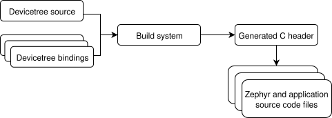
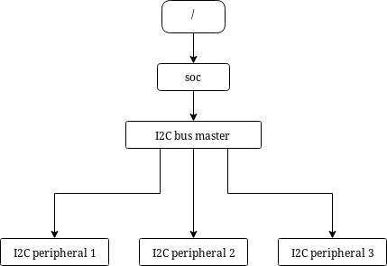
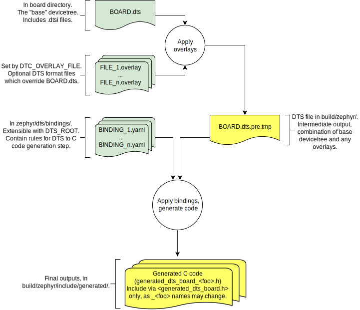

.. _devicetree-intro:

Introduction to devicetree
##########################

.. tip::

   This is a conceptual overview of devicetree and how Zephyr uses it. For
   step-by-step guides and examples, see :ref:`dt-howtos`.

A *devicetree* is a hierarchical data structure that describes hardware. The
`Devicetree specification`_ defines its source and binary representations.
Zephyr uses devicetree to describe the hardware available on its :ref:`boards`,
as well as that hardware's initial configuration.

There are two types of devicetree input files: *devicetree sources* and
*devicetree bindings*. The sources contain the devicetree itself. The bindings
describe its contents, including data types. The :ref:`build system
<build_overview>` uses devicetree sources and bindings to produce a generated C
header. The generated header's contents are abstracted by the ``devicetree.h``
API, which you can use to get information from your devicetree.

Here is a simplified view of the process:

   Devicetree build flow

All Zephyr and application source code files can include and use
``devicetree.h``. This includes :ref:`device drivers <device_model_api>`,
:ref:`applications <application>`, :ref:`tests <testing>`, the kernel, etc.

The API itself is based on C macros. The macro names all start with ``DT_``. In
general, if you see a macro that starts with ``DT_`` in a Zephyr source file,
it's probably a ``devicetree.h`` macro. The generated C header contains macros
that start with ``DT_`` as well; you might see those in compiler error
messages. You always can tell a generated- from a non-generated macro:
generated macros have some lowercased letters, while the ``devicetree.h`` macro
names have all capital letters.

Some information defined in devicetree is available via ``CONFIG_`` macros
generated from :ref:`Kconfig <kconfig>`. This is often done for backwards
compatibility, since Zephyr has used Kconfig for longer than devicetree, and is
still in the process of converting some information from Kconfig to devicetree.
It is also done to allow Kconfig overrides of default values taken from
devicetree. Devicetree information is referenced from Kconfig via :ref:`Kconfig
functions <kconfig-functions>`. See :ref:`dt_vs_kconfig` for some additional
comparisons with Kconfig.

.. _dt-syntax:

Syntax and structure
********************

As the name indicates, a devicetree is a tree. The human-readable text format
for this tree is called DTS (for devicetree source), and is defined in the
`Devicetree specification`_.

.. _Devicetree specification: https://www.devicetree.org/

Here is an example DTS file:

.. code-block:: DTS

   /dts-v1/;

   / {
           a-node {
                   subnode_label: a-sub-node {
                           foo = <3>;
                   };
           };
   };

The ``/dts-v1/;`` line means the file's contents are in version 1 of the DTS
syntax, which has replaced a now-obsolete "version 0".

The tree has three *nodes*:

#. A root node: ``/``
#. A node named ``a-node``, which is a child of the root node
#. A node named ``a-sub-node``, which is a child of ``a-node``

.. _dt-node-labels:

Nodes can be given *labels*, which are unique shorthands that can be used to
refer to the labeled node elsewhere in the devicetree. Above, ``a-sub-node``
has label ``subnode_label``. A node can have zero, one, or multiple node
labels.

Devicetree nodes have *paths* identifying their locations in the tree. Like
Unix file system paths, devicetree paths are strings separated by slashes
(``/``), and the root node's path is a single slash: ``/``. Otherwise, each
node's path is formed by concatenating the node's ancestors' names with the
node's own name, separated by slashes. For example, the full path to
``a-sub-node`` is ``/a-node/a-sub-node``.

Devicetree nodes can also have *properties*. Properties are name/value pairs.
Property values can be any sequence of bytes. In some cases, the values are an
array of what are called *cells*. A cell is just a 32-bit unsigned integer.

Node ``a-sub-node`` has a property named ``foo``, whose value is a cell with
value 3. The size and type of ``foo``\ 's value are implied by the enclosing
angle brackets (``<`` and ``>``) in the DTS. See
:ref:`dt-writing-property-values` below for more example property values.

In practice, devicetree nodes usually correspond to some hardware, and the node
hierarchy reflects the hardware's physical layout. For example, let's consider
a board with three I2C peripherals connected to an I2C bus controller on an SoC,
like this:

Nodes corresponding to the I2C bus controller and each I2C peripheral would be
present in the devicetree. Reflecting the hardware layout, the
I2C peripheral nodes would be children of the bus controller node.
Similar conventions exist for representing other types of hardware.

The DTS would look something like this:

.. code-block:: DTS

   /dts-v1/;

   / {
           soc {
                   i2c-bus-controller {
                           i2c-peripheral-1 {
                           };
                           i2c-peripheral-2 {
                           };
                           i2c-peripheral-3 {
                           };
                   };
           };
   };

Properties are used in practice to describe or configure the hardware the node
represents. For example, an I2C peripheral's node has a property whose value is
the peripheral's address on the bus.

Here's a tree representing the same example, but with real-world node
names and properties you might see when working with I2C devices.

.. figure:: zephyr_dt_i2c_example.png
   :figclass: align-center

   I2C devicetree example with real-world names and properties.
   Node names are at the top of each node with a gray background.
   Properties are shown as "name=value" lines.

This is the corresponding DTS:

.. code-block:: DTS

   /dts-v1/;

   / {
           soc {
                   i2c@40003000 {
                           compatible = "nordic,nrf-twim";
                           label = "I2C_0";
                           reg = <0x40003000 0x1000>;

                           apds9960@39 {
                                   compatible = "avago,apds9960";
                                   label = "APDS9960";
                                   reg = <0x39>;
                           };
                           ti_hdc@43 {
                                   compatible = "ti,hdc", "ti,hdc1010";
                                   label = "HDC1010";
                                   reg = <0x43>;
                           };
                           mma8652fc@1d {
                                   compatible = "nxp,fxos8700", "nxp,mma8652fc";
                                   label = "MMA8652FC";
                                   reg = <0x1d>;
                           };
                   };
           };
   };

.. _dt-unit-address:

In addition to showing more realistic names and properties, the above example
introduces a new devicetree concept: unit addresses. Unit addresses are the
parts of node names after an "at" sign (``@``), like ``40003000`` in
``i2c@40003000``, or ``39`` in ``apds9960@39``. Unit addresses are optional:
the ``soc`` node does not have one.

Some more details about unit addresses and important properties follow.

Unit address examples
*********************

In devicetree, unit addresses give a node's address in the
address space of its parent node. Here are some example unit addresses for
different types of hardware.

Memory-mapped peripherals
    The peripheral's register map base address.
    For example, the node named ``i2c@40003000`` represents an I2C controller
    whose register map base address is 0x40003000.

I2C peripherals
    The peripheral's address on the I2C bus.
    For example, the child node ``apds9960@39`` of the I2C controller
    in the previous section has I2C address 0x39.

SPI peripherals
    An index representing the peripheral's chip select line number.
    (If there is no chip select line, 0 is used.)

Memory
    The physical start address.
    For example, a node named ``memory@2000000`` represents RAM starting at
    physical address 0x2000000.

Memory-mapped flash
    Like RAM, the physical start address.
    For example, a node named ``flash@8000000`` represents a flash device
    whose physical start address is 0x8000000.

Fixed flash partitions
    This applies when the devicetree is used to store a flash partition table.
    The unit address is the partition's start offset within the flash memory.
    For example, take this flash device and its partitions:

    .. code-block:: DTS

        flash@8000000 {
            /* ... */
            partitions {
                    partition@0 { /* ... */ };
                    partition@20000 {  /* ... */ };
                    /* ... */
            };
        };

    The node named ``partition@0`` has offset 0 from the start of its flash
    device, so its base address is 0x8000000. Similarly, the base address of
    the node named ``partition@20000`` is 0x8020000.

.. _dt-important-props:

Important properties
********************

.. Documentation maintainers: If you add a property to this list,
   make sure it gets linked to from gen_devicetree_rest.py too.

Some important properties are:

compatible
    The name of the hardware device the node represents.

    The recommended format is ``"vendor,device"``, like ``"avago,apds9960"``,
    or a sequence of these, like ``"ti,hdc", "ti,hdc1010"``. The ``vendor``
    part is an abbreviated name of the vendor. The file
    :zephyr_file:`dts/bindings/vendor-prefixes.txt` contains a list of commonly
    accepted ``vendor`` names. The ``device`` part is usually taken from the
    datasheet.

    It is also sometimes a value like ``gpio-keys``, ``mmio-sram``, or
    ``fixed-clock`` when the hardware's behavior is generic.

    The build system uses the compatible property to find the right
    :ref:`bindings <dt-bindings>` for the node. Device drivers use
    ``devicetree.h`` to find nodes with relevant compatibles, in order to
    determine the available hardware to manage.

    The ``compatible`` property can have multiple values. Additional values are
    useful when the device is a specific instance of a more general family, to
    allow the system to match from most- to least-specific device drivers.

    Within Zephyr's bindings syntax, this property has type ``string-array``.

label
    The device's name according to Zephyr's :ref:`device_model_api`. The value
    can be passed to :c:func:`device_get_binding()` to retrieve the
    corresponding driver-level :ref:`struct device* <device_struct>`. This
    pointer can then be passed to the correct driver API by application code to
    interact with the device. For example, calling
    ``device_get_binding("I2C_0")`` would return a pointer to a device
    structure which could be passed to :ref:`I2C API <i2c_api>` functions like
    :c:func:`i2c_transfer()`. The generated C header will also contain a macro
    which expands to this string.

reg
    Information used to address the device. The value is specific to the device
    (i.e. is different depending on the compatible property).

    The ``reg`` property is a sequence of ``(address, length)`` pairs. Each
    pair is called a "register block". Here are some common patterns:

    - Devices accessed via memory-mapped I/O registers (like ``i2c@40003000``):
      ``address`` is usually the base address of the I/O register space, and
      ``length`` is the number of bytes occupied by the registers.
    - I2C devices (like ``apds9960@39`` and its siblings):
      ``address`` is a slave address on the I2C bus. There is no ``length``
      value.
    - SPI devices: ``address`` is a chip select line number; there is no
      ``length``.

    You may notice some similarities between the ``reg`` property and common
    unit addresses described above. This is not a coincidence. The ``reg``
    property can be seen as a more detailed view of the addressable resources
    within a device than its unit address.

status
    A string which describes whether the node is enabled.

    The devicetree specification allows this property to have values
    ``"okay"``, ``"disabled"``, ``"reserved"``, ``"fail"``, and ``"fail-sss"``.
    Only the values ``"okay"`` and ``"disabled"`` are currently relevant to
    Zephyr; use of other values currently results in undefined behavior.

    A node is considered enabled if its status property is either ``"okay"`` or
    not defined (i.e. does not exist in the devicetree source). Nodes with
    status ``"disabled"`` are explicitly disabled. (For backwards
    compatibility, the value ``"ok"`` is treated the same as ``"okay"``, but
    this usage is deprecated.) Devicetree nodes which correspond to physical
    devices must be enabled for the corresponding ``struct device`` in the
    Zephyr driver model to be allocated and initialized.

interrupts
    Information about interrupts generated by the device, encoded as an array
    of one or more *interrupt specifiers*. Each interrupt specifier has some
    number of cells. See section 2.4, *Interrupts and Interrupt Mapping*, in the
    `Devicetree Specification release v0.3`_ for more details.

    Zephyr's devicetree bindings language lets you give a name to each cell in
    an interrupt specifier.

.. _Devicetree Specification release v0.3:
   https://www.devicetree.org/specifications/

.. _dt-alias-chosen:

Aliases and chosen nodes
************************

There are two additional ways beyond :ref:`node labels <dt-node-labels>` to
refer to a particular node without specifying its entire path: by alias, or by
chosen node.

Here is an example devicetree which uses both:

.. code-block:: DTS

   /dts-v1/;

   / {
   	chosen {
   		zephyr,console = &uart0;
        };

   	aliases {
   		my-uart = &uart0;
   	};

   	soc {
   		uart0: serial@12340000 {
   			...
   		};
   	};
   };

The ``/aliases`` and ``/chosen`` nodes do not refer to an actual hardware
device. Their purpose is to specify other nodes in the devicetree.

Above, ``my-uart`` is an alias for the node with path ``/soc/serial@12340000``.
Using its node label ``uart0``, the same node is set as the value of the chosen
``zephyr,console`` node.

Zephyr sample applications sometimes use aliases to allow overriding the
particular hardware device used by the application in a generic way. For
example, :ref:`blinky-sample` uses this to abstract the LED to blink via the
``led0`` alias.

The ``/chosen`` node's properties are used to configure system- or
subsystem-wide values. See :ref:`devicetree-chosen-nodes` for more information.

.. _devicetree-in-out-files:

Input and output files
**********************

This section describes the input and output files shown in the figure at the
:ref:`top of this introduction <devicetree-intro>` in more detail.

   Devicetree input (green) and output (yellow) files

.. _dt-input-files:

Input files
===========

There are four types of devicetree input files:

- sources (``.dts``)
- includes (``.dtsi``)
- overlays (``.overlay``)
- bindings (``.yaml``)

The devicetree files inside the :file:`zephyr` directory look like this::

  boards/<ARCH>/<BOARD>/<BOARD>.dts
  dts/common/skeleton.dtsi
  dts/<ARCH>/.../<SOC>.dtsi
  dts/bindings/.../binding.yaml

Generally speaking, every supported board has a :file:`BOARD.dts` file
describing its hardware. For example, the ``reel_board`` has
:zephyr_file:`boards/arm/reel_board/reel_board.dts`.

:file:`BOARD.dts` includes one or more ``.dtsi`` files. These ``.dtsi`` files
describe the CPU or system-on-chip Zephyr runs on, perhaps by including other
``.dtsi`` files. They can also describe other common hardware features shared by
multiple boards. In addition to these includes, :file:`BOARD.dts` also describes
the board's specific hardware.

The :file:`dts/common` directory contains :file:`skeleton.dtsi`, a minimal
include file for defining a complete devicetree. Architecture-specific
subdirectories (:file:`dts/<ARCH>`) contain ``.dtsi`` files for CPUs or SoCs
which extend :file:`skeleton.dtsi`.

The C preprocessor is run on all devicetree files to expand macro references,
and includes are generally done with ``#include <filename>`` directives, even
though DTS has a ``/include/ "<filename>"`` syntax.

:file:`BOARD.dts` can be extended or modified using *overlays*. Overlays are
also DTS files; the :file:`.overlay` extension is just a convention which makes
their purpose clear. Overlays adapt the base devicetree for different purposes:

- Zephyr applications can use overlays to enable a peripheral that is disabled
  by default, select a sensor on the board for an application specific purpose,
  etc. Along with :ref:`kconfig`, this makes it possible to reconfigure the
  kernel and device drivers without modifying source code.

- Overlays are also used when defining :ref:`shields`.

The build system automatically picks up :file:`.overlay` files stored in
certain locations. It is also possible to explicitly list the overlays to
include, via the :makevar:`DTC_OVERLAY_FILE` CMake variable. See
:ref:`set-devicetree-overlays` for details.

The build system combines :file:`BOARD.dts` and any :file:`.overlay` files by
concatenating them, with the overlays put last. This relies on DTS syntax which
allows merging overlapping definitions of nodes in the devicetree. See
:ref:`dt_k6x_example` for an example of how this works (in the context of
``.dtsi`` files, but the principle is the same for overlays). Putting the
contents of the :file:`.overlay` files last allows them to override
:file:`BOARD.dts`.

:ref:`dt-bindings` (which are YAML files) are essentially glue. They describe
the contents of devicetree sources, includes, and overlays in a way that allows
the build system to generate C macros usable by device drivers and
applications. The :file:`dts/bindings` directory contains bindings.

Zephyr currently uses :file:`dts_fixup.h` files to rename macros in
:file:`devicetree_unfixed.h` to names that are currently in use by C code. The
build system looks for fixup files in the :file:`zephyr/boards/` and
:file:`zephyr/soc/` directories by default. Fixup files exist for historical
reasons. New code should generally avoid them.

.. _dt-scripts:

Scripts and tools
=================

The following libraries and scripts, located in :zephyr_file:`scripts/dts/`,
create output files from input files. Their sources have extensive
documentation.

:zephyr_file:`dtlib.py <scripts/dts/dtlib.py>`
    A low-level DTS parsing library.

:zephyr_file:`edtlib.py <scripts/dts/edtlib.py>`
    A library layered on top of dtlib that uses bindings to interpret
    properties and give a higher-level view of the devicetree. Uses dtlib to do
    the DTS parsing.

:zephyr_file:`gen_defines.py <scripts/dts/gen_defines.py>`
    A script that uses edtlib to generate C preprocessor macros from the
    devicetree and bindings.

In addition to these, the standard ``dtc`` (devicetree compiler) tool is run on
the final devicetree if it is installed on your system. This is just to catch
errors or warnings. The output is unused. Boards may need to pass ``dtc``
additional flags, e.g. for warning suppression. Board directories can contain a
file named :file:`pre_dt_board.cmake` which configures these extra flags, like
this:

.. code-block:: cmake

   list(APPEND EXTRA_DTC_FLAGS "-Wno-simple_bus_reg")

.. _dt-outputs:

Output files
============

These are created in your application's build directory.

.. warning::

   Don't include the header files directly. :ref:`dt-from-c` explains
   what to do instead.

:file:`<build>/zephyr/include/generated/devicetree_unfixed.h`
   The generated macros and additional comments describing the devicetree.
   Included by ``devicetree.h``.

:file:`<build>/zephyr/include/generated/devicetree_fixups.h`
   The concatenated contents of any :file:`dts_fixup.h` files.
   Included by ``devicetree.h``.

:file:`<build>/zephyr/zephyr.dts`
   The final merged devicetree. This file is output by :file:`gen_defines.py`
   as a debugging aid, and is unused otherwise.

:file:`<build>/zephyr/<BOARD>.dts.pre.tmp`
   The preprocessed and concatenated DTS sources and overlays. This is an
   intermediate output file, which is used to create :file:`zephyr.dts`
   and :file:`devicetree_unfixed.h`.

.. highlight:: none

.. _dt-writing-property-values:

Writing property values
***********************

Here are some example ways to write property values in DTS format. Some
specifics are skipped in the interest of keeping things simple; if you're
curious about details, see the devicetree specification.

Arrays of 32-bit unsigned integers, or *cells*, can be written between angle
brackets (``<`` and ``>``) and separated by spaces::

   foo = <0xdeadbeef 1234 0>;

The ``foo`` property value is three cells with values 0xdeadbeef, 1234, and 0,
in that order. Note that hexadecimal and decimal numbers are allowed and can be
intermixed. Since Zephyr transforms DTS to C sources, it is not necessary to
specify the endianness of an individual cell here.

64-bit integers are written as two 32-bit cells in big-endian order. The value
0xaaaa0000bbbb1111 would be written ``<0xaaaa0000 0xbbbb1111>``.

Parentheses, arithmetic operators, and bitwise operators are allowed. The
``bar`` property contains a single cell with value 64::

   bar = <2 * (1 << 5)>;

Strings are double quoted::

   a-string = "hello, world!";

String arrays are separated by commas::

   a-string-array = "string one", "string two", "string three";

Arrays of bytes are written in hexadecimal *without* leading ``0x`` between
square brackets (``[`` and ``]``). Property ``a-byte-array`` is the three bytes
0x00, 0x01, 0xab, in that order::

   a-byte-array = [00 01 ab];

Properties can refer to other nodes in the devicetree by their *phandles*. You
can write a phandle using ``&label``, like in this devicetree fragment:

.. code-block:: DTS

   baz: device@0 {
           /* ... */
   };
   device@1 {
           sibling = <&baz 1 2>;
           /* ... */
   };

The ``sibling`` property of node ``device@1`` contains three cells:

- The ``device@0`` node's phandle. Each phandle occupies an entire cell. The
  ``baz`` label is used to write the phandle ``&baz`` inside the ``sibling``
  property value.
- The values 1 and 2, each in its own cell, in that order.
