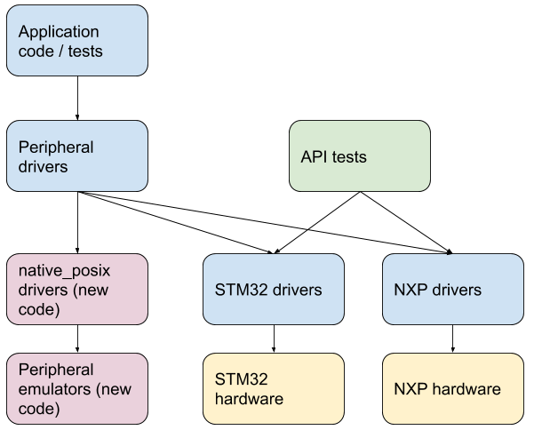

.. _emulators:

Emulators
#########

Overview
========

Zephyr supports a simple emulator framework to support testing of drivers
without requiring real hardware.

Emulators are used to emulate hardware devices, to support testing of
various subsystems. For example, it is possible to write an emulator
for an I2C compass such that it appears on the I2C bus and can be used
just like a real hardware device.

Emulators often implement special features for testing. For example a
compass may support returning bogus data if the I2C bus speed is too
high, or may return invalid measurements if calibration has not yet
been completed. This allows for testing that high-level code can
handle these situations correctly. Test coverage can therefore
approach 100% if all failure conditions are emulated.

Concept
=======

The diagram below shows application code / high-level tests at the top.
This is the ultimate application we want to run.

Below that are peripheral drivers, such as the AT24 EEPROM driver. We can test
peripheral drivers using an emulation driver connected via a native_posix I2C
controller/emulator which passes I2C traffic from the AT24 driver to the AT24
simulator.

Separately we can test the STM32 and NXP I2C drivers on real hardware using API
tests. These require some sort of device attached to the bus, but with this, we
can validate much of the driver functionality.

Putting the two together, we can test the application and peripheral code
entirely on native_posix. Since we know that the I2C driver on the real hardware
works, we should expect the application and peripheral drivers to work on the
real hardware also.

Using the above framework we can test an entire application (e.g. Embedded
Controller) on native_posix using emulators for all non-chip drivers:

.. figure:: img/app.png
   :align: center
   :alt: Example system, using emulators to implement a PC EC

The 'real' code is shown in green. The Zephyr emulation-framework code is shown
in yellow. The blue boxes are the extra code we have to write to emulate the
peripherals.

With this approach we can:

* Write individual tests for each driver (green), covering all failure modes,
  error conditions, etc.

* Ensure 100% test coverage for drivers (green)

* Write tests for combinations of drivers, such as GPIOs provided by an I2C GPIO
  expander driver talking over an I2C bus, with the GPIOs controlling a charger.
  All of this can work in the emulated environment or on real hardware.

* Write a complex application that ties together all of these pieces and runs on
  native_posix. We can develop on a host, use source-level debugging, etc.

* Transfer the application to any board which provides the required features
  (e.g. I2C, enough GPIOs), by adding Kconfig and devicetree fragments.

Available emulators
===================

Zephyr includes the following emulators:

* EEPROM, which uses a file as the EEPROM contents

* I2C emulator driver, allowing drivers to be connected to an emulator so that
  tests can be performed without access to the real hardware

* SPI emulator driver, which does the same for SPI

* eSPI emulator driver, which does the same for eSPI. The emulator is being
  developed to support more functionalities.

A GPIO emulator is planned but is not yet complete.

Samples
=======

Here are some examples present in Zephyr:

#. Bosche BMI160 sensor driver connected via both I2C and SPI to an emulator:

   .. zephyr-app-commands::
      :app: tests/drivers/sensor/accel/
      :board: native_posix
      :goals: build

#. Simple test of the EEPROM emulator:

   .. zephyr-app-commands::
      :app: tests/drivers/eeprom
      :board: native_posix
      :goals: build

#. The same test has a second EEPROM which is an Atmel AT24 EEPROM driver
   connected via I2C an emulator:

   .. zephyr-app-commands::
      :app: tests/drivers/eeprom
      :board: native_posix
      :goals: build
