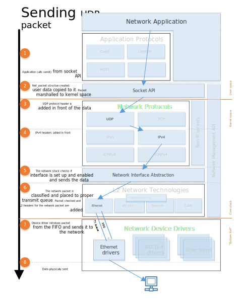

.. _network_stack_architecture:

Network Stack Architecture
##########################

The Zephyr network stack is a native network stack specifically designed
for Zephyr OS. It consists of layers, each meant to provide certain services
to other layers. Network stack functionality is highly configurable via Kconfig
options.

.. contents::
    :local:
    :depth: 2

High level overview of the network stack
****************************************

.. figure:: zephyr_netstack_overview.svg
    :alt: Overview of the network stack architecture
    :figclass: align-center

    Network stack overview

The network stack is layered and consists of the following parts:

* **Network Application.** The network application can either use the provided
  application-level protocol libraries or access the
  :ref:`BSD socket API <bsd_sockets_interface>` directly to create a network
  connection, send or receive data, and close a connection. The application can
  also use the :ref:`network management API <net_mgmt_interface>` to configure
  the network and set related parameters such as network link options,
  starting a scan (when applicable), listen network configuration events, etc.
  The :ref:`network interface API <net_if_interface>` can be used to set IP
  address to a network interface, taking the network interface down, etc.

* **Network Protocols.** This provides implementations for
  various protocols such as

  * Application-level network protocols like CoAP, LWM2M, and MQTT.
    See :ref:`application protocols chapter <net_protocols>` for information
    about them.
  * Core network protocols like IPv6, IPv4, UDP, TCP, ICMPv4, and ICMPv6.
    You access these protocols by using the
    :ref:`BSD socket API <bsd_sockets_interface>`.

* **Network Interface Abstraction.** This provides functionality
  that is common in all the network interfaces, such as setting network
  interface down, etc. There can be multiple network interfaces in the system.
  See :ref:`network interface overview <net_if_interface>` for more details.

* **L2 Network Technologies.** This provides a common API for sending and
  receiving data to and from an actual network device.
  See :ref:`L2 overview <net_l2_interface>` for more details.
  These network technologies include :ref:`Ethernet <ethernet_interface>`,
  :ref:`IEEE 802.15.4 <ieee802154_interface>`,
  :ref:`Bluetooth <bluetooth_api>`, :ref:`CANBUS <can_interface>`, etc.
  Some of these technologies support IPv6 header compression (6Lo),
  see `RFC 6282 <https://tools.ietf.org/html/rfc6282>`_ for details.
  For example `ARP <https://tools.ietf.org/html/rfc826>`_ for IPv4 is done by
  the :ref:`Ethernet component <ethernet_interface>`.

* **Network Device Drivers.** The actual low-level device drivers handle the
  physical sending or receiving of network packets.

Network data flow
*****************

An application typically consists of one or more :ref:`threads <threads_v2>`
that execute the application logic. When using the
:ref:`BSD socket API <bsd_sockets_interface>`, the following things will
happen.

.. figure:: zephyr_netstack_overview-rx_sequence.svg
    :alt: Network RX data flow
    :figclass: align-center

    Network RX data flow

Data receiving (RX)
-------------------

1. A network data packet is received by a device driver.

2. The device driver allocates enough network buffers to store the received
   data. The network packet is placed in the proper RX queue (implemented by
   :ref:`k_fifo <fifos_v2>`). By default there is only one receive queue in
   the system, but it is possible to have up to 8 receive queues.
   These queues will process incoming packets with different priority.
   See :ref:`traffic-class-support` for more details. The receive queues also
   act as a way to separate the data processing pipeline (bottom-half) as
   the device driver is running in an interrupt context and it must do its
   processing as fast as possible.

3. The network packet is then passed to the correct L2 driver. The L2 driver
   can check if the packet is proper and modify it if needed, e.g. strip L2
   header and frame check sequence, etc.

4. The packet is processed by a network interface. The network statistics are
   collected if enabled by :option:`CONFIG_NET_STATISTICS`.

5. The packet is then passed to L3 processing. If the packet is IP based,
   then the L3 layer checks if the packet is a proper IPv6 or IPv4 packet.

6. A socket handler then finds an active socket to which the network packet
   belongs and puts it in a queue for that socket, in order to separate the
   networking code from the application. Typically the application is run in
   userspace context and the network stack is run in kernel context.

7. The application will then receive the data and can process it as needed.
   The application should have used the
   :ref:`BSD socket API <bsd_sockets_interface>` to create a socket
   that will receive the data.

    Network TX data flow

Data sending (TX)
-----------------

1. The application should use the
   :ref:`BSD socket API <bsd_sockets_interface>` when sending the data.

2. The application data is prepared for sending to kernel space and then
   copied to internal net_buf structures.

3. Depending on the socket type, a protocol header is added in front of the
   data. For example, if the socket is a UDP socket, then a UDP header is
   constructed and placed in front of the data.

4. An IP header is added to the network packet for a UDP or TCP packet.

5. The network stack will check that the network interface is properly set
   for the network packet, and also will make sure that the network interface
   is enabled before the data is queued to be sent.

6. The network packet is then classified and placed to the proper transmit
   queue (implemented by :ref:`k_fifo <fifos_v2>`). By default there is only
   one transmit queue in the system, but it is possible to have up to 8
   transmit queues. These queues will process the sent packets with different
   priority. See :ref:`traffic-class-support` for more details.
   After the transmit packet classification, the packet is checked by the
   correct L2 layer module. The L2 module will do additional checks for the
   data and it will also create any L2 headers for the network packet.
   If everything is ok, the data is given to the network device driver to be
   sent out.

7. The device driver will send the packet to the network.

Note that in both the TX and RX data paths, the queues
(:ref:`k_fifo's <fifos_v2>`) form separation points where data is passed from
one :ref:`thread <threads_v2>` to another.
These :ref:`threads <threads_v2>` might run in different contexts
(:ref:`kernel <kernel>` vs. :ref:`userspace <usermode>`) and with different
:ref:`priorities <scheduling_v2>`.
