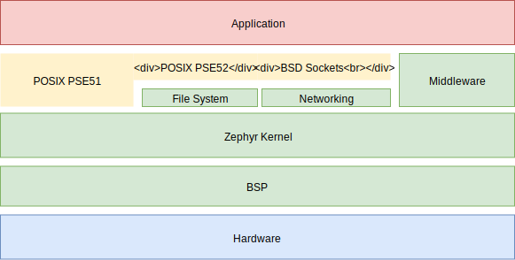

POSIX Support
#############

The Portable Operating System Interface (POSIX) is a family of standards
specified by the IEEE Computer Society for maintaining compatibility between
operating systems. Zephyr implements a subset of the embedded profiles PSE51
and PSE52, and BSD Sockets API.

With the POSIX support available in Zephyr, an existing POSIX compliant
application can be ported to run on the Zephyr kernel, and therefore leverage
Zephyr features and functionality. Additionally, a library designed for use with
POSIX threading compatible operating systems can be ported to Zephyr kernel
based applications with minimal or no changes.

    POSIX support in Zephyr

The POSIX API subset is an increasingly popular OSAL (operating system
abstraction layer) for IoT and embedded applications, as can be seen in
Zephyr, AWS:FreeRTOS, TI-RTOS, and NuttX.

Benefits of POSIX support in Zephyr include:

- Offering a familiar API to non-embedded programmers, especially from Linux
- Enabling reuse (portability) of existing libraries based on POSIX APIs
- Providing an efficient API subset appropriate for small (MCU) embedded systems

System Overview
===============

Units of Functionality
++++++++++++++++++++++

The system profile is defined in terms of component profiles that specify Units
of Functionality that can be combined to realize the application platform. A Unit
of Functionality is a defined set of services which can be implemented. If
implemented, the standard prescribes that all services in the Unit must
be implemented.

A Minimal Realtime System Profile implementation must support the
following Units of Functionality as defined in IEEE Std. 1003.1 (also referred to
as POSIX.1-2017).

.. csv-table:: Units of Functionality
   :header: Requirements, Supported, Remarks
   :widths: 50,10,60

    POSIX_C_LANG_JUMP,
    POSIX_C_LANG_SUPPORT,+
    POSIX_DEVICE_IO,
    POSIX_FILE_LOCKING,
    POSIX_SIGNALS,
    POSIX_SINGLE_PROCESS,
    POSIX_THREADS_BASE,+
    XSI_THREAD_MUTEX_EXT,+
    XSI_THREADS_EXT,+

Option Requirements
++++++++++++++++++++

An implementation supporting the Minimal Realtime System
Profile must support the POSIX.1 Option Requirements which are defined in the
standard. Options Requirements are used for further sub-profiling within the
units of functionality: they further define the functional behavior of the
system service (normally adding extra functionality). Depending on the profile
to which the POSIX implementation complies,parameters and/or the precise
functionality of certain services may differ.

The following list shows the option requirements that are implemented in
Zephyr.

.. csv-table:: Option Requirements
   :header: Requirements, Supported
   :widths: 50,10

    _POSIX_CLOCK_SELECTION,
    _POSIX_FSYNC,
    _POSIX_MEMLOCK,
    _POSIX_MEMLOCK_RANGE,
    _POSIX_MONOTONIC_CLOCK,
    _POSIX_NO_TRUNC,
    _POSIX_REALTIME_SIGNALS,
    _POSIX_SEMAPHORES,+
    _POSIX_SHARED_MEMORY_OBJECTS,
    _POSIX_SYNCHRONIZED_IO,
    _POSIX_THREAD_ATTR_STACKADDR,
    _POSIX_THREAD_ATTR_STACKSIZE,
    _POSIX_THREAD_CPUTIME,
    _POSIX_THREAD_PRIO_INHERIT,+
    _POSIX_THREAD_PRIO_PROTECT,
    _POSIX_THREAD_PRIORITY_SCHEDULING,+
    _POSIX_THREAD_SPORADIC_SERVER,
    _POSIX_TIMEOUTS,
    _POSIX_TIMERS,
    _POSIX2_C_DEV,
    _POSIX2_SW_DEV,

Units of Functionality
======================

This section describes the Units of Functionality (fixed sets of interfaces)
which are implemented (partially or completely) in Zephyr. Please refer to the
standard for a full description of each listed interface.

POSIX_THREADS_BASE
+++++++++++++++++++

The basic assumption in this profile is that the system
consists of a single (implicit) process with multiple threads. Therefore, the
standard requires all basic thread services, except those related to
multiple processes.

.. csv-table:: POSIX_THREADS_BASE
   :header: API, Supported
   :widths: 50,10

    pthread_atfork(),
    pthread_attr_destroy(),+
    pthread_attr_getdetachstate(),+
    pthread_attr_getschedparam(),+
    pthread_attr_init(),+
    pthread_attr_setdetachstate(),+
    pthread_attr_setschedparam(),+
    pthread_cancel(),+
    pthread_cleanup_pop(),
    pthread_cleanup_push(),
    pthread_cond_broadcast(),+
    pthread_cond_destroy(),
    pthread_cond_init(),+
    pthread_cond_signal(),+
    pthread_cond_timedwait(),+
    pthread_cond_wait(),+
    pthread_condattr_destroy(),
    pthread_condattr_init(),
    pthread_create(),+
    pthread_detach(),+
    pthread_equal(),
    pthread_exit(),+
    pthread_getspecific(),+
    pthread_join(),+
    pthread_key_create(),+
    pthread_key_delete(),+
    pthread_kill(),
    pthread_mutex_destroy(),+
    pthread_mutex_init(),+
    pthread_mutex_lock(),+
    pthread_mutex_trylock(),+
    pthread_mutex_unlock(),+
    pthread_mutexattr_destroy(),
    pthread_mutexattr_init(),
    pthread_once(),+
    pthread_self(),+
    pthread_setcalcelstate(),
    pthread_setcanceltype(),
    pthread_setspecific(),+
    pthread_sigmask(),
    pthread_testcancel(),

XSI_THREAD_EXT
++++++++++++++

The XSI_THREADS_EXT Unit of Functionality is required because it provides
functions to control a thread's stack. This is considered useful for any
real-time application.

This table lists service support status in Zephyr:

.. csv-table:: XSI_THREAD_EXT
   :header: API, Supported
   :widths: 50,10

    pthread_attr_getguardsize(),
    pthread_attr_getstack(),+
    pthread_attr_setguardsize(),
    pthread_attr_setstack(),+
    pthread_getconcurrency(),
    pthread_setconcurrency()

XSI_THREAD_MUTEX_EXT
++++++++++++++++++++

The XSI_THREAD_MUTEX_EXT Unit of Functionality is required because it has
options for controlling the behavior of mutexes under erroneous application use.

This table lists service support status in Zephyr:

.. csv-table:: XSI_THREAD_MUTEX_EXT
   :header: API, Supported
   :widths: 50,10

    pthread_mutexattr_gettype(),+
    pthread_mutexattr_settype(),+

POSIX_C_LANG_SUPPORT
++++++++++++++++++++

The POSIX_C_LANG_SUPPORT Unit of Functionality contains the general ISO C
Library.

This is implemented as part of the minimal C library available in Zephyr.

.. csv-table:: POSIX_C_LANG_SUPPORT
   :header: API, Supported
   :widths: 50,10

    abs(),+
    asctime(),
    asctime_r(),
    atof(),
    atoi(),+
    atol(),
    atoll(),
    bsearch(),+
    calloc(),+
    ctime(),
    ctime_r(),
    difftime(),
    div(),
    feclearexcept(),
    fegetenv(),
    fegetexceptflag(),
    fegetround(),
    feholdexcept(),
    feraiseexcept(),
    fesetenv(),
    fesetexceptflag(),
    fesetround(),
    fetestexcept(),
    feupdateenv(),
    free(),+
    gmtime(),+
    gmtime_r(),+
    imaxabs(),
    imaxdiv(),
    isalnum(),+
    isalpha(),+
    isblank(),
    iscntrl(),
    isdigit(),+
    isgraph(),+
    islower(),
    isprint(),+
    ispunct(),
    isspace(),+
    isupper(),+
    isxdigit(),+
    labs(),+
    ldiv(),
    llabs(),+
    lldiv(),
    localeconv(),
    localtime(),+
    localtime_r(),
    malloc(),+
    memchr(),+
    memcmp(),+
    memcpy(),+
    memmove(),+
    memset(),+
    mktime(),+
    qsort(),
    rand(),+
    rand_r(),
    realloc(),+
    setlocale(),
    snprintf(),+
    sprintf(),+
    srand(),
    sscanf(),
    strcat(),+
    strchr(),+
    strcmp(),+
    strcoll(),
    strcpy(),+
    strcspn(),
    strerror(),
    strerror_r(),
    strftime(),
    strlen(),+
    strncat(),+
    strncmp(),+
    strncpy(),+
    strpbrk(),
    strrchr(),+
    strspn(),
    strstr(),+
    strtod(),
    strtof(),
    strtoimax(),
    strtok(),
    strtok_r(),+
    strtol(),+
    strtold(),
    strtoll(),
    strtoul(),+
    strtoull(),
    strtoumax(),
    strxfrm(),
    time(),+
    tolower(),+
    toupper(),+
    tzname(),
    tzset(),
    va_arg(),
    va_copy(),
    va_end(),
    va_start(),
    vsnprintf(),+
    vsprintf(),+
    vsscanf(),

POSIX_SINGLE_PROCESS
+++++++++++++++++++++

The POSIX_SINGLE_PROCESS Unit of Functionality contains services for single
process applications.

.. csv-table:: POSIX_SINGLE_PROCESS
   :header: API, Supported
   :widths: 50,10

    confstr(),
    environ,
    errno,
    getenv(),
    setenv(),
    sysconf(),
    uname(),
    unsetenv()

POSIX_SIGNALS
+++++++++++++

Signal services are a basic mechanism within POSIX-based systems and are
required for error and event handling.

.. csv-table:: POSIX_SIGNALS
   :header: API, Supported
   :widths: 50,10

    abort(),+
    alarm(),
    kill(),
    pause(),
    raise(),
    sigaction(),
    igaddset(),
    sigdelset(),
    sigemptyset(),
    sigfillset(),
    igismember(),
    signal(),
    sigpending(),
    sigprocmask(),
    igsuspend(),
    sigwait()

POSIX_DEVICE_IO
+++++++++++++++

.. csv-table:: POSIX_DEVICE_IO
   :header: API, Supported
   :widths: 50,10

    flockfile(),
    ftrylockfile(),
    funlockfile(),
    getc_unlocked(),
    getchar_unlocked(),
    putc_unlocked(),
    putchar_unlocked()
    clearerr(),
    close(),
    fclose(),
    fdopen(),
    feof(),
    ferror(),
    fflush(),
    fgetc(),
    fgets(),
    fileno(),
    fopen(),
    fprintf(),+
    fputc(),+
    fputs(),+
    fread(),
    freopen(),
    fscanf(),
    fwrite(),+
    getc(),
    getchar(),
    gets(),
    open(),+
    perror(),
    printf(),+
    putc(),+
    putchar(),
    puts(),+
    read(),+
    scanf(),
    setbuf(),
    etvbuf(),
    stderr,
    stdin,
    stdout,
    ungetc(),
    vfprintf(),+
    vfscanf(),
    vprintf(),+
    vscanf(),
    write(),
