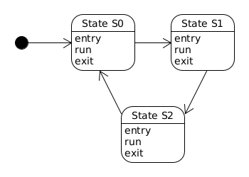
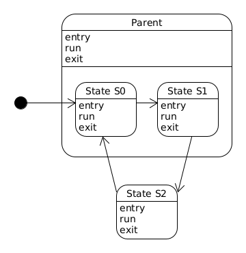

.. _smf:

State Machine Framework
#######################

Overview
========

The State Machine Framework (SMF) is an application agnostic framework that
provides an easy way for developers to integrate state machines into their
application. The framework can be added to any project by including the
CONFIG_SMF=y into the projects prj.conf file.

State Creation
==============

A state is represented by three functions, where one function implements the
Entry actions, another function implements the Run actions, and the last
function implements the Exit actions. The prototype for these functions is as
follows: **void funct(void *obj)**, where the **obj** parameter is a user
defined structure that has the state machine context, **struct smf_ctx**, as
its first member. For example::

	struct user_object {
 		struct smf_ctx ctx;
 		/* All User Defined Data Follows */
	};

The **struct smf_ctx** member must be first because the state machine
framework's functions casts the user defined object to the **struct smf_ctx**
type with the following macro: **SMF_CTX(o)**

For example instead of doing this **(struct smf_ctx *)&user_obj**, you could
use **SMF_CTX(user_obj)**.

The following macros can be used for easy state creation:
    - HSM_CREATE_MSG_STATE
    - HSM_CREATE_STATE
    - FSM_CREATE_MSG_STATE
    - FSM_CREATE_BASIC_STATE

**HSM_CREATE_MSG_STATE(me, mx, e, r, x, p)** is used to create a hierarchical
state that can have an optional parent state and prints a message in the
optional Entry action and a message in the optional Exit action. The macro has
the following parameters:

    - me - String message that's printed in the Entry action. Can be NULL.
    - mx - String message that's printed in the Exit action. Can be NULL.
    - e - Function pointer to state's Entry action. Can be NULL.
    - r - Function pointer to state's Run action. Can be NULL.
    - x - Function pointer to state's Exit action. Can be NULL.
    - p - Function pointer to state's Parent state. Can be NULL.

**HSM_CREATE_STATE(e, r, x, p)** is the same as **HSM_CREATE_MSG_STATE** except
no Entry or Exit messages are printed.

**FSM_CREATE_MSG_STATE(me, mx, e, r, x)** is used to create a flat state and
prints a message in the optional Entry action and a message in the optional
Exit action. The macro has the following parameters:

    - me - String message that's printed in the Entry action. Can be NULL.
    - mx - String message that's printed in the Exit action. Can be NULL.
    - e - Function pointer to state's Entry action. Can be NULL.
    - r - Function pointer to state's Run action. Can be NULL.
    - x - Function pointer to state's Exit action. Can be NULL.

**FSM_CREATE_STATE(e, r, x)** is the same as **FSM_CREATE_MSG_STATE** except no
Entry or Exit messages are printed.

To enable message printing, the **CONFIG_SMF_PRINT_MSG=y** config option must be
added to the projects **prj.conf** file. The use of **HSM_CREATE_MSG_STATE** or
**FSM_CREATE_MSG_STATE** when the **CONFIG_SMF_PRINT_MSG** config option isn't
defined, results in a build error.

To enable a flat state machine, the **CONFIG_SMF_FLAT=y**  config option must be
added to the projects **prj.conf** file. The use of **FSM_CREATE_MSG_STATE** or
**FSM_CREATE_STATE** when the **CONFIG_SMF_FLAT** config option isn't defined,
results in a build error. If the **CONFIG_SMF_FLAT=y** config option is defined
and **HSM_CREATE_STATE** or **HSM_CREATE_MSG_STATE** is used, results in a build
error.

State Machine Creation
======================

A state machine is created by defining a table of states that's indexed by an
enum. For example::

	enum demo_state { S0, S1, S2 };

	const struct smf_state demo_states {
		[S0] = FSM_CREATE_STATE(s0_entry, s0_run, s0_exit),
		[S1] = FSM_CREATE_STATE(s1_entry, s1_run, s1_exit),
		[S2] = FSM_CREATE_STATE(s2_entry, s2_run, s2_exit)
	};

To set the initial state or to transition from one state to another, the
**set_state** function is used and it has the following prototype:
**void set_state(smf_ctx *ctx, smf_state *state)**

**NOTE:** While the state machine is running, set_state should only be called
from the Entry and Run functions. Calling set_state from the Exit functions
doesn't make sense and will generate a warning.

State Machine Execution
=======================
To run the state machine, the **run_state** function should be called in some
application dependent way. The function has the following prototype:
**void run_state(smf_ctx *ctx)**

Flat State Machine Example
==========================
This example turns the following state diagram into code using the SMF, where
the initial state is S0.

Code::

	#include <smf.h>

	/* Forward declaration of state table */
	static const struct smf_state demo_states[];

	/* List of demo states */
	enum demo_state { S0, S1, S2 };

	/* User defined object */
	struct s_object {
		/* This must be first */
		struct smf_ctx ctx;

		/* Other state specific data add here */
	} s_obj;

	/* State S0 */
	static void s0_entry(void *o) {}
	static void s0_run(void *o)
	{
		set_state(SMF_CTX(s_obj), &demo_states[S1]);
	}
	static void s0_exit(void *o) {}

	/* State S1 */
	static void s1_entry(void *o) {}
	static void s1_run(void *o)
	{
		set_state(SMF_CTX(s_obj), &demo_states[S2]);
	}
	static void s1_exit(void *o) {}

	/* State S2 */
	static void s2_entry(void *o) {}
	static void s2_run(void *o)
	{
		set_state(SMF_CTX(s_obj), &demo_states[S0]);
	}
	static void s2_exit(void *o) {}

	/* Populate state table */
	static const struct smf_state demo_states[] {
		[S0] = FSM_CREATE_STATE(s0_entry, s0_run, s0_exit),
		[S1] = FSM_CREATE_STATE(s1_entry, s1_run, s1_exit),
		[S2] = FSM_CREATE_STATE(s2_entry, s2_run, s2_exit),
	};

	void main(void)
	{
		/* Set initial state */
		set_stat(SMF_CTX(s_obj), &demo_states[S0]);

		/* Run the state machine */
		while(1) {
			run_state(SMF_CTX(s_obj));
			k_msleep(1000);
		}
	}

Hierarchical State Machine Example
==================================
This example turns the following state diagram into code using the SMF, where
S0 and S1 share a parent state and S0 is the initial state.

Code::

	#include <smf.h>

	/* Forward declaration of state table */
	static const struct smf_state demo_states[];

	/* List of demo states */
	enum demo_state { PARENT, S0, S1, S2 };

	/* User defined object */
	struct s_object {
		/* This must be first */
		struct smf_ctx ctx;

		/* Other state specific data add here */
	} s_obj;

	/* Parent State */
	static void parent_entry(void *o) {}
	static void parent_run(void *o) {}
	static void parent_exit(void *o) {}

	/* State S0 */
	static void s0_entry(void *o) {}
	static void s0_run(void *o)
	{
		set_state(SMF_CTX(s_obj), &demo_states[S1]);
	}
	static void s0_exit(void *o) {}

	/* State S1 */
	static void s1_entry(void *o) {}
	static void s1_run(void *o)
	{
		set_state(SMF_CTX(s_obj), &demo_states[S2]);
	}
	static void s1_exit(void *o) {}

	/* State S2 */
	static void s2_entry(void *o) {}
	static void s2_run(void *o)
	{
		set_state(SMF_CTX(s_obj), &demo_states[S0]);
	}
	static void s2_exit(void *o) {}

	/* Populate state table */
	static const struct smf_state demo_states[] {
		[PARENT] = HSM_CREATE_STATE(parent_entry, parent_run, parent_exit, NULL);
		[S0] = HSM_CREATE_STATE(s0_entry, s0_run, s0_exit, &demo_states[PARENT]),
		[S1] = HSM_CREATE_STATE(s1_entry, s1_run, s1_exit, &demo_states[PARENT]),
		[S2] = HSM_CREATE_STATE(s2_entry, s2_run, s2_exit),
	};

	void main(void)
	{
		/* Set initial state */
		set_stat(SMF_CTX(s_obj), &demo_states[S0]);

		/* Run the state machine */
		while(1) {
			run_state(SMF_CTX(s_obj));
			k_msleep(1000);
		}
	}

When designing hierarchical state machines, the following should be considered\:
    - Ancestor entry actions are executed before the sibling entry actions. For
      example, the parent_entry function is called before the s0_entry function.
    - Transitioning from one sibling to another with a shared ancestry does not
      re-run the ancestor\'s entry action or run the exit action. For example,
      the parent_entry function is not called when transitioning from S0 to S1,
      nor is the parent_exit function called.
    - Ancestor exit actions are executed after the sibling exit actions. For
      example, the s1_exit function is called before the parent_exit function
      is called.
    - The parent_run function only executes if the child_run function returns.
      This is not shown in the current example.
