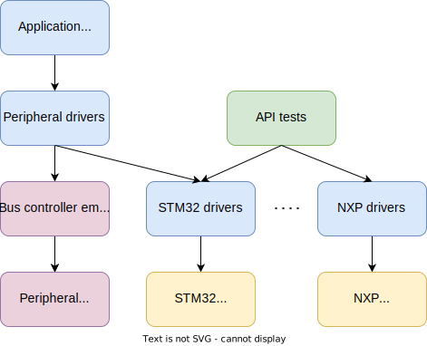
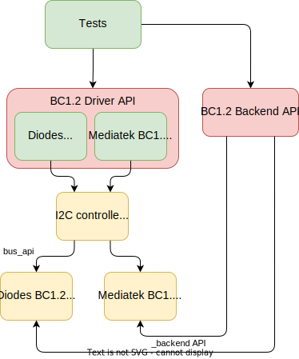

.. _bus_emul:

External Bus and Bus Connected Peripherals Emulators
####################################################

Overview
========

Zephyr supports a simple emulator framework to support testing of external peripheral drivers
without requiring real hardware.

Emulators are used to emulate external hardware devices, to support testing of
various subsystems. For example, it is possible to write an emulator
for an I2C compass such that it appears on the I2C bus and can be used
just like a real hardware device.

Emulators often implement special features for testing. For example a
compass may support returning bogus data if the I2C bus speed is too
high, or may return invalid measurements if calibration has not yet
been completed. This allows for testing that high-level code can
handle these situations correctly. Test coverage can therefore
approach 100% if all failure conditions are emulated.

Concept
=======

The diagram below shows application code / high-level tests at the top.
This is the ultimate application we want to run.

Below that are peripheral drivers, such as the AT24 EEPROM driver. We can test
peripheral drivers using an emulation driver connected via a emulated I2C
controller/emulator which passes I2C traffic from the AT24 driver to the AT24
simulator.

Separately we can test the STM32 and NXP I2C drivers on real hardware using API
tests. These require some sort of device attached to the bus, but with this, we
can validate much of the driver functionality.

Putting the two together, we can test the application and peripheral code
entirely on native_sim. Since we know that the I2C driver on the real hardware
works, we should expect the application and peripheral drivers to work on the
real hardware also.

Using the above framework we can test an entire application (e.g. Embedded
Controller) on native_sim using emulators for all non-chip drivers.

With this approach we can:

* Write individual tests for each driver (green), covering all failure modes,
  error conditions, etc.

* Ensure 100% test coverage for drivers (green)

* Write tests for combinations of drivers, such as GPIOs provided by an I2C GPIO
  expander driver talking over an I2C bus, with the GPIOs controlling a charger.
  All of this can work in the emulated environment or on real hardware.

* Write a complex application that ties together all of these pieces and runs on
  native_sim. We can develop on a host, use source-level debugging, etc.

* Transfer the application to any board which provides the required features
  (e.g. I2C, enough GPIOs), by adding Kconfig and devicetree fragments.

Creating a Device Driver Emulator
=================================

The emulator subsystem is modeled on the :ref:`device_model_api`.  You create
an emulator instance using one of the :c:func:`EMUL_DT_DEFINE()` or
:c:func:`EMUL_DT_INST_DEFINE()` APIs.

Emulators for peripheral devices reuse the same devicetree node as the real
device driver. This means that your emulator defines `DT_DRV_COMPAT` using the
same ``compat`` value from the real driver.

.. code-block:: C

  /* From drivers/sensor/bm160/bm160.c */
  #define DT_DRV_COMPAT bosch_bmi160

  /* From drivers/sensor/bmi160/emul_bmi160.c */
  #define DT_DRV_COMPAT bosch_bmi160

The ``EMUL_DT_DEFINE()`` function accepts two API types:

  #. ``bus_api`` - This points to the API for the upstream bus that the emulator
     connects to. The ``bus_api`` parameter is required.  The supported
     emulated bus types include I2C, SPI, eSPI, and MSPI.
  #. ``_backend_api`` - This points to the device-class specific backend API for
     the emulator. The ``_backend_api`` parameter is optional.

The diagram below demonstrates the logical organization of the ``bus_api`` and
``_backend_api`` using the BC1.2 charging detector driver as the model
device-class.

The real code is shown in green, while the emulator code is shown in yellow.

The ``bus_api`` connects the BC1.2 emulators to the ``native_sim`` I2C
controller. The real BC1.2 drivers are unchanged and operate exactly as if there
was a physical I2C controller present in the system. The ``native_sim`` I2C
controller uses the ``bus_api`` to initiate register reads and writes to the
emulator.

The ``_backend_api`` provides a mechanism for tests to manipulate the emulator
out of band.  Each device class defines it's own API functions.  The backend API
functions focus on high-level behavior and do not provide hooks for specific
emulators.

In the case of the BC1.2 charging detector the backend API provides functions
to simulate connecting and disconnecting a charger to the emulated BC1.2 device.
Each emulator is responsible for updating the correct vendor specific registers
and potentially signalling an interrupt.

Example test flow:

  #. Test registers BC1.2 detection callback using the Zephyr BC1.2 driver API.
  #. Test connects a charger using the BC1.2 emulator backend.
  #. Test verifies B1.2 detection callback invoked with correct charger type.
  #. Test disconnects a charger using the BC1.2 emulator backend.

With this architecture, the same test can be used will all supported drivers in
the same driver class.

Available Emulators
===================

Zephyr includes the following emulators:

* I2C emulator driver, allowing drivers to be connected to an emulator so that
  tests can be performed without access to the real hardware

* SPI emulator driver, which does the same for SPI

* eSPI emulator driver, which does the same for eSPI. The emulator is being
  developed to support more functionalities.

* MSPI emulator driver, allowing drivers to be connected to an emulator so that
  tests can be performed without access to the real hardware.

I2C Emulation features
----------------------

In the binding of the I2C emulated bus, there's a custom property for address
based forwarding. Given the following devicetree node:

.. code-block:: devicetree

   i2c0: i2c@100 {
     status = "okay";
     compatible = "zephyr,i2c-emul-controller";
     clock-frequency = <I2C_BITRATE_STANDARD>;
     #address-cells = <1>;
     #size-cells = <0>;
     #forward-cells = <1>;
     reg = <0x100 4>;
     forwards = <&i2c1 0x20>;
   };

The final property, ``forwards`` indicates that any read/write requests sent to
address ``0x20`` should be sent to ``i2c1`` with the same address. This allows
us to test both the controller and the target end of the communication on the
same image.

.. note::
   The ``#forward-cells`` attribute should always be 1. Each entry in the
   ``forwards`` attribute consists of the phandle followed by the address. In
   the example above, ``<&i2c1 0x20>`` will forward all read/write operations
   made to ``i2c0`` at port ``0x20`` to ``i2c1`` on the same port. Since no
   additional cells are used by the emulated controller, the number of cells
   should remain 1.

Samples
=======

Here are some examples present in Zephyr:

#. Bosch BMI160 sensor driver connected via both I2C and SPI to an emulator:

   .. zephyr-app-commands::
      :zephyr-app: tests/drivers/sensor/bmi160
      :board: native_sim
      :goals: build

#. The same test can be built with a second EEPROM which is an Atmel AT24 EEPROM driver
   connected via I2C an emulator:

   .. zephyr-app-commands::
      :zephyr-app: tests/drivers/eeprom/api
      :board: native_sim
      :goals: build
      :gen-args: -DDTC_OVERLAY_FILE=at2x_emul.overlay -DOVERLAY_CONFIG=at2x_emul.conf

API Reference
=============

.. doxygengroup:: io_emulators
