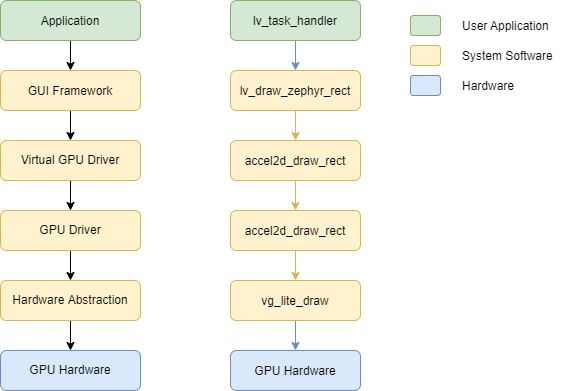
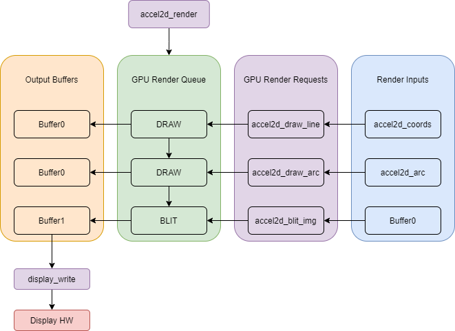
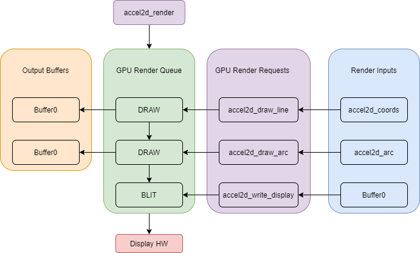

.. _accel2d_api:

2D Accelerator
######################

Overview
********

The 2D accelerator API is designed to leverage features common between many 2D graphical
accelerator blocks. The API functions can be broadly divided into the following
categories:

* Raster (Blit) APIs

  * simple raster APIs
  * path-based raster APIs

* Vector drawing APIs

  * simple drawing APIs
  * path-based drawing APIs

The API is designed with simple and path-based APIs so that more basic
accelerators can still implement a subset of the full API, and be leveraged
by graphics frameworks like LVGL. Note that the API does not implement software
rendering. It is expected that the graphical framework will fall back to
its own software rendering for any operations hardware does not support.

API Use Cases
*************

The API is designed to support the following use cases:

* Single GPU capable of implementing some or all of the listed APIs
* Multiple GPUs, each implementing a subset of the GPU API
* Optimized software accelerator, capable of implementing the simple drawing
  and raster APIs
* 2D accelerators such as the PXP or SMARTDMA that can write framebuffers
  directly to the output display

Render Queue Concept
********************

Since most GPU hardware allows the user to configure commands before
executing them, the 2D accelerator API uses a queuing concept for operations.
GPU devices will enqueue raster and blit operations, which then can be
flushed by calling :c:func:`accel2d_render`. This API *must* be called before
any render operations will complete. Buffers configured as outputs for render
or draw functions should not be modified until the GPU render queue is flushed.

Using Multiple GPUs
*******************

To use multiple GPUs, we can define a "shared" GPU device in the Zephyr
devicetree. The definition may look like the following::

    gpu-shared {
        blit-engine = <&gc355>;
        vector-engine = <&gc355>;
        output-engine = <&pxp>; /* Used with accel2d_write_display */
    };

In this case:

* GC355  would implement the raster APIs
* GC355 would implement the drawing APIs
* PXP would be used to write directly to the display, bypassing LCDIF

The ``gpu-shared`` device would implement the same 2D accelerator API as the PXP
and GC355 do, but would select different GPU devices for each API call based on
the device chosen in devicetree.

API Diagrams
------------

   This diagram indicates the basic acclerator usage model. The application may
   interact directly with GPU drivers, or directly with the Multi-GPU device.
   However, the primary consumer of these APIs is expected to be GUI frameworks
   such as LVGL

   This diagram describes the standard render queue for a GPU device. All
   gpu draw and raster operations place GPU operations on a sequential queue.
   The :c:func:`accel2d_render` API will then flush these operations, and write
   to output buffers. The :c:func:`display_write` API would then be used to
   write the final output buffer to a display device

   In this configuration, the 2d accelerator supports writing directly to the
   display. This allows the application or framework to bypass the
   :c:func:`display_write` API call, and instead allow the GPU to render
   directly to the display. This can be used in cases where the app needs
   to modify the display buffer before writing it to the display, but
   wants to avoid an additional intermediate framebuffer being allocated.

API Definitions
***************

The following APIs are implemented. See below for the full API definitions.
This table is intended to serve as documentation for the reasoning behind
each function as it is currently defined.

+------------------------+-------------------------------------------------------------+------------------------------------------------+------------------------------------------------+
| API                    | Purpose                                                     | Inputs                                         | Rationale/Supported GPUs                       |
+========================+=============================================================+================================================+================================================+
| accel2d_draw_rect      | draw rectangle                                              | * device object                                | This API is deliberately kept simple,          |
|                        |                                                             | * output buffer                                | so that more basic GPUs can implement it.      |
|                        |                                                             | * fill:                                        | For example, the ST DMA2D engine can           |
|                        |                                                             |                                                | support this API, but could not support        |
|                        |                                                             |   * solid color OR                             | features like rounded rectangles. This         |
|                        |                                                             |   * gradient                                   | can also be used for optimized software        |
|                        |                                                             | * rectangle coordinates                        | renders, such as ARM2D                         |
|                        |                                                             | * blend setting                                |                                                |
|                        |                                                             |                                                | Supported GPUs:                                |
|                        |                                                             |                                                |                                                |
|                        |                                                             |                                                | * NXP PXP                                      |
|                        |                                                             |                                                | * NXP GC355/GCNanoLiteV                        |
|                        |                                                             |                                                | * ST DMA2D                                     |
+------------------------+-------------------------------------------------------------+------------------------------------------------+------------------------------------------------+
| accel2d_draw_arc       | draw an arc. Can also draw a circle                         | * device object                                | This API is deliberately kept simple,          |
|                        |                                                             | * output buffer                                | so that more basic GPUs can implement it,      |
|                        |                                                             | * fill:                                        | like the API above                             |
|                        |                                                             |                                                |                                                |
|                        |                                                             |   * solid color OR                             |                                                |
|                        |                                                             |   * gradient                                   |                                                |
|                        |                                                             | * start and end angle                          |                                                |
|                        |                                                             | * center point                                 |                                                |
|                        |                                                             | * inner and outer radius                       |                                                |
|                        |                                                             | * blend setting                                |                                                |
|                        |                                                             |                                                | Supported GPUs:                                |
|                        |                                                             |                                                |                                                |
|                        |                                                             |                                                | * NXP GC355/GCNanoLiteV                        |
+------------------------+-------------------------------------------------------------+------------------------------------------------+------------------------------------------------+
| accel2d_draw_line      | draw a line between two points                              | * device object                                | Again, this API is kept simple so that         |
|                        |                                                             | * output buffer                                | a software renderer could be written           |
|                        |                                                             | * fill:                                        | to implement it                                |
|                        |                                                             |                                                |                                                |
|                        |                                                             |   * solid color OR                             |                                                |
|                        |                                                             |   * gradient                                   |                                                |
|                        |                                                             | * start point                                  |                                                |
|                        |                                                             | * end point                                    |                                                |
|                        |                                                             | * blend setting                                |                                                |
|                        |                                                             |                                                | Supported GPUs:                                |
|                        |                                                             |                                                |                                                |
|                        |                                                             |                                                | * NXP GC355/GCNanoLiteV                        |
+------------------------+-------------------------------------------------------------+------------------------------------------------+------------------------------------------------+
| accel2d_draw_path      | Draw arbitrary path.                                        | * device object                                | This API is designed to leverage GPUs that     |
|                        | This is the catch all API                                   | * output buffer                                | support 2D path commands similar to SVG,       |
|                        | for complex shapes. Useful for GPUs.                        | * fill:                                        | which allows arbitrary shape drawing           |
|                        |                                                             |                                                |                                                |
|                        | We could also split this into a                             |   * solid color OR                             |                                                |
|                        | polygon API or others                                       |   * gradient                                   |                                                |
|                        |                                                             | * OPCODEs to describe path shape               |                                                |
|                        |                                                             | * Tessellation matrix                          |                                                |
|                        |                                                             | * gpu fill rule                                |                                                |
|                        |                                                             | * blend setting                                |                                                |
|                        |                                                             |                                                | Supported GPUs:                                |
|                        |                                                             |                                                |                                                |
|                        |                                                             |                                                | * NXP GC355/GCNanoLiteV                        |
+------------------------+-------------------------------------------------------------+------------------------------------------------+------------------------------------------------+
| accel2d_blit_path      | blit a source buffer into output path                       | * device object                                | This API is designed to leverage GPUs that     |
|                        |                                                             | * output buffer                                | support 2D path commands similar to SVG,       |
|                        |                                                             | * source buffer                                | which allows arbitrary shape drawing           |
|                        |                                                             | * OPCODEs to describe path shape               |                                                |
|                        |                                                             | * Tessellation matrix for path                 |                                                |
|                        |                                                             | * Tessellation matrix for                      |                                                |
|                        |                                                             |   source buffer                                |                                                |
|                        |                                                             | * blend setting                                |                                                |
|                        |                                                             | * color to fill outside of source buffer       |                                                |
|                        |                                                             |   in path                                      |                                                |
|                        |                                                             |                                                | Supported GPUs:                                |
|                        |                                                             |                                                |                                                |
|                        |                                                             |                                                | * NXP GC355/GCNanoLiteV                        |
+------------------------+-------------------------------------------------------------+------------------------------------------------+------------------------------------------------+
| accel2d_blit_img       | blit a source buffer onto output buffer                     | * device object                                | This API is designed for blit engines          |
|                        |                                                             | * output buffer                                | like the PXP or ST's DMA2D. It is kept         |
|                        |                                                             | * source buffer                                | simpler so that these engines can              |
|                        |                                                             | * coordinates to write to                      | implement it easily                            |
|                        |                                                             | * blend setting                                |                                                |
|                        |                                                             | * Rotation setting (0, 90, 180, 270 degrees)   |                                                |
|                        |                                                             | * Scale setting                                |                                                |
|                        |                                                             |                                                | Supported GPUs:                                |
|                        |                                                             |                                                |                                                |
|                        |                                                             |                                                | * NXP PXP                                      |
|                        |                                                             |                                                | * NXP GC355/GCNanoLiteV                        |
|                        |                                                             |                                                | * ST DMA2D                                     |
+------------------------+-------------------------------------------------------------+------------------------------------------------+------------------------------------------------+
| accel2d_render         | Render buffer. Waits for all queued operations to complete. | * device object                                | This API simply flushes queued GPU operations, |
|                        |                                                             |                                                | since all of the graphical accelerators        |
|                        |                                                             |                                                | allow the user to configure them before        |
|                        |                                                             |                                                | starting operations. It also fits well with    |
|                        |                                                             |                                                | LVGL, which has a callback to                  |
|                        |                                                             |                                                | wait on the GPU for completion.                |
|                        |                                                             |                                                |                                                |
|                        |                                                             |                                                | Supported GPUs:                                |
|                        |                                                             |                                                |                                                |
|                        |                                                             |                                                | * All GPUs must implement this API             |
+------------------------+-------------------------------------------------------------+------------------------------------------------+------------------------------------------------+
| accel2d_write_display  | Write directly to the display via the GPU.                  | * device object                                | This API will be used with engines             |
|                        | This API is useful for engines like the PXP and             | * source buffer                                | like SMARTDMA and the PXP that allow           |
|                        | SMARTDMA that allow the user to perform pixel               | * Rotation setting                             | the application to write to the display        |
|                        | conversions or rotation on a framebuffer using              | * Horizontal scale setting                     | directly, via handshakes with the relevant     |
|                        | hardware offload, and then write it directly to             | * Vertical scale setting                       | peripherals (the MIPI DSI                      |
|                        | the display                                                 | * input pixel format                           | and eLCDIF in this case)                       |
|                        |                                                             | * coordinates to write to on display           |                                                |
|                        | the selected output display device should be                | * output pixel format                          |                                                |
|                        | set as a devicetree property.                               |                                                |                                                |
|                        |                                                             |                                                | Supported GPUs:                                |
|                        |                                                             |                                                |                                                |
|                        |                                                             |                                                | * NXP PXP                                      |
|                        |                                                             |                                                | * NXP SmartDMA                                 |
+------------------------+-------------------------------------------------------------+------------------------------------------------+------------------------------------------------+
| accel2d_read_caps      | Read GPU render capabilities.                               | * device object                                | This API is intended to reduce the software    |
|                        | This API can be used by graphics stacks to determine        | * gpu capabilities structure                   | overhead incurred by attempting to run         |
|                        | when falling back to software rendering will be required,   |                                                | unsupported operations on the GPU, since       |
|                        | without needing to attempt each render call at runtime.     |                                                | software stacks only need to check             |
|                        |                                                             |                                                | capabilities once.                             |
|                        |                                                             |                                                |                                                |
|                        |                                                             |                                                | Supported GPUs:                                |
|                        |                                                             |                                                |                                                |
|                        |                                                             |                                                | * All GPUs must implement this API             |
+------------------------+-------------------------------------------------------------+------------------------------------------------+------------------------------------------------+

API Reference
*************

.. doxygengroup:: accel2d_interface
