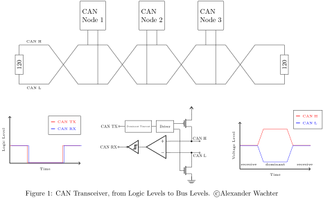

.. _can_transceiver_api:

CAN Transceiver
###############

.. contents::
    :local:
    :depth: 2

Overview
********

A CAN transceiver is an external device that converts the logic level signals
from the CAN controller to the bus-levels. The bus lines are called
CAN High (CAN H) and CAN Low (CAN L).
The transmit wire from the controller to the transceiver is called CAN TX,
and the receive wire is called CAN RX.
These wires use the logic levels whereas the bus-level is interpreted
differentially between CAN H and CAN L.
The bus can be either in the recessive (logical one) or dominant (logical zero)
state. The recessive state is when both lines, CAN H and CAN L, are roughly at
the same voltage level. This state is also the idle state.
To write a dominant bit to the bus, open-drain transistors tie CAN H to Vdd
and CAN L to ground.
The first and last node use a 120-ohm resistor between CAN H and CAN L to
terminate the bus. The dominant state always overrides the recessive state.
This structure is called a wired-AND.

CAN Transceiver API Reference
*****************************

.. doxygengroup:: can_transceiver
