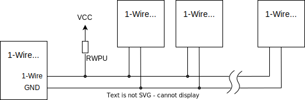

.. _w1_api:

1-Wire Bus
##########

Overview
********

1-Wire is a low speed half-duplex serial bus using only a single wire plus
ground for both data transmission and device power supply.
Similarly to I2C, 1-Wire uses a bidirectional open-collector data line,
and is a single master multidrop bus. This means one master initiates all data
exchanges with the slave devices.
The 1-Wire bus supports longer bus lines than I2C, while it reaches speeds of up
to 15.4 kbps in standard mode and up to 125 kbps in overdrive mode.
Reliable communication in standard speed configuration is possible with 10 nodes
over a bus length of 100 meters. Using overdrive speed, 3 nodes on a bus of
10 meters length are expected to work solid. Optimized timing parameters and
fewer nodes on the bus may allow to reach larger bus extents.

The implementation details are specified in the `BOOK OF IBUTTON STANDARDS`_.

   A typical 1-Wire bus topology

.. _w1-master-api:

W1 Master API
=================

Zephyr's 1-Wire Master API is used to interact with 1-Wire slave devices like
temperature sensors and serial memories.

In Zephyr this API is split into the following layers.

* The link layer handles basic communication functions such as bus reset,
  presence detect and bit transfer operations.
  It is the only hardware-dependent layer in Zephyr.
  This layer is supported by a driver using the Zephyr :ref:`uart_api` interface,
  which should work on most Zephyr platforms.
  In the future, a GPIO/Timer based driver and hardware specific drivers might
  be added.
* The 1-Wire network layer handles all means for slave identification and bus
  arbitration.
  This includes ROM commands like Match ROM, or Search ROM.

   * All slave devices have a unique 64-bit identification number, which
     includes a 8-bit `1-Wire Family Code`_ and a 8-bit CRC.
   * In order to find slaves on the bus, the standard specifies an search
     algorithm which successively detects all slaves on the bus.
     This algorithm is described in detail by `Maxim's Applicationnote 187`_.

* Transport layer and Presentation layer functions are not implemented in the
  generic 1-Wire driver and therefore must be handled in individual slave drivers.

The 1-Wire API is considered experimental.

Configuration Options
*********************

Related configuration options:

* :kconfig:option:`CONFIG_W1`
* :kconfig:option:`CONFIG_W1_NET`

API Reference
*************

1-Wire data link layer
======================

.. doxygengroup:: w1_data_link

1-Wire network layer
====================

.. doxygengroup:: w1_network

1-Wire generic functions and helpers
====================================

Functions that are not directly related to any of the networking layers.

.. doxygengroup:: w1_interface

.. _BOOK OF IBUTTON STANDARDS:
   https://www.maximintegrated.com/en/design/technical-documents/app-notes/9/937.html

.. _1-Wire Family Code:
   https://www.maximintegrated.com/en/design/technical-documents/app-notes/1/155.html

.. _Maxim's Applicationnote 187:
   https://www.maximintegrated.com/en/design/technical-documents/app-notes/1/187.html
