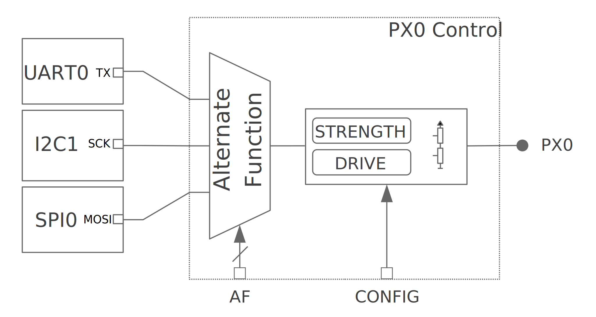
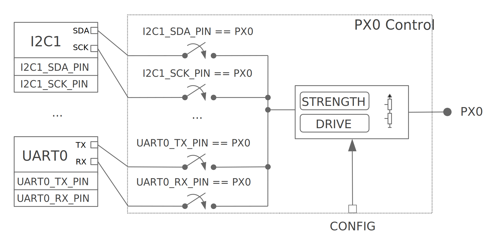

.. _pinctrl-guide:

Pin Control
###########

This is a high-level guide to pin control. See :ref:`pinctrl_api` for API
reference material.

Introduction
************

The hardware blocks that control pin multiplexing and pin configuration
parameters such as pin direction, pull-up/down resistors, etc. are named **pin
controllers**. The pin controller's main users are SoC hardware peripherals,
since the controller enables exposing peripheral signals, like for example,
map ``I2C0`` ``SDA`` signal to pin ``PX0``. Not only that, but it usually allows
configuring certain pin settings that are necessary for the correct functioning
of a peripheral, for example, the slew-rate depending on the operating
frequency. The available configuration options are vendor/SoC dependent and can
range from simple pull-up/down options to more advanced settings such as
debouncing, low-power modes, etc.

The way pin control is implemented in hardware is vendor/SoC specific. It is
common to find a *centralized* approach, that is, all pin configuration
parameters are controlled by a single hardware block (typically named pinmux),
including signal mapping. The figure below illustrates this
approach. ``PX0`` can be mapped to ``UART0_TX``, ``I2C0_SCK`` or ``SPI0_MOSI``
depending on the ``AF`` control bits. Other configuration parameters such as
pull-up/down are controlled in the same block via ``CONFIG`` bits. This model is
used by several SoC families, such as many from NXP and STM32.

    Example of pin control centralized into a single per-pin block

Other vendors/SoCs use a *distributed* approach. In such case, the pin mapping
and configuration are controlled by multiple hardware blocks.
The figure below illustrates a distributed approach where pin
mapping is controlled by peripherals, such as in Nordic nRF SoCs.

    Example pin control distributed between peripheral registers and per-pin block

From a user perspective, there is no difference in pin controller usage
regardless of the hardware implementation: a user will always apply a state.
The only difference lies in the driver implementation. In general, implementing
a pin controller driver for a hardware that uses a distributed approach requires
more effort, since the driver needs to gather knowledge of peripheral dependent
registers.

Pin control vs. GPIO
====================

Some functionality covered by a pin controller driver overlaps with GPIO
drivers. For example, pull-up/down resistors can usually be enabled by both the
pin control driver and the GPIO driver. In Zephyr context, the pin control
driver purpose is to perform peripheral signal multiplexing and configuration of
other pin parameters required for the correct operation of that peripheral.
Therefore, the main users of the pin control driver are SoC peripherals. In
contrast, GPIO drivers are for general purpose control of a pin, that is, when
its logic level is read or controlled manually.

State model
***********

For a device driver to operate correctly, a certain pin configuration needs to
be applied. Some device drivers require a static configuration, usually set up
at initialization time. Others need to change the configuration at runtime
depending on the operating conditions, for example, to enable a low-power mode
when suspending the device. Such requirements are modeled using **states**, a
concept that has been adapted from the one in the Linux kernel. Each device
driver owns a set of states. Each state has a unique name and contains a full
pin configuration set (see the figure below). This effectively
means that states are independent of each other, so they do not need to be
applied in any specific order. Another advantage of the state model is that it
isolates device drivers from pin configuration.

.. table:: Example pin configuration encoded using the states model
    :align: center

    +----+------------------+----+------------------+
    | ``UART0`` peripheral                          |
    +====+==================+====+==================+
    | ``default`` state     | ``sleep`` state       |
    +----+------------------+----+------------------+
    | TX | - Pin: PA0       | TX | - Pin: PA0       |
    |    | - Pull: NONE     |    | - Pull: NONE     |
    |    | - Low Power: NO  |    | - Low Power: YES |
    +----+------------------+----+------------------+
    | RX | - Pin: PA1       | RX | - Pin: PA1       |
    |    | - Pull: UP       |    | - Pull: NONE     |
    |    | - Low Power: NO  |    | - Low Power: YES |
    +----+------------------+----+------------------+

Standard states
===============

The name assigned to pin control states or the number of them is up to the
device driver requirements. In many cases a single state applied at
initialization time will be sufficient, but in some other cases more will be
required. In order to make things consistent, a naming convention has been
established for the most common use cases. The figure below
details the standardized states and its purpose.

.. table:: Standardized state names
    :align: center

    +-------------+----------------------------------+-------------------------+
    | State       | Identifier                       | Purpose                 |
    +-------------+----------------------------------+-------------------------+
    | ``default`` | :c:macro:`PINCTRL_STATE_DEFAULT` | State of the pins when  |
    |             |                                  | the device is in        |
    |             |                                  | operational state       |
    +-------------+----------------------------------+-------------------------+
    | ``sleep``   | :c:macro:`PINCTRL_STATE_SLEEP`   | State of the pins when  |
    |             |                                  | the device is in low    |
    |             |                                  | power or sleep modes    |
    +-------------+----------------------------------+-------------------------+

Note that other standard states could be introduced in the future.

Custom states
=============

Some device drivers may require using custom states beyond the standard ones. To
achieve that, the device driver needs to have in its scope definitions for the
custom state identifiers named as ``PINCTRL_STATE_{STATE_NAME}``, where
``{STATE_NAME}`` is the capitalized state name. For example, if ``mystate`` has
to be supported, a definition named ``PINCTRL_STATE_MYSTATE`` needs to be
in the driver's scope.

.. note::
    It is important that custom state identifiers start from
    :c:macro:`PINCTRL_STATE_PRIV_START`

If custom states need to be accessed from outside the driver, for example to
perform dynamic pin control, custom identifiers should be placed in a header
that is publicly accessible.

Skipping states
===============

In most situations, the states defined in Devicetree will be the ones used in
the compiled firmware. However, there are some cases where certain states will
be conditionally used depending on a compilation flag. A typical case is the
``sleep`` state. This state is only used in practice if
:kconfig:option:`CONFIG_PM` or :kconfig:option:`CONFIG_PM_DEVICE` is enabled.
If a firmware variant without these power management configurations is needed,
one should in theory remove the ``sleep`` state from Devicetree to not waste ROM
space storing such unused state.

States can be skipped by the ``pinctrl`` Devicetree macros if a definition named
``PINCTRL_SKIP_{STATE_NAME}`` expanding to ``1`` is present when pin control
configuration is defined. In case of the ``sleep`` state, the ``pinctrl`` API
already provides such definition conditional to the availability of device power
management:

.. code-block:: c

    #if !defined(CONFIG_PM) && !defined(CONFIG_PM_DEVICE)
    /** Out of power management configurations, ignore "sleep" state. */
    #define PINCTRL_SKIP_SLEEP 1
    #endif

Dynamic pin control
*******************

Dynamic pin control refers to the capability of changing pin configuration
at runtime. This feature can be useful in situations where the same firmware
needs to run onto slightly different boards, each having a peripheral routed at
a different set of pins. This feature can be enabled by setting
:kconfig:option:`CONFIG_PINCTRL_DYNAMIC`.

.. note::

    Dynamic pin control should only be used on devices that have not been
    initialized. Changing pin configurations while a device is operating may
    lead to unexpected behavior. Since Zephyr does not support device
    de-initialization yet, this functionality should only be used during early
    boot stages.

One of the effects of enabling dynamic pin control is that
:c:struct:`pinctrl_dev_config` will be stored in RAM instead of ROM (not states
or pin configurations, though). The user can then use
:c:func:`pinctrl_update_states` to update the states stored in
:c:struct:`pinctrl_dev_config` with a new set. This effectively means that the
device driver will apply the pin configurations stored in the updated states
when it applies a state.

Devicetree representation
*************************

Because Devicetree is meant to describe hardware, it is the natural choice when
it comes to storing pin control configuration. In the following sections you
will find an overview on how states and pin configurations are represented in
Devicetree.

States
======

Given a device, each of its pin control state is represented in Devicetree by
``pinctrl-N`` properties, being ``N`` the state index starting from zero. The
``pinctrl-names`` property is then used to assign a unique identifier for each
state property by index, for example, ``pinctrl-names`` list entry 0 is the name
for ``pinctrl-0``.

.. code-block:: devicetree

    periph0: periph@0 {
        ...
        /* state 0 ("default") */
        pinctrl-0 = <...>;
        ...
        /* state N ("mystate") */
        pinctrl-N = <...>;
        /* names for state 0 up to state N */
        pinctrl-names = "default", ..., "mystate";
        ...
    };

Pin configuration
=================

There are multiple ways to represent the pin configurations in Devicetree.
However, all end up encoding the same information: the pin multiplexing and the
pin configuration parameters. For example, ``UART_RX`` is mapped to ``PX0`` and
pull-up is enabled. The representation choice largely depends on each
vendor/SoC, so the Devicetree binding files for the pin control drivers are the
best place to look for details.

A popular and versatile option is shown in the example below. One of the
advantages of this choice is the grouping capability based on shared pin
configuration. This allows to reduce the verbosity of the pin control
definitions. Another advantage is that the pin configuration parameters for a
particular state are enclosed in a single Devicetree node.

.. code-block:: devicetree

    /* board.dts */
    #include "board-pinctrl.dtsi"

    &periph0 {
        pinctrl-0 = <&periph0_default>;
        pinctrl-names = "default";
    };

.. code-block:: c

    /* vnd-soc-pkgxx.h
     * File with valid mappings for a specific package (may be autogenerated).
     * This file is optional, but recommended.
     */
    ...
    #define PERIPH0_SIGA_PX0 VNDSOC_PIN(X, 0, MUX0)
    #define PERIPH0_SIGB_PY7 VNDSOC_PIN(Y, 7, MUX4)
    #define PERIPH0_SIGC_PZ1 VNDSOC_PIN(Z, 1, MUX2)
    ...

.. code-block:: devicetree

    /* board-pinctrl.dtsi */
    #include <vnd-soc-pkgxx.h>

    &pinctrl {
        /* Node with pin configuration for default state */
        periph0_default: periph0_default {
            group1 {
                /* Mappings: PERIPH0_SIGA -> PX0, PERIPH0_SIGC -> PZ1 */
                pinmux = <PERIPH0_SIGA_PX0>, <PERIPH0_SIGC_PZ1>;
                /* Pins PX0 and PZ1 have pull-up enabled */
                bias-pull-up;
            };
            ...
            groupN {
                /* Mappings: PERIPH0_SIGB -> PY7 */
                pinmux = <PERIPH0_SIGB_PY7>;
            };
        };
    };

Another popular model is based on having a node for each pin configuration and
state. While this model may lead to shorter board pin control files, it also
requires to have one node for each pin mapping and state, since in general,
nodes can not be re-used for multiple states. This method is discouraged if
autogeneration is not an option.

.. note::

   Because all Devicetree information is parsed into a C header, it is important
   to make sure its size is kept to a minimum. For this reason it is important
   to prefix pre-generated nodes with ``/omit-if-no-ref/``. This prefix makes
   sure that the node is discarded when not used.

.. code-block:: devicetree

    /* board.dts */
    #include "board-pinctrl.dtsi"

    &periph0 {
        pinctrl-0 = <&periph0_siga_px0_default &periph0_sigb_py7_default
                     &periph0_sigc_pz1_default>;
        pinctrl-names = "default";
    };

.. code-block:: devicetree

    /* vnd-soc-pkgxx.dtsi
     * File with valid nodes for a specific package (may be autogenerated).
     * This file is optional, but recommended.
     */

    &pinctrl {
        /* Mapping for PERIPH0_SIGA -> PX0, to be used for default state */
        /omit-if-no-ref/ periph0_siga_px0_default: periph0_siga_px0_default {
            pinmux = <VNDSOC_PIN(X, 0, MUX0)>;
        };

        /* Mapping for PERIPH0_SIGB -> PY7, to be used for default state */
        /omit-if-no-ref/ periph0_sigb_py7_default: periph0_sigb_py7_default {
            pinmux = <VNDSOC_PIN(Y, 7, MUX4)>;
        };

        /* Mapping for PERIPH0_SIGC -> PZ1, to be used for default state */
        /omit-if-no-ref/ periph0_sigc_pz1_default: periph0_sigc_pz1_default {
            pinmux = <VNDSOC_PIN(Z, 1, MUX2)>;
        };
    };

.. code-block:: devicetree

    /* board-pinctrl.dts */
    #include <vnd-soc-pkgxx.dtsi>

    /* Enable pull-up for PX0 (default state) */
    &periph0_siga_px0_default {
        bias-pull-up;
    };

    /* Enable pull-up for PZ1 (default state) */
    &periph0_sigc_pz1_default {
        bias-pull-up;
    };

.. note::

    It is discouraged to add pin configuration defaults in pre-defined nodes.
    In general, pin configurations depend on the board design or on the
    peripheral working conditions, so the decision should be made by the board.
    For example, enabling a pull-up by default may not always be desired because
    the board already has one or because its value depends on the operating bus
    speed. Another downside of defaults is that user may not be aware of them,
    for example:

    .. code-block:: devicetree

        /* not evident that "periph0_siga_px0_default" also implies "bias-pull-up" */
        /omit-if-no-ref/ periph0_siga_px0_default: periph0_siga_px0_default {
            pinmux = <VNDSOC_PIN(X, 0, MUX0)>;
            bias-pull-up;
        };

Implementation guidelines
*************************

Pin control drivers
===================

Pin control drivers need to implement a single function:
:c:func:`pinctrl_configure_pins`. This function receives an array of pin
configurations that need to be applied. Furthermore, if
:kconfig:option:`CONFIG_PINCTRL_STORE_REG` is set, it also receives the associated
device register address for the given pins. This information may be required by
some drivers to perform device specific actions.

The pin configuration is stored in an opaque type that is vendor/SoC dependent:
``pinctrl_soc_pin_t``. This type needs to be defined in a header named
``pinctrl_soc.h`` file that is in the Zephyr's include path. It can range from
a simple integer value to a struct with multiple fields. ``pinctrl_soc.h`` also
needs to define a macro named ``Z_PINCTRL_STATE_PINS_INIT`` that accepts two
arguments: a node identifier and a property name (``pinctrl-N``). With this
information the macro needs to define an initializer for all pin configurations
contained within the ``pinctrl-N`` property of the given node.

Regarding Devicetree pin configuration representation, vendors can decide which
option is better for their devices. However, the following guidelines should be
followed:

- Use ``pinctrl-N`` (N=0, 1, ...) and ``pinctrl-names`` properties to define pin
  control states. These properties are defined in
  :file:`dts/bindings/pinctrl/pinctrl-device.yaml`.
- Use standard pin configuration properties as defined in
  :file:`dts/bindings/pinctrl/pincfg-node.yaml`.

Representations not following these guidelines may be accepted if they are
already used by the same vendor in other operating systems, e.g. Linux.

Device drivers
==============

In this section you will find some tips on how a device driver should use the
``pinctrl`` API to successfully configure the pins it needs.

The device compatible needs to be modified in the corresponding binding so that
the ``pinctrl-device.yaml`` is included. For example:

.. code-block:: yaml

    include: [base.yaml, pinctrl-device.yaml]

This file is needed to add ``pinctrl-N`` and ``pinctrl-names`` properties to the
device.

From a device driver perspective there are two steps that need to be performed
to be able to use the ``pinctrl`` API. First, the pin control configuration
needs to be defined. This includes all states and pins.
:c:macro:`PINCTRL_DT_DEFINE` or :c:macro:`PINCTRL_DT_INST_DEFINE` macros
should be used for this purpose. Second, a reference to
the device instance :c:struct:`pinctrl_dev_config` needs to be stored, since it
is required to later use the API. This can be achieved using the
:c:macro:`PINCTRL_DT_DEV_CONFIG_GET` and
:c:macro:`PINCTRL_DT_INST_DEV_CONFIG_GET` macros.

It is worth to note that the only relationship between a device and its
associated pin control configuration is based on variable naming conventions.
The way an instance of :c:struct:`pinctrl_dev_config` is named for a
corresponding device instance allows to later obtain a reference to it given the
device's Devicetree node identifier. This allows to minimize ROM usage, since
only devices requiring pin control will own a reference to a pin control
configuration.

Once the driver has defined the pin control configuration and kept a reference
to it, it is ready to use the API. The most common way to apply a state is by
using :c:func:`pinctrl_apply_state`. It is also possible to use the lower level
function :c:func:`pinctrl_apply_state_direct` to skip state lookup if it is
cached in advance (e.g. at init time). Since state lookup time is expected to be
fast, it is recommended to use :c:func:`pinctrl_apply_state`.

The example below contains a complete example of a device driver that uses the
``pinctrl`` API.

.. code-block:: c

    /* A driver for the "mydev" compatible device */
    #define DT_DRV_COMPAT mydev

    ...
    #include <zephyr/drivers/pinctrl.h>
    ...

    struct mydev_config {
        ...
        /* Reference to mydev pinctrl configuration */
        const struct pinctrl_dev_config *pcfg;
        ...
    };

    ...

    static int mydev_init(const struct device *dev)
    {
        const struct mydev_config *config = dev->config;
        int ret;
        ...
        /* Select "default" state at initialization time */
        ret = pinctrl_apply_state(config->pcfg, PINCTRL_STATE_DEFAULT);
        if (ret < 0) {
            return ret;
        }
        ...
    }

    #define MYDEV_DEFINE(i)                                                    \
        /* Define all pinctrl configuration for instance "i" */                \
        PINCTRL_DT_INST_DEFINE(i);                                             \
        ...                                                                    \
        static const struct mydev_config mydev_config_##i = {                  \
            ...                                                                \
            /* Keep a ref. to the pinctrl configuration for instance "i" */    \
            .pcfg = PINCTRL_DT_INST_DEV_CONFIG_GET(i),                         \
            ...                                                                \
        };                                                                     \
        ...                                                                    \
                                                                               \
        DEVICE_DT_INST_DEFINE(i, mydev_init, NULL, &mydev_data##i,             \
                              &mydev_config##i, ...);

    DT_INST_FOREACH_STATUS_OKAY(MYDEV_DEFINE)

.. _pinctrl_api:

Pin Control API
****************

.. doxygengroup:: pinctrl_interface

Dynamic pin control
====================

.. doxygengroup:: pinctrl_interface_dynamic

Other reference material
************************

- `Introduction to pin muxing and GPIO control under Linux <https://elinux.org/images/a/a7/ELC-2021_Introduction_to_pin_muxing_and_GPIO_control_under_Linux.pdf>`_
