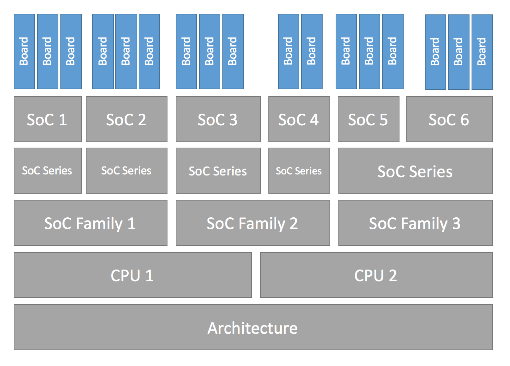
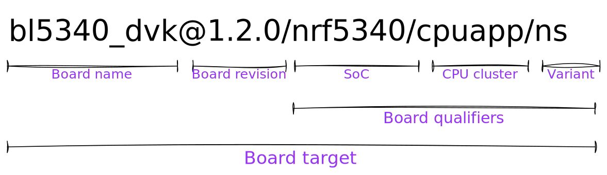

.. _board_porting_guide:

Board Porting Guide
###################

To add Zephyr support for a new :term:`board`, you at least need a *board
directory* with various files in it. Files in the board directory inherit
support for at least one SoC and all of its features. Therefore, Zephyr must
support your :term:`SoC` as well.

.. _hw_model_v2:

Transition to the current hardware model
****************************************

Shortly after Zephyr 3.6.0 was released, a new hardware model was introduced to
Zephyr. This new model overhauls the way both SoCs and boards are named and
defined, and adds support for features that had been identified as important
over the years. Among them:

- Support for multi-core, multi-arch AMP (Asymmetrical Multi Processing) SoCs
- Support for multi-SoC boards
- Support for reusing the SoC and board Kconfig trees outside of the Zephyr
  build system
- Support for advanced use cases with :ref:`sysbuild`
- Removal of all existing arbitrary and inconsistent uses of Kconfig and folder
  names

All the documentation in this page refers to the current hardware model. Please
refer to the documentation in Zephyr v3.6.0 (or earlier) for information on the
previous, now obsolete, hardware model.

More information about the rationale, development and concepts behind the new
model can be found in the :github:`original issue <51831>`, the
:github:`original Pull Request <50305>` and, for a complete set of changes
introduced, the `hardware model v2 commit`_.

Some non-critical features, enhancements and improvements of the new hardware
model are still in development. Check the
:github:`hardware model v2 enhancements issue <69546>` for a complete list.

The transition from the previous hardware model to the current one (commonly
referred to as "hardware model v2") requires modifications to all existing board
and SoC definitions. A decision was made not to provide direct backwards
compatibility for the previous model, which leaves users transitioning from a
previous version of Zephyr to one including the new model (v3.7.0 and onwards)
with two options if they have an out-of-tree board (or SoC):

#. Convert the out-of-tree board to the current hardware model (recommended)
#. Take the SoC definition from Zephyr v3.6.0 and copy it to your downstream
   repository (ensuring that the build system can find it via a
   :ref:`zephyr module <modules>` or ``SOC_ROOT``). This will allow your board,
   defined in the previous hardware model, to continue to work

When converting your board from the previous to the current hardware model, we
recommend first reading through this page to understand the model in detail. You
can then use the `example-application conversion Pull Request`_ as an example on
how to port a simple board. Additionally, a `conversion script`_ is available
and works reliably in many cases (though multi-core SoCs may not be handled
entirely). Finally, the `hardware model v2 commit`_ contains the full conversion
of all existing boards from the old to the current model, so you can use it as a
complete conversion reference.

.. _hardware model v2 commit: https://github.com/zephyrproject-rtos/zephyr/commit/8dc3f856229ce083c956aa301c31a23e65bd8cd8
.. _example-application conversion Pull Request: https://github.com/zephyrproject-rtos/example-application/pull/58
.. _conversion script: https://github.com/zephyrproject-rtos/zephyr/blob/main/scripts/utils/board_v1_to_v2.py

.. _hw_support_hierarchy:

Hardware support hierarchy
**************************

Zephyr's hardware support is based on a series of hierarchical abstractions.
Primarily, each :term:`board` has one or more :term:`SoC`.
Each SoC can be optionally classed into an :term:`SoC series`, which in turn may optionally belong to an :term:`SoC family`.
Each SoC has one or more :term:`CPU cluster`, each containing one or more :term:`CPU core` of a particular :term:`architecture`.

You can visualize the hierarchy in the diagram below:



   Hardware support Hierarchy

Below are some examples of the hierarchy described in this section, in the form
of a :term:`board` per row with its corresponding hierarchy entries. Notice how
the :term:`SoC series` and :term:`SoC family` levels are not always used.

.. table::

   +--------------------------------------------+--------------------------+-------------+--------------------+--------------------+----------------+----------------------+
   | :term:`board name`                         | :term:`board qualifiers` | :term:`SoC` | :term:`SoC Series` | :term:`SoC family` | CPU core       | :term:`architecture` |
   +============================================+==========================+=============+====================+====================+================+======================+
   | :ref:`nrf52dk <nrf52dk_nrf52832>`          | nrf52832                 | nRF52832    | nRF52              | Nordic nRF         | Arm Cortex-M4  | ARMv7-M              |
   +--------------------------------------------+--------------------------+-------------+--------------------+--------------------+----------------+----------------------+
   | :zephyr:board:`frdm_k64f <frdm_k64f>`      | mk64f12                  | MK64F12     | Kinetis K6x        | NXP Kinetis        | Arm Cortex-M4  | ARMv7-M              |
   +--------------------------------------------+--------------------------+-------------+--------------------+--------------------+----------------+----------------------+
   | :zephyr:board:`rv32m1_vega <rv32m1_vega>`  | openisa_rv32m1/ri5cy     | RV32M1      | (Not used)         | (Not used)         | RI5CY          | RISC-V RV32          |
   +--------------------------------------------+--------------------------+-------------+--------------------+--------------------+----------------+----------------------+
   | :ref:`nrf5340dk <nrf5340dk_nrf5340>`       | nrf5340/cpuapp           | nRF5340     | nRF53              | Nordic nRF         | Arm Cortex-M33 | ARMv8-M              |
   |                                            +--------------------------+-------------+--------------------+--------------------+----------------+----------------------+
   |                                            | nrf5340/cpunet           | nRF5340     | nRF53              | Nordic nRF         | Arm Cortex-M33 | ARMv8-M              |
   +--------------------------------------------+--------------------------+-------------+--------------------+--------------------+----------------+----------------------+
   | :zephyr:board:`mimx8mp_evk <imx8mp_evk>`   | mimx8ml8/a53             | i.MX8M Plus | i.MX8M             | NXP i.MX           | Arm Cortex-A53 | ARMv8-A              |
   |                                            +--------------------------+-------------+--------------------+--------------------+----------------+----------------------+
   |                                            | mimx8ml8/m7              | i.MX8M Plus | i.MX8M             | NXP i.MX           | Arm Cortex-M7  | ARMv7-M              |
   |                                            +--------------------------+-------------+--------------------+--------------------+----------------+----------------------+
   |                                            | mimx8ml8/adsp            | i.MX8M Plus | i.MX8M             | NXP i.MX           | Cadence HIFI4  | Xtensa LX6           |
   +--------------------------------------------+--------------------------+-------------+--------------------+--------------------+----------------+----------------------+

Additional details about terminology can be found in the next section.

.. _board_terminology:

Board terminology
*****************

The previous section introduced the hierarchical manner in which Zephyr
classifies and implements hardware support.
This section focuses on the terminology used around hardware support, and in
particular when defining and working with boards and SoCs.

The overall set of terms used around the concept of board in Zephyr is depicted
in the image below, which uses the :zephyr:board:`bl5340_dvk` board as reference.



   Board terminology diagram

The diagram shows the different terms that are used to describe boards:

- The :term:`board name`: ``bl5340_dvk``
- The optional :term:`board revision`: ``1.2.0``
- The :term:`board qualifiers`, that optionally describe the :term:`SoC`,
  :term:`CPU cluster` and :term:`variant`: ``nrf5340/cpuapp/ns``
- The :term:`board target`, which uniquely identifies a combination of the above
  and can be used to specify the hardware to build for when using the tooling
  provided by Zephyr: ``bl5340_dvk@1.2.0/nrf5340/cpuapp/ns``

Formally this can also be seen as
:samp:`{board name}[@{revision}][/{board qualifiers}]`, which can be extended to
:samp:`{board name}[@{revision}][/{SoC}[/{CPU cluster}][/{variant}]]`.

If a board contains only one single-core SoC, then the SoC can be omitted from
the board target. This implies that if the board does not define any board
qualifiers, the board name can be used as a board target. Conversely, if
board qualifiers are part of the board definition, then the SoC can be omitted
by leaving it out but including the corresponding forward-slashes: ``//``.

Continuing with the example above, The board :zephyr:board:`bl5340_dvk` is a single SoC
board where the SoC defines two CPU clusters: ``cpuapp`` and ``cpunet``. One of
the CPU clusters, ``cpuapp``, additionally defines a non-secure board variant,
``ns``.

The board qualifiers ``nrf5340/cpuapp/ns`` can be read as:


- ``nrf5340``: The SoC, which is a Nordic nRF5340 dual-core SoC
- ``cpuapp``: The CPU cluster ``cpuapp``, which consists of a single Cortex-M33
  CPU core. The number of cores in a CPU cluster cannot be determined from the
  board qualifiers.
- ``ns``: a variant, in this case ``ns`` is a common variant name is
  Zephyr denoting a non-secure build for boards supporting :ref:`tfm`.

Not all SoCs define CPU clusters or variants. For example a simple board
like the :ref:`thingy52_nrf52832` contains a single SoC with no CPU clusters and
no variants.
For ``thingy52`` the board target ``thingy52/nrf52832`` can be read as:

- ``thingy52``: board name.
- ``nrf52832``: The board qualifiers, in this case identical to the SoC, which
  is a Nordic nRF52832.


Make sure your SoC is supported
*******************************

Start by making sure your SoC is supported by Zephyr. If it is, it's time to
:ref:`create-your-board-directory`. If you don't know, try:

- checking :ref:`boards` for names that look relevant, and reading individual
  board documentation to find out for sure.
- asking your SoC vendor

If you need to add a SoC, CPU cluster, or even architecture support, this is the
wrong page, but here is some general advice.

Architecture
============

See :ref:`architecture_porting_guide`.

CPU Core
========

CPU core support files go in ``core`` subdirectories under :zephyr_file:`arch`,
e.g. :zephyr_file:`arch/x86/core`.

See :ref:`gs_toolchain` for information about toolchains (compiler, linker,
etc.) supported by Zephyr. If you need to support a new toolchain,
:ref:`build_overview` is a good place to start learning about the build system.
Please reach out to the community if you are looking for advice or want to
collaborate on toolchain support.

SoC
===

Zephyr SoC support files are in architecture-specific subdirectories of
:zephyr_file:`soc`. They are generally grouped by SoC family.

When adding a new SoC family or series for a vendor that already has SoC
support within Zephyr, please try to extract common functionality into shared
files to avoid duplication. If there is no support for your vendor yet, you can
add it in a new directory ``zephyr/soc/<VENDOR>/<YOUR-SOC>``; please use
self-explanatory directory names.

.. _create-your-board-directory:

Create your board directory
***************************

Once you've found an existing board that uses your SoC, you can usually start
by copy/pasting its board directory and changing its contents for your
hardware.

You need to give your board a unique name. Run ``west boards`` for a list of
names that are already taken, and pick something new. Let's say your board is
called ``plank`` (please don't actually use that name).

Start by creating the board directory ``zephyr/boards/<VENDOR>/plank``, where
``<VENDOR>`` is your vendor subdirectory. (You don't have to put your
board directory in the zephyr repository, but it's the easiest way to get
started. See :ref:`custom_board_definition` for documentation on moving your
board directory to a separate repository once it's working.)

.. note::
  A ``<VENDOR>`` subdirectory is mandatory if contributing your board
  to Zephyr, but if your board is placed in a local repo, then any folder
  structure under ``<your-repo>/boards`` is permitted.
  If the vendor is defined in the list in
  :zephyr_file:`dts/bindings/vendor-prefixes.txt` then you must use
  that vendor prefix as ``<VENDOR>``. ``others`` may be used as vendor prefix if
  the vendor is not defined.

.. note::

  The board directory name does not need to match the name of the board.
  Multiple boards can even defined be in one directory.

Your board directory should look like this:

.. code-block:: none

   boards/<VENDOR>/plank
   ├── board.yml
   ├── board.cmake
   ├── CMakeLists.txt
   ├── doc
   │   ├── plank.webp
   │   └── index.rst
   ├── Kconfig.plank
   ├── Kconfig.defconfig
   ├── plank_<qualifiers>_defconfig
   ├── plank_<qualifiers>.dts
   └── plank_<qualifiers>.yaml

Replace ``plank`` with your board's name, of course.

The mandatory files are:

#. :file:`board.yml`: a YAML file describing the high-level meta data of the
   boards such as the boards names, their SoCs, and variants.
   CPU clusters for multi-core SoCs are not described in this file as they are
   inherited from the SoC's YAML description.

#. :file:`plank_<qualifiers>.dts`: a hardware description
   in :ref:`devicetree <dt-guide>` format. This declares your SoC, connectors,
   and any other hardware components such as LEDs, buttons, sensors, or
   communication peripherals (USB, Bluetooth controller, etc).

#. :file:`Kconfig.plank`: the base software configuration for selecting SoC and
   other board and SoC related settings. Kconfig settings outside of the board
   and SoC tree must not be selected. To select general Zephyr Kconfig settings
   the :file:`Kconfig` file must be used.


The optional files are:

- :file:`Kconfig`, :file:`Kconfig.defconfig` software configuration in
  :ref:`kconfig` formats. This provides default settings for software features
  and peripheral drivers.
- :file:`plank_defconfig` and :file:`plank_<qualifiers>_defconfig`: software
  configuration in Kconfig ``.conf`` format.
- :file:`board.cmake`: used for :ref:`flash-and-debug-support`
- :file:`CMakeLists.txt`: if you need to add additional source files to
  your build.
- :file:`doc/index.rst`, :file:`doc/plank.webp`: documentation for and a picture
  of your board. You only need this if you're :ref:`contributing-your-board` to
  Zephyr.
- :file:`plank_<qualifiers>.yaml`: a YAML file with miscellaneous metadata used
  by the :ref:`twister_script`.

Board qualifiers of the form ``<soc>/<cpucluster>/<variant>`` are normalized so
that ``/`` is replaced with ``_`` when used for filenames, for example:
``soc1/foo`` becomes ``soc1_foo`` when used in filenames.

.. _board_description:

Write your board YAML
*********************

The board YAML file describes the board at a high level.
This includes the SoC, board variants, and board revisions.

Detailed configurations, such as hardware description and configuration are done
in devicetree and Kconfig.

The skeleton of the board YAML file is:

.. code-block:: yaml

   board:
     name: <board-name>
     vendor: <board-vendor>
     revision:
       format: <major.minor.patch|letter|number|custom>
       default: <default-revision-value>
       exact: <true|false>
       revisions:
       - name: <revA>
       - name: <revB>
         ...
     socs:
     - name: <soc-1>
       variants:
       - name: <variant-1>
       - name: <variant-2>
         variants:
         - name: <sub-variant-2-1>
           ...
     - name: <soc-2>
       ...

It is possible to have multiple boards located in the board folder.
If multiple boards are placed in the same board folder, then the file
:file:`board.yml` must describe those in a list as:

.. code-block:: yaml

   boards:
   - name: <board-name-1>
     vendor: <board-vendor>
     ...
   - name: <board-name-2>
     vendor: <board-vendor>
     ...
   ...


.. _default_board_configuration:

Write your devicetree
*********************

The devicetree file :file:`boards/<vendor>/plank/plank.dts` or
:file:`boards/<vendor>/plank/plank_<qualifiers>.dts` describes your board
hardware in the Devicetree Source (DTS) format (as usual, change ``plank`` to
your board's name). If you're new to devicetree, see :ref:`devicetree-intro`.

In general, :file:`plank.dts` should look like this:

.. code-block:: devicetree

   /dts-v1/;
   #include <your_soc_vendor/your_soc.dtsi>

   / {
           model = "A human readable name";
           compatible = "yourcompany,plank";

           chosen {
                   zephyr,console = &your_uart_console;
                   zephyr,sram = &your_memory_node;
                   /* other chosen settings  for your hardware */
           };

           /*
            * Your board-specific hardware: buttons, LEDs, sensors, etc.
            */

           leds {
                   compatible = "gpio-leds";
                   led0: led_0 {
                           gpios = < /* GPIO your LED is hooked up to */ >;
                           label = "LED 0";
                   };
                   /* ... other LEDs ... */
           };

           buttons {
                   compatible = "gpio-keys";
                   /* ... your button definitions ... */
           };

           /* These aliases are provided for compatibility with samples */
           aliases {
                   led0 = &led0; /* now you support the blinky sample! */
                   /* other aliases go here */
           };
   };

   &some_peripheral_you_want_to_enable { /* like a GPIO or SPI controller */
           status = "okay";
   };

   &another_peripheral_you_want {
           status = "okay";
   };

Only one ``.dts`` file will be used, and the most specific file which exists
will be used.

This means that if both :file:`plank.dts` and :file:`plank_soc1_foo.dts` exist,
then when building for ``plank`` / ``plank/soc1``, then :file:`plank.dts` is
used. When building for ``plank//foo`` / ``plank/soc1/foo`` the
:file:`plank_soc1_foo.dts` is used.

This allows board maintainers to write a base devicetree file for the board
or write specific devicetree files for a given board's SoC or variant.

If you're in a hurry, simple hardware can usually be supported by copy/paste
followed by trial and error. If you want to understand details, you will need
to read the rest of the devicetree documentation and the devicetree
specification.

.. _dt_k6x_example:

Example: FRDM-K64F and Hexiwear K64
===================================

.. Give the filenames instead of the full paths below, as it's easier to read.
   The cramped 'foo.dts<path>' style avoids extra spaces before commas.

This section contains concrete examples related to writing your board's
devicetree.

The FRDM-K64F and Hexiwear K64 board devicetrees are defined in
:zephyr_file:`frdm_k64fs.dts <boards/nxp/frdm_k64f/frdm_k64f.dts>` and
:zephyr_file:`hexiwear_k64.dts <boards/nxp/hexiwear/hexiwear_mk64f12.dts>`
respectively. Both boards have NXP SoCs from the same Kinetis SoC family, the
K6X.

Common devicetree definitions for K6X are stored in :zephyr_file:`nxp_k6x.dtsi
<dts/arm/nxp/nxp_k6x.dtsi>`, which is included by both board :file:`.dts`
files. :zephyr_file:`nxp_k6x.dtsi<dts/arm/nxp/nxp_k6x.dtsi>` in turn includes
:zephyr_file:`armv7-m.dtsi<dts/arm/armv7-m.dtsi>`, which has common definitions
for Arm v7-M cores.

Since :zephyr_file:`nxp_k6x.dtsi<dts/arm/nxp/nxp_k6x.dtsi>` is meant to be
generic across K6X-based boards, it leaves many devices disabled by default
using ``status`` properties.  For example, there is a CAN controller defined as
follows (with unimportant parts skipped):

.. code-block:: devicetree

   can0: can@40024000 {
        ...
        status = "disabled";
        ...
   };

It is up to the board :file:`.dts` or application overlay files to enable these
devices as desired, by setting ``status = "okay"``. The board :file:`.dts`
files are also responsible for any board-specific configuration of the device,
such as adding nodes for on-board sensors, LEDs, buttons, etc.

For example, FRDM-K64 (but not Hexiwear K64) :file:`.dts` enables the CAN
controller and sets the bus speed:

.. code-block:: devicetree

   &can0 {
        status = "okay";
   };

The ``&can0 { ... };`` syntax adds/overrides properties on the node with label
``can0``, i.e. the ``can@4002400`` node defined in the :file:`.dtsi` file.

Other examples of board-specific customization is pointing properties in
``aliases`` and ``chosen`` to the right nodes (see :ref:`dt-alias-chosen`), and
making GPIO/pinmux assignments.

.. _board_kconfig_files:

Write Kconfig files
*******************

Zephyr uses the Kconfig language to configure software features. Your board
needs to provide some Kconfig settings before you can compile a Zephyr
application for it.

Setting Kconfig configuration values is documented in detail in
:ref:`setting_configuration_values`.

There is one mandatory Kconfig file in the board directory, and several optional
files for a board named ``plank``:

.. code-block:: none

   boards/<vendor>/plank
   ├── Kconfig
   ├── Kconfig.plank
   ├── Kconfig.defconfig
   ├── plank_defconfig
   └── plank_<qualifiers>_defconfig

:file:`Kconfig.plank`
  A shared Kconfig file which can be sourced both in Zephyr Kconfig and sysbuild
  Kconfig trees.

  This file selects the SoC in the Kconfig tree and potential other SoC related
  Kconfig settings. This file must not select anything outside the re-usable
  Kconfig board and SoC trees.

  A :file:`Kconfig.plank` may look like this:

  .. code-block:: kconfig

     config BOARD_PLANK
             select SOC_SOC1

  The Kconfig symbols :samp:`BOARD_{board}` and
  :samp:`BOARD_{normalized_board_target}` are constructed by the build
  system, therefore no type shall be defined in above code snippet.

:file:`Kconfig`
  Included by :zephyr_file:`boards/Kconfig`.

  This file can add Kconfig settings which are specific to the current board.

  Not all boards have a :file:`Kconfig` file.

  A board specific setting should be defining a custom setting and usually with
  a prompt, like this:

  .. code-block:: kconfig

     config BOARD_FEATURE
             bool "Board specific feature"

  If the setting name is identical to an existing Kconfig setting in Zephyr and
  only modifies the default value of said setting, then
  :file:`Kconfig.defconfig` should be used  instead.

:file:`Kconfig.defconfig`
  Board-specific default values for Kconfig options.

  Not all boards have a :file:`Kconfig.defconfig` file.

  The entire file should be inside an ``if BOARD_PLANK`` / ``endif`` pair of
  lines, like this:

  .. code-block:: kconfig

     if BOARD_PLANK

     config FOO
             default y

     if NETWORKING
     config SOC_ETHERNET_DRIVER
             default y
     endif # NETWORKING

     endif # BOARD_PLANK

:file:`plank_defconfig` / :file:`plank_<qualifiers>_defconfig`
  A Kconfig fragment that is merged as-is into the final build directory
  :file:`.config` whenever an application is compiled for your board.

  If both the common :file:`plank_defconfig` file and one or more board
  qualifiers specific :file:`plank_<qualifiers>_defconfig` files exist, then
  all matching files will be used.
  This allows you to place configuration which is common for all board SoCs,
  CPU clusters, and board variants in the base :file:`plank_defconfig` and only
  place the adjustments specific for a given SoC or board variant in the
  :file:`plank_<qualifiers>_defconfig`.

  The ``_defconfig`` should contain mandatory settings for your system clock,
  console, etc. The results are architecture-specific, but typically look
  something like this:

  .. code-block:: cfg

     CONFIG_SYS_CLOCK_HW_CYCLES_PER_SEC=120000000  # set up your clock, etc
     CONFIG_SERIAL=y

:file:`plank_x_y_z_defconfig` / :file:`plank_<qualifiers>_x_y_z_defconfig`
  A Kconfig fragment that is merged as-is into the final build directory
  :file:`.config` whenever an application is compiled for your board revision
  ``x.y.z``.

Build, test, and fix
********************

Now it's time to build and test the application(s) you want to run on your
board until you're satisfied.

For example:

.. code-block:: console

   west build -b plank samples/hello_world
   west flash

For ``west flash`` to work, see :ref:`flash-and-debug-support` below. You can
also just flash :file:`build/zephyr/zephyr.elf`, :file:`zephyr.hex`, or
:file:`zephyr.bin` with any other tools you prefer.

.. _porting-general-recommendations:

General recommendations
***********************

For consistency and to make it easier for users to build generic applications
that are not board specific for your board, please follow these guidelines
while porting.

- Unless explicitly recommended otherwise by this section, leave peripherals
  and their drivers disabled by default.

- Configure and enable a system clock, along with a tick source.

- Provide pin and driver configuration that matches the board's valuable
  components such as sensors, buttons or LEDs, and communication interfaces
  such as USB, Ethernet connector, or Bluetooth/Wi-Fi chip.

- If your board uses a well-known connector standard (like Arduino, Mikrobus,
  Grove, or 96Boards connectors), add connector nodes to your DTS and configure
  pin muxes accordingly.

- Configure components that enable the use of these pins, such as
  configuring an SPI instance to use the usual Arduino SPI pins.

- If available, configure and enable a serial output for the console
  using the ``zephyr,console`` chosen node in the devicetree.
  Development boards with a built-in debug adapter or USB-to-UART adapter should
  by default configure and use the UART controller connected to that adapter.
  For boards like :ref:`nRF52840 Dongle <nrf52840dongle_nrf52840>`, that do not
  have a debug adapter, but a USB device controller, there is a common
  :zephyr_file:`Kconfig file <boards/common/usb/Kconfig.cdc_acm_serial.defconfig>`
  that must be included in the board's Kconfig.defconfig file and
  :zephyr_file:`devicetree file <boards/common/usb/cdc_acm_serial.dtsi>`
  that must be included if the board's devicetree, if the board want to use the
  CDC ACM UART as the default backend for logging and shell.

- If your board supports networking, configure a default interface.

- Enable all GPIO ports connected to peripherals or expansion connectors.

- If available, enable pinmux and interrupt controller drivers.

- It is recommended to enable the MPU by default, if there is support for it
  in hardware. For boards with limited memory resources it is acceptable to
  disable it. When the MPU is enabled, it is recommended to also enable
  hardware stack protection (CONFIG_HW_STACK_PROTECTION=y) and, thus, allow the
  kernel to detect stack overflows when the system is running in privileged
  mode.

.. _flash-and-debug-support:

Flash and debug support
***********************

Zephyr supports :ref:`west-build-flash-debug` via west extension commands.

To add ``west flash`` and ``west debug`` support for your board, you need to
create a :file:`board.cmake` file in your board directory. This file's job is
to configure a "runner" for your board. (There's nothing special you need to
do to get ``west build`` support for your board.)

"Runners" are Zephyr-specific Python classes that wrap :ref:`flash and debug
host tools <flash-debug-host-tools>` and integrate with west and the zephyr build
system to support ``west flash`` and related commands. Each runner supports
flashing, debugging, or both. You need to configure the arguments to these
Python scripts in your :file:`board.cmake` to support those commands like this
example :file:`board.cmake`:

.. code-block:: cmake

   board_runner_args(jlink "--device=nrf52" "--speed=4000")
   board_runner_args(pyocd "--target=nrf52" "--frequency=4000000")

   include(${ZEPHYR_BASE}/boards/common/nrfjprog.board.cmake)
   include(${ZEPHYR_BASE}/boards/common/jlink.board.cmake)
   include(${ZEPHYR_BASE}/boards/common/pyocd.board.cmake)

This example configures the ``nrfjprog``, ``jlink``, and ``pyocd`` runners.

.. warning::

   Runners usually have names which match the tools they wrap, so the ``jlink``
   runner wraps Segger's J-Link tools, and so on. But the runner command line
   options like ``--speed`` etc. are specific to the Python scripts.

.. note::

   Runners and board configuration should be created without being targeted to
   a single operating system if the tool supports multiple operating systems,
   nor should it rely upon special system setup/configuration. For example; do
   not assume that a user will have prior knowledge/configuration or (if using
   Linux) special udev rules installed, do not assume one specific ``/dev/X``
   device for all platforms as this will not be compatible with Windows or
   macOS, and allow for overriding of the selected device so that multiple
   boards can be connected to a single system and flashed/debugged at the
   choice of the user.

For more details:

- Run ``west flash --context`` to see a list of available runners which support
  flashing, and ``west flash --context -r <RUNNER>`` to view the specific options
  available for an individual runner.
- Run ``west debug --context`` and ``west debug --context <RUNNER>`` to get
  the same output for runners which support debugging.
- Run ``west flash --help`` and ``west debug --help`` for top-level options
  for flashing and debugging.
- See :ref:`west-runner` for Python APIs.
- Look for :file:`board.cmake` files for other boards similar to your own for
  more examples.

To see what a ``west flash`` or ``west debug`` command is doing exactly, run it
in verbose mode:

.. code-block:: sh

   west --verbose flash
   west --verbose debug

Verbose mode prints any host tool commands the runner uses.

The order of the ``include()`` calls in your :file:`board.cmake` matters. The
first ``include`` sets the default runner if it's not already set. For example,
including ``nrfjprog.board.cmake`` first means that ``nrfjprog`` is the default
flash runner for this board. Since ``nrfjprog`` does not support debugging,
``jlink`` is the default debug runner.

.. _porting_board_revisions:

Multiple board revisions
************************

See :ref:`application_board_version` for basics on this feature from the user
perspective.

Board revisions are described in the ``revision`` entry of the
:file:`board.yml`.

.. code-block:: yaml

   board:
     revision:
       format: <major.minor.patch|letter|number|custom>
       default: <default-revision-value>
       exact: <true|false>
       revisions:
       - name: <revA>
       - name: <revB>

Zephyr natively supports the following revision formats:

- ``major.minor.patch``: match a three digit revision, such as ``1.2.3``.
- ``number``: matches integer revisions
- ``letter``: matches single letter revisions from ``A`` to ``Z`` only

.. _board_fuzzy_revision_matching:

Fuzzy revision matching
=======================

Fuzzy revision matching is enabled per default.

If the user selects a revision between those available, the closest revision
number that is not larger than the user's choice is used. For example, if the
board ``plank`` defines revisions ``0.5.0``, and ``1.5.0`` and the user builds
for ``plank@0.7.0``, the build system will target revision ``0.5.0``.

The build system will print this at CMake configuration time:

.. code-block:: console

   -- Board: plank, Revision: 0.7.0 (Active: 0.5.0)

This allows you to only create revision configuration files for board revision
numbers that introduce incompatible changes.

Similar for ``letter`` where revision ``A``, ``D``, and ``F`` could be defined
and the user builds for ``plank@E``, the build system will target revision ``D``
.

Exact revision matching
=======================

Exact revision matching is enabled when ``exact: true`` is specified in the
revision section in :file:`board.yml`.

When exact is defined then building for ``plank@0.7.0`` in the above example
will result in the following error message:

.. code-block:: console

   Board revision `0.7.0` not found.  Please specify a valid board revision.

Board revision configuration adjustment
=======================================

When the user builds for board ``plank@<revision>`` it is possible to make
adjustments to the board's normal configuration.

As described in the :ref:`default_board_configuration` and
:ref:`board_kconfig_files` sections the board default configuration is created
from the files :file:`<board>.dts` / :file:`<board>_<qualifiers>.dts` and
:file:`<board>_defconfig` / :file:`<board>_<qualifiers>_defconfig`.
When building for a specific board revision, the above files are used as a
starting point and the following board files will be used in addition:

- :file:`<board>_<qualifiers>_<revision>_defconfig`: a specific revision
  defconfig which is only used for the board and SOC / variants identified by
  ``<board>_<qualifiers>``.

- :file:`<board>_<revision>_defconfig`: a specific revision defconfig which is
  used for the board regardless of the SOC / variants.

- :file:`<board>_<qualifiers>_<revision>.overlay`: a specific revision dts
  overlay which is only used for the board and SOC / variants identified by
  ``<board>_<qualifiers>``.

- :file:`<board>_<revision>.overlay`: a specific revision dts overlay which is
  used for the board regardless of the SOC / variants.

This split allows boards with multiple SoCs, multi-core SoCs, or variants to
place common revision adjustments which apply to all SoCs and variants in a
single file, while still providing the ability to place SoC or variant specific
adjustments in a dedicated revision file.

Using the ``plank`` board from previous sections, then we could have the following
revision adjustments:

.. code-block:: none

   boards/zephyr/plank
   ├── plank_0_5_0_defconfig          # Kconfig adjustment for all plank board qualifiers on revision 0.5.0
   ├── plank_0_5_0.overlay            # DTS overlay for all plank board qualifiers on revision 0.5.0
   └── plank_soc1_foo_1_5_0_defconfig # Kconfig adjustment for plank board when building for soc1 variant foo on revision 1.5.0

Custom revision.cmake files
***************************

Some boards may not use board revisions supported natively by Zephyr.
For example string revisions.

One reason why Zephyr doesn't support string revisions is that strings can take
many forms and it's not always clear if the given strings are just strings, such
as ``blue``, ``green``, ``red``, etc. or if they provide an order which can be
matched against higher or lower revisions, such as ``alpha``, ``beta```,
``gamma``.

Due to the sheer number of possibilities with strings, including the possibility
of doing regex matches internally, then string revisions must be done using
``custom`` revision type.

To indicate to the build system that ``custom`` revisions are used, the format
field in the ``revision`` section of the :file:`board.yml` must be written as:

.. code-block:: yaml

   board:
     revision:
       format: custom

When using custom revisions then a :file:`revision.cmake` must be created in the
board directory.

The :file:`revision.cmake` will be included by the build system when building
for the board and it is the responsibility of the file to validate the revision
specified by the user.

The :makevar:`BOARD_REVISION` variable holds the revision value specified by the
user.

To signal to the build system that it should use a different revision than the
one specified by the user, :file:`revision.cmake` can set the variable
``ACTIVE_BOARD_REVISION`` to the revision to use instead. The corresponding
Kconfig files and devicetree overlays must be named
:file:`<board>_<ACTIVE_BOARD_REVISION>_defconfig` and
:file:`<board>_<ACTIVE_BOARD_REVISION>.overlay`.

.. _contributing-your-board:

Contributing your board
***********************

If you want to contribute your board to Zephyr, first -- thanks!

There are some extra things you'll need to do:

#. Make sure you've followed all the :ref:`porting-general-recommendations`.
   They are requirements for boards included with Zephyr.

#. Add documentation for your board using the template file
   :zephyr_file:`doc/templates/board.tmpl`. See :ref:`zephyr_doc` for
   information on how to build your documentation before submitting
   your pull request.

#. Prepare a pull request adding your board which follows the
   :ref:`contribute_guidelines`.

.. _extend-board:

Board extensions
****************

The board hardware model in Zephyr allows you to extend an existing board with
new board variants. Such board extensions can be done in your custom repository
and thus outside of the Zephyr repository.

Extending an existing board with an extra variant allows you to adjust an
existing board and thereby during build to select building for the existing,
unmodified board, or the new variant.

To extend an existing board, first create a :file:`board.yml` in your extended
board. Make sure to use the directory structure described in
:ref:`create-your-board-directory`.

The skeleton of the board YAML file for extending a board is:

.. code-block:: yaml

   board:
     extend: <existing-board-name>
      variants:
       - name: <new-variant>
         qualifier: <existing-qualifier>

When extending a board, your board directory should look like:

.. code-block:: none

   boards/<VENDOR>/plank
   ├── board.yml
   ├── plank_<new-qualifiers>_defconfig
   └── plank_<new-qualifiers>.dts

Replace ``plank`` with the real name of the board you extend.

In some cases you might want to also adjust additional settings, like the
:file:`Kconfig.defconfig` or :file:`Kconfig.{board}`.
Therefore it is also possible to provide the following in addition when
extending a board.

.. code-block:: none

   boards/<VENDOR>/plank
   ├── board.cmake
   ├── Kconfig
   ├── Kconfig.plank
   ├── Kconfig.defconfig
   └── plank_<new-qualifiers>.yaml

Board extensions (Old hardware model)
*************************************

.. note::

  This extension mechanism is intended for boards in old hardware description
  format. For boards described in new hardware model format, use the extension
  feature described in :ref:`extend-board`.

Boards already supported by Zephyr can be extended by downstream users, such as
``example-application`` or vendor SDKs. In some situations, certain hardware
description or :ref:`choices <devicetree-chosen-nodes>` can not be added in the
upstream Zephyr repository, but they can be in a downstream project, where
custom bindings or driver classes can also be created. This feature may also be
useful in development phases, when the board skeleton lives upstream, but other
features are developed in a downstream module.

Board extensions are board fragments that can be present in an out-of-tree board
root folder, under ``${BOARD_ROOT}/boards/extensions``. Here is an example
structure of an extension for the ``plank`` board and its revisions:

.. code-block:: none

   boards/extensions/plank
   ├── plank.conf                # optional
   ├── plank_<revision>.conf     # optional
   ├── plank.overlay             # optional
   └── plank_<revision>.overlay  # optional

A board extension directory must follow the naming structure of the original
board it extends. It may contain Kconfig fragments and/or devicetree overlays.
Extensions are, by default, automatically loaded and applied on top of board
files, before anything else. There is no guarantee on which order extensions are
applied, in case multiple exist. This feature can be disabled by passing
``-DBOARD_EXTENSIONS=OFF`` when building.

Note that board extensions need to follow the
:ref:`same guidelines <porting-general-recommendations>` as regular boards. For
example, it is wrong to enable extra peripherals or subsystems in a board
extension.

.. warning::

   Board extensions are not allowed in any module referenced in Zephyr's
   ``west.yml`` manifest file. Any board changes are required to be submitted to
   the main Zephyr repository.
