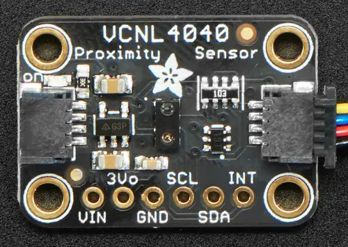

.. _shields:

Shields
#######

Shields, also known as "add-on" or "daughter boards", attach to a board
to extend its features and services for easier and modularized prototyping.
In Zephyr, the shield feature provides Zephyr-formatted shield
descriptions for easier compatibility with applications.

Shield activation
*****************

Activate support for one or more shields by adding the matching ``--shield`` arguments
to the west command:

  .. zephyr-app-commands::
     :app: your_app
     :board: your_board
     :shield: x_nucleo_idb05a1,x_nucleo_iks01a1
     :goals: build

Alternatively, it could be set by default in a project's CMakeLists.txt:

.. code-block:: cmake

	set(SHIELD x_nucleo_iks01a1)

Shield interfaces
*****************

A shield is defined by two key characteristics:

#. **Physical connectors** - the mechanical interface
#. **Electrical signals** - what each pin actually does

The connection between a shield and a board happens through Devicetree files:

- Board side: The board's devicetree file uses a :ref:`GPIO nexus node <gpio-nexus-node>` to map
  connector pins to the microcontroller's actual GPIO pins. It also defines labels for buses exposed
  through the connector (like ``arduino_i2c``, ``arduino_spi``, ``arduino_uart``).

- Shield side: The shield's .overlay file references these same labels to describe how its
  components connect to the board.

At build time, the board's devicetree and the shield's overlay are combined to create a complete
picture of the hardware setup.

For example, let's say you have a board with an Arduino connector but no built-in accelerometer.
You can add one using an Arduino shield:

#. The board's Devicetree defines an ``arduino_i2c`` label: it is the I2C bus made available on the
   Arduino connector

#. The accelerometer shield's overlay file also references ``arduino_i2c`` to indicate it uses that
   same I2C bus. If it needs to use GPIO pins from the connector, it references the GPIO nexus node
   defined by the board's Devicetree (e.g. ``arduino_header``).

When you then build for this board with this shield, Zephyr automatically "wires them" together.

.. note::

   Some boards and shields may only support a limited set of features of a shield hardware
   interface. Refer to their documentation for more details.

Arduino MKR
-----------

This is the form factor of the Arduino MKR boards.

.. figure:: ../../../boards/arduino/mkrzero/doc/img/arduino_mkrzero.jpg
   :align: center
   :width: 200px
   :alt: Arduino MKR Zero

   Arduino MKR Zero, an example of a board with the Arduino MKR shield interface

Relevant devicetree node labels:

- ``arduino_mkr_header`` See :dtcompatible:`arduino-mkr-header` for details on GPIO pin definitions
  and includes for use in devicetree files.
- ``arduino_mkr_i2c``
- ``arduino_mkr_spi``
- ``arduino_mkr_serial``

Arduino Nano
------------

This is the form factor of the Arduino Nano boards.

.. figure:: ../../../boards/arduino/nano_33_iot/doc/img/nano_33_iot.jpg
   :align: center
   :width: 300px
   :alt: Arduino Nano 33 IOT

   Arduino Nano 33 IOT, an example of a board with the Arduino Nano shield interface

Relevant devicetree node labels:

- ``arduino_nano_header`` See :dtcompatible:`arduino-nano-header` for details on GPIO pin definitions
  and includes for use in devicetree files.
- ``arduino_nano_i2c``
- ``arduino_nano_spi``
- ``arduino_nano_serial``

Arduino Uno R3
--------------

This is the form factor of the Arduino Uno R3 board.

.. figure:: ../../../boards/shields/mcp2515/doc/keyestudio_can_bus_ks0411.jpg
   :align: center
   :width: 300px
   :alt: Keyestudio CAN-BUS Shield (KS0411)

   Keyestudio CAN-BUS, an example of an Arduino shield (Credit: Keyestudio)

Relevant devicetree node labels:

- ``arduino_header`` See :dtcompatible:`arduino-header-r3` for details on GPIO pin definitions
  and includes for use in devicetree files.
- ``arduino_adc`` See :dtcompatible:`arduino,uno-adc`
- ``arduino_pwm`` See :dtcompatible:`arduino-header-pwm`
- ``arduino_serial``
- ``arduino_i2c``
- ``arduino_spi``

For technical details, see `Arduino Uno R3 pinout`_.

Camera and display connectors
-----------------------------

These describe connections to cameras and displays (strictly speaking not shields).

- :dtcompatible:`arducam,dvp-20pin-connector`
- :dtcompatible:`nxp,cam-44pins-connector`
- :dtcompatible:`nxp,parallel-lcd-connector`
- :dtcompatible:`raspberrypi,csi-connector`
- :dtcompatible:`weact,dcmi-camera-connector`

Feather
-------

This is the form factor of the Adafruit Feather series of boards.
Shields intended for Feather boards are called Featherwings.

.. figure:: ../../../boards/shields/adafruit_adalogger_featherwing/doc/adafruit_adalogger_featherwing.webp
   :align: center
   :width: 300px
   :alt: Adafruit Adalogger Featherwing Shield

   Adafruit Adalogger, an example of a Featherwing (Credit: Adafruit)

Relevant devicetree node labels:

- ``feather_header`` See :dtcompatible:`adafruit-feather-header` for GPIO pin definitions.
- ``feather_adc``
- ``feather_i2c``
- ``feather_serial``
- ``feather_spi``

Microbit
--------

This is for the edge connector of the Microbit boards.

.. figure::  ../../../boards/bbc/microbit_v2/doc/img/bbc_microbit2.jpg
   :align: center
   :width: 500px
   :alt: Microbit V2 board

   Microbit V2 board uses the Microbit shield interface

See :dtcompatible:`microbit,edge-connector` for GPIO pin definitions and
links to technical requirements.

mikroBUS |trade|
----------------

This is an interface standard for add-on boards, developed by Mikroe.

.. figure:: ../../../boards/shields/mikroe_3d_hall_3_click/doc/images/mikroe_3d_hall_3_click.webp
   :align: center
   :alt: 3D Hall 3 Click
   :height: 300px

   3D Hall 3 Click, an example of a mikroBUS |trade| shield

Relevant devicetree node labels:

- ``mikrobus_header`` See :dtcompatible:`mikro-bus` for GPIO pin definitions and links to
  technical specifications.
- ``mikrobus_adc``
- ``mikrobus_i2c``
- ``mikrobus_spi``
- ``mikrobus_serial``

Note that boards with several mikroBUS |trade| connectors might define for
example ``mikrobus_2_spi``.

Pico
----

This is the form factor of the Raspberry Pi Pico boards.

.. figure::  ../../../boards/shields/waveshare_ups/doc/waveshare_pico_ups_b.jpg
   :align: center
   :width: 300px
   :alt: Waveshare Pico UPS-B shield

   Waveshare Pico UPS-B, an example of a Pico shield

Relevant devicetree node labels:

- ``pico_header`` See :dtcompatible:`raspberrypi,pico-header` for GPIO pin definitions.
- ``pico_i2c0``
- ``pico_i2c1``
- ``pico_serial``
- ``pico_spi``

ST Morpho
---------

Development boards from ST Microelectronics often uses the ST Morpho shield interface.

.. figure:: ../../../boards/shields/x_nucleo_gfx01m2/doc/x_nucleo_gfx01m2.webp
   :align: center
   :width: 300px
   :alt: X-NUCLEO-GFX01M2

   X-NUCLEO-GFX01M2, an example of an ST Morpho shield

Relevant devicetree node labels:

- ``st_morpho_header``  See :dtcompatible:`st-morpho-header` for details on GPIO pin definitions
  and includes for use in devicetree files.
- ``st_morpho_lcd_spi``
- ``st_morpho_flash_spi``

Xiao
----

This is the form factor of the Seeeduino XIAO boards.

.. figure:: ../../../boards/shields/seeed_xiao_expansion_board/doc/img/seeed_xiao_expansion_board.webp
     :align: center
     :width: 300px
     :alt: Seeed Studio XIAO Expansion Board

     Seeed Studio XIAO Expansion Board, an example of a Xiao shield (Credit: Seeed Studio)

Relevant devicetree node labels:

- ``xiao_d`` See :dtcompatible:`seeed,xiao-gpio` for GPIO pin definitions.
- ``xiao_spi``
- ``xiao_i2c``
- ``xiao_serial``
- ``xiao_adc``
- ``xiao_dac``

zephyr_i2c / Stemma QT / Quiic
------------------------------

These are four-pin I2C connectors. SparkFun calls these connectors "Qwiic", and Adafruit
calls them "Stemma QT". The I2C connectors have four pins; GND, +3.3 Volt, I2C data and I2C
clock. The most common physical connector is the 1.0 mm pitch JST-SH.

Due to the different brand names, the interface is labeled "zephyr_i2c".

   Adafruit VCNL4040, an example of a zephyr_i2c shield (Credit: Adafruit)

See :dtcompatible:`stemma-qt-connector` and :dtcompatible:`grove-header` for descriptions
and links to further details.

Relevant devicetree node labels:

- ``zephyr_i2c``

.. _shield_porting_guide:

Shield porting and configuration
********************************

Shield configuration files are available in the board directory
under :zephyr_file:`boards/shields`:

.. code-block:: none

   boards/shields/<shield>
   ├── shield.yml
   ├── <shield>.overlay
   ├── Kconfig.shield
   ├── Kconfig.defconfig
   └── pre_dt_shield.cmake

These files provides shield configuration as follows:

* **shield.yml**: This file provides metadata about the shield in YAML format.
  It must contain the following fields:

  * ``name``: Name of the shield used in Kconfig and build system (required)
  * ``full_name``: Full commercial name of the shield (required)
  * ``vendor``: Manufacturer/vendor of the shield (required)
  * ``supported_features``: List of hardware features the shield supports (optional). In order to
    help users identify the features a shield supports without having to dig into its overlay file,
    the ``supported_features`` field can be used to list the types of features the shield supports.
    The values should be the same as the ones defined in the
    :zephyr_file:`dts/bindings/binding-types.txt` file.

  Example:

  .. code-block:: yaml

     name: foo_shield
     full_name: Foo Shield for Arduino
     vendor: acme
     supported_features:
       - display
       - input

* **<shield>.overlay**: This file provides a shield description in devicetree
  format that is merged with the board's :ref:`devicetree <dt-guide>`
  before compilation.

* **Kconfig.shield**: This file defines shield Kconfig symbols that will be
  used for default shield configuration. To ease use with applications,
  the default shield configuration here should be consistent with those in
  the :ref:`default_board_configuration`.

* **Kconfig.defconfig**: This file defines the default shield configuration. It
  is made to be consistent with the :ref:`default_board_configuration`. Hence,
  shield configuration should be done by keeping in mind that features
  activation is application responsibility.

* **pre_dt_shield.cmake**: This optional file can be used to pass additional
  arguments to the devicetree compiler ``dtc``.

Besides, in order to avoid name conflicts with devices that may be defined at
board level, it is advised, specifically for shields devicetree descriptions,
to provide a device nodelabel is the form <device>_<shield>, for instance:

.. code-block:: devicetree

        sdhc_myshield: sdhc@1 {
                reg = <1>;
                ...
        };

Adding Source Code
******************

It is possible to add source code to shields, as a way to meet configuration
requirements that are specific to the shield (e.g: initialization routines,
timing constraints, etc), in order to enable it for proper operation with the
different Zephyr components.

.. note::

   Source code in shields shall not be used for purposes other than the
   one described above. Generic functionalities that could be reused among
   shields (and/or targets) shall not be captured here.

To effectively incorporate source code: add a :file:`CMakeLists.txt` file, as
well as the corresponding source files (referenced in CMake similar to other
areas of Zephyr, e.g: boards).

Board compatibility
*******************

Hardware shield-to-board compatibility depends on the use of well-known
connectors used on popular boards (such as Arduino and 96boards).  For
software compatibility, boards must also provide a configuration matching
their supported connectors.

This should be done at two different level:

* Pinmux: Connector pins should be correctly configured to match shield pins

* Devicetree: A board :ref:`devicetree <dt-guide>` file,
  :file:`BOARD.dts` should define an alternate nodelabel for each connector interface.
  For example, for Arduino I2C:

.. code-block:: devicetree

        arduino_i2c: &i2c1 {};

Board specific shield configuration
-----------------------------------

If modifications are needed to fit a shield to a particular board or board
revision, you can override a shield description for a specific board by adding
board or board revision overriding files to a shield, as follows:

.. code-block:: none

   boards/shields/<shield>
   └── boards
       ├── <board>_<revision>.overlay
       ├── <board>.overlay
       ├── <board>.defconfig
       ├── <board>_<revision>.conf
       └── <board>.conf

Shield variants
***************

Some shields may support several variants or revisions. In that case, it is
possible to provide multiple version of the shields description:

.. code-block:: none

   boards/shields/<shield>
   ├── <shield_v1>.overlay
   ├── <shield_v1>.defconfig
   ├── <shield_v2>.overlay
   └── <shield_v2>.defconfig

In this case, a shield-particular revision name can be used:

  .. zephyr-app-commands::
     :app: your_app
     :shield: shield_v2
     :goals: build

You can also provide a board-specific configuration to a specific shield
revision:

.. code-block:: none

   boards/shields/<shield>
   ├── <shield_v1>.overlay
   ├── <shield_v1>.defconfig
   ├── <shield_v2>.overlay
   ├── <shield_v2>.defconfig
   └── boards
       └── <shield_v2>
           ├── <board>.overlay
           └── <board>.defconfig

.. _gpio-nexus-node:

GPIO nexus nodes
****************

GPIOs accessed by the shield peripherals must be identified using the
shield GPIO abstraction, for example from the ``arduino-header-r3``
compatible.  Boards that provide the header must map the header pins
to SOC-specific pins.  This is accomplished by including a `nexus
node`_ that looks like the following into the board devicetree file:

.. _nexus node:
    https://github.com/devicetree-org/devicetree-specification/blob/4b1dac80eaca45b4babf5299452a951008a5d864/source/devicetree-basics.rst#nexus-nodes-and-specifier-mapping

.. code-block:: devicetree

    arduino_header: connector {
            compatible = "arduino-header-r3";
            #gpio-cells = <2>;
            gpio-map-mask = <0xffffffff 0xffffffc0>;
            gpio-map-pass-thru = <0 0x3f>;
            gpio-map = <0 0 &gpioa 0 0>,    /* A0 */
                       <1 0 &gpioa 1 0>,    /* A1 */
                       <2 0 &gpioa 4 0>,    /* A2 */
                       <3 0 &gpiob 0 0>,    /* A3 */
                       <4 0 &gpioc 1 0>,    /* A4 */
                       <5 0 &gpioc 0 0>,    /* A5 */
                       <6 0 &gpioa 3 0>,    /* D0 */
                       <7 0 &gpioa 2 0>,    /* D1 */
                       <8 0 &gpioa 10 0>,   /* D2 */
                       <9 0 &gpiob 3 0>,    /* D3 */
                       <10 0 &gpiob 5 0>,   /* D4 */
                       <11 0 &gpiob 4 0>,   /* D5 */
                       <12 0 &gpiob 10 0>,  /* D6 */
                       <13 0 &gpioa 8 0>,   /* D7 */
                       <14 0 &gpioa 9 0>,   /* D8 */
                       <15 0 &gpioc 7 0>,   /* D9 */
                       <16 0 &gpiob 6 0>,   /* D10 */
                       <17 0 &gpioa 7 0>,   /* D11 */
                       <18 0 &gpioa 6 0>,   /* D12 */
                       <19 0 &gpioa 5 0>,   /* D13 */
                       <20 0 &gpiob 9 0>,   /* D14 */
                       <21 0 &gpiob 8 0>;   /* D15 */
    };

This specifies how Arduino pin references like ``<&arduino_header 11
0>`` are converted to SOC gpio pin references like ``<&gpiob 4 0>``.

In Zephyr GPIO specifiers generally have two parameters (indicated by
``#gpio-cells = <2>``): the pin number and a set of flags.  The low 6
bits of the flags correspond to features that can be configured in
devicetree.  In some cases it's necessary to use a non-zero flag value
to tell the driver how a particular pin behaves, as with:

.. code-block:: devicetree

    drdy-gpios = <&arduino_header 11 GPIO_ACTIVE_LOW>;

After preprocessing this becomes ``<&arduino_header 11 1>``.  Normally
the presence of such a flag would cause the map lookup to fail,
because there is no map entry with a non-zero flags value.  The
``gpio-map-mask`` property specifies that, for lookup, all bits of the
pin and all but the low 6 bits of the flags are used to identify the
specifier.  Then the ``gpio-map-pass-thru`` specifies that the low 6
bits of the flags are copied over, so the SOC GPIO reference becomes
``<&gpiob 4 1>`` as intended.

See `nexus node`_ for more information about this capability.

.. _Arduino Uno R3 pinout:
  https://docs.arduino.cc/resources/pinouts/A000066-full-pinout.pdf
