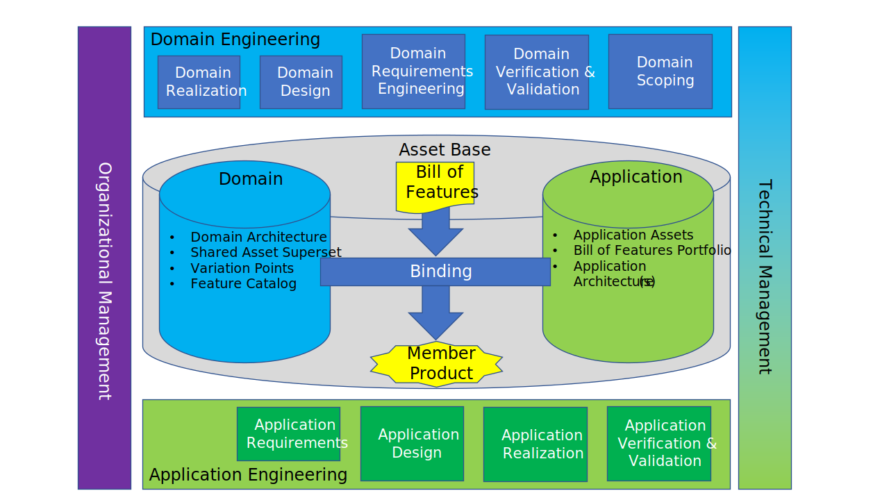

.. _introducing_zephyr:

Introduction
############

Zephyr is a configurable, reusable framework and composable
set of reusable assets designed to work together for developing
RTOS-based firmware for resource-constrained embedded systems:
from simple embedded environmental sensors and LED wearables
to sophisticated embedded controllers, smart watches, and IoT
wireless applications.  The framework, assets (e.g., RTOS, drivers,
board definitions) and processes are targeted for use in developing
certifiably secure and safety-critical embedded systems.

The Zephyr kernel supports multiple CPU architectures, including:
 - ARCv2 (EM and HS) and ARCv3 (HS6X)
 - ARMv6-M, ARMv7-M, and ARMv8-M (Cortex-M)
 - ARMv7-A and ARMv8-A (Cortex-A, 32- and 64-bit)
 - ARMv7-R, ARMv8-R (Cortex-R, 32- and 64-bit)
 - Intel x86 (32- and 64-bit)
 - MIPS (MIPS32 Release 1 specification)
 - NIOS II Gen 2
 - RISC-V (32- and 64-bit)
 - SPARC V8
 - Tensilica Xtensa

The full list of supported boards based on these CPU architectures
can be found :ref:`here <boards>`.

Licensing
*********

Zephyr is permissively licensed using the `Apache 2.0 license`_
(as found in the ``LICENSE`` file in the
project's `GitHub repo`_).  There are some
imported or reused components of the Zephyr project that use other licensing,
as described in :ref:`Zephyr_Licensing`.

.. _Apache 2.0 license:
   https://github.com/zephyrproject-rtos/zephyr/blob/main/LICENSE

.. _GitHub repo: https://github.com/zephyrproject-rtos/zephyr

Distinguishing Features
***********************

Zephyr is both more than and less than "an RTOS".  It is more closely
described as a :term:`product line platform` (defined in ISO/IEC 26550:2015)
as Zephyr provides:

**Reusable, extensible framework**

  Zephyr offers a number of familiar features for development:

  * *Project-specific feature-based configuration management*

    built around Kconfig.  For describing which high-level features to build
    into a specific product.

  * *Board-specific hardware descriptions*

    built around :ref:`devicetree <dt-guide>` to describe hardware.
    Information from devicetree is used to create the application image.

  * *Test framework, test runner, and code coverage tools*

    to verify only the specified functionality exists in the code-under-test.

  * *Extenensible, modular workspace*

    to support integration of non-child source repositories as well as
    Git submodules into the ecosystem.

  * *Extensible documentation*

    to capture all the content in the workspace.

  * *Generated linker directives and system interfaces*

  * *Extensible build system*

    for integration of modules using other tools to build libraries.

  * *Highly configurable / Modular for flexibility*

    that allows an application to incorporate *only* the capabilities
    it needs as it needs them, and to specify their quantity and size.

  * *Native Linux, macOS, and Windows Development*

    to a command-line CMake build environment that runs on popular
    developer host systems. A native POSIX port that lets you build
    and run Zephyr as a native application on Linux and other OSes,
    aiding development and testing.

**Configurable, extensible domain architecture**

  * *Cross CPU Architecture*

    that supports a wide variety of :ref:`supported boards <boards>`
    with different CPU architectures and developer tools. Contributions
    have added support for an increasing number of SoCs, platforms,
    and drivers.

  * *Compile-time resource definition*

    that allows system resources to be defined at compile-time,
    which reduces code size and increases performance for
    resource-limited systems.

**Extensive reusable asset base**

  Zephyr offers a large and ever growing number of features including:

  * *Extensive suite of Kernel services*

    Zephyr offers a number of familiar services for development:

    * *Multi-threading Services*

      for cooperative, priority-based,
      non-preemptive, and preemptive threads with optional round robin
      time-slicing. Includes POSIX pthreads compatible API support.

    * *Interrupt Services*

      for compile-time registration of interrupt handlers.

    * *Memory Allocation Services*

      for dynamic allocation and freeing of fixed-size or
      variable-size memory blocks.

    * *Inter-thread Synchronization Services*

      for binary semaphores, counting semaphores, and mutex semaphores.

    * *Inter-thread Data Passing Services*

      for basic message queues, enhanced message queues, and byte streams.

    * *Power Management Services*

      such as tickless idle and an advanced idling infrastructure.

    * *Multiple Scheduling Algorithms*

      Zephyr provides a comprehensive set of thread scheduling choices:

      * Cooperative and Preemptive Scheduling
      * Earliest Deadline First (EDF)
      * Meta IRQ scheduling implementing "interrupt bottom half" or "tasklet"
        behavior
      * Timeslicing: Enables time slicing between preemptible threads of equal
        priority
      * Multiple queuing strategies:

        * Simple linked-list ready queue
        * Red/black tree ready queue
        * Traditional multi-queue ready queue

    * *Memory Protection*

       Implements configurable architecture-specific stack-overflow protection,
       kernel object and device driver permission tracking, and thread isolation
       with thread-level memory protection on x86, ARC, and ARM architectures,
       userspace, and memory domains.

       For platforms without MMU/MPU and memory constrained devices, supports
       combining application-specific code with a custom kernel to create a
       monolithic image that gets loaded and executed on a system's hardware. Both
       the application code and kernel code execute in a single shared address
       space.

  * *Optimized Device Driver Model*

    Provides a consistent device model for configuring the drivers that are part
    of the platform/system and a consistent model for initializing all the
    drivers configured into the system and Allows the reuse of drivers across
    platforms that have common devices/IP blocks

  * *Native Networking Stack supporting multiple protocols*

    Networking support is fully featured and optimized, including LwM2M and BSD
    sockets compatible support.  OpenThread support (on Nordic chipsets) is also
    provided - a mesh network designed to securely and reliably connect hundreds
    of products around the home.

  * *Bluetooth Low Energy 5.0 support*

    Bluetooth 5.0 compliant (ESR10) and Bluetooth Low Energy Controller support
    (LE Link Layer). Includes Bluetooth mesh and a Bluetooth qualification-ready
    Bluetooth controller.

    * Generic Access Profile (GAP) with all possible LE roles.
    * GATT (Generic Attribute Profile)
    * Pairing support, including the Secure Connections feature from Bluetooth
      4.2
    * Clean HCI driver abstraction
    * Raw HCI interface to run Zephyr as a Controller instead of a full Host
      stack
    * Verified with multiple popular controllers
    * Highly configurable

    Mesh Support:

    * Relay, Friend Node, Low-Power Node (LPN) and GATT Proxy features
    * Both Provisioning bearers supported (PB-ADV & PB-GATT)
    * Highly configurable, fitting in devices with at least 16k RAM

  * *Virtual File System Interface with LittleFS and FATFS Support*

    LittleFS and FATFS Support,
    FCB (Flash Circular Buffer) for memory constrained applications, and
    file system enhancements for logging and configuration.

  * *Powerful multi-backend logging Framework*

    Support for log filtering, object dumping, panic mode, multiple backends
    (memory, networking, filesystem, console, ..) and integration with the shell
    subsystem.

  * *User friendly and full-featured Shell interface*

    A multi-instance shell subsystem with user-friendly features such as
    autocompletion, wildcards, coloring, metakeys (arrows, backspace, ctrl+u,
    etc.) and history. Support for static commands and dynamic sub-commands.

  * *Settings on non-volatile storage*

    The settings subsystem gives modules a way to store persistent per-device
    configuration and runtime state.  Settings items are stored as key-value pair
    strings.

  * *Non-volatile storage (NVS)*

    NVS allows storage of binary blobs, strings, integers, longs, and any
    combination of these.

  * *Native POSIX port*

    Supports running Zephyr as a Linux application with support for various
    subsystems and networking.

.. include:: ../../README.rst
   :start-after: start_include_here

Fundamental Concepts
********************

Software and Systems Product Line (SSPL) Instantiation
======================================================

Software and Systems Product Line (SSPL) engineering and management
is standardized in the ISO/IEC 2655x series of documents.  The Introduction
section of ISO/IEC 26550:2015 Software and systems engineering -
Reference model for product line engineering and management,
states:

  Software and Systems Product Line (SSPL) engineering and management
  creates, exploits, and manages a common platform to develop a family
  of products (e.g. software products, system architectures) at lower
  cost, reduced time to market, and with better quality.  As a result,
  it has gained increasing global attention since 1990s.

  This International Standard [ISO/IEC 26550:2015] provides a reference
  model consisting of an abstract representation of the key processes
  of software and systems product line engineering and management and
  the relationships between the processes.  Two key characteristics,
  the need for both domain and application engineering lifecycle processes
  and the need for the explicit variability definition, differentiate
  product line engineering from single-system engineering.  The goal of
  domain engineering is to define and implement domain assets commonly
  used by member products within a product line, while the goal of
  application engineering is to develop applications by exploiting the
  domain assets including common and variable assets.  Domain engineering
  explicitly defines product line variability which reflects the specific
  needs of different markets and market segments.  Variability may be
  embedded in domain assets.  During application engineering, the
  domain assets are deployed in accordance with the defined variability
  models.

The SSPL approach is very appropriate for the development of connected
resource-constrained devices due to typically having a significant
number of device variations, frequently built in high quanitites,
and potentially having a long sustainment lifetime.

* :term:`product line` -
     set of products and/or services sharing explicitly defined and
     managed common and variable features and relying on the same
     :term:`domain architecture` to meet the :term:`common <commonality>` and
     :term:`variable <variability>` needs of specific markets

* :term:`domain engineering` -
      life cycle consisting of a set of processes for specifying and
      managing the :term:`commonality` and :term:`variability` of a
      :term:`product line`

* :term:`application engineering`
      life cycle consisting of a set of processes in which the
      :term:`application assets <application asset>` and
      :term:`member products <member product>` of the
      :term:`product line` are implemented and
      managed by reusing :term:`domain assets <domain asset>`
      in conformance to the :term:`domain architecture` and by
      binding the :term:`variability` of the platform

* :term:`product line platform`
      :term:`product line architecture`, a configuration management plan,
      and :term:`domain assets <domain asset>` enabling
      :term:`application engineering` to effectively reuse and produce
      a set of derivative products

The :term:`product line reference model` can be represented as:

Fundamentally Zephyr fulfills the ISO/IEC 26550:2016 definition of a
:term:`product line platform`, focusing on the domain of
resource-constrained connected devices.

The foundational value comes with the reusable framework that can be
extended with additional downstream content via supplemental repositories
*without having to modify the base Zephyr repository*. The associated
processes, policies, and guidelines set the patterns and direction of
sustained high reuse of framework, tools, and architecture by
downsteam users.  This value is present even when a product is built
on top of only the minimal Zephyr functionality (no threading,
no scheduler, no memory protection, no Zephyr drivers).

The more obvious value comes with the suite of **reusable**, configurable
assets (e.g, scheduler, drivers, subsystems, etc.) designed to work
together as an **extensible**, composable system.  This enables downstream
vendors and OSS projects to extend the Zephyr ecosystem as desired.

In this model the Zephyr Project and contributors are primarily involved
in :term:`domain engineering`. This includes automated verification of
the domain assets.  Verifying the framework and domain assets also requires
exercising some :term:`application engineering` processes and developing
sample :term:`applications <application>` (complete executables -
i.e., samples).

This model shows how Zephyr is both much more than and significantly
different than "an RTOS".

Feature-based Product Line Engineering (Feature-based PLE) Support
==================================================================

Additionally Zephyr provides much of the core functionality needed
for the **feature-based software and systems product line engineering**
("feature-based PLE") described in ISO/IEC 26580:2021. As described in
Introduction of that standard:

  The feature-based PLE specialization is a more narrowly defined
  solution that can be supported by off-the-shelf tools and methods,
  which has resulted in lower investments when an orgization adopts
  SSPL.  Feature-based PLE embodies lessons learned about SSPL
  practices that have been shown to provide some of the highest
  benefits and returns.

  The predominant specializations of general SSPL that characterize
  feature-based PLE are:

  #. a mapping from features to asset variation points that is
     sufficient to drive a fully automated configurator that produces
     assets specific to member products;

  #. a methodological shift of all design and implementation effort,
     change management, and configuration management to domain
     engineering, so that application engineering is reduced to
     automated configuration of member product instances and testing
     of configured member products and member-product-specific assets.

Specifically, Zephyr supports a level of automated configuration through
both extensible Kconfig definitions, overlays of configuration files, and
build system hooks for user-definable extensions.  Additionally, Zephyr
explicitly provides a default implementation of `main()` and build-time
construction of initialization sequences. Together these enable users
to extend Zephyr for feature-based PLE.

Extensibility via Zephyr Modules
================================

The Zephyr modules interface enables downstream users to extend
their workspace without having to fork the upstream repositories.  This
mechanism is independent of SSPL and Feature-based PLE.  This mechanism
allows downstream products to reuse a Zephyr release (including all
verification tests and potentially certification artifacts).

This capability is very relevant for developing non-OSS content
(e.g., commercially-licensed device drivers) for integration by end users.
This mechanism enables the development of isolated proprietary code to
use the same tools and follow parallel processes and structure provided
for the Zephyr core assets.

It is important to notice that all files exposed by the module's
interface are accessible throughout the workspace. If they are
reusable then they are part of the :term:`asset base`.

Fundamental Terms
*****************

See :ref:`glossary`
