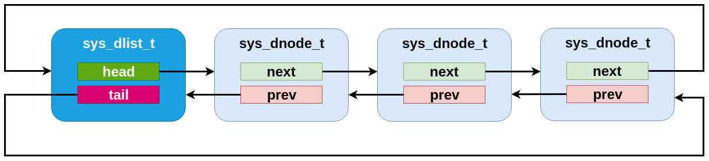
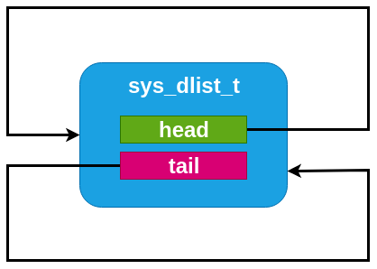

.. _dlist_api:

Double-linked List
==================

Similar to the single-linked list in many respects, Zephyr includes a
double-linked implementation.  This provides the same algorithmic
behavior for all the existing slist operations, but also allows for
constant-time removal and insertion (at all points: before or after
the head, tail or any internal node).  To do this, the list stores two
pointers per node, and thus has somewhat higher runtime code and
memory space needs.

A :c:type:`sys_dlist_t` struct may be instantiated by the user in any
accessible memory.  It must be initialized with :c:func:`sys_dlist_init`
or :c:macro:`SYS_DLIST_STATIC_INIT` before use.  The :c:type:`sys_dnode_t` struct
is expected to be provided by the user for any nodes added to the
list (typically embedded within the struct to be tracked, as described
above).  It must be initialized in zeroed/bss memory or with
:c:func:`sys_dnode_init` before use.

Primitive operations may retrieve the head/tail of a list and the
next/prev pointers of a node with :c:func:`sys_dlist_peek_head`,
:c:func:`sys_dlist_peek_tail`, :c:func:`sys_dlist_peek_next` and
:c:func:`sys_dlist_peek_prev`.  These can all return NULL where
appropriate (i.e. for empty lists, or nodes at the endpoints of the
list).

A dlist can be modified in constant time by removing a node with
:c:func:`sys_dlist_remove`, by adding a node to the head or tail of a list
with :c:func:`sys_dlist_prepend` and :c:func:`sys_dlist_append`, or by
inserting a node before an existing node with :c:func:`sys_dlist_insert`.

As for slist, each node in a dlist can be processed in a natural code
block style using :c:macro:`SYS_DLIST_FOR_EACH_NODE`.  This macro also
exists in a "FROM_NODE" form which allows for iterating from a known
starting point, a "SAFE" variant that allows for removing the node
being inspected within the code block, a "CONTAINER" style that
provides the pointer to a containing struct instead of the raw node,
and a "CONTAINER_SAFE" variant that provides both properties.

Convenience utilities provided by dlist include
:c:func:`sys_dlist_insert_at`, which inserts a node that linearly searches
through a list to find the right insertion point, which is provided by
the user as a C callback function pointer, and
:c:func:`sys_dnode_is_linked`, which will affirmatively return whether or
not a node is currently linked into a dlist or not (via an
implementation that has zero overhead vs. the normal list processing).

Double-linked List Internals
----------------------------

Internally, the dlist implementation is minimal: the :c:type:`sys_dlist_t`
struct contains "head" and "tail" pointer fields, the :c:type:`sys_dnode_t`
contains "prev" and "next" pointers, and no other data is stored.  But
in practice the two structs are internally identical, and the list
struct is inserted as a node into the list itself.  This allows for a
very clean symmetry of operations:

* An empty list has backpointers to itself in the list struct, which
  can be trivially detected.

* The head and tail of the list can be detected by comparing the
  prev/next pointers of a node vs. the list struct address.

* An insertion or deletion never needs to check for the special case
  of inserting at the head or tail.  There are never any NULL pointers
  within the list to be avoided.  Exactly the same operations are run,
  without tests or branches, for all list modification primitives.

Effectively, a dlist of N nodes can be thought of as a "ring" of "N+1"
nodes, where one node represents the list tracking struct.

    A dlist containing three elements.  Note that the list struct
    appears as a fourth "element" in the list.

.. figure:: dlist-single.png
    :align: center
    :alt: single-element dlist example
    :figclass: align-center

    An dlist containing just one element.

    An empty dlist.

Doubly-linked List API Reference
--------------------------------

.. doxygengroup:: doubly-linked-list_apis
