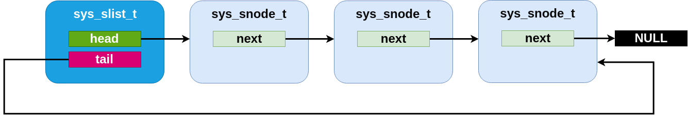

.. _slist_api:

Single-linked List
==================

Zephyr provides a :c:struct:`sys_slist_t` type for storing simple
singly-linked list data (i.e. data where each list element stores a
pointer to the next element, but not the previous one).  This supports
constant-time access to the first (head) and last (tail) elements of
the list, insertion before the head and after the tail of the list and
constant time removal of the head.  Removal of subsequent nodes
requires access to the "previous" pointer and thus can only be
performed in linear time by searching the list.

The :c:struct:`sys_slist_t` struct may be instantiated by the user in any
accessible memory.  It should be initialized with either
:c:func:`sys_slist_init` or by static assignment from SYS_SLIST_STATIC_INIT
before use.  Its interior fields are opaque and should not be accessed
by user code.

The end nodes of a list may be retrieved with
:c:func:`sys_slist_peek_head` and :c:func:`sys_slist_peek_tail`, which will
return NULL if the list is empty, otherwise a pointer to a
:c:struct:`sys_snode_t` struct.

The :c:struct:`sys_snode_t` struct represents the data to be inserted.  In
general, it is expected to be allocated/controlled by the user,
usually embedded within a struct which is to be added to the list.
The container struct pointer may be retrieved from a list node using
:c:macro:`SYS_SLIST_CONTAINER`, passing it the struct name of the
containing struct and the field name of the node.  Internally, the
:c:struct:`sys_snode_t` struct contains only a next pointer, which may be
accessed with :c:func:`sys_slist_peek_next`.

Lists may be modified by adding a single node at the head or tail with
:c:func:`sys_slist_prepend` and :c:func:`sys_slist_append`.  They may also
have a node added to an interior point with :c:func:`sys_slist_insert`,
which inserts a new node after an existing one.  Similarly
:c:func:`sys_slist_remove` will remove a node given a pointer to its
predecessor.  These operations are all constant time.

Convenience routines exist for more complicated modifications to a
list.  :c:func:`sys_slist_merge_slist` will append an entire list to an
existing one.  :c:func:`sys_slist_append_list` will append a bounded
subset of an existing list in constant time.  And
:c:func:`sys_slist_find_and_remove` will search a list (in linear time)
for a given node and remove it if present.

Finally the slist implementation provides a set of "for each" macros
that allows for iterating over a list in a natural way without needing
to manually traverse the next pointers.  :c:macro:`SYS_SLIST_FOR_EACH_NODE`
will enumerate every node in a list given a local variable to store
the node pointer.  :c:macro:`SYS_SLIST_FOR_EACH_NODE_SAFE` behaves
similarly, but has a more complicated implementation that requires an
extra scratch variable for storage and allows the user to delete the
iterated node during the iteration.  Each of those macros also exists
in a "container" variant (:c:macro:`SYS_SLIST_FOR_EACH_CONTAINER` and
:c:macro:`SYS_SLIST_FOR_EACH_CONTAINER_SAFE`) which assigns a local
variable of a type that matches the user's container struct and not
the node struct, performing the required offsets internally.  And
:c:macro:`SYS_SLIST_ITERATE_FROM_NODE` exists to allow for enumerating a
node and all its successors only, without inspecting the earlier part
of the list.

Single-linked List Internals
----------------------------

The slist code is designed to be minimal and conventional.
Internally, a :c:struct:`sys_slist_t` struct is nothing more than a pair of
"head" and "tail" pointer fields.  And a :c:struct:`sys_snode_t` stores only a
single "next" pointer.

    An slist containing three elements.

.. figure:: slist-empty.png
    :align: center
    :alt: empty slist example
    :figclass: align-center

    An empty slist

The specific implementation of the list code, however, is done with an
internal "Z_GENLIST" template API which allows for extracting those
fields from arbitrary structures and emits an arbitrarily named set of
functions.  This allows for implementing more complicated
single-linked list variants using the same basic primitives.  The
genlist implementor is responsible for a custom implementation of the
primitive operations only: an "init" step for each struct, and a "get"
and "set" primitives for each of head, tail and next pointers on their
relevant structs.  These inline functions are passed as parameters to
the genlist macro expansion.

Only one such variant, sflist, exists in Zephyr at the moment.

Flagged List
------------

The :c:struct:`sys_sflist_t` is implemented using the described genlist
template API.  With the exception of symbol naming ("sflist" instead
of "slist") and the additional API described next, it operates in all
ways identically to the slist API.

It adds the ability to associate exactly two bits of user defined
"flags" with each list node.  These can be accessed and modified with
:c:func:`sys_sfnode_flags_get` and :c:func:`sys_sfnode_flags_get`.
Internally, the flags are stored unioned with the bottom bits of the
next pointer and incur no SRAM storage overhead when compared with the
simpler slist code.

Single-linked List API Reference
--------------------------------

.. doxygengroup:: single-linked-list_apis

Flagged List API Reference
--------------------------------

.. doxygengroup:: flagged-single-linked-list_apis
