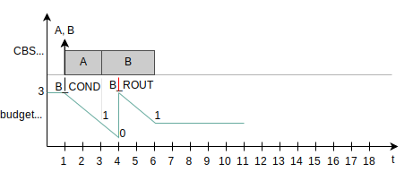
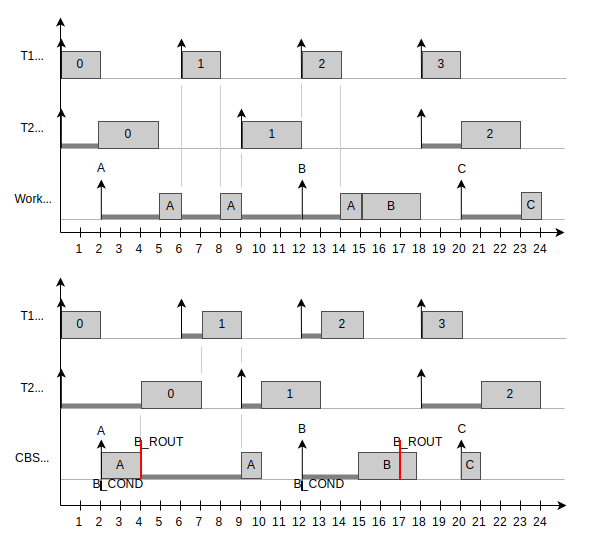

.. _constant_bandwidth_server_v1:

Constant Bandwidth Server (CBS)
###############################

A :dfn:`CBS` is an extension of the Earliest Deadline First (EDF) scheduler
that allows tasks to be executed virtually isolated from each other, in a way
that if a task executes for longer than expected it doesn't interfere on the
execution of the others. In other words, the CBS prevents that a task
misbehavior causes other tasks to miss their own deadlines.

.. contents::
    :local:
    :depth: 1

Introduction
************

The regular EDF scheduler selects which task should be executing based on
whichever has the earliest absolute deadline of all. The absolute deadline
of a task, then, is the time instant in which the task *should* have already
be completely executed. In *hard* real-time systems, not meeting the deadline
means a catastrophic failure, whereas in *soft* real-time systems, it means
annoyance to the end user. Many complex systems, however, feature both *hard*
and *soft* tasks to execute, in which case they are called *hybrid* real-time
systems.

Either way, having a missed deadline is never desirable. On single-core systems,
the EDF guarantees schedulability (i.e. no task will miss a deadline) when the
sum of each task's **bandwidth** - that is, the task execution time divided by
its deadline - is less than or equal to **1** (which means 100% of CPU usage).
However, that implies that the execution times are known beforehand - for hard
tasks, the Worst-Case Execution Time (WCET) is used, and for soft tasks, the
average execution time is preferred. These values are still prone to estimation
errors if the system is not thoroughly tested, and even if it is, a true
worst-case scenario might never truly show up during development phase.

However, these calculations are not relevant to the regular EDF scheduler at
runtime - it doesn't actively account for tasks that execute for more than the
estimated time, it just cares for the configured deadline of the threads. As
a result, a system which features tasks with variable execution times might
often cause other tasks to miss their deadlines.

The Constant Bandwidth Server (CBS)
***********************************

The CBS solves this problem in EDF by trading the aforementioned execution
time for a time *budget* that represents for how long the task is *allowed*
to execute, somewhat similar to the time slice in the round-robin scheduler.
Unlike round-robin, though, the kernel automatically downgrades the thread
priority by postponing its deadline when the budget runs out. So, if even
with the lowered priority the task in question remains the one with the
earliest deadline, it keeps executing as if nothing happened.

In a nutshell, the CBS is a work-conserving wrapper for the tasks that
automatically recalculates their deadlines when they exceed their
configured timing constraints. If a task takes longer than expected,
it can be preempted by awaiting tasks instead of jeopardizing their
deadlines. The key features of a CBS are:

* A **budget**, which represents the maximum amount of time a CBS can
  serve the tasks given to it before triggering a deadline recalculation;
* A **period**, which is used to recalculate the absolute deadline of
  the server when the kernel intervenes; and
* A **job queue**, dedicated to receive the jobs that the CBS should
  execute. All jobs received are executed in a First-In-First-Out manner.

.. note::
  For the remainder of this documentation, a **job** is an instance of a
  task (similar to what objects are to classes in OOP). So while the task
  is the function *declaration*, the job is the function *call*.

  Tasks assigned to a CBS don't have a deadline of their own. Instead, each
  time a job is pushed to a CBS, it receives the deadline of that CBS.

In the following section we'll go through the basics of the CBS mechanism.

How it works
============

Assume we have two jobs of tasks *A* and *B*, with an execution time of 2 and 3
seconds each, that are pushed to a CBS with (budget, period) = (3,7) seconds.
Both jobs are pushed sequentially to the CBS, so job A will be served first
and job B will go next. If the CBS is running alone in the system, this is
what would happen:

* At instant t=1, both jobs are pushed. The CBS was idle, so the
  deadline is calculated as (t + period) = (1 + 7) = 8. As there
  is no other contending task in the system, the CBS starts
  executing job A immediately.
* At instant t=3, job A finishes execution. The remaining budget
  is of 1 second, since job A spent 2 seconds with its own execution.
  Job B, the next one in line, starts here.
* At instant t=4, the budget runs out. This triggers the kernel,
  which replenishes the budget at the cost of postponing the CBS
  deadline by 7 units (the CBS period). So the new deadline is
  (8 + 7) = 15. Since there is no other contending task with an
  earliest deadline, the CBS resumes execution of job B.
* At instant t=6, job B is completed. The remaining budget is of
  1 second and will be like this until a new job is pushed.

Note that, originally, the CBS has an utilization factor (bandwidth) of
(budget / period) = (3 / 7) = 0.4286. When the budget runs out at t=4,
the CBS is granted 3 more seconds of execution at the expense of an
increased deadline, then becoming (6 / 14) = 0.4286. That means the CBS
is always expected to use at most 42.86% of the CPU - hence the name
*Constant Bandwidth Server*.

Now let's add to this example by imagining two more jobs C and D, with
execution times of 1.3 and 1, are pushed to the CBS at instants t=8 and
t=16, respectively. This is the execution outcome:

.. image:: example-2.svg
     :align: center
     :width: 80%

* At instant t=8, job C is pushed. The CBS was idle, so the kernel
  checks if the available bandwidth of the server - that is, the
  budget left (1) divided by the current time until the deadline (7,
  since at this point the deadline is set at t=15) - is greater or
  equal than the configured server bandwidth (0.4286). Since
  (1 / 7) = 0.14, the current bandwidth is lower than configured.
  Thus, job C is served with the current budget and deadline.
* At instant t=9, the budget runs out. The kernel then replenishes
  the budget and postpones the deadline in 7 seconds, leading to a
  new value of (15 + 7) = 22. As there are no other contending tasks,
  job C resumes execution.
* At instant t=9.3, job C is completed. The remaining budget is
  2.7 seconds.
* At instant t=16, job D is pushed. The CBS was idle, so the kernel
  performs the same bandwidth check as above. This time the current
  budget is 2.7 seconds and the deadine is 22, so the available
  bandwidth is (2.7 / (22 - 16)) = (2.7 / 6) = 0.45. As it is higher
  than the configured 0.4286, serving job D with the current values
  could jeopardize the system schedulability (thus, it's better to
  intervene). The budget is replenished to 3, and the new deadine is
  set at (t + period) = (16 + 7) = 23.
* At instant t=17, job D is completed. The remaining budget is of
  2 seconds and will be like this until a new job is pushed.

The working principle is simple: the CBS executes jobs that might come
at random intervals in FIFO order, and every time a new job comes to an
idle server, the kernel checks if the available bandwidth is higher
than configured. If that's the case, an intervention happen and the
server deadline is recalculated as to not risk the system schedulability.
Moreover, the deadline is postponed whenever the running job exhausts
the budget.

Use Cases
*********

The CBS is optimal for situations where tasks have an unpredictable period
between activations and variable (or unknown) execution times. For these
scenarios, it introduces safeguards that add predictability to the
execution. There are two main ways of using a CBS: within a hard taskset or
to aid in the execution of a soft taskset.

Case 1: CBS + Hard tasks
========================

This is the use case where the hard real-time tasks are scheduled directly
under EDF, and the soft real-time tasks are wrapped by one (or more) CBS's.
Such might be the case for hard tasks because it might not be of interest
that those have their deadlines automatically recalculated when running
for longer than expected. For example, a hard task could be the sampling of
a sensor for a control loop while a soft task could be the rendering of
the user interface.

When selecting this approach, the CBS can behave like an EDF version of
the :ref:`Workqueue Threads<workqueues_v2>`, offering improved response
times for offloaded work without risking the deadlines of the hard taskset.
The following diagram illustrates the execution outcome for each approach
considering the exact same set of two periodic hard tasks (with periods =
deadlines) and one CBS for the handling of aperiodic jobs A, B and C.

the main difference between these alternatives is that, due to the fact
that the workqueue thread only executes when no hard task is active, it
is subject to a considerable amount of delay for the soft tasks. In fact,
job A is still attempting to finish when job B becomes active. The CBS,
however, offers a deadline of its own to the EDF scheduler and thus manages
to finish job A sooner (also causing less context switches). A downside
is that the hard tasks T1 an T2 become prone to more latency, but they
still never miss a deadline.

Case 2: Soft tasks
==================

This use case is somewhat similar to what the Linux kernel does in its
SCHED_DEADLINE algorithm. Here, each application task, periodic or not,
has one exclusive CBS to handle their jobs. This solution is optimal in
the sense that, while the system behaves just like the regular EDF when
all execution times are equal to or lower than the respective budget,
any overrun is guaranteed not to influence the rest of the system. Thus,
in this use case the CBS acts as a *fail-safe* for EDF overruns.

API Usage
*********

The CBS API consists of basically two elements, a :c:macro:`K_CBS_DEFINE`
to statically define a CBS and a :c:func:`k_cbs_push_job` function to insert
jobs on its execution queue. To define the CBS, we need to specify its
name, budget, period and the static priority it will have. The latter is
needed because the EDF scheduler is a tie-breaker for competing threads of
the same static priority (hence, for "pure" EDF results, all application
threads should have the same static value). In the following code snippet,
the CBS is defined with a budget of 50 milliseconds and a period of 200
milliseconds, which yields a bandwidth of 0.25 (up to 25% of the CPU usage):

.. code-block:: c

  #define BUDGET            K_MSEC(50)
  #define PERIOD            K_MSEC(200)
  #define STATIC_PRIORITY   5

  K_CBS_DEFINE(my_cbs, BUDGET, PERIOD, STATIC_PRIORITY);

now, all that's left to do is insert a job into the CBS queue, which will
then be served in a FIFO manner. A job is a regular C function that expects
a void pointer as an argument. Similar to the :ref:`Message Queues<message_queues_v2>`,
the :c:func:`k_cbs_push_job` function also accepts a timeout value to wait
for an open slot if the CBS queue happens to be full.

.. note::
  one can call :c:func:`k_cbs_push_job` from an ISR or a thread context,
  but ISRs should **not** attempt to wait trying to push a job on the CBS
  queue.

.. code-block:: c

  void some_job(void *arg){
    printf("I am job '%c'.\n", (char) arg);
  }

  int main(){
    ...
    k_cbs_push_job(my_cbs, some_job, 'A', K_NO_WAIT);
    ...
  }

In this example, the CBS will execute ``some_job`` and suspend afterwards,
remaining dormant and away from the CPU for as long as no other jobs are
pushed to it. In the event of a job having an infinite loop inside it, say:

.. code-block:: c

  void some_job(void *arg){
    for(;;){
      printf("Hello, world!\n");
      k_sleep(K_SECONDS(1));
    }
  }

The CBS will be active and measuring the budget consumption *whenever the job
is actively running* - that is, whevener it's not suspended as well. When a
job calls :c:func:`k_sleep`, it suspends the CBS with it. If one desires
that a *busy wait* happens instead, :c:func:`k_busy_wait` should be issued.

.. note::
  At implementation level, the CBS really is just a kernel-level :ref:`thread<threads_v2>`
  packed with a :ref:`timer<timers_v2>` and a :ref:`message queue<message_queues_v2>`
  to deliver the functionality described in the previous sections.
  Thus, it makes no sense to "push a thread" to a CBS, just regular
  functions as shown above.

  One can see a CBS as an EDF thread that automatically recalculates
  its deadline, thus not needing to worry about doing it manually. Users
  that desire to adopt this approach can push the thread entry point as
  a job, like so:

  .. code-block:: c

    void my_thread_entry_point(void *arg){
      ...
      /* your thread code goes here */
      ...
    }

    /*
      you can consider the budget equal
      to the expected execution time,
      and the period equal to the
      relative deadline of the thread.
    */

    K_CBS_DEFINE(my_cbs, budget, period, static_priority);

    int main(){
      ...
      k_cbs_push_job(my_cbs, my_thread_entry_point, (void *) &args, K_NO_WAIT);
      ...
    }

  With the only adaptation needed being to concentrate the thread
  arguments into one single argument (which could be easily done
  with a struct).

Logging CBS events
==================

The CBS API provides a logging feature of the main events regarding the
server execution. Those can be viewed on the chosen console by enabling
:kconfig:option:`CONFIG_CBS_LOG` on the ``prj.conf`` file or through
``menuconfig``. The following events are supported and, although registered
synchronously as they happen, will be effectivelly logged on-screen by a
low-priority background task by default, in a strategy to keep the overhead
as minimal as possible.

.. list-table:: Constant Bandwidth Server (CBS) events
   :widths: 10 90
   :header-rows: 1

   * - Event
     - Description
   * - J_PUSH
     - a job has been pushed to the CBS job queue.
   * - J_COMP
     - a job has been completed.
   * - B_COND
     - the kernel verified that the available (budget, deadline) pair yielded
       a higher bandwidth than what's configured for that CBS. This condition
       is only checked right after J_PUSH happens. When true, the deadline is
       recalculated as (t + period) and the budget is replenished.
   * - B_ROUT
     - the budget ran out mid-execution and was replenished. The deadline is
       postponed in (period) units (i.e. deadline += period).
   * - SWT_TO
     - the CBS thread entered the CPU to start or resume the execution of a job.
   * - SWT_AY
     - the CBS thread left the CPU due to preemption or completing a job execution.

The example below shows an example output when :kconfig:option:`CONFIG_CBS_LOG` is
enabled. The value alongside the event log is the budget level, in hardware cycles.
The CBS thread does an underlying conversion from timeout units passed on
:c:macro:`K_CBS_DEFINE` (e.g. :c:macro:`K_USEC`) to ensure units compatibility
with :c:func:`k_thread_deadline_set()`, which currently accepts only hardware cycles.

.. code-block:: console

  [00:00:12.028,000] <inf> CBS: cbs_1     J_PUSH  43543     // first job is pushed
  [00:00:12.028,000] <inf> CBS: cbs_1     B_COND  100000    // condition met, budget replenished
  [00:00:12.028,000] <inf> CBS: cbs_1     J_PUSH  100000    // one more job pushed
  [00:00:12.028,000] <inf> CBS: cbs_1     SWT_TO  100000    // CBS thread enters CPU to execute
  [00:00:12.031,000] <inf> CBS: cbs_1     J_COMP  68954     // first job completed
  [00:00:12.034,000] <inf> CBS: cbs_1     J_COMP  38914     // second job completed
  [00:00:12.034,000] <inf> CBS: cbs_1     SWT_AY  38914     // CBS thread leaves the CPU

Configuration Options
**********************

Related configuration options:

* :kconfig:option:`CONFIG_CBS`
* :kconfig:option:`CONFIG_CBS_LOG`
* :kconfig:option:`CONFIG_CBS_THREAD_STACK_SIZE`
* :kconfig:option:`CONFIG_CBS_QUEUE_LENGTH`
* :kconfig:option:`CONFIG_CBS_INITIAL_DELAY`
* :kconfig:option:`CONFIG_CBS_THREAD_MAX_NAME_LEN`

API Reference
**************

.. doxygengroup:: cbs_apis
