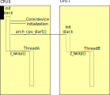

.. _smp_arch:

Symmetric Multiprocessing
#########################

On multiprocessor architectures, Zephyr supports the use of multiple
physical CPUs running Zephyr application code.  This support is
"symmetric" in the sense that no specific CPU is treated specially by
default.  Any processor is capable of running any Zephyr thread, with
access to all standard Zephyr APIs supported.

No special application code needs to be written to take advantage of
this feature.  If there are two Zephyr application threads runnable on
a supported dual processor device, they will both run simultaneously.

SMP configuration is controlled under the :kconfig:option:`CONFIG_SMP` kconfig
variable.  This must be set to "y" to enable SMP features, otherwise
a uniprocessor kernel will be built.  In general the platform default
will have enabled this anywhere it's supported. When enabled, the
number of physical CPUs available is visible at build time as
:kconfig:option:`CONFIG_MP_MAX_NUM_CPUS`.  Likewise, the default for this will be the
number of available CPUs on the platform and it is not expected that
typical apps will change it.  But it is legal and supported to set
this to a smaller (but obviously not larger) number for special
purposes (e.g. for testing, or to reserve a physical CPU for running
non-Zephyr code).

Synchronization
***************

At the application level, core Zephyr IPC and synchronization
primitives all behave identically under an SMP kernel.  For example
semaphores used to implement blocking mutual exclusion continue to be
a proper application choice.

At the lowest level, however, Zephyr code has often used the
:c:func:`irq_lock`/:c:func:`irq_unlock` primitives to implement fine grained
critical sections using interrupt masking.  These APIs continue to
work via an emulation layer (see below), but the masking technique
does not: the fact that your CPU will not be interrupted while you are
in your critical section says nothing about whether a different CPU
will be running simultaneously and be inspecting or modifying the same
data!

Spinlocks
=========

SMP systems provide a more constrained :c:func:`k_spin_lock` primitive
that not only masks interrupts locally, as done by :c:func:`irq_lock`, but
also atomically validates that a shared lock variable has been
modified before returning to the caller, "spinning" on the check if
needed to wait for the other CPU to exit the lock.  The default Zephyr
implementation of :c:func:`k_spin_lock` and :c:func:`k_spin_unlock` is built
on top of the pre-existing :c:struct:`atomic_` layer (itself usually
implemented using compiler intrinsics), though facilities exist for
architectures to define their own for performance reasons.

One important difference between IRQ locks and spinlocks is that the
earlier API was naturally recursive: the lock was global, so it was
legal to acquire a nested lock inside of a critical section.
Spinlocks are separable: you can have many locks for separate
subsystems or data structures, preventing CPUs from contending on a
single global resource.  But that means that spinlocks must not be
used recursively.  Code that holds a specific lock must not try to
re-acquire it or it will deadlock (it is perfectly legal to nest
**distinct** spinlocks, however).  A validation layer is available to
detect and report bugs like this.

When used on a uniprocessor system, the data component of the spinlock
(the atomic lock variable) is unnecessary and elided.  Except for the
recursive semantics above, spinlocks in single-CPU contexts produce
identical code to legacy IRQ locks.  In fact the entirety of the
Zephyr core kernel has now been ported to use spinlocks exclusively.

Legacy irq_lock() emulation
===========================

For the benefit of applications written to the uniprocessor locking
API, :c:func:`irq_lock` and :c:func:`irq_unlock` continue to work compatibly on
SMP systems with identical semantics to their legacy versions.  They
are implemented as a single global spinlock, with a nesting count and
the ability to be atomically reacquired on context switch into locked
threads.  The kernel will ensure that only one thread across all CPUs
can hold the lock at any time, that it is released on context switch,
and that it is re-acquired when necessary to restore the lock state
when a thread is switched in.  Other CPUs will spin waiting for the
release to happen.

The overhead involved in this process has measurable performance
impact, however.  Unlike uniprocessor apps, SMP apps using
:c:func:`irq_lock` are not simply invoking a very short (often ~1
instruction) interrupt masking operation.  That, and the fact that the
IRQ lock is global, means that code expecting to be run in an SMP
context should be using the spinlock API wherever possible.

CPU Mask
********

It is often desirable for real time applications to deliberately
partition work across physical CPUs instead of relying solely on the
kernel scheduler to decide on which threads to execute.  Zephyr
provides an API, controlled by the :kconfig:option:`CONFIG_SCHED_CPU_MASK`
kconfig variable, which can associate a specific set of CPUs with each
thread, indicating on which CPUs it can run.

By default, new threads can run on any CPU.  Calling
:c:func:`k_thread_cpu_mask_disable` with a particular CPU ID will prevent
that thread from running on that CPU in the future.  Likewise
:c:func:`k_thread_cpu_mask_enable` will re-enable execution.  There are also
:c:func:`k_thread_cpu_mask_clear` and :c:func:`k_thread_cpu_mask_enable_all` APIs
available for convenience.  For obvious reasons, these APIs are
illegal if called on a runnable thread.  The thread must be blocked or
suspended, otherwise an ``-EINVAL`` will be returned.

Note that when this feature is enabled, the scheduler algorithm
involved in doing the per-CPU mask test requires that the list be
traversed in full.  The kernel does not keep a per-CPU run queue.
That means that the performance benefits from the
:kconfig:option:`CONFIG_SCHED_SCALABLE` and :kconfig:option:`CONFIG_SCHED_MULTIQ`
scheduler backends cannot be realized.  CPU mask processing is
available only when :kconfig:option:`CONFIG_SCHED_SIMPLE` is the selected
backend.  This requirement is enforced in the configuration layer.

SMP Boot Process
****************

A Zephyr SMP kernel begins boot identically to a uniprocessor kernel.
Auxiliary CPUs begin in a disabled state in the architecture layer.
All standard kernel initialization, including device initialization,
happens on a single CPU before other CPUs are brought online.

Just before entering the application :c:func:`main` function, the kernel
calls :c:func:`z_smp_init` to launch the SMP initialization process.  This
enumerates over the configured CPUs, calling into the architecture
layer using :c:func:`arch_cpu_start` for each one.  This function is
passed a memory region to use as a stack on the foreign CPU (in
practice it uses the area that will become that CPU's interrupt
stack), the address of a local :c:func:`smp_init_top` callback function to
run on that CPU, and a pointer to a "start flag" address which will be
used as an atomic signal.

The local SMP initialization (:c:func:`smp_init_top`) on each CPU is then
invoked by the architecture layer.  Note that interrupts are still
masked at this point.  This routine is responsible for calling
:c:func:`smp_timer_init` to set up any needed stat in the timer driver.  On
many architectures the timer is a per-CPU device and needs to be
configured specially on auxiliary CPUs.  Then it waits (spinning) for
the atomic "start flag" to be released in the main thread, to
guarantee that all SMP initialization is complete before any Zephyr
application code runs, and finally calls :c:func:`z_swap` to transfer
control to the appropriate runnable thread via the standard scheduler
API.

   Example SMP initialization process, showing a configuration with
   two CPUs and two app threads which begin operating simultaneously.

Interprocessor Interrupts
*************************

When running in multiprocessor environments, it is occasionally the
case that state modified on the local CPU needs to be synchronously
handled on a different processor.

One example is the Zephyr :c:func:`k_thread_abort` API, which cannot return
until the thread that had been aborted is no longer runnable.  If it
is currently running on another CPU, that becomes difficult to
implement.

Another is low power idle.  It is a firm requirement on many devices
that system idle be implemented using a low-power mode with as many
interrupts (including periodic timer interrupts) disabled or deferred
as is possible.  If a CPU is in such a state, and on another CPU a
thread becomes runnable, the idle CPU has no way to "wake up" to
handle the newly-runnable load.

So where possible, Zephyr SMP architectures should implement an
interprocessor interrupt.  The current framework is very simple: the
architecture provides at least a :c:func:`arch_sched_broadcast_ipi` call,
which when invoked will flag an interrupt on all CPUs (except the current one,
though that is allowed behavior). If the architecture supports directed IPIs
(see :kconfig:option:`CONFIG_ARCH_HAS_DIRECTED_IPIS`), then the
architecture also provides a :c:func:`arch_sched_directed_ipi` call, which
when invoked will flag an interrupt on the specified CPUs. When an interrupt is
flagged on the CPUs, the :c:func:`z_sched_ipi` function implemented in the
scheduler will get invoked on those CPUs. The expectation is that these
APIs will evolve over time to encompass more functionality (e.g. cross-CPU
calls), and that the scheduler-specific calls here will be implemented in
terms of a more general framework.

Note that not all SMP architectures will have a usable IPI mechanism
(either missing, or just undocumented/unimplemented).  In those cases
Zephyr provides fallback behavior that is correct, but perhaps
suboptimal.

Using this, :c:func:`k_thread_abort` becomes only slightly more
complicated in SMP: for the case where a thread is actually running on
another CPU (we can detect this atomically inside the scheduler), we
broadcast an IPI and spin, waiting for the thread to either become
"DEAD" or for it to re-enter the queue (in which case we terminate it
the same way we would have in uniprocessor mode).  Note that the
"aborted" check happens on any interrupt exit, so there is no special
handling needed in the IPI per se.  This allows us to implement a
reasonable fallback when IPI is not available: we can simply spin,
waiting until the foreign CPU receives any interrupt, though this may
be a much longer time!

Likewise idle wakeups are trivially implementable with an empty IPI
handler.  If a thread is added to an empty run queue (i.e. there may
have been idle CPUs), we broadcast an IPI.  A foreign CPU will then be
able to see the new thread when exiting from the interrupt and will
switch to it if available.

Without an IPI, however, a low power idle that requires an interrupt
will not work to synchronously run new threads.  The workaround in
that case is more invasive: Zephyr will **not** enter the system idle
handler and will instead spin in its idle loop, testing the scheduler
state at high frequency (not spinning on it though, as that would
involve severe lock contention) for new threads.  The expectation is
that power constrained SMP applications are always going to provide an
IPI, and this code will only be used for testing purposes or on
systems without power consumption requirements.

IPI Cascades
============

The kernel can not control the order in which IPIs are processed by the CPUs
in the system. In general, this is not an issue and a single set of IPIs is
sufficient to trigger a reschedule on the N CPUs that results with them
scheduling the highest N priority ready threads to execute. When CPU masking
is used, there may be more than one valid set of threads (not to be confused
with an optimal set of threads) that can be scheduled on the N CPUs and a
single set of IPIs may be insufficient to result in any of these valid sets.

.. note::
    When CPU masking is not in play, the optimal set of threads is the same
    as the valid set of threads. However when CPU masking is in play, there
    may be more than one valid set--one of which may be optimal.

    To better illustrate the distinction, consider a 2-CPU system with ready
    threads T1 and T2 at priorities 1 and 2 respectively. Let T2 be pinned to
    CPU0 and T1 not be pinned. If CPU0 is executing T2 and CPU1 executing T1,
    then this set is is both valid and optimal. However, if CPU0 is executing
    T1 and CPU1 is idling, then this too would be valid though not optimal.

In those cases where a single set of IPIs is not sufficient to generate a valid
set, the resulting set of executing threads are expected to be close to a valid
set, and subsequent IPIs can generally be expected to correct the situation
soon. However, for cases where neither the approximation nor the delay are
acceptable, enabling :kconfig:option:`CONFIG_SCHED_IPI_CASCADE` will allow the
kernel to generate cascading IPIs until the kernel has selected a valid set of
ready threads for the CPUs.

There are three types of costs/penalties associated with the IPI cascades--and
for these reasons they are disabled by default. The first is a cost incurred
by the CPU producing the IPI when a new thread preempts the old thread as checks
must be done to compare the old thread against the threads executing on the
other CPUs. The second is a cost incurred by the CPUs receiving the IPIs as
they must be processed. The third is the apparent sputtering of a thread as it
"winks in" and then "winks out" due to cascades stemming from the
aforementioned first cost.

IPI Work Items
==============

The kernel allows developers to execute functions on other CPUs at ISR level
using one or more IPI work items. After IPI work items have been added to the
specified CPUs' work queues using :c:func:`k_ipi_work_add`, the targeted CPUs
will process them after receiving an IPI. Signaling an IPI is done by calling
:c:func:`k_ipi_work_signal`. Waiting for an IPI work item to be completed by
the targeted CPUs is done by calling :c:func:`k_ipi_work_wait`. Only a single
waiter is permitted at a time.

.. note::
    IPI work items will only be added to the IPI work queues of other CPUs. If
    adding IPI work items at thread level, the developer must ensure that the
    current thread does not change CPUs until after signaling the IPIs.

Sample Use
----------

The following code outlines how to use IPI work items to update status
information across a set of CPUs as a result of one CPU handling an ISR.

.. code-block:: c

    struct k_ipi_work my_work;

    void remote_cpu_action(struct k_ipi_work *arg)
    {
        ...
    }

    void my_isr(void)
    {
        /*
         * Wait for previous use of <my_work> to complete.
         * It assumes that <my_work> was initialized elsewhere.
         */

        uint32_t cpu_mask = <bitmask identifying CPUs to update>;

        while (k_ipi_work_wait(&my_work, K_NO_WAIT) == -EAGAIN) {
        }

        /* Add and signal the new work */

        k_ipi_work_add(&my_work, cpu_mask, remote_cpu_action);

        k_ipi_signal();
    }

SMP Kernel Internals
********************

In general, Zephyr kernel code is SMP-agnostic and, like application
code, will work correctly regardless of the number of CPUs available.
But in a few areas there are notable changes in structure or behavior.

Per-CPU data
============

Many elements of the core kernel data need to be implemented for each
CPU in SMP mode.  For example, the ``_current`` thread pointer obviously
needs to reflect what is running locally, there are many threads
running concurrently.  Likewise a kernel-provided interrupt stack
needs to be created and assigned for each physical CPU, as does the
interrupt nesting count used to detect ISR state.

These fields are now moved into a separate struct :c:struct:`_cpu` instance
within the :c:struct:`_kernel` struct, which has a ``cpus[]`` array indexed by ID.
Compatibility fields are provided for legacy uniprocessor code trying
to access the fields of ``cpus[0]`` using the older syntax and assembly
offsets.

Note that an important requirement on the architecture layer is that
the pointer to this CPU struct be available rapidly when in kernel
context.  The expectation is that :c:func:`arch_curr_cpu` will be
implemented using a CPU-provided register or addressing mode that can
store this value across arbitrary context switches or interrupts and
make it available to any kernel-mode code.

Similarly, where on a uniprocessor system Zephyr could simply create a
global "idle thread" at the lowest priority, in SMP we may need one
for each CPU.  This makes the internal predicate test for "_is_idle()"
in the scheduler, which is a hot path performance environment, more
complicated than simply testing the thread pointer for equality with a
known static variable.  In SMP mode, idle threads are distinguished by
a separate field in the thread struct.

Switch-based context switching
==============================

The traditional Zephyr context switch primitive has been :c:func:`z_swap`.
Unfortunately, this function takes no argument specifying a thread to
switch to.  The expectation has always been that the scheduler has
already made its preemption decision when its state was last modified
and cached the resulting "next thread" pointer in a location where
architecture context switch primitives can find it via a simple struct
offset.  That technique will not work in SMP, because the other CPU
may have modified scheduler state since the current CPU last exited
the scheduler (for example: it might already be running that cached
thread!).

Instead, the SMP "switch to" decision needs to be made synchronously
with the swap call, and as we don't want per-architecture assembly
code to be handling scheduler internal state, Zephyr requires a
somewhat lower-level context switch primitives for SMP systems:
:c:func:`arch_switch` is always called with interrupts masked, and takes
exactly two arguments.  The first is an opaque (architecture defined)
handle to the context to which it should switch, and the second is a
pointer to such a handle into which it should store the handle
resulting from the thread that is being switched out.
The kernel then implements a portable :c:func:`z_swap` implementation on top
of this primitive which includes the relevant scheduler logic in a
location where the architecture doesn't need to understand it.

Similarly, on interrupt exit, switch-based architectures are expected
to call :c:func:`z_get_next_switch_handle` to retrieve the next thread to
run from the scheduler. The argument to :c:func:`z_get_next_switch_handle`
is either the interrupted thread's "handle" reflecting the same opaque type
used by :c:func:`arch_switch`, or NULL if that thread cannot be released
to the scheduler just yet. The choice between a handle value or NULL
depends on the way CPU interrupt mode is implemented.

Architectures with a large CPU register file would typically preserve only
the caller-saved registers on the current thread's stack when interrupted
in order to minimize interrupt latency, and preserve the callee-saved
registers only when :c:func:`arch_switch` is called to minimize context
switching latency. Such architectures must use NULL as the argument to
:c:func:`z_get_next_switch_handle` to determine if there is a new thread
to schedule, and follow through with their own :c:func:`arch_switch` or
derivative if so, or directly leave interrupt mode otherwise.
In the former case it is up to that switch code to store the handle
resulting from the thread that is being switched out in that thread's
"switch_handle" field after its context has fully been saved.

Architectures whose entry in interrupt mode already preserves the entire
thread state may pass that thread's handle directly to
:c:func:`z_get_next_switch_handle` and be done in one step.

Note that while SMP requires :kconfig:option:`CONFIG_USE_SWITCH`, the reverse is not
true.  A uniprocessor architecture built with :kconfig:option:`CONFIG_SMP` set to No might
still decide to implement its context switching using
:c:func:`arch_switch`.

API Reference
**************

.. doxygengroup:: spinlock_apis
