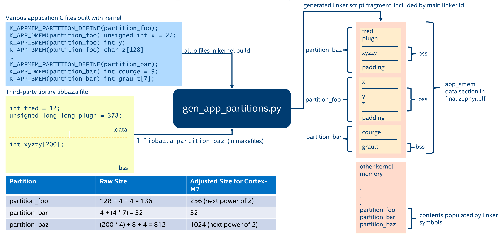

.. _memory_domain:

Memory Protection Design
########################

Zephyr's memory protection design is geared towards microcontrollers with MPU
(Memory Protection Unit) hardware. We do support some architectures, such as x86,
which have a paged MMU (Memory Management Unit), but in that case the MMU is
used like an MPU with an identity page table.

All of the discussion below will be using MPU terminology; systems with MMUs
can be considered to have an MPU with an unlimited number of programmable
regions.

There are a few different levels on how memory access is configured when
Zephyr memory protection features are enabled, which we will describe here:

Boot Time Memory Configuration
******************************

This is the configuration of the MPU after the kernel has started up. It should
contain the following:

- Any configuration of memory regions which need to have special caching or
  write-back policies for basic hardware and driver function. Note that most
  MPUs have the concept of a default memory access policy map, which can be
  enabled as a "background" mapping for any area of memory that doesn't
  have an MPU region configuring it. It is strongly recommended to use this
  to maximize the number of available MPU regions for the end user. On
  ARMv7-M/ARMv8-M this is called the System Address Map, other CPUs may
  have similar capabilities.

- A read-only, executable region or regions for program text and ro-data, that
  is accessible to user mode. This could be further sub-divided into a
  read-only region for ro-data, and a read-only, executable region for text, but
  this will require an additional MPU region. This is required so that
  threads running in user mode can read ro-data and fetch instructions.

- Depending on configuration, user-accessible read-write regions to support
  extra features like GCOV, HEP, etc.

Assuming there is a background map which allows supervisor mode to access any
memory it needs, and regions are defined which grant user mode access to
text/ro-data, this is sufficient for the boot time configuration.

Hardware Stack Overflow
***********************

:kconfig:option:`CONFIG_HW_STACK_PROTECTION` is an optional feature which detects stack
buffer overflows when the system is running in supervisor mode. This
catches issues when the entire stack buffer has overflowed, and not
individual stack frames, use compiler-assisted :kconfig:option:`CONFIG_STACK_CANARIES`
for that.

Like any crash in supervisor mode, no guarantees can be made about the overall
health of the system after a supervisor mode stack overflow, and any instances
of this should be treated as a serious error. However it's still very useful to
know when these overflows happen, as without robust detection logic the system
will either crash in mysterious ways or behave in an undefined manner when the
stack buffer overflows.

Some systems implement this feature by creating at runtime a 'guard' MPU region
which is set to be read-only and is at either the beginning or immediately
preceding the supervisor mode stack buffer.  If the stack overflows an
exception will be generated.

This feature is optional and is not required to catch stack overflows in user
mode; disabling this may free 1-2 MPU regions depending on the MPU design.

Other systems may have dedicated CPU support for catching stack overflows
and no extra MPU regions will be required.

Thread Stack
************

Any thread running in user mode will need access to its own stack buffer.
On context switch into a user mode thread, a dedicated MPU region will be
programmed with the bounds of the stack buffer. A thread exceeding its stack
buffer will start pushing data onto memory it doesn't have access to and a
memory access violation exception will be generated.

Thread Resource Pools
*********************

A small subset of kernel APIs, invoked as system calls, require heap memory
allocations. This memory is used only by the kernel and is not accessible
directly by user mode. In order to use these system calls, invoking threads
must assign themselves to a resource pool, which is a :c:struct:`k_heap`
object. Memory is drawn from a thread's resource pool using
:c:func:`z_thread_malloc` and freed with :c:func:`k_free`.

The APIs which use resource pools are as follows, with any alternatives
noted for users who do not want heap allocations within their application:

 - :c:func:`k_stack_alloc_init` sets up a k_stack with its storage
   buffer allocated out of a resource pool instead of a buffer provided by the
   user. An alternative is to declare k_stacks that are automatically
   initialized at boot with :c:macro:`K_STACK_DEFINE()`, or to initialize the
   k_stack in supervisor mode with :c:func:`k_stack_init`.

 - :c:func:`k_pipe_alloc_init` sets up a k_pipe object with its
   storage buffer allocated out of a resource pool instead of a buffer provided
   by the user. An alternative is to declare k_pipes that are automatically
   initialized at boot with :c:macro:`K_PIPE_DEFINE()`, or to initialize the
   k_pipe in supervisor mode with :c:func:`k_pipe_init`.

 - :c:func:`k_msgq_alloc_init` sets up a k_msgq object with its
   storage buffer allocated out of a resource pool instead of a buffer provided
   by the user. An alternative is to declare a k_msgq that is automatically
   initialized at boot with :c:macro:`K_MSGQ_DEFINE()`, or to initialize the
   k_msgq in supervisor mode with :c:func:`k_msgq_init`.

 - :c:func:`k_poll` when invoked from user mode, needs to make a kernel-side
   copy of the provided events array while waiting for an event. This copy is
   freed when :c:func:`k_poll` returns for any reason.

 - :c:func:`k_queue_alloc_prepend` and :c:func:`k_queue_alloc_append`
   allocate a container structure to place the data in, since the internal
   bookkeeping information that defines the queue cannot be placed in the
   memory provided by the user.

 - :c:func:`k_object_alloc` allows for entire kernel objects to be
   dynamically allocated at runtime and a usable pointer to them returned to
   the caller.

The relevant API is :c:func:`k_thread_heap_assign` which assigns
a k_heap to draw these allocations from for the target thread.

If the system heap is enabled, then the system heap may be used with
:c:func:`k_thread_system_pool_assign`, but it is preferable for different
logical applications running on the system to have their own pools.

Memory Domains
**************

The kernel ensures that any user thread will have access to its own stack
buffer, plus program text and read-only data. The memory domain APIs are the
way to grant access to additional blocks of memory to a user thread.

Conceptually, a memory domain is a collection of some number of memory
partitions. The maximum number of memory partitions in a domain
is limited by the number of available MPU regions. This is why it is important
to minimize the number of boot-time MPU regions.

Memory domains are *not* intended to control access to memory from supervisor
mode. In some cases this may be unavoidable; for example some architectures do
not allow for the definition of regions which are read-only to user mode but
read-write to supervisor mode. A great deal of care must be taken when working
with such regions to not unintentionally cause the kernel to crash when
accessing such a region. Any attempt to use memory domain APIs to control
supervisor mode access is at best undefined behavior; supervisor mode access
policy is only intended to be controlled by boot-time memory regions.

Memory domain APIs are only available to supervisor mode. The only control
user mode has over memory domains is that any user thread's child threads
will automatically become members of the parent's domain.

All threads are members of a memory domain, including supervisor threads
(even though this has no implications on their memory access). There is a
default domain ``k_mem_domain_default`` which will be assigned to threads if
they have not been specifically assigned to a domain, or inherited a memory
domain membership from their parent thread. The main thread starts as a
member of the default domain.

Memory Partitions
=================

Each memory partition consists of a memory address, a size,
and access attributes. It is intended that memory partitions are used to
control access to system memory. Defining memory partitions are subject
to the following constraints:

- The partition must represent a memory region that can be programmed by
  the underlying memory management hardware, and needs to conform to any
  underlying hardware constraints. For example, many MPU-based systems require
  that partitions be sized to some power of two, and aligned to their own
  size. For MMU-based systems, the partition must be aligned to a page and
  the size some multiple of the page size.

- Partitions within the same memory domain may not overlap each other. There is
  no notion of precedence among partitions within a memory domain.  Partitions
  within a memory domain are assumed to have a higher precedence than any
  boot-time memory regions, however whether a memory domain partition can
  overlap a boot-time memory region is architecture specific.

- The same partition may be specified in multiple memory domains. For example
  there may be a shared memory area that multiple domains grant access to.

- Care must be taken in determining what memory to expose in a partition.
  It is not appropriate to provide direct user mode access to any memory
  containing private kernel data.

- Memory domain partitions are intended to control access to system RAM.
  Configuration of memory partitions which do not correspond to RAM
  may not be supported by the architecture; this is true for MMU-based systems.

There are two ways to define memory partitions: either manually or
automatically.

Manual Memory Partitions
------------------------

The following code declares a global array ``buf``, and then declares
a read-write partition for it which may be added to a domain:

.. code-block:: c

    uint8_t __aligned(32) buf[32];

    K_MEM_PARTITION_DEFINE(my_partition, buf, sizeof(buf),
                           K_MEM_PARTITION_P_RW_U_RW);

This does not scale particularly well when we are trying to contain multiple
objects spread out across several C files into a single partition.

Automatic Memory Partitions
---------------------------

Automatic memory partitions are created by the build system. All globals
which need to be placed inside a partition are tagged with their destination
partition. The build system will then coalesce all of these into a single
contiguous block of memory, zero any BSS variables at boot, and define
a memory partition of appropriate base address and size which contains all
the tagged data.

   Automatic Memory Domain build flow

Automatic memory partitions are only configured as read-write
regions. They are defined with :c:macro:`K_APPMEM_PARTITION_DEFINE()`.
Global variables are then routed to this partition using
:c:macro:`K_APP_DMEM()` for initialized data and :c:macro:`K_APP_BMEM()` for
BSS.

.. code-block:: c

    #include <zephyr/app_memory/app_memdomain.h>

    /* Declare a k_mem_partition "my_partition" that is read-write to
     * user mode. Note that we do not specify a base address or size.
     */
    K_APPMEM_PARTITION_DEFINE(my_partition);

    /* The global variable var1 will be inside the bounds of my_partition
     * and be initialized with 37 at boot.
     */
    K_APP_DMEM(my_partition) int var1 = 37;

    /* The global variable var2 will be inside the bounds of my_partition
     * and be zeroed at boot size K_APP_BMEM() was used, indicating a BSS
     * variable.
     */
    K_APP_BMEM(my_partition) int var2;

The build system will ensure that the base address of ``my_partition`` will
be properly aligned, and the total size of the region conforms to the memory
management hardware requirements, adding padding if necessary.

If multiple partitions are being created, a variadic preprocessor macro can be
used as provided in ``app_macro_support.h``:

.. code-block:: c

    FOR_EACH(K_APPMEM_PARTITION_DEFINE, part0, part1, part2);

Automatic Partitions for Static Library Globals
~~~~~~~~~~~~~~~~~~~~~~~~~~~~~~~~~~~~~~~~~~~~~~~

The build-time logic for setting up automatic memory partitions is in
``scripts/build/gen_app_partitions.py``. If a static library is linked into Zephyr,
it is possible to route all the globals in that library to a specific
memory partition with the ``--library`` argument.

For example, if the Newlib C library is enabled, the Newlib globals all need
to be placed in ``z_libc_partition``. The invocation of the script in the
top-level ``CMakeLists.txt`` adds the following:

.. code-block:: none

    gen_app_partitions.py ... --library libc.a z_libc_partition ..

For pre-compiled libraries there is no support for expressing this in the
project-level configuration or build files; the toplevel ``CMakeLists.txt`` must
be edited.

For Zephyr libraries created using ``zephyr_library`` or ``zephyr_library_named``
the ``zephyr_library_app_memory`` function can be used to specify the memory
partition where all globals in the library should be placed.

.. _memory_domain_predefined_partitions:

Pre-defined Memory Partitions
-----------------------------

There are a few memory partitions which are pre-defined by the system:

 - ``z_malloc_partition`` - This partition contains the system-wide pool of
   memory used by libc malloc(). Due to possible starvation issues, it is
   not recommended to draw heap memory from a global pool, instead
   it is better to define various sys_heap objects and assign them
   to specific memory domains.

 - ``z_libc_partition`` - Contains globals required by the C library and runtime.
   Required when using either the Minimal C library or the Newlib C Library.
   Required when :kconfig:option:`CONFIG_STACK_CANARIES` is enabled.

Library-specific partitions are listed in ``include/app_memory/partitions.h``.
For example, to use the MBEDTLS library from user mode, the
``k_mbedtls_partition`` must be added to the domain.

Memory Domain Usage
===================

Create a Memory Domain
----------------------

A memory domain is defined using a variable of type
:c:struct:`k_mem_domain`. It must then be initialized by calling
:c:func:`k_mem_domain_init`.

The following code defines and initializes an empty memory domain.

.. code-block:: c

    struct k_mem_domain app0_domain;

    k_mem_domain_init(&app0_domain, 0, NULL);

Add Memory Partitions into a Memory Domain
------------------------------------------

There are two ways to add memory partitions into a memory domain.

This first code sample shows how to add memory partitions while creating
a memory domain.

.. code-block:: c

    /* the start address of the MPU region needs to align with its size */
    uint8_t __aligned(32) app0_buf[32];
    uint8_t __aligned(32) app1_buf[32];

    K_MEM_PARTITION_DEFINE(app0_part0, app0_buf, sizeof(app0_buf),
                           K_MEM_PARTITION_P_RW_U_RW);

    K_MEM_PARTITION_DEFINE(app0_part1, app1_buf, sizeof(app1_buf),
                           K_MEM_PARTITION_P_RW_U_RO);

    struct k_mem_partition *app0_parts[] = {
        app0_part0,
        app0_part1
    };

    k_mem_domain_init(&app0_domain, ARRAY_SIZE(app0_parts), app0_parts);

This second code sample shows how to add memory partitions into an initialized
memory domain one by one.

.. code-block:: c

    /* the start address of the MPU region needs to align with its size */
    uint8_t __aligned(32) app0_buf[32];
    uint8_t __aligned(32) app1_buf[32];

    K_MEM_PARTITION_DEFINE(app0_part0, app0_buf, sizeof(app0_buf),
                           K_MEM_PARTITION_P_RW_U_RW);

    K_MEM_PARTITION_DEFINE(app0_part1, app1_buf, sizeof(app1_buf),
                           K_MEM_PARTITION_P_RW_U_RO);

    k_mem_domain_add_partition(&app0_domain, &app0_part0);
    k_mem_domain_add_partition(&app0_domain, &app0_part1);

.. note::
    The maximum number of memory partitions is limited by the maximum
    number of MPU regions or the maximum number of MMU tables.

Memory Domain Assignment
------------------------

Any thread may join a memory domain, and any memory domain may have multiple
threads assigned to it. Threads are assigned to memory domains with an API
call:

.. code-block:: c

    k_mem_domain_add_thread(&app0_domain, app_thread_id);

If the thread was already a member of some other domain (including the
default domain), it will be removed from it in favor of the new one.

In addition, if a thread is a member of a memory domain, and it creates a
child thread, that thread will belong to the domain as well.

Remove a Memory Partition from a Memory Domain
----------------------------------------------

The following code shows how to remove a memory partition from a memory
domain.

.. code-block:: c

    k_mem_domain_remove_partition(&app0_domain, &app0_part1);

The k_mem_domain_remove_partition() API finds the memory partition
that matches the given parameter and removes that partition from the
memory domain.

Available Partition Attributes
------------------------------

When defining a partition, we need to set access permission attributes
to the partition. Since the access control of memory partitions relies on
either an MPU or MMU, the available partition attributes would be architecture
dependent.

The complete list of available partition attributes for a specific architecture
is found in the architecture-specific include file
``include/arch/<arch name>/arch.h``, (for example, ``include/arch/arm/aarch32/arch.h``.)
Some examples of partition attributes are:

.. code-block:: c

    /* Denote partition is privileged read/write, unprivileged read/write */
    K_MEM_PARTITION_P_RW_U_RW
    /* Denote partition is privileged read/write, unprivileged read-only */
    K_MEM_PARTITION_P_RW_U_RO

In almost all cases ``K_MEM_PARTITION_P_RW_U_RW`` is the right choice.

Configuration Options
*********************

Related configuration options:

* :kconfig:option:`CONFIG_MAX_DOMAIN_PARTITIONS`

API Reference
*************

The following memory domain APIs are provided by :zephyr_file:`include/zephyr/kernel.h`:

.. doxygengroup:: mem_domain_apis
