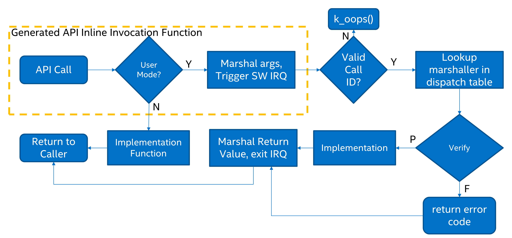

.. _syscalls:

System Calls
############
User threads run with a reduced set of privileges than supervisor threads:
certain CPU instructions may not be used, and they have access to only a
limited part of the memory map. System calls (may) allow user threads to
perform operations not directly available to them.

When defining system calls, it is very important to ensure that access to the
API's private data is done exclusively through system call interfaces.
Private kernel data should never be made available to user mode threads
directly. For example, the ``k_queue`` APIs were intentionally not made
available as they store bookkeeping information about the queue directly
in the queue buffers which are visible from user mode.

APIs that allow the user to register callback functions that run in
supervisor mode should never be exposed as system calls. Reserve these
for supervisor-mode access only.

This section describes how to declare new system calls and discusses a few
implementation details relevant to them.

Components
**********

All system calls have the following components:

* A **C prototype** prefixed with :c:macro:`__syscall` for the API. It
  will be declared in some header under ``include/`` or in another
  ``SYSCALL_INCLUDE_DIRS`` directory. This prototype is never implemented
  manually, instead it gets created by the :ref:`gen_syscalls.py` script.
  What gets generated is an inline function which either calls the
  implementation function directly (if called from supervisor mode) or goes
  through privilege elevation and validation steps (if called from user
  mode).

* An **implementation function**, which is the real implementation of the
  system call. The implementation function may assume that all parameters
  passed in have been validated if it was invoked from user mode.

* A **verification function**, which wraps the implementation function
  and does validation of all the arguments passed in.

* An **unmarshalling function**, which is an automatically generated
  handler that must be included by user source code.

C Prototype
***********

The C prototype represents how the API is invoked from either user or
supervisor mode. For example, to initialize a semaphore:

.. code-block:: c

    __syscall void k_sem_init(struct k_sem *sem, unsigned int initial_count,
                              unsigned int limit);

The :c:macro:`__syscall` attribute is very special. To the C compiler, it
simply expands to 'static inline'. However to the post-build
:ref:`parse_syscalls.py` script, it indicates that this API is a system call.
The :ref:`parse_syscalls.py` script does some parsing of the function prototype,
to determine the data types of its return value and arguments, and has some
limitations:

* Array arguments must be passed in as pointers, not arrays. For example,
  ``int foo[]`` or ``int foo[12]`` is not allowed, but should instead be
  expressed as ``int *foo``.

* Function pointers horribly confuse the limited parser. The workaround is
  to typedef them first, and then express in the argument list in terms
  of that typedef.

* :c:macro:`__syscall` must be the first thing in the prototype.

The preprocessor is intentionally not used when determining the set of system
calls to generate. However, any generated system calls that don't actually have
a verification function defined (because the related feature is not enabled in
the kernel configuration) will instead point to a special verification for
unimplemented system calls. Data type definitions for APIs should not have
conditional visibility to the compiler.

Any header file that declares system calls must include a special generated
header at the very bottom of the header file. This header follows the
naming convention ``syscalls/<name of header file>``. For example, at the
bottom of ``include/sensor.h``:

.. code-block:: c

    #include <zephyr/syscalls/sensor.h>

C prototype functions must be declared in one of the directories
listed in the CMake variable ``SYSCALL_INCLUDE_DIRS``. This list
always contains ``APPLICATION_SOURCE_DIR`` when
``CONFIG_APPLICATION_DEFINED_SYSCALL`` is set, or
``${ZEPHYR_BASE}/subsys/testsuite/ztest/include`` when
``CONFIG_ZTEST`` is set. Additional paths can be added to the list
through the CMake command line or in CMake code that is run before
``find_package(Zephyr ...)`` is run. ``${ZEPHYR_BASE}/include``
is always scanned for potential syscall prototypes.

Note that not all syscalls will be included in the final binaries.
CMake functions ``zephyr_syscall_header`` and
``zephyr_syscall_header_ifdef`` are used to specify which header
files contain syscall prototypes where those syscalls must be
present in the final binaries. Note that header files inside
directories listed in CMake variable ``SYSCALL_INCLUDE_DIRS``
will always have their syscalls present in final binaries.
To force all syscalls to be included in the final binaries,
turn on :kconfig:option:`CONFIG_EMIT_ALL_SYSCALLS`.

Invocation Context
==================

Source code that uses system call APIs can be made more efficient if it is
known that all the code inside a particular C file runs exclusively in
user mode, or exclusively in supervisor mode. The system will look for
the definition of macros :c:macro:`__ZEPHYR_SUPERVISOR__` or
:c:macro:`__ZEPHYR_USER__`, typically these will be added to the compiler
flags in the build system for the related files.

* If :kconfig:option:`CONFIG_USERSPACE` is not enabled, all APIs just directly call
  the implementation function.

* Otherwise, the default case is to make a runtime check to see if the
  processor is currently running in user mode, and either make the system call
  or directly call the implementation function as appropriate.

* If :c:macro:`__ZEPHYR_SUPERVISOR__` is defined, then it is assumed that
  all the code runs in supervisor mode and all APIs just directly call the
  implementation function. If the code was actually running in user mode,
  there will be a CPU exception as soon as it tries to do something it isn't
  allowed to do.

* If :c:macro:`__ZEPHYR_USER__` is defined, then it is assumed that all the
  code runs in user mode and system calls are unconditionally made.

Implementation Details
======================

Declaring an API with :c:macro:`__syscall` causes some code to be generated in
C and header files by the :ref:`gen_syscalls.py` script, all of which can be found in
the project out directory under ``include/generated/``:

* The system call is added to the enumerated type of system call IDs,
  which is expressed in ``include/generated/zephyr/syscall_list.h``. It is the name
  of the API in uppercase, prefixed with ``K_SYSCALL_``.

* An entry for the system call is created in the dispatch table
  ``_k_syscall_table``, expressed in ``include/generated/zephyr/syscall_dispatch.c``

  * This table only contains syscalls where their corresponding
    prototypes are declared in header files when
    :kconfig:option:`CONFIG_EMIT_ALL_SYSCALLS` is enabled:

    * Indicated by CMake functions ``zephyr_syscall_header`` and
      ``zephyr_syscall_header_ifdef``, or

    * Under directories specified in CMake variable
      ``SYSCALL_INCLUDE_DIRS``.

* A weak verification function is declared, which is just an alias of the
  'unimplemented system call' verifier. This is necessary since the real
  verification function may or may not be built depending on the kernel
  configuration. For example, if a user thread makes a sensor subsystem
  API call, but the sensor subsystem is not enabled, the weak verifier
  will be invoked instead.

* An unmarshalling function is defined in ``include/generated/<name>_mrsh.c``

The body of the API is created in the generated system header. Using the
example of :c:func:`k_sem_init()`, this API is declared in
``include/kernel.h``. At the bottom of ``include/kernel.h`` is::

    #include <zephyr/syscalls/kernel.h>

Inside this header is the body of :c:func:`k_sem_init()`::

    static inline void k_sem_init(struct k_sem * sem, unsigned int initial_count, unsigned int limit)
    {
    #ifdef CONFIG_USERSPACE
            if (z_syscall_trap()) {
                    arch_syscall_invoke3(*(uintptr_t *)&sem, *(uintptr_t *)&initial_count, *(uintptr_t *)&limit, K_SYSCALL_K_SEM_INIT);
                    return;
            }
            compiler_barrier();
    #endif
            z_impl_k_sem_init(sem, initial_count, limit);
    }

This generates an inline function that takes three arguments with void
return value. Depending on context it will either directly call the
implementation function or go through a system call elevation. A
prototype for the implementation function is also automatically generated.

The final layer is the invocation of the system call itself. All architectures
implementing system calls must implement the seven inline functions
:c:func:`_arch_syscall_invoke0` through :c:func:`_arch_syscall_invoke6`. These
functions marshal arguments into designated CPU registers and perform the
necessary privilege elevation. Parameters of API inline function, before being
passed as arguments to system call, are C casted to ``uintptr_t`` which matches
size of register.
Exception to above is passing 64-bit parameters on 32-bit systems, in which case
64-bit parameters are split into lower and higher part and passed as two consecutive
arguments.
There is always a ``uintptr_t`` type return value, which may be neglected if
not needed.

   System Call execution flow

Some system calls may have more than six arguments, but number of arguments
passed via registers is limited to six for all architectures.
Additional arguments will need to be passed in an array in the source memory
space, which needs to be treated as untrusted memory in the verification
function. This code (packing, unpacking and validation) is generated
automatically as needed in the stub above and in the unmarshalling function.

System calls return ``uintptr_t`` type value that is C casted, by wrapper, to
a return type of API prototype declaration. This means that 64-bit value may
not be directly returned, from a system call to its wrapper, on 32-bit systems.
To solve the problem the automatically generated wrapper function defines 64-bit
intermediate variable, which is considered **untrusted** buffer, on its stack
and passes pointer to that variable to the system call, as a final argument.
Upon return from the system call the value written to that buffer will be
returned by the wrapper function.
The problem does not exist on 64-bit systems which are able to return 64-bit
values directly.

Implementation Function
***********************

The implementation function is what actually does the work for the API.
Zephyr normally does little to no error checking of arguments, or does this
kind of checking with assertions. When writing the implementation function,
validation of any parameters is optional and should be done with assertions.

All implementation functions must follow the naming convention, which is the
name of the API prefixed with ``z_impl_``. Implementation functions may be
declared in the same header as the API as a static inline function or
declared in some C file. There is no prototype needed for implementation
functions, these are automatically generated.

Verification Function
*********************

The verification function runs on the kernel side when a user thread makes
a system call. When the user thread makes a software interrupt to elevate to
supervisor mode, the common system call entry point uses the system call ID
provided by the user to look up the appropriate unmarshalling function for that
system call and jump into it. This in turn calls the verification function.

Verification and unmarshalling functions only run when system call APIs are
invoked from user mode. If an API is invoked from supervisor mode, the
implementation is simply called and there is no software trap.

The purpose of the verification function is to validate all the arguments
passed in.  This includes:

* Any kernel object pointers provided. For example, the semaphore APIs must
  ensure that the semaphore object passed in is a valid semaphore and that
  the calling thread has permission on it.

* Any memory buffers passed in from user mode. Checks must be made that the
  calling thread has read or write permissions on the provided buffer.

* Any other arguments that have a limited range of valid values.

Verification functions involve a great deal of boilerplate code which has been
made simpler by some macros in :zephyr_file:`include/zephyr/internal/syscall_handler.h`.
Verification functions should be declared using these macros.

Argument Validation
===================

Several macros exist to validate arguments:

* :c:macro:`K_SYSCALL_OBJ()` Checks a memory address to assert that it is
  a valid kernel object of the expected type, that the calling thread
  has permissions on it, and that the object is initialized.

* :c:macro:`K_SYSCALL_OBJ_INIT()` is the same as
  :c:macro:`K_SYSCALL_OBJ()`, except that the provided object may be
  uninitialized. This is useful for verifiers of object init functions.

* :c:macro:`K_SYSCALL_OBJ_NEVER_INIT()` is the same as
  :c:macro:`K_SYSCALL_OBJ()`, except that the provided object must be
  uninitialized. This is not used very often, currently only for
  :c:func:`k_thread_create()`.

* :c:macro:`K_SYSCALL_MEMORY_READ()` validates a memory buffer of a particular
  size. The calling thread must have read permissions on the entire buffer.

* :c:macro:`K_SYSCALL_MEMORY_WRITE()` is the same as
  :c:macro:`K_SYSCALL_MEMORY_READ()` but the calling thread must additionally
  have write permissions.

* :c:macro:`K_SYSCALL_MEMORY_ARRAY_READ()` validates an array whose total size
  is expressed as separate arguments for the number of elements and the
  element size. This macro correctly accounts for multiplication overflow
  when computing the total size. The calling thread must have read permissions
  on the total size.

* :c:macro:`K_SYSCALL_MEMORY_ARRAY_WRITE()` is the same as
  :c:macro:`K_SYSCALL_MEMORY_ARRAY_READ()` but the calling thread must
  additionally have write permissions.

* :c:macro:`K_SYSCALL_VERIFY_MSG()` does a runtime check of some boolean
  expression which must evaluate to true otherwise the check will fail.
  A variant :c:macro:`K_SYSCALL_VERIFY` exists which does not take
  a message parameter, instead printing the expression tested if it
  fails. The latter should only be used for the most obvious of tests.

* :c:macro:`K_SYSCALL_DRIVER_OP()` checks at runtime if a driver
  instance is capable of performing a particular operation.  While this
  macro can be used by itself, it's mostly a building block for macros
  that are automatically generated for every driver subsystem.  For
  instance, to validate the GPIO driver, one could use the
  :c:macro:`K_SYSCALL_DRIVER_GPIO()` macro.

* :c:macro:`K_SYSCALL_SPECIFIC_DRIVER()` is a runtime check to verify that
  a provided pointer is a valid instance of a specific device driver, that
  the calling thread has permissions on it, and that the driver has been
  initialized. It does this by checking the API structure pointer that
  is stored within the driver instance and ensuring that it matches the
  provided value, which should be the address of the specific driver's
  API structure.

If any check fails, the macros will return a nonzero value. The macro
:c:macro:`K_OOPS()` can be used to induce a kernel oops which will kill the
calling thread. This is done instead of returning some error condition to
keep the APIs the same when calling from supervisor mode.

.. _syscall_verification:

Verifier Definition
===================

All system calls are dispatched to a verifier function with a prefixed
``z_vrfy_`` name based on the system call.  They have exactly the same
return type and argument types as the wrapped system call.  Their job
is to execute the system call (generally by calling the implementation
function) after having validated all arguments.

The verifier is itself invoked by an automatically generated
unmarshaller function which takes care of unpacking the register
arguments from the architecture layer and casting them to the correct
type.  This is defined in a header file that must be included from
user code, generally somewhere after the definition of the verifier in
a translation unit (so that it can be inlined).

For example:

.. code-block:: c

    static int z_vrfy_k_sem_take(struct k_sem *sem, int32_t timeout)
    {
        K_OOPS(K_SYSCALL_OBJ(sem, K_OBJ_SEM));
        return z_impl_k_sem_take(sem, timeout);
    }
    #include <zephyr/syscalls/k_sem_take_mrsh.c>

Verification Memory Access Policies
===================================

Parameters passed to system calls by reference require special handling,
because the value of these parameters can be changed at any time by any
user thread that has access to the memory that parameter points to. If the
kernel makes any logical decisions based on the contents of this memory, this
can open up the kernel to attacks even if checking is done. This is a class
of exploits known as TOCTOU (Time Of Check to Time Of Use).

The proper procedure to mitigate these attacks is to make a copies in the
verification function, and only perform parameter checks on the copies, which
user threads will never have access to. The implementation functions get passed
the copy and not the original data sent by the user. The
:c:func:`k_usermode_to_copy()` and :c:func:`k_usermode_from_copy()` APIs exist for
this purpose.

There is one exception in place, with respect to large data buffers which are
only used to provide a memory area that is either only written to, or whose
contents are never used for any validation or control flow. Further
discussion of this later in this section.

As a first example, consider a parameter which is used as an output parameter
for some integral value:

.. code-block:: c

    int z_vrfy_some_syscall(int *out_param)
    {
        int local_out_param;
        int ret;

        ret = z_impl_some_syscall(&local_out_param);
        K_OOPS(k_usermode_to_copy(out_param, &local_out_param, sizeof(*out_param)));
        return ret;
    }

Here we have allocated ``local_out_param`` on the stack, passed its address to
the implementation function, and then used :c:func:`k_usermode_to_copy()` to fill
in the memory passed in by the caller.

It might be tempting to do something more concise:

.. code-block:: c

    int z_vrfy_some_syscall(int *out_param)
    {
        K_OOPS(K_SYSCALL_MEMORY_WRITE(out_param, sizeof(*out_param)));
        return z_impl_some_syscall(out_param);
    }

However, this is unsafe if the implementation ever does any reads to this
memory as part of its logic. For example, it could be used to store some
counter value, and this could be meddled with by user threads that have access
to its memory. It is by far safest for small integral values to do the copying
as shown in the first example.

Some parameters may be input/output. For instance, it's not uncommon to see APIs
which pass in a pointer to some ``size_t`` which is a maximum allowable size,
which is then updated by the implementation to reflect the actual number of
bytes processed. This too should use a stack copy:

.. code-block:: c

    int z_vrfy_in_out_syscall(size_t *size_ptr)
    {
        size_t size;
        int ret;

        K_OOPS(k_usermode_from_copy(&size, size_ptr, sizeof(size));
        ret = z_impl_in_out_syscall(&size);
        K_OOPS(k_usermode_to_copy(size_ptr, &size, sizeof(size)));
        return ret;
    }

Many system calls pass in structures or even linked data structures. All should
be copied. Typically this is done by allocating copies on the stack:

.. code-block:: c

    struct bar {
        ...
    };

    struct foo {
        ...
        struct bar *bar_left;
        struct bar *bar_right;
    };

    int z_vrfy_must_alloc(struct foo *foo)
    {
        int ret;
        struct foo foo_copy;
        struct bar bar_right_copy;
        struct bar bar_left_copy;

        K_OOPS(k_usermode_from_copy(&foo_copy, foo, sizeof(*foo)));
        K_OOPS(k_usermode_from_copy(&bar_right_copy, foo_copy.bar_right,
                                sizeof(struct bar)));
        foo_copy.bar_right = &bar_right_copy;
        K_OOPS(k_usermode_from_copy(&bar_left_copy, foo_copy.bar_left,
                                sizeof(struct bar)));
        foo_copy.bar_left = &bar_left_copy;

        return z_impl_must_alloc(&foo_copy);
    }

In some cases the amount of data isn't known at compile time or may be too
large to allocate on the stack. In this scenario, it may be necessary to draw
memory from the caller's resource pool via :c:func:`z_thread_malloc()`. This
should always be considered last resort. Functional safety programming
guidelines heavily discourage usage of heap and the fact that a resource pool is
used must be clearly documented. Any issues with allocation must be
reported, to a caller, with returning the ``-ENOMEM`` . The ``K_OOPS()``
should never be used to verify if resource allocation has been successful.

.. code-block:: c

    struct bar {
        ...
    };

    struct foo {
        size_t count;
        struct bar *bar_list; /* array of struct bar of size count */
    };

    int z_vrfy_must_alloc(struct foo *foo)
    {
        int ret;
        struct foo foo_copy;
        struct bar *bar_list_copy;
        size_t bar_list_bytes;

        /* Safely copy foo into foo_copy */
        K_OOPS(k_usermode_from_copy(&foo_copy, foo, sizeof(*foo)));

        /* Bounds check the count member, in the copy we made */
        if (foo_copy.count > 32) {
            return -EINVAL;
        }

        /* Allocate RAM for the bar_list, replace the pointer in
         * foo_copy */
        bar_list_bytes = foo_copy.count * sizeof(struct_bar);
        bar_list_copy = z_thread_malloc(bar_list_bytes);
        if (bar_list_copy == NULL) {
            return -ENOMEM;
        }
        K_OOPS(k_usermode_from_copy(bar_list_copy, foo_copy.bar_list,
                                bar_list_bytes));
        foo_copy.bar_list = bar_list_copy;

        ret = z_impl_must_alloc(&foo_copy);

        /* All done with the memory, free it and return */
        k_free(foo_copy.bar_list_copy);
        return ret;
    }

Finally, we must consider large data buffers. These represent areas of user
memory which either have data copied out of, or copied into. It is permitted
to pass these pointers to the implementation function directly. The caller's
access to the buffer still must be validated with ``K_SYSCALL_MEMORY`` APIs.
The following constraints need to be met:

 * If the buffer is used by the implementation function to write data, such
   as data captured from some MMIO region, the implementation function must
   only write this data, and never read it.

 * If the buffer is used by the implementation function to read data, such
   as a block of memory to write to some hardware destination, this data
   must be read without any processing. No conditional logic can be implemented
   due to the data buffer's contents. If such logic is required a copy must be
   made.

 * The buffer must only be used synchronously with the call. The implementation
   must not ever save the buffer address and use it asynchronously, such as
   when an interrupt fires.

.. code-block:: c

    int z_vrfy_get_data_from_kernel(void *buf, size_t size)
    {
        K_OOPS(K_SYSCALL_MEMORY_WRITE(buf, size));
        return z_impl_get_data_from_kernel(buf, size);
    }

Verification Return Value Policies
==================================

When verifying system calls, it's important to note which kinds of verification
failures should propagate a return value to the caller, and which should
simply invoke :c:macro:`K_OOPS()` which kills the calling thread. The current
conventions are as follows:

#. For system calls that are defined but not compiled, invocations of these
   missing system calls are routed to :c:func:`handler_no_syscall()` which
   invokes :c:macro:`K_OOPS()`.

#. Any invalid access to memory found by the set of ``K_SYSCALL_MEMORY`` APIs,
   :c:func:`k_usermode_from_copy()`, :c:func:`k_usermode_to_copy()`
   should trigger a :c:macro:`K_OOPS`. This happens when the caller doesn't have
   appropriate permissions on the memory buffer or some size calculation
   overflowed.

#. Most system calls take kernel object pointers as an argument, checked either
   with one of the ``K_SYSCALL_OBJ`` functions,  ``K_SYSCALL_DRIVER_nnnnn``, or
   manually using :c:func:`k_object_validate()`. These can fail for a variety
   of reasons: missing driver API, bad kernel object pointer, wrong kernel
   object type, or improper initialization state. These issues should always
   invoke :c:macro:`K_OOPS()`.

#. Any error resulting from a failed memory heap allocation, often from
   invoking :c:func:`z_thread_malloc()`, should propagate ``-ENOMEM`` to the
   caller.

#. General parameter checks should be done in the implementation function,
   in most cases using ``CHECKIF()``.

   * The behavior of ``CHECKIF()`` depends on the kernel configuration, but if
     user mode is enabled, :kconfig:option:`CONFIG_RUNTIME_ERROR_CHECKS` is enforced,
     which guarantees that these checks will be made and a return value
     propagated.

#. It is totally forbidden for any kind of kernel mode callback function to
   be registered from user mode. APIs which simply install callbacks shall not
   be exposed as system calls. Some driver subsystem APIs may take optional
   function callback pointers. User mode verification functions for these APIs
   must enforce that these are NULL and should invoke :c:macro:`K_OOPS()` if
   not.

#. Some parameter checks are enforced only from user mode. These should be
   checked in the verification function and propagate a return value to the
   caller if possible.

There are some known exceptions to these policies currently in Zephyr:

* :c:func:`k_thread_join()` and :c:func:`k_thread_abort()` are no-ops if
  the thread object isn't initialized. This is because for threads, the
  initialization bit pulls double-duty to indicate whether a thread is
  running, cleared upon exit. See #23030.

* :c:func:`k_thread_create()` invokes :c:macro:`K_OOPS()` for parameter
  checks, due to a great deal of existing code ignoring the return value.
  This will also be addressed by #23030.

* :c:func:`k_thread_abort()` invokes :c:macro:`K_OOPS()` if an essential
  thread is aborted, as the function has no return value.

* Various system calls related to logging invoke :c:macro:`K_OOPS()`
  when bad parameters are passed in as they do not propagate errors.

Configuration Options
*********************

Related configuration options:

* :kconfig:option:`CONFIG_USERSPACE`
* :kconfig:option:`CONFIG_EMIT_ALL_SYSCALLS`

APIs
****

Helper macros for creating system call verification functions are provided in
:zephyr_file:`include/zephyr/internal/syscall_handler.h`:

* :c:macro:`K_SYSCALL_OBJ()`
* :c:macro:`K_SYSCALL_OBJ_INIT()`
* :c:macro:`K_SYSCALL_OBJ_NEVER_INIT()`
* :c:macro:`K_OOPS()`
* :c:macro:`K_SYSCALL_MEMORY_READ()`
* :c:macro:`K_SYSCALL_MEMORY_WRITE()`
* :c:macro:`K_SYSCALL_MEMORY_ARRAY_READ()`
* :c:macro:`K_SYSCALL_MEMORY_ARRAY_WRITE()`
* :c:macro:`K_SYSCALL_VERIFY_MSG()`
* :c:macro:`K_SYSCALL_VERIFY`

Functions for invoking system calls are defined in
:zephyr_file:`include/zephyr/syscall.h`:

* :c:func:`_arch_syscall_invoke0`
* :c:func:`_arch_syscall_invoke1`
* :c:func:`_arch_syscall_invoke2`
* :c:func:`_arch_syscall_invoke3`
* :c:func:`_arch_syscall_invoke4`
* :c:func:`_arch_syscall_invoke5`
* :c:func:`_arch_syscall_invoke6`
