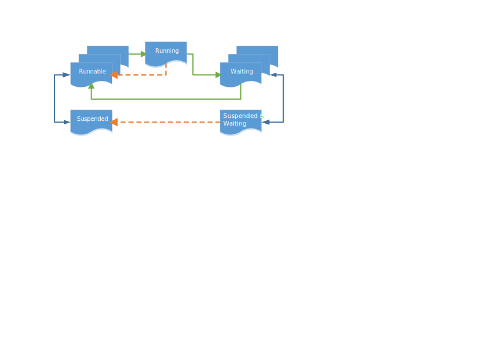

Tasks
#####

Properties of Tasks
*******************

A Tiny Mountain task is an execution thread that implements part or all
of the application functionality using the Tiny Mountain objects
described in detail by the Nanokernel Objects and Microkernel Objects
documents. Tasks are cooperatively scheduled, and will run until they
explicitly yield, call a blocking interface or are preempted by a
higher priority task.

Defining Tasks
**************

Microkernel tasks are statically defined in the Tiny Mountain project
file (which has a file extension of .mdef). The number of tasks in a
project file is limited only by the available memory on the platform. A
task definition in the project file must specify its name, priority,
entry point, task group, and stack size. As shown below:

.. code-block:: console

   % TASK NAME     PRIO    ENTRY    STACK   GROUPS

   % ===============================================

     TASK philTask    5   philDemo   1024   [EXE]

     TASK phi1Task0   6   philEntry  1024   [PHI]

Task groups must be specified. If a task does not belong to any groups
an empty list can be specified; i.e. :literal:`[]`. A task can change
groups at runtime, but the project file defines the group the task
belongs to when it begins running. Task groups are statically
allocated, and need to be defined in the project file. For example, the
PHI group from the example above would be defined as:

.. code-block:: console

   % TASKGROUP NAME

   % ==============

     TASKGROUP PHI

To write scalable and portable task code, observe the following
guidelines:

#. Define the task entry point prototype in the project file.

#. Use the C calling convention.

#. Use C linkage style.

.. note::

   To maximize portability, use Tiny Mountain -defined objects, such
   as memory maps or memory pools, instead of user-defined array
   buffers.

Task Behavior
*************

When a task calls an API to operate on a Tiny Mountain object, it passes
an abstract object identifier called objectID. A task shall always
manipulate kernel data structures through the APIs and shall not
directly access the internals of any object, for example, the internals
of a semaphore or a FIFO.

Task Application Program Interfaces
***********************************

The task APIs allow starting, stopping, suspending, resuming, aborting,
changing its priority, changing its entry point, and changing
groups.This table lists all task- and task-group-related application
program interfaces. For more information on each of those application
program interfaces see the application program interfaces documentation.

+----------------------------------------------------------------------+-------------------------------------------------------------------------------------------------------------------------------------+
| **Call**                                                             | **Description**                                                                                                                     |
+----------------------------------------------------------------------+-------------------------------------------------------------------------------------------------------------------------------------+
| :c:func:`sys_scheduler_time_slice_set()`                             | Specifies the time slice period for round\-robin task scheduling.                                                                   |
+----------------------------------------------------------------------+-------------------------------------------------------------------------------------------------------------------------------------+
| :c:func:`task_abort()`                                               | Aborts a task.                                                                                                                      |
+----------------------------------------------------------------------+-------------------------------------------------------------------------------------------------------------------------------------+
| :c:func:`task_abort_handler_set()`                                   | Installs or removes an abort handler.                                                                                               |
+----------------------------------------------------------------------+-------------------------------------------------------------------------------------------------------------------------------------+
| :c:func:`task_resume()`                                              | Marks a task as runnable.                                                                                                           |
+----------------------------------------------------------------------+-------------------------------------------------------------------------------------------------------------------------------------+
| :c:func:`task_entry_set()`                                           | Sets a task’s entry point.                                                                                                          |
+----------------------------------------------------------------------+-------------------------------------------------------------------------------------------------------------------------------------+
| :c:func:`task_priority_set()`                                        | Sets a task’s priority.                                                                                                             |
+----------------------------------------------------------------------+-------------------------------------------------------------------------------------------------------------------------------------+
| :c:func:`task_sleep()`                                               | Marks a task as not runnable until a timeout expires.                                                                               |
+----------------------------------------------------------------------+-------------------------------------------------------------------------------------------------------------------------------------+
| :c:func:`task_start()`                                               | Starts processing a task.                                                                                                           |
+----------------------------------------------------------------------+-------------------------------------------------------------------------------------------------------------------------------------+
| :c:func:`task_suspend()`                                             | Marks all tasks in a group as not runnable.                                                                                         |
+----------------------------------------------------------------------+-------------------------------------------------------------------------------------------------------------------------------------+
| :c:func:`task_yield()`                                               | Yields the CPU to an equal\-priority task.                                                                                          |
+----------------------------------------------------------------------+-------------------------------------------------------------------------------------------------------------------------------------+
| :c:func:`task_node_id_get()`, isr_node_id_get()`                     | Get the task’s node ID.From an ISR call :c:func:`isr_node_id_get()`, from a task, call :c:func:`task_node_id_get()`.                |
+----------------------------------------------------------------------+-------------------------------------------------------------------------------------------------------------------------------------+
| :c:func:`task_group_abort()`                                         | Aborts a group of tasks.                                                                                                            |
+----------------------------------------------------------------------+-------------------------------------------------------------------------------------------------------------------------------------+
| :c:func:`task_group_join()`                                          | Adds a task to a group.                                                                                                             |
+----------------------------------------------------------------------+-------------------------------------------------------------------------------------------------------------------------------------+
| :c:func:`task_group_leave()`                                         | Removes a task from a group.                                                                                                        |
+----------------------------------------------------------------------+-------------------------------------------------------------------------------------------------------------------------------------+
| :c:func:`task_group_resume()`                                        | Resumes processing of a group.                                                                                                      |
+----------------------------------------------------------------------+-------------------------------------------------------------------------------------------------------------------------------------+
| :c:func:`task_group_start()`                                         | Starts processing of a group.                                                                                                       |
+----------------------------------------------------------------------+-------------------------------------------------------------------------------------------------------------------------------------+
| :c:func:`task_group_suspend()`                                       | Marks all tasks in a group as not runnable.                                                                                         |
+----------------------------------------------------------------------+-------------------------------------------------------------------------------------------------------------------------------------+
| :c:func:`task_group_mask_get()`, :c:func:`isr_task_group_mask_get()` | Gets the task’s group type.From an ISR call :c:func:`isr_task_group_mask_get()`, from a task, call :c:func:`task_group_mask_get()`. |
+----------------------------------------------------------------------+-------------------------------------------------------------------------------------------------------------------------------------+
| :c:func:`task_id_get()`, :c:func:`isr_task_id_get()`                 | Gets the task’s ID.From an ISR call :c:func:`isr_task_id_get()`, from a task, call :c:func:`task_id_get()`.                         |
+----------------------------------------------------------------------+-------------------------------------------------------------------------------------------------------------------------------------+
| :c:func:`task_priority_get()`, :c:func:`isr_task_priority_get()`     | Gets the task’s priority.From an ISR call :c:func:`isr_task_priority_get()`, from a task, call :c:func:`task_priority_get()`        |
+----------------------------------------------------------------------+-------------------------------------------------------------------------------------------------------------------------------------+

A task can find its own ID using :c:func:`task_id_get()`. The task's own
name can be used interchangeably as the ID, however since the task's
name is chosen by the user it can be changed. Using
:c:func:`task_id_get()` is the safest way to reference a task’s name.

.. todo:: Add high level information about other APIs.

Task Implementation
*******************

Use Tiny Mountain objects and routine calls to interface a task with
other tasks running in the system. For example, achieve cooperation
between tasks by using synchronization objects, such as resources and
semaphores, or by passing parameters from one task to another using a
data-passing object.

Task Stack
==========

The compiler uses the task stack to store local task variables and to
implement parameter-passing between functions. Static and global
variables do not use memory from the stack. For more information about
defining memory segments, and the defaults used for different variable
types, consult the documentation for your compiler.

Task States
===========

Each task has a task state that the scheduler uses to determine whether
it is ready to run. This figure shows the possible task states and the
possible transitions. The most usual transitions are green,
bidirectional transitions are blue and uncommon transitions are marked
orange.

   Shows the possible states that a task might have and their transitions.

Starting and Stopping Tasks
---------------------------

Tasks in Tiny Mountain are started in one of three ways:

+ Automatically at boot time if it is assigned to the EXE task group.
+ Another task issues a :c:func:`task_start()` for the task.
+ Another task issues a :c:func:`task_group_start()` for any task
  group the task belongs to..

The scheduler manages the execution of a task once it is running. If the
task performs a return from the routine that started it, the task
terminates and its stack can be reused. This ensures that the task
terminates safely and cleanly.

Automatically Starting Tasks
----------------------------

Starting tasks automatically at boot utilizes the Task Grouping concept.
The EXE group at boot time will put all tasks belonging to the group in
a runnable state immediately after the kernel boots up.

Tasks Starting Other Tasks
^^^^^^^^^^^^^^^^^^^^^^^^^^

.. todo:: Add details on how to start a task from within another task.

Task Scheduling
---------------

Once started, a task is scheduled for execution by the microkernel until
one of the following occurs:

* A higher-priority task becomes ready to run.

* The task completes.

* The task's time slice expires and another runnable task of equal
  priority exists.

* The task becomes non-runnable.

Task Completion
^^^^^^^^^^^^^^^

.. todo:: Add details on how tasks complete.

Task Priorities
^^^^^^^^^^^^^^^

Tiny Mountain offers a configurable number of task priority levels. The
number ranges from 0 to :literal:`NUM_TASK_PRIORITIES-1`. The lowest
priority level ( :literal:`NUM_TASK_PRIORITIES-1` is reserved for use
by the microkernel's idle task. The priority of tasks is assigned
during the build process based upon the task definition in the project
file. The priority can be changed at any time, by either the task
itself or by another task calling :c:func:`task_priority_set()`.

If a task of higher priority becomes runnable, the kernel saves the
current tasks context and runs the higher-priority task. It is also
possible for a tasks priority to be temporarily changed to prevent a
condition known as priority inversion.

Priority Preemption
-------------------

The microkernel uses a priority-based preemptive scheduling algorithm
where the highest-priority task that is ready to run, runs. When a task
with a higher priority becomes runnable, the running task is
unscheduled and the task of higher priority is started. This is the
principle of preemption.

Suspended Tasks
^^^^^^^^^^^^^^^

Tasks can suspend other tasks, or themselves, using
:c:func:`task_suspend()`. The task stays suspended until
:c:func:`task_resume()` or :c:func:`task_abort()` is called by another
task. Use :c:func:`task_abort()` and :c:func:`task_group_abort()` with
care, as none of the affected tasks may own or be using kernel objects
when they are called. The safest abort practice is for a task to abort
only itself.

Aborting a Task
---------------

Tasks can have an abort handler, C routines that run as a critical
section when a task is aborted. Since the routine runs as critical, it
cannot be preempted or unscheduled allowing the task to properly clean
up. Because of this, abort handlers cannot make kernel API calls.

To install an abort handler function use
:c:func:`task_abort_handler_set()`. This will bind the routine for
execution when :c:func:`task_abort()` is called, and run the abort
handler function immediately.

Time-Slicing
------------

Time-slicing, enabled through the :c:func:`sys_scheduler_time_slice_set()`
function, can share a processor between multiple tasks with the same
priority. When enabled, the kernel preempts a task that has run for a
certain amount of time, the time slice, and schedules another runnable
task with the same priority. The sorting of tasks of equal priority
order is a fundamental microkernel scheduling concept and is not
limited to cases involving :c:func:`task_yield()`.

The same effect as time-slicing can be achieved using
:c:func:`task_yield()`. When this call is made, the current task
relinquishes the processor if another task of the same priority is
ready to run. The calling task returns to the queue of runnable tasks.
If no other task of the same priority is runnable, the task that called
:c:func:`task_yield()` continues running.

.. note::

   :c:func:`task_yield()` sorts the tasks in FIFO order.

Task Context Switches
^^^^^^^^^^^^^^^^^^^^^

When a task swap occurs, Tiny Mountain saves the context of the task
that is swapped out and restores the context of the task that is
swapped in.