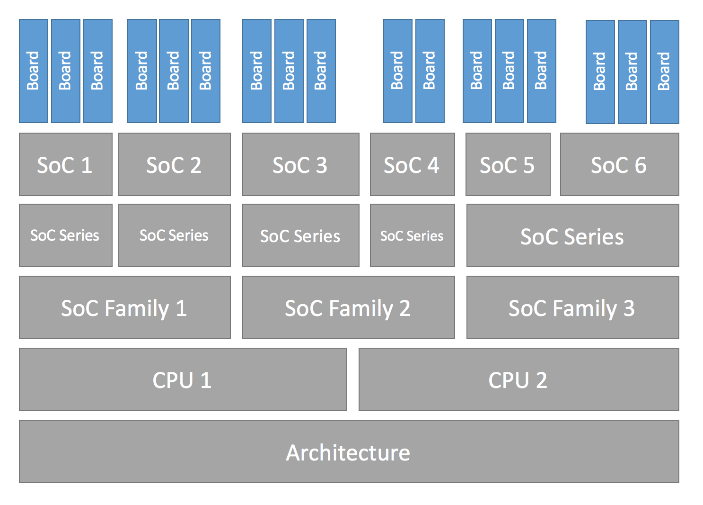

.. _board_porting_guide:

Board Porting Guide
###################

When building an application you must specify the target hardware and
the exact board or model. Specifying the board name results in a binary that
is suited for the target hardware by selecting the right Zephyr features and
components and setting the right Zephyr configuration for that specific target
hardware.

A board is defined as a special configuration of an SoC with possible additional
components.
For example, a board might have sensors and flash memory implemented as
additional features on top of what the SoC provides. Such additional hardware is
configured and referenced in the Zephyr board configuration.

The board implements at least one SoC and thus inherits all of the features
that are provided by the SoC. When porting a board to Zephyr, you should
first make sure the SoC is implemented in Zephyr.

Hardware Configuration Hierarchy
********************************

Hardware definitions in Zephyr follow a well-defined hierarchy of configurations
and layers, below are the layers from top to bottom:

- Board
- SoC
- SoC Series
- SoC Family
- CPU Core
- Architecture

This design contributes to code reuse and implementation of device drivers and
features at the bottom of the hierarchy making a board configuration as simple
as a selection of features that are implemented by the underlying layers. The
figures below shows this hierarchy with a few example of boards currently
available in the source tree:

   Configuration Hierarchy

Hierarchy Example

+------------+-----------+--------------+------------+--------------+---------+
|Board       |FRDM K64F  |nRF52 NITROGEN|nRF51XX     |Quark SE C1000|Arduino  |
|            |           |              |            |Devboard      |101      |
+============+===========+==============+============+==============+=========+
|SOC         |MK64F12    |nRF52832      |nRF51XX     |Quark SE C1000|Curie    |
+------------+-----------+--------------+------------+--------------+---------+
|SOC Series  |Kinetis K6x|Nordic NRF52  |Nordic NRF51|Quark SE      |Quark SE |
|            |Series     |              |            |              |         |
+------------+-----------+--------------+------------+--------------+---------+
|SOC Family  |NXP Kinetis|Nordic NRF5   |Nordic NRF5 |Quark         |Quark    |
+------------+-----------+--------------+------------+--------------+---------+
|CPU Core    |Cortex-M4  |Cortex-M4     |Cortex-M0+  |Lakemont      |Lakemont |
+------------+-----------+--------------+------------+--------------+---------+
|Architecture|ARM        |ARM           |ARM         |x86           |x86      |
+------------+-----------+--------------+------------+--------------+---------+

Architecture
============
If your CPU architecture is already supported by Zephyr, there is no
architecture work involved in porting to your board.  If your CPU architecture
is not supported by the Zephyr kernel, you can add support by following the
instructions available at :ref:`architecture_porting_guide`.

CPU Core
========

Some OS code depends on the CPU core that your board is using. For
example, a given CPU core has a specific assembly language instruction set, and
may require special cross compiler or compiler settings to use the appropriate
instruction set.

If your CPU architecture is already supported by Zephyr, there is no CPU core
work involved in porting to your platform or board. You need only to select the
appropriate CPU in your configuration and the rest will be taken care of by the
configuration system in Zephyr which will select the features implemented
by the corresponding CPU.

Platform
========

This layer implements most of the features that need porting and is split into
three layers to allow for code reuse when dealing with implementations with
slight differences.

SoC Family
----------

This layer is a container of all SoCs of the same class that, for example
implement one single type of CPU core but differ in peripherals and features.
The base hardware will in most cases be the same across all SoCs and MCUs of
this family.

SoC Series
----------

Moving closer to the SoC, the series is derived from an SoC family. A series is
defined by a feature set that serves the purpose of distinguishing different
SoCs belonging to the same family.

SoC
---

Finally, an SoC is actual hardware component that is physically available on a
board.

Board
=====

A board implements an SoC with all its features, together with peripherals
available on the board that differentiates the board with additional interfaces
and features not available in the SoC.

While adding your board support, make sure to add it to the list of
``platforms`` in the appropriate architecture ``.ini`` file in
``scripts/sanity_chk/arches/``.
