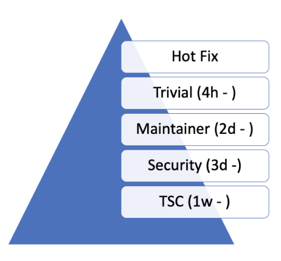

.. _dev-environment-and-tools:

Development Environment and Tools
#################################

Code Review
************

GitHub is intended to provide a framework for reviewing every commit before it
is accepted into the code base. Changes, in the form of Pull Requests (PR) are
uploaded to GitHub but don't actually become a part of the project until they've
been reviewed, passed a series of checks (CI), and are approved by maintainers.
GitHub is used to support the standard open source practice of submitting
patches, which are then reviewed by the project members before being applied to
the code base.

Pull requests should be appropriately :ref:`labeled<gh_labels>`,
and linked to any relevant :ref:`bug or feature tracking issues<bug_reporting>`
.

The Zephyr project uses GitHub for code reviews and Git tree management. When
submitting a change or an enhancement to any Zephyr component, a developer
should use GitHub. GitHub Actions automatically assigns a responsible reviewer
on a component basis, as defined in the :zephyr_file:`MAINTAINERS.yml` file
stored with the code tree in the Zephyr project repository. A limited set of
release managers are allowed to merge a pull request into the main branch once
reviews are complete.

.. _review_time:

Give reviewers time to review before code merge
================================================

The Zephyr project is a global project that is not tied to a certain geography
or timezone. We have developers and contributors from across the globe. When
changes are proposed using pull request, we need to allow for a minimal review
time to give developers and contributors the opportunity to review and comment
on changes. There are different categories of changes and we know that some
changes do require reviews by subject matter experts and owners of the subsystem
being changed. Many changes fall under the "trivial" category that can be
addressed with general reviews and do not need to be queued for a maintainer or
code-owner review. Additionally, some changes might require further discussions
and a decision by the TSC or the Security working group. To summarize the above,
the diagram below proposes minimal review times for each category:

    Pull request classes

Workflow
---------

- An author of a change can suggest in his pull-request which category a change
  should belong to. A project maintainers or TSC member monitoring the inflow of
  changes can change the label of a pull request by adding a comment justifying
  why a change should belong to another category.
- The project will use the label system to categorize the pull requests.
- Changes should not be merged before the minimal time has expired.

Categories/Labels
-----------------

Hotfix
++++++

Any change that is a fix to an issue that blocks developers from doing their
daily work, for example CI breakage, Test breakage, Minor documentation fixes
that impact the user experience.

Such fixes can be merged at any time after they have passed CI checks. Depending
on the fix, severity, and availability of someone to review them (other than the
author) they can be merged with justification without review by one of the
project owners.

Trivial
+++++++

Trivial changes are those that appear obvious enough and do not require maintainer or code-owner
involvement. Such changes should not change the logic or the design of a
subsystem or component. For example a trivial change can be:

- Documentation changes
- Configuration changes
- Minor Build System tweaks
- Minor optimization to code logic without changing the logic
- Test changes and fixes
- Sample modifications to support additional configuration or boards etc.

Maintainer
+++++++++++

Any changes that touch the logic or the original design of a subsystem or
component will need to be reviewed by the code owner or the designated subsystem
maintainer. If the code changes is initiated by a contributor or developer other
than the owner the pull request needs to be assigned to the code owner who will
have to drive the pull request to a mergeable state by giving feedback to the
author and asking for more reviews from other developers.

Security
+++++++++++

Changes that appear to have an impact to the overall security of the system need
to be reviewed by a security expert from the security working group.

TSC and Working Groups
++++++++++++++++++++++

Changes that introduce new features or functionality or change the way the
overall system works need to be reviewed by the TSC or the responsible Working
Group. For example for :ref:`breaking API changes <breaking_api_changes>`, the
proposal needs to be presented in the Architecture meeting so that the relevant
stakeholders are made aware of the change.

A Pull-Request should have an Assignee
=======================================

- An assignee to a pull request should not be the same as the
  author of the pull-request
- An assignee to a pull request is responsible for driving the
  pull request to a mergeable state
- An assignee is responsible for dismissing stale reviews and seeking reviews
  from additional developers and contributors
- Pull requests should not be merged without an approval by the assignee.

Pull Request should not be merged by author without review
===========================================================

All pull requests need to be reviewed and should not be merged by the author
without a review. The following exceptions apply:

- Hot fixes: Fixing CI issues, reverts, and system breakage
- Release related changes: Changing version file, applying tags and release
  related activities without any code changes.

Developers and contributors should always seek review, however there are cases
when reviewers are not available and there is a need to get a code change into
the tree as soon as possible.

Reviewers shall not 'Request Changes' without comments or justification
=======================================================================

Any change requests (-1) on a pull request have to be justified. A reviewer
should avoid blocking a pull-request with no justification. If a reviewer feels
that a change should not be merged without their review, then: Request change
of the category: for example:

- Trivial -> Maintainer
- Assign Pull Request to yourself, this will mean that a pull request should
  not be merged without your approval.

Pull Requests should have at least 2 approvals before they are merged
======================================================================

A pull-request shall be merged only with two positive reviews (approval). Beside
the person merging the pull-request (merging != approval), two additional
approvals are required to be able to merge a pull request. The person merging
the request can merge without approving or approve and merge to get to the 2
approvals required.

Reviewers should keep track of pull requests they have provided feedback to
===========================================================================

If a reviewer has requested changes in a pull request, he or she should monitor
the state of the pull request and/or respond to mention requests to see if his
feedback has been addressed. Failing to do so, negative reviews shall be
dismissed by the assignee or an owner of the repository. Reviews will be
dismissed following the criteria below:

- The feedback or concerns were visibly addressed by the author
- The reviewer did not revisit the pull request after 2 week and multiple pings
  by the author
- The review is unrelated to the code change or asking for unjustified
  structural changes such as:

  - Split the PR
  - Can you fix this unrelated code that happens to appear in the diff
  - Can you fix unrelated issues
  - Etc.

Closing Stale Issues and Pull Requests
=======================================

- The Pull requests and issues sections on Github are NOT discussion forums.
  They are items that we need to execute and drive to closure.
  Use the mailing lists for discussions.
- In case of both issues and pull-requests the original poster needs to respond
  to questions and provide clarifications regarding the issue or the change.
  After one week without a response to a request, a second attempt to elicit
  a response from the contributor will be made. After one more week without a
  response the item may be closed (draft and DNM tagged pull requests are
  excluded).

Continuous Integration
***********************

All changes submitted to GitHub are subject to tests that are run on
emulated platforms and architectures to identify breakage and regressions that
can be immediately identified. Testing using Twister additionally performs build tests
of all boards and platforms. Documentation changes are also verified
through review and build testing to verify doc generation will be successful.

Any failures found during the CI test run will result in a negative review
assigned automatically by the CI system.
Developers are expected to fix issues and rework their patches and submit again.

The CI infrastructure currently runs the following tests:

- Run ''checkpatch'' for code style issues (can vote -1 on errors; see note)
- Gitlint: Git commit style based on project requirements
- License Check: Check for conflicting licenses
- Run ''twister'' script

  - Run kernel tests in QEMU (can vote -1 on errors)
  - Build various samples for different boards (can vote -1 on errors)

- Verify documentation builds correctly.

.. note::

   ''checkpatch'' is a Perl script that uses regular expressions to
   extract information that requires a C language parser to process
   accurately.  As such it sometimes issues false positives.  Known
   cases include constructs like::

      static uint8_t __aligned(PAGE_SIZE) page_pool[PAGE_SIZE * POOL_PAGES];
      IOPCTL_Type *base = config->base;

   Both lines produce a diagnostic regarding spaces around the ``*``
   operator: the first is misidentified as a pointer type declaration
   that would be correct as ``PAGE_SIZE *POOL_PAGES`` while the second
   is misidentified as a multiplication expression that would be correct
   as ``IOPCTL_Type * base``.

   Maintainers can override the -1 in cases where the CI infrastructure
   gets the wrong answer.

.. _gh_labels:

Labeling issues and pull requests in GitHub
*******************************************

The project uses GitHub issues and pull requests (PRs) to track and manage
daily and long-term work and contributions to the Zephyr project. We use
GitHub **labels** to classify and organize these issues and PRs by area, type,
priority, and more, making it easier to find and report on relevant items.

All GitHub issues or pull requests must be appropriately labeled.
Issues and PRs often have multiple labels assigned,
to help classify them in the different available categories.
When reviewing a PR, if it has missing or incorrect labels, maintainers shall
fix it.

This saves us all time when searching, reduces the chances of the PR or issue
being forgotten, speeds up reviewing, avoids duplicate issue reports, etc.

These are the labels we currently have, grouped by applicability:

Labels applicable to issues only
================================

* *priority: {high|medium|low}*

To classify the impact and importance of a bug or
:ref:`feature <feature-tracking>`.

Note: Issue priorities are generally set or changed during the bug-triage or TSC
meetings.

* *Regression*

Something, which was working, but does not anymore (bug subtype).

* *Enhancement*

Changes/Updates/Additions to existing :ref:`features <feature-tracking>`.

* *Feature request*

A request for a new :ref:`feature <feature-tracking>`.

* *Feature*

A :ref:`planned feature<feature-tracking>` with a milestone.

* *Hardware Support*

Covers porting an existing feature (including Zephyr itself) to new hardware.

* *Duplicate*

This issue is a duplicate of another issue (please specify).

* *Good first issue*

Good for a first time contributor to take.

* *Release Notes*

Issues that need to be mentioned in release notes as known issues with
additional information.

Any issue must be classified and labeled as either *Bug*, *Enhancement*, *RFC*,
*Feature*, *Feature Request* or *Hardware Support*. More information on how
feature requests are handled and become features can be found in :ref:`Feature
Tracking<feature-tracking>`.

Labels applicable to pull requests only
=======================================

The issue or PR describes a change to a stable API.

* *Hotfix*

Fix for an issue blocking development.

* *Trivial*

* *Maintainer*

Maintainer review required.

* *Security Review*

To be reviewed by a security expert.

* *DNM*

This PR should not be merged (Do Not Merge). For work in progress, GitHub
"draft" PRs are preferred.

* *Needs review*

The PR needs attention from the maintainers.

* *Backport*

The PR is a backport or should be backported.

* *Licensing*

The PR has licensing issues which require a licensing expert to review it.

.. note::
   For all labels applicable to PRs: Please note that the label, together with
   PR complexity, affects how long a merge should be held to ensure proper
   review. See :ref:`review process <review_time>` for details.

Labels applicable to both pull requests and issues
==================================================

* *area: **

Indicates Zephyr subsystems (e.g, *area: Kernel*, *area: I2C*,
*area: Memory Management*), project functions (e.g., *area: Debugging*,
*area: Documentation*, *area: Process*), or other categories (e.g.,
*area: Coding Style*, *area: MISRA-C*) affected by the bug or the pull request.

An area maintainer should be able to filter by an area label and find all issues
and PRs which relate to that area.

* *platform: **

An issue or PR which affects only a particular platform.

* *dev-review*

The issue is to be discussed in the following `dev-review`_ if time
permits.

.. _`dev-review`: https://github.com/zephyrproject-rtos/zephyr/wiki/Zephyr-Committee-and-Working-Group-Meetings#zephyr-dev-meeting

* *TSC*

TSC stands for Technical Steering Committee. The issue is to be discussed in the
following `TSC meeting`_ if time permits.

.. _`TSC meeting`: https://github.com/zephyrproject-rtos/zephyr/wiki/Zephyr-Committee-and-Working-Group-Meetings#technical-steering-committee-tsc

* *Breaking API Change*

The issue or PR describes a breaking change to a stable API. See additional information
in :ref:`breaking_api_changes`.

* *Bug*

The issue is a bug, or the PR is fixing a bug.

* *Coverity*

A Coverity detected issue or its fix.

* *Waiting for response*

The Zephyr developers are waiting for the submitter to respond to a question, or
address an issue.

* *Blocked*

Blocked by another PR or issue.

* *Stale*

An issue or a PR which seems abandoned, and requires attention by the author.

* *In progress*

For PRs: is work in progress and should not be merged yet. For issues: Is being
worked on.

* *RFC*

The author would like input from the community. For a PR it should be considered
a draft.

* *LTS*

Long term release branch related.

* *EXT*

Related to an external component.
